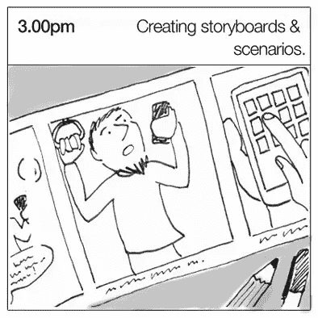

# UX 设计师实际上是做什么的？

> 原文：<https://www.sitepoint.com/ux-designer-actually/>

*了解[如何为 Mobile First UX](https://www.sitepoint.com/premium/screencasts/how-to-rewire-your-brain-for-mobile-first-ux) 的设计重组你的大脑。*

我还记得第一次碰到“用户体验设计师”这个词的时候。这是几年前的事了，嵌在我一个朋友的电子邮件签名里——这个人的工作我一直不太明白。所以我问他。

从那天起，他的回答从根本上改变了我设计网站的方式。不是因为他实际上说了什么(他咕哝了一些关于可用性和研究的东西)，而是因为接下来的持续讨论。那次讨论促使我更深入地挖掘 UX 的世界，重新评估我的流程，并戏剧性地塑造了我的职业生涯。

虽然许多设计师听到对“UX”这个词的描述时会回答，“哦，这就是我一直在做的——我只是不知道它叫这个”，但我不同。在知道“UX 设计师”这个术语甚至存在之前，我的设计过程是傲慢的；我的设计看起来很漂亮，但经常不中目标。很久以后，当我选择采用这个术语作为我自己的职称时，我感到自信，作为一名设计师，我已经显著地成长了，并且将我的过程发展到了配得上这个头衔的程度。

这就是短语的力量。UX 可能是一个时髦词，但对于我们这些为网络设计的人来说，这未必是一件坏事。UX 设计所包含的原则、哲学和技术已经被很好地确立，好消息是:任何人都可以学习它们。

那么用户体验设计师实际上是做什么的呢？嗯，没有典型的一天，但是有许多 UX 设计师在项目的不同阶段依赖的[技术](http://uxmastery.com/resources/techniques/)。我在这里扩展了其中的一些技巧，使用了出现在[每日 UX](http://uxmastery.com/everyday-ux/) 中的一个短漫画的面板，这本电子书包含了对 10 位著名 UX 设计师的采访:

## 线框

线框——网站或应用程序布局的粗略指南——是最著名的与 UX 设计师相关的可交付成果。

一旦被设计师创造为一系列静态图像，现在像 [Balsamiq 样机](http://balsamiq.com/)和 [Axure RP](http://axure.com/) 这样的工具可以直接将你的线框演变成交互式原型，而无需编写任何代码。

虽然许多 UX 设计师强调他们不仅仅是线框机器，但许多 UX 设计师确实是从线框开始的:创建一个基本的网站布局是任何人都可以做的事情，而且工具很容易学习。

## 用户测试

让用户坐在你的网站或应用前，让他们执行你为他们计划的任务，同时让他们大声说出自己的想法，这是用户测试的基本前提。

您涉及多少测试参与者，您的测试参与者与您的实际用户有多匹配，以及您运行多少测试迭代都是由预算和时间约束决定的。

用户测试非常简单，任何人都可以——也应该——体验运行一次。当有人在努力使用你的产品时，呆在同一个房间里是与用户产生共鸣的一个强有力的触发器——这是一个共同的特性。

## 个人的

一个**人物角色**是一个虚构的身份，它反映了你正在为之设计的一个用户群。

人物角色需要通过研究获得有用的信息。戴上你的创意写作帽，发明一些细节，让它们变得可信或有趣，这很有诱惑力。然而，目标应该是让你的人物角色反映出你在你的用户(或潜在用户)身上发现的模式。

识别这些模式没有捷径——它们来自于[用户研究](http://uxmastery.com/resources/techniques/?table_filter=research):进行访谈、调查、用户测试、背景调查和其他活动。

## 场景和故事板

**场景**是描述你的一个角色“生活中的一天”的叙述，包括你的网站或应用如何融入他们的生活。如果你熟悉在敏捷环境中编写用户故事，你会很容易编写场景——尽管这里的重点是常规使用，而不是边缘情况。

根据受众的不同，**故事板**可能是一个更合适的工具，用来捕捉人们可能如何、何时、何地以及为什么使用你的产品。

受电影制作行业的启发，故事板是用于捕捉用户与产品交互的事件的视觉序列。

这可能是一个非常粗糙的草图——纯粹是为了使你自己的想法具体化——或者是一个更加精致的漫画，为了更有效地吸引你的观众。

## 结论

这仅仅是 UX 设计师可以用来确保他们得到正确设计的数百种技术中的一个例子。

应用它们的诀窍是学习何时使用哪种技术。

但那是改天的话题…

*为什么停止学习？如果你喜欢读这篇文章，你会喜欢我们的截屏[如何为移动第一 UX](https://www.sitepoint.com/premium/screencasts/how-to-rewire-your-brain-for-mobile-first-ux) 重新连接你的大脑——现在就看。*

## 分享这篇文章