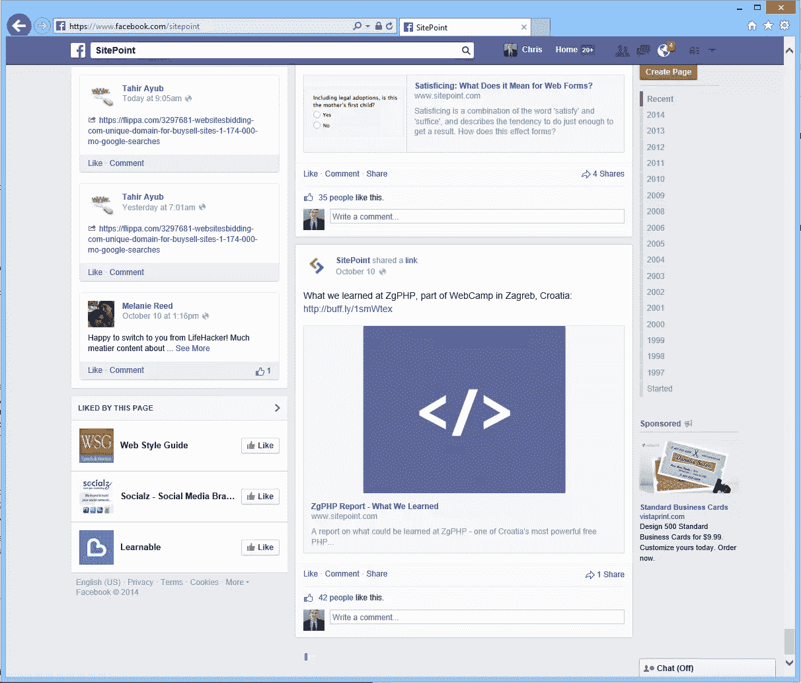
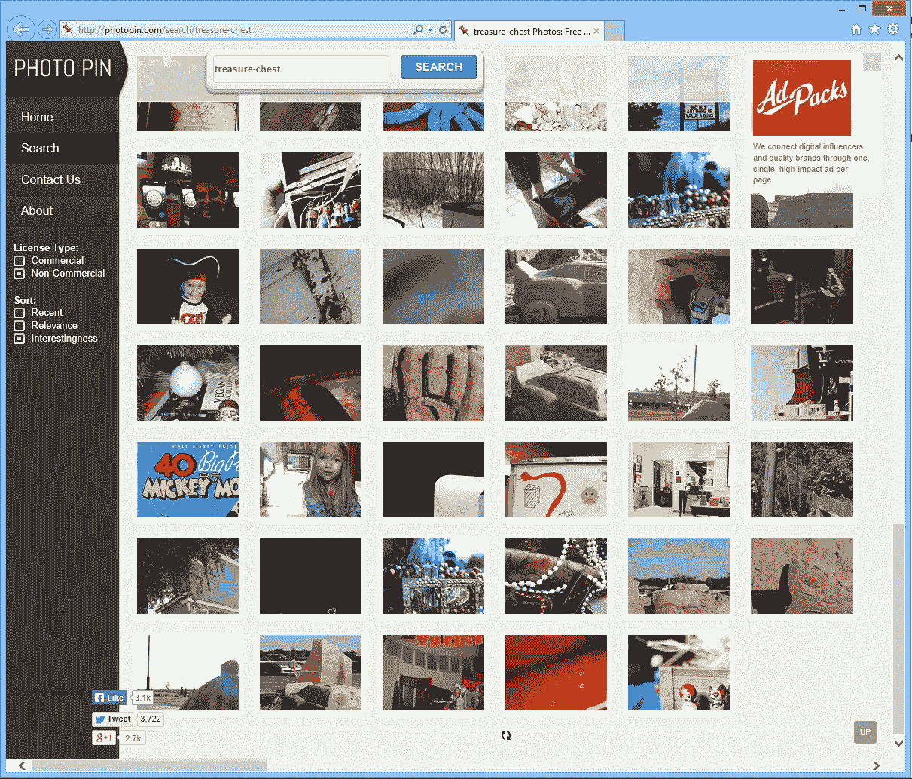

# 无限卷轴中的 UX:好的、坏的和可能的

> 原文：<https://www.sitepoint.com/ux-infinite-scroll-good-bad-maybe/>

在我们深入探讨“无限卷轴”的利弊之前，我想我们应该首先就其定义达成共识。我这样说是因为当我第一次承担写这篇文章的任务时，我开始写我对无限滚动的想法，这是一个“一页网站”，其中所有网站的内容都驻留在主页上，导航链接指向页面内的书签。

这不是我的对手的定义。它很可能有多种含义。

就本文而言，无限滚动的定义是:

> 一种设计模式，从数据库或主文件中异步获取内容，并在用户使用信息时插入到用户页面中。这导致了一个看似无止境的页面，当用户向底部滚动时，该页面继续加载内容。

这里有几个例子

*   [戴谷歌眼镜的白人](http://whitemenwearinggoogleglass.tumblr.com/)(所有 tumblrs 都是如此)
*   [社交](http://socialthing.com/)
*   [Live.com 图片搜索](http://www.bing.cimg/search?q=Sitepoint&go=Submit&qs=n&form=QBIR&pq=sitepoint&sc=8-9&sp=-1&sk=)(2006 年 9 月 17 日开始使用！)
*   [汤包日志](http://www.soup.io/)

像几乎所有主要的设计模式一样，它本身没有好坏之分。作为设计者和开发者，我们有责任运用我们的逻辑、经验和远见，根据具体情况在我们的项目中包含或排除它。

不要犯错误；无限卷轴绝对是一种主要的设计模式——据 Netcraft 报道，以其名字命名的网站([Infinite-Scroll.com](http://www.infinite-scroll.com/))自 2008 年就已经出现了:

既然我们已经建立了一个共同的定义，并得到了序言的方式；让我们直入主题，看看好的和坏的方面。

## 好人

*   你有更好的机会留住用户，因为他们除了滚动页面什么也不用做。这几乎就像是潜意识的行动号召。
*   没有必要指导用户。如果他们在页面上，我们可以有把握地假设他们至少知道如何滚动。
*   用户的阅读风格/习惯将可能与无限滚动兼容。
*   Infinite-scroll.com 声称，当正确使用时(比如使用他们的 WordPress 插件)，导航会得到增强，搜索引擎优化不会受到损害，可访问性会得到保持，在挑剔的浏览器中和/或关闭 JavaScript 时也会有优雅的降级。
*   不使用 WordPress 插件？这里有一篇关于 SEO 友好无限卷轴的好文章:[https://www.sitepoint.com/seo-friendly-infinite-scroll/](https://www.sitepoint.com/seo-friendly-infinite-scroll/)
*   在大多数项目中，用一个简单的 jQuery 插件来实现相对容易。
*   您可以减少页面加载大小，但通常节省的空间与您不会创建的页面相比，除非有像无限滚动这样的解决方案来驯服它…

### 例如:Facebook.com

我们来看一个我认为执行得很好的无限卷轴。

我们可以假设脸书可以让一些人只考虑他们的用户界面。他们在一些内容类型上使用无限滚动，他们这样做不仅仅是因为它很酷。值得称赞的是，下一节列出的许多负面因素并没有考虑到他们对该技术的使用。例如，新闻提要中的每个“故事”基本上都是一个导语或预告，旨在让用户查看、喜欢、评论或分享到他们自己的时间线。

似乎很明显，用户已经被训练，即使是无意识的；如果他们不想迷失在 Infinite Scroll 返回页面片段的麻烦中，他们最好一看到内容就和它互动。这样看来，脸书似乎利用了无限卷轴的一个不利之处来促进用户互动。

我从个人经验中知道，如果我在我的新闻订阅源中看到一些我可能希望以后再次访问的内容，我会将其共享，以便我可以在自己的新闻订阅源中轻松找到它。

## 坏事

*   你的应用程序需要不断地监听滚动事件，如果没有正确处理的话，*可能会导致性能问题。滚动事件触发非常频繁，因此一个低效的例程会占用大量 CPU 资源。处理这个问题的正确方法是使用节流或“去抖动”,这样可以更好地控制执行周期。*
*   在无限滚动的页面上跟随一个链接，然后试图返回到原始页面上的同一点通常是一种令人沮丧的体验，因为滚动位置通常不会被记录为“状态”。这意味着使用浏览器的后退按钮通常会将滚动位置重置到页面顶部。
*   如果你在一个很长的页面上使用无限滚动，你会不断地将越来越多的内容加载到内存中。根据页面的构建方式，这会对页面性能产生非常负面的影响，因为浏览器需要做更多的工作来呈现页面。
*   人们理解页脚的概念，并且知道页脚是他们可以找到重要网站信息链接的地方。然而，无限滚动意味着页脚不断被新加载的内容推到无法触及的地方。这就像驴子试图用棍子去抓胡萝卜一样——令人沮丧的是，胡萝卜总是够不着。当然，你可以使用粘性页脚，但是这样会毫无理由地占用屏幕空间。
*   目前没有既定的方法来取消或选择退出的行为。
*   用户不容易添加书签或使用后退按钮返回到页面的特定部分。(脸书似乎利用了这种损害)
*   分析将更加难以实施。仅仅将一些 Google Analytics 代码放入页面不会给你带来太多的洞察力，所以必须实现一个定制的解决方案。

### 例如:Photopin.com

[http://photopin.com/search/treasure-chest](http://photopin.com/search/treasure-chest)

让我们来看看一个可以说不太成功的无限卷轴。

Photopin 是一个 creative commons 搜索引擎，允许用户在 Flickr 上搜索一幅或一组图像。由于无限滚动有效地破坏了后退按钮，并且这个网站没有提供明显的方法来“标记”一个图像，冗长的搜索/滚动会非常令人沮丧。

返回之前找到的图像的唯一方法是重复搜索并开始滚动。

可用性问题可以用类似于脸书的方法来处理，但不幸的是，如果你检查网站，你会看到缩略图模式在悬停时提供了两个选项，而且它们都不是“可书签化”的。

也许这背后的理论类似于脸书，但在这种情况下，强迫用户下载吸引他们眼球的图片，无论他们是否需要它们，或者只是想与当地的一组其他人进行比较，因为用户界面中没有“比较”功能。

## 可能

那么，您应该在项目中使用无限卷轴设计模式吗？

希望这篇文章的内容能让你明白一个明确的可能。分析您对网站的需求、可能的用户原型、预测的用途等等。

如果实施得好，你将增强用户体验，甚至可能促进用户互动，就像我们在脸书的例子中看到的那样。

如果执行得不好——或者只是简单地应用在错误的情况下——你会让你的用户感到沮丧，很可能会把他们赶走。

## 分享这篇文章