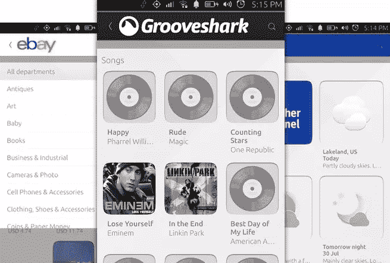
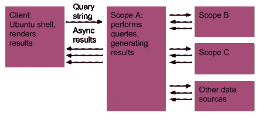
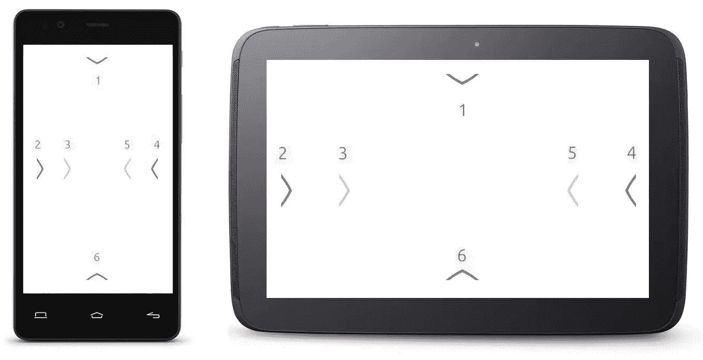

# Ubuntu Phone 背后的 UX 原则是什么？

> 原文：<https://www.sitepoint.com/ux-principles-behind-ubuntu-phone/>

开源爱好者有很多要感谢 Ubuntu。作为最早的主流 Linux 发行版之一，Canonical 的 Ubuntu 极大地促进了我们今天对 Linux 和开源的理解。随着当今社会变得越来越“移动化”，Canonical 也想在移动媒体上占有一席之地也就不足为奇了。Ubuntu for Phones 是 Canonical 为移动设备定制的操作系统。它于 2013 年首次推出，一直难以获得关注，2015 年 1 月推出的第一款 Ubuntu 手机专注于早期采用者和开发者。

也就是说，Ubuntu for Phones 采用了不同的用户体验和设计理念，从手势和边缘的广泛使用开始，这在移动操作系统中是独一无二的。Ubuntu 手机的界面是根据一种叫做[苏茹](http://design.ubuntu.com/apps/getting-started/design-philosophy/)的哲学设计的，这是日语中 crane 的意思。根据 Canonical:

> 苏茹代表了水鸟在飞行中的优雅和轻松，这在折纸艺术中最为明显，我们已经将其融入到我们的设计中。

在苏茹，元素可以脱离网格。Canonical 强调，屏幕布局保持自然、有节奏的品质，帮助用户快速找到并直观地使用它们。在下面的文章中，我打算让你熟悉 Ubuntu for Phones 中用户体验的这些新的和独特的概念。

## 范围介绍

随着 Android 和 iOS 的双头垄断，任何潜在的游戏规则改变者都很难突破，这种“鸡和蛋”的类比适用于需要应用程序来吸引用户，但需要用户来吸引开发者的新平台。Canonical 的目标是创造真正“移动优先”的用户体验，它认为应用程序能提供最佳体验吗？显然没有。

在我们的日常工作中，我们可能会安装和启动三个独立的应用程序来检查三件不同的事情。有了瞄准镜，你可以直接在屏幕上看到这三样东西。

> 范围向任何应用程序之外的用户提供内容。像 web 或数据库查询这样的简单内容，或者来自多个数据源的细粒度、丰富组织的内容，都直接呈现在用户体验中。范围是 Ubuntu 的核心特性之一。

[https://www.youtube.com/embed/CsDFMIphtZk](https://www.youtube.com/embed/CsDFMIphtZk)

[OMG！Ubuntu！](http://www.omgubuntu.co.uk/2015/01/ubuntu-phone-bq-photo-scopes-details)很好地描述了应用程序和作用域之间的概念差异:

*   应用程序就像书架上的书一样:你取下一本，找到你需要的，放回原处。需要时重复。
*   范围是相关的页面:当你需要的时候，从钉在你的布告栏上的那些书中。

Ubuntu 将范围描述为:

> 不同种类内容的个人主屏幕。

### 范围的技术细节

目前，有两种示波器:

*   **聚集器**:在一个视图中聚集多个内容源(例如，“今日”、“新闻”、“图像”)；
*   **品牌化**:内容和品牌特定视图(如“脸书”、“Instagram”)。

这两种类型的观测仪都可以随意安装、配置和调整。

从技术上讲，作用域是一个查询，向调用它的客户机提供内容。

作为一个具体的例子，用户可以在 Ubuntu shell 中输入一个搜索词，然后调用一个范围。scope 处理它的查询，并向 shell 显示结果，然后呈现它们。

作用域调用的源在这里并不重要，这意味着作用域可以调用作用域(*scope reception*！).作用域可以聚合来自任何数据源(包括其他作用域)的数据，即使没有初始查询字符串，它们也可以提供内容。

**注:**scopes 的一个缺点(至少目前是这样)是在没有数据连接的情况下用户体验很差。记住这一点。

要更深入地了解示波器如何工作，请阅读 Ubuntu 开发者门户网站上关于示波器的技术[介绍。](https://developer.ubuntu.com/en/scopes/guides/scopes-guide/)

如果你有“scopephobia ”,想用传统方式开发应用程序，你可以用 HTML5 或者 QML。查看 Ubuntu 开发者门户网站上的[应用概述。](https://developer.ubuntu.com/en/apps/)

## 手势指南

与 Android 或 iOS 相比，手机版 Ubuntu 非常注重触摸手势。甚至有一些交互选项在不使用手势的情况下不可用。让我们来看看它们。

## 底部边缘手势

Ubuntu for Phones 的底部边缘为你的应用程序体验提供了一个完全可定制的空间，因此是必备的。请注意，用户应该知道有一个底部边缘可供他们使用，所以线索和指导是至关重要的。

底部边缘提供了一个短的和一个长的滑动视图。重要的是强调和理解从一个到另一个的转换，让用户充分利用这种平稳的体验。

如果你在视觉化底部边缘手势方面有困难，[看看一些例子](https://design.ubuntu.com/apps/patterns/bottom-edge)。

### 暗示、揭示和提交

虽然听起来像是魔术师的初学者指南，但“提示、展示和提交”模式在手机版 Ubuntu 中被广泛使用。它利用渐进手势从底部边缘逐渐显示特征/内容。

正如您所猜测的，它包括 3 个步骤:

*   **提示**:提醒用户底部边缘是可用的，如果你在你的应用程序中使用它，这是至关重要的。如果长时间停留在屏幕上，不要把提示做得太大。如果暗示掩盖了内容，那就违背了它的目的。
*   **揭示**:随着手势的伸展，我们逐渐揭示了变化的第一部分，而没有真正让它发生，如果你愿意，可以先睹为快。如果用户改变主意，可以在这里确认或返回。
*   **提交**:最后<q>点击</q>确认。改变后的*标题*将指示用户在应用程序中的当前位置。可以选择返回上一个屏幕。

请观看下面的视频，了解“提示、揭示和提交”模式的可视化。

[https://www.youtube.com/embed/QLiBr4j-SPQ](https://www.youtube.com/embed/QLiBr4j-SPQ)

### 自然进程

在设计流畅的底部边缘体验时，考虑相关功能/内容逐步垂直布局的可能性。任何线性维度对此都很棒，比如空间或者时间。

### 左侧和右侧

与谷歌的收件箱应用程序或 Dropbox 的[邮箱](https://www.mailboxapp.com/)类似，在 Ubuntu 中，积极的行为总是在右边，消极的行为在左边。根据经验，消极行为(如删除)在左边，积极行为(如寻找新内容)在右边。

[查看开发者门户网站](http://design.ubuntu.com/apps/getting-started/design-vision)了解更多关于手势和其他设计价值的深度文档。这同样适用于关于底部边缘的[特征的更详细示例和文档。](https://design.ubuntu.com/apps/patterns/bottom-edge)

## 边缘概述

Ubuntu 手机还利用了其他设备优势:

*   **顶部边缘**:从顶部边缘向下滑动，查看包含设置和通知的指示器菜单。
*   **向左短扫**:从启动菜单中显示喜爱的应用程序。
*   **长时间向左滑动**:进入应用程序后，长时间向左滑动会将你带回应用程序屏幕。
*   **短向右滑动**:在一个应用程序中，短向右滑动会悄悄地显示你上次使用的应用程序。
*   **长时间向右滑动**:会显示一个应用堆栈，你打开过的所有应用都可以看到，就像一叠卡片。
*   **底边**:从底部向上滑动可以显示你选择的任何内容。这可以是控件、动作或更多内容。

## 展望未来

对于 Canonical 的移动操作系统来说，作为一个替代的移动操作系统，还有很多工作要做。随着黑莓和微软争夺剩下的一小块市场份额，看看 Canonical 接下来会发生什么将是有趣的。尽管如此，Ubuntu for Phones 有着独特的用户体验和设计理念，如果使用得当的话，这将是非常有用的。

你使用手机版 Ubuntu 有什么体验？

## 分享这篇文章