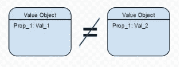

# 用 Ruby 解释的值对象

> 原文：<https://www.sitepoint.com/value-objects-explained-with-ruby/>

本文解释了价值对象的概念。它首先定义和演示各种类型的值对象，然后解释构造有效值对象的规则，同时涵盖违反概念的后果。最后，展示了在 Ruby 中实现值对象的几种方法。

虽然这些例子是用 Ruby 编写的，但是这个概念也可以很容易地应用于其他语言。

## 什么是价值对象？

EAA 的 [P 中定义的值对象为:](http://martinfowler.com/bliki/ValueObject.html)

> …他们的相等概念不是基于身份，而是如果两个值对象的所有字段都相等，那么它们就是相等的。

这意味着具有相同内部字段的值对象必须彼此相等。所有字段的值足够**决定**一个值对象的相等性。

最简单的例子就是原始对象——`Symbol`、`String`、`Integer`、`TrueClass` ( `true`)、`FalseClass` ( `false`)、`NilClass` ( `nil`)、`Range`、`Regexp`等。每个对象的值决定了它们的相等性。例如，**每当** `1.0`出现在一个程序中，都应该是相等的 <sup id="fnref-1">[1](#fn-1)</sup> 到`1.0`，因为它们的值相同。

```
var1 = :symbol
var2 = :symbol
var1 == var2  # => true

var1 = 'string'
var2 = 'string'
var1 == var2  # => true

var1 = 1.0
var2 = 1.0
var1 == var2  # => true

var1 = true
var2 = true
var1 == var2  # => true

var1 = nil
var2 = nil
var1 == var2  # => true

var1 = /reg/
var2 = /reg/
var1 == var2  # => true

var1 = 1..2
var2 = 1..2
var1 == var2  # => true

var1 == [1, 2, 3]
var2 == [1, 2, 3]
var1 == var2  # => true

var1 == { key: 'value'}
var2 == { key: 'value'}
var1 == var2  # => true
```

这些是具有一个字段的值对象的示例。

值对象也可以由多个字段组成。比如标准库中的 [`IPAddr`](https://github.com/ruby/ruby/blob/ruby_2_0_0/lib/ipaddr.rb#L350-352) 类有三个字段，`@addr`、`@mask_addr`和`@family`。`@addr`和`@mask_addr`定义 IP 地址值，`@family`确定其类型为 IPv4 或 IPv6。`IPAddr`具有相同字段值的对象彼此相等。

```
require 'ipaddr'

ipaddr1 = IPAddr.new "192.168.2.0/24"
ipaddr2 = IPAddr.new "192.168.2.0/255.255.255.0"

ipaddr1.inspect
# => "#<IPAddr: IPv4:192.168.2.0/255.255.255.0>"

ipaddr2.inspect
#=> "#<IPAddr: IPv4:192.168.2.0/255.255.255.0>"

ipaddr1 == ipaddr2 # => true
```

类似地，金钱、GPS 数据、跟踪数据、日期范围等。都是值对象的合适候选对象。

上面的例子演示了值对象的定义——这些对象的相等性是基于它们的内部字段而不是它们的标识。

为了保证具有相同字段的值对象在程序中出现时彼此相等，在构造值对象时有一个隐含的规则要遵循。

## 构造值对象的规则

保证值对象在其整个生命周期中的平等性的规则是:**值对象的属性从实例化到其存在的最后状态将保持不变。**“…这是隐式契约所要求的，即两个值对象创建时相等，应该保持相等。” <sup id="fnref-2">[2](#fn-2)</sup> 遵循这个规则，值对象应该有一个不可变的接口。

有时，创建值对象的变体的需求可能会违反规则，如果它们是在没有仔细实现的情况下构造的。以下面的`Money`类为例。

```
class Money
  attr_accessor :currency, :amount

  def initialize(amount, currency)
    @amount = amount
    @currency = currency
  end
end

usd = Money.new(10, 'USD')
# <Money:0x007f987f283b50 @amount=10, @currency="USD">

usd.amount = 20
usd.inspect
# <Money:0x007f987f283b50 @amount=20, @currency="USD">
```

由于对其`@amount`字段的更改，`usd` money value 对象在其生命周期中也会发生更改。

公共 setter 方法`amount=`违反了规则，因为当它被调用时，值从对象的原始值转移。

创建值对象变体的正确方法是实现 setter 方法来初始化新的值对象，而不是修改当前的值对象:

```
class Money
  # remove the public setter interface
  attr_reader :currency, :amount

  def initialize(amount, currency)
    @amount = amount
    @currency = currency
  end

  # a setter method to return a new value object
  def amount=(other_amount)
    Money.new(other_amount, currency)
  end
end

usd = Money.new(10, 'USD')
usd.inspect
# <Money:0x007f9672753ba8 @amount=10, @currency="USD">

other_usd = (usd.amount = 20)
usd.inspect
# <Money:0x007f9672753ba8 @amount=20, @currency="USD">
```

这样，一旦创建了一个`Money`值对象，它将在整个生命周期中保持其初始状态。新变量被创建为不同的值对象，而不是对原始变量进行更改。

## 如何在 Ruby 中实现一个值对象

在查看中，按照上述定义和规则实现值对象:

*   值对象有多个属性
*   属性在整个生命周期中应该是不可变的
*   相等是由其属性(和类型)决定的

我们已经看到了用 Ruby 普通类语法实现的`Money`值对象。让我们通过添加确定等式的方法来完成实现。

```
class Money
  def ==(other_money)
    self.class == other_money.class &&
    amount == other_money.amount &&
    currency == other_money.currency
  end
  alias :eql? :==

def hash
    [@amount, @currency].hash
  end
end

usd = Money.new(10, 'USD')
usd2 = Money.new(10, 'USD')
usd == usd2 # => true
```

`eql?`和`==`是标准的 Ruby 方法，用于确定对象级的相等性。通过定义值对象，检验所有字段的比较结果。还需要将`Money`与其他可能具有相同属性的物体区分开来。

例如:

```
AnotherMoney = Struct.new(:money, :currency)
other_usd = AnotherMoney.new(10, 'USD')
usd == other_usd # => false
```

这是通过行`self.class == other_money.class`完成的。

`hash`方法是为对象生成哈希值的标准 Ruby 方法。从 Ruby 文档中可以看出，“……这个函数必须具有`a.eql?(b)`隐含`a.hash == b.hash`的属性。”因此，实现使用所有字段值来生成散列。

除了普通的类语法，上一个例子中的`Struct`是一种非常简洁的构建值对象的方法。下面是一个使用`Struct`实现相同的`Money`值对象的例子:

```
class Money < Struct.new(:amount, :currency)
  def amount=(other_amount)
    Money.new(other_amount, currency)
  end
end

usd = Money.new(10, 'USD')
usd2 = Money.new(10, 'USD')

usd.hash == usd2.hash # => true
usd == usd2 # => true
```

它比普通的类定义要简洁得多。属性是通过`Struct.new`接口声明的。省略了`hash`和`==`方法的定义，因为它们是从`Struct`类继承的。

然而，使用`Struct`定义值对象的一个缺点是，它们通过默认的 setter 方法是可变的，并且它们允许默认的属性值。

```
usd = Money.new(10, 'USD')
usd.amount = 20
usd.inspect
# => <struct Money amount=10, currency="USD">

invalid_usd = Money.new(1)
invalid_usd.inspect
# => <struct Money amount=1, currency=nil>
```

为了保持`Struct`方式的简明性，但是修复它的问题，我们可以使用`Value` gem，它是一个类似于`Struct`的类，上面所有的问题都已修复。以下是该库演示页面中的一个示例:

```
Point = Value.new(:x, :y)
Point.new(1)
# => ArgumentError: wrong number of arguments, 1 for 2
# from /Users/tcrayford/Projects/ruby/values/lib/values.rb:7:in `block (2 levels) in new
# from (irb):5:in new
# from (irb):5
# from /usr/local/bin/irb:12:in `<main>

p = Point.new(1, 2)
p.x = 1
# => NoMethodError: undefined method x= for #<Point:0x00000100943788 @x=0, @y=1>
# from (irb):6
# from /usr/local/bin/irb:12:in <main>
```

现在，在 Ruby 中使用值对象应该很容易也很有趣。

## 结论

从值对象的定义开始，本文展示了从基本对象到更复杂的特定领域对象的值对象的用法。它还深入研究了值对象在其生命周期中一致行为的隐含规则。

最后，我们通过几种不同的方法，使用 Ruby 的普通类定义和`Struct`类实现了值对象的概念。最后，我们最终得到了一个有用的`Values` gem 来轻松简洁地创建价值对象。

对值对象的解释是否给你提供了编写更优雅代码的灵感？你对价值对象的用法有什么看法？

1.  “平等”在这里用于平等(`==`或`eql?`)的意思，而不是标识(`equal?`)。 [↩](#fnref-1)
2.  http://en.wikipedia.org/wiki/Value_object[↩](#fnref-1)

## 参考

维基百科上的[值对象](http://en.wikipedia.org/wiki/Value_object)。

有人在 c2.com[上](http://c2.com/cgi/wiki?ValueObjectsShouldBeImmutable)[讨论](http://c2.com/cgi/wiki?ValueObject) [价值对象](http://c2.com/cgi/wiki?ValueObjectHypotheses)。

## 分享这篇文章