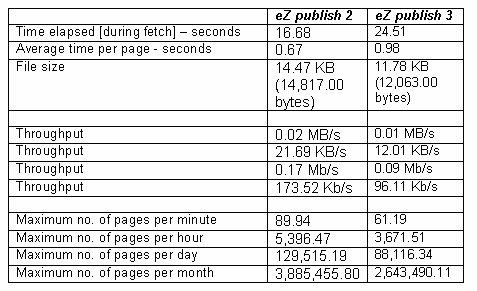
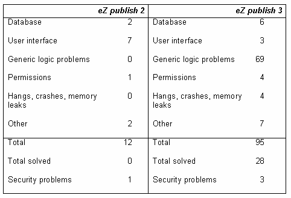

# eZ publish 评估:版本 2 与版本 3

> 原文：<https://www.sitepoint.com/version-2-version-3/>

eZ publish 2 是当今网络上最流行的开放内容管理系统之一。它的继任者 eZ publish 3 是一个内容管理系统和开发框架，与版本 2 有着根本的不同。

目前还没有办法从版本 2 自动更新到版本 3，虽然 eZ Systems 已经计划发布一个升级脚本。在此之前，用户决定采用第 2 版还是第 3 版将对其网站的未来发展产生深远的影响。

eZ publish 2 是一个稳定的、经过良好测试的系统，但是版本 2 的开发可能会在将来停止。目前，eZ Systems 仍然支持这个版本，但是资源有限。eZ publish 第 3 版的开发正在如火如荼地进行，并向早期采用者提供了所有相关的优点和缺点。版本 3 是高维护性的，因为它包含更多的错误，提供的“现成”功能比前一个版本少，但它为网站的未来发展提供了更多的机会。

本报告提供了一个通用框架，允许读者在 eZ publish CMS 的两个版本之间做出明智的选择。它并不试图确定哪个版本应该被认为是“首选”。这两个版本的适用性将取决于一个地点的功能要求、其未来发展的计划以及开发商所经历的时间/项目限制。

##### 关于 eZ publish

eZ publish，一个在开源许可下发布的 CMS，最近变得非常受欢迎。该系统包括大多数商业许可系统的所有功能，并提供许多额外的可选功能。eZ publish CMS 是由位于挪威 Skien 的一家小公司 eZ systems 开发的(更多信息请访问他们的网站)。

eZ publish 2.2.x 是一个专业的开源 CMS，通过一个用户友好且可靠的程序，可以轻松访问互联网网站。它独立于平台和数据库，基于模块，总共有 26 个不同的模块可用。版本 2 于 2000 年 11 月首次发布；2 系列的最新版本是 2.2.8。

eZ publish 3 是一个内容管理系统和开发框架。CMS 基于完全可定制和可扩展的内容模型。它的独立库可以用作跨平台、独立于数据库的 PHP 项目的开发框架。第 3 版于 2003 年 3 月 25 日发布。版本 3 的第一次更新已经发布(3.0-2)，修复了一些在内核中发现的错误。

正如版本编号所暗示的，eZ publish 版本 2 和 3 之间有一些基本的区别。eZ publish 3 将版本 2 的功能扩展到一个通用的应用程序框架，提供了基本的数据处理和显示机制，并无限扩展了在系统内创建定制内容的可能性。

第 2 版只能处理“有限的”26 个模块，而第 3 版允许用户识别自己的内容类别和属性。内容类的一些示例有:

*   文章
*   论坛
*   产品
*   出版
*   组织
*   用户帐户

一个简单的“文章”内容类可能由诸如作者、标题、简介和正文等属性组成。可以通过管理后端简单地添加新的类和属性——不需要额外的编码。

##### 评定标准

出于本次调查的目的，基于以下标准对 eZ publish 的两个版本进行了评估:

*   功能
*   灵活性
*   表演
*   稳定性

可用性没有作为标准包括在内，因为 eZ publish 应用程序的前端和后端都可以完全定制，以满足用户和内容管理者的需求。

***功能***
eZ publish 默认安装的功能需求和实际可用功能之间的差距越大，用户在网站开发上花费的资源(人员、金钱和时间)就越多。在最好的情况下，定制仅限于设计或现有功能的增强。在最坏的情况下，高级定制需要从头开始开发新功能。

高级但缺乏文档记录的定制可能会将 eZ publish 系统变成一个遗留的解决方案，没有人能够对其进行扩展、提取数据或修复错误。一旦系统不再真正“开放”，组织可能会与定制系统的公司签订排他性的长期合同。此外，高级定制可能会严重妨碍未来更新的安装，结果是组织可能会错过重要的安全更新。

eZ publish 2 是一个具有广泛内置功能的系统，可以满足大多数中小型组织和活动的需求。现有模块的定制通常仅限于适应和改进 eZ Article(多个主题、备选链接、附加 frontpage 行)、eZ Filemanager(排序方法)、eZ Search(搜索附加模块)和 eZ Link(排序方法)。在许多情况下，定制还包括向模块添加额外的信息字段。例如，在 eZ Filemanager 的情况下，这可能是文件的“作者”字段。对于多语言支持、eZ 日历、eZ 联系人或 eZ Filemanager 必须转换为“电子图书馆”的情况，通常需要更高级的定制。

乍一看，eZ publish 3 提供的功能似乎比版本 2 少得多。但是，如上所述，版本 3 允许用户通过管理后端识别自己的内容类和属性。版本 2 模块的许多功能在版本 3 中以某种形式可用(更多信息请参见本文的)。默认情况下，版本 3 中提供了许多版本 2 所需的标准功能增强，并且无需编码即可将附加信息字段(属性)添加到对象中。这意味着有可能实现版本 3 的高级定制，同时保持源代码可理解或“开放”，从而避免依赖于单个服务提供商。

版本 3 有一个紧凑的设计，对于大多数定制，内核不需要改变。因此，即使系统是高度定制的，未来的升级也是可能的。此外，eZ Systems 正在版本 3 中开发更多的示例实现，并使其他人更容易贡献他们的工作。

**结论**

eZ publish 2 在“开箱即用”功能方面提供了更多，允许资源和时间有限的组织“快速启动”他们的互联网项目，同时控制成本。版本 2 足够灵活，允许在需要时进行功能扩展，但是该系统的高级开发可能会导致依赖外部服务提供商进行技术维护。

eZ publish 3 非常适合于需要超出“标准”模块所提供功能的项目。它允许广泛的定制，同时避免外部依赖性。然而，由于其灵活性，缺乏准确和全面的功能规范可能会导致开发过程失控。这种“成熟”的系统需要一种“成熟”的开发方法，这可能不适合时间和资源紧张的组织。

*柔韧性*

 *eZ publish 第 2 版和第 3 版在创建定制内容类、页面定制和布局方面的灵活性进行了比较。关于定制内容类，如上所述，eZ publish 3 允许用户通过管理后端识别自己的内容类和属性。在版本 2 中，这需要对数据库进行手动更改，编写新的类和函数，并创建匹配的前端和后端模板。

在 eZ publish 中，页面定制和布局与内容、代码和多语言功能相分离。每个页面都是通过模板动态生成的。模板是一个或多个包含模板变量的普通 HTML 文件。这些变量在页面生成时由 eZ publish 填充。在 eZ publish 2 中，模板集分布在所有模块中。每个模块至少有一个名为“admin”的子目录，通常还有一个名为“user”的目录。

在 eZ publish 3 中，所有标准模板都存储在一个文件夹中。在版本 3 中创建自定义设计的基本原则是在自定义设计文件夹中创建替代标准模板的替代模板。eZ publish 3 还引入了允许高级模板定制的模板操作符和函数。

**结论**

与版本 2 相比，在版本 3 中创建新的内容类和属性要容易得多。版本 3 的优势之一是，它允许用户识别自己的内容类和属性，而无需编码或手动更新数据库。剩下的唯一任务是为新的内容类开发必要的前端模板。

在版本 3 中，模板系统变得更加高级和灵活，但是实现起来也更加麻烦。与版本 2 相比，版本 3 用户需要对 eZ publish 应用程序有更多的了解，以便能够设置或更改设计模板。这可能会导致一个组织依赖外部服务提供商对其网站的外观和感觉进行微小的改变。

***表现***

可伸缩性和性能是评估任何 Web 平台的关键因素。在这个评估中，使用了 eZ httpbench 来了解 eZ publish 版本 2 和 3 的性能差异。还审查了用户在 eZ publish 网站论坛上提交的体验。

使用 eZ httpbench，一个由 eZ Systems 开发的用于测试 HTTP 页面的工具，比较了两个版本中大小约为 12.0 KB 的页面的平均下载时间。下面的页面被 eZ httpbench 基准测试工具读取了 25 次( [14.47 KB，eZ publish 2](http://www.contactivity.com/ezpublish/index.php/filemanager/list/) 和 [11.78 KB，eZ publish 3](http://www.contactivity.com/ezpublish3/index.php/demo/content/view/full/62/) )。结果如下表 1 所示。不幸的是，eZ httpbench 不再可以从 eZ Systems 网站下载，但它仍然可以在这里下载[。](http://www.3sign.org/45/383/38330570.php)

请注意，这些统计数据并不是所有 eZ publish 安装的典型数据。吞吐量可能因服务器规格、整体服务器负载、eZ publish 应用程序的配置以及加速器的使用而异。eZ publish version 3 更广泛的性能测试结果可以在 eZ publish 网站上找到。

**表 1。**eZ publish 版本 2 和 3 的比较:大小约为 12.0 KB 的页面的平均下载时间

在 eZ publish 网站的开发者论坛上，[用户报告了关于版本 2 和版本 3](http://ez.no/content/search/?SearchText=performance) 的不同体验。一些用户发现版本 2 的性能更好，而另一些用户更喜欢版本 3。eZ publish 缓存和 PHP 缓存应用程序的使用最近受到了很多关注，[关于如何使用缓存来提高性能的有用建议已经提出](http://ez.no/content/search/?SearchText=caching)。

根据 eZ publish 开发者的一个论坛帖子，“我们刚刚开始优化，你应该会看到 2.x 系列的巨大速度提升”。另一位有经验的用户建议其他人使用“2 GHz 双 cpu 服务器+ php 加速器，用于高负载的 eZ publish 3 服务器”。用户报告说，两个版本都包含一些写得很差的 SQL 语句，这些语句降低了应用程序的某些部分的速度。

eZ Systems 声称 eZ publish 3 比版本 2 更具可扩展性。然而，由于版本 3 的灵活性，也更容易错误配置系统，从而体验更差的性能。eZ Systems 已经将这个问题作为未来版本 3 开发的焦点。我们并未试图在本次讨论中验证可伸缩性的说法，但有关该主题的更多信息，请参见[本次讨论](http://ez.no/developer/ez_publish_3/forum/general/ez_30_scalability)。

**结论**

从 eZ httpbench 测试来看，eZ publish 3 似乎比版本 2 稍慢。然而，版本 2 和版本 3 在标准服务器上的性能仍然绰绰有余。这两个版本的性能可以通过调整启用 eZ publish 缓存的站点，或者通过使用 PHP 缓存应用程序(如 ionCube PHP Accelerator、Zend、Alternativ PHP Cache 或 Turck MMCache)来进一步提高。

***稳定***

出于评估的目的，“稳定性”被定义为在一段固定时间内报告的错误数量。这基本上意味着:bug 数量越少，系统被认为越稳定。显然，这个工作定义可以说是测量除了“稳定性”之外的其他东西，例如用户社区对一个特定版本的承诺或参与，或者可用功能与用户的期望或需求匹配的程度。

无论如何，可以肯定地说，一个报告了大量错误的系统比一个报告了较少错误的系统需要更多的维护。如果一个组织没有资源来监控发展和执行所有必要的更新，一个先进的系统可能很快就会发展成为一个缓慢，不可靠，错误百出和潜在的不安全的网站。

eZ publish bugs 的概述可以在[这里](http://ez.no/developer/ez_publish_22/bug_reports)和[这里](http://ez.no/developer/ez_publish_3/bug_reports)找到。下表 2 列出了 2003 年 3 月 26 日至 5 月 26 日期间报告的错误数量，分类如下:数据库、用户界面、一般逻辑问题、权限、挂起和崩溃以及其他。还列出了存在安全问题的错误。

**表 2。**eZ publish 第 2 版和第 3 版的比较:2003 年 3 月 26 日至 5 月 26 日期间报告的每个类别中的错误数量

**结论**

eZ publish 2 是一个需要相对较少维护的应用程序。该系统经过充分测试，稳定，显然是安全的。选择定制相当有限的 eZ publish 2 应用程序的组织将相对独立于外部开发人员。

尽管 eZ publish 3 比 version 2 有优势，因为它扩展了在系统内创建定制内容的可能性，但它仍然是一个高维护性的应用程序。尽管版本 3 的核心功能比版本 2 稳定得多，但版本 3 中的错误数量仍然相当可观。内部 IT 团队或外部开发人员需要时刻保持警惕，至少要确保所有潜在的(安全)问题都得到解决。然而，关于处理 bug 的系统方法可能超出了资源有限的组织的范围。

##### 结果呢

总的来说，我们建议任何组织在制定互联网战略时都要现实一点，运用常识。该组织应考虑其当前的要求和未来的网站计划，资源的可用性(预算，员工，开发人员，支持)，以及可能的时间限制。例如，功能需求是否要求使用最新的、前沿的基于 Web 的技术，或者组织是否仅仅需要某种东西来“启动”一个 Internet 项目，同时保持其他选项开放？

对于资源和时间有限的组织来说，eZ publish 2 是一个理想的解决方案，它需要一个低维护、用户友好的应用程序，并具有广泛的“开箱即用”功能。运行版本 2 的服务器要求相对适中，使组织能够选择廉价的托管解决方案。eZ publish 2 有一套全面的功能模块，几乎不需要修改就能满足大多数中小型组织的需求。

后端界面友好，易于理解，即使对于没有 Web 发布经验的新手也是如此。改变前端的外观相对简单，并且不需要 eZ publish 应用程序的丰富知识。由于其灵活的模块化设置，第 2 版允许高级定制以满足组织的需求，但这可能会以依赖外部服务提供商为代价，并且会出现第三方安装(安全)更新或修改的问题。

eZ publish 3 非常适合那些功能需求超出版本 2 的“标准”模块所提供的范围的组织，或者那些对未来站点开发有雄心壮志的组织。eZ publish 3 比版本 2 更加灵活，允许进行广泛的定制，同时避免了对单一外部服务提供商的依赖。不利的一面是，与基于版本 2 的网站相比，基于 eZ publish 3 的网站开发需要组织(或外部服务提供商)更多地参与开发周期、项目规划技能、应用程序维护以及对网站设计人员/开发人员和内容管理人员的培训。

因为版本 3 更灵活，所以它的学习曲线比版本 2 更陡峭。现有手册和社区贡献的文档的质量抵消了这一缺点。eZ Publish 3 的性能水平是可以接受的，在不久的将来可能会有所提高，但是使用 PHP 缓存应用程序可能会对托管帐户的选择造成一些限制。

## 分享这篇文章*