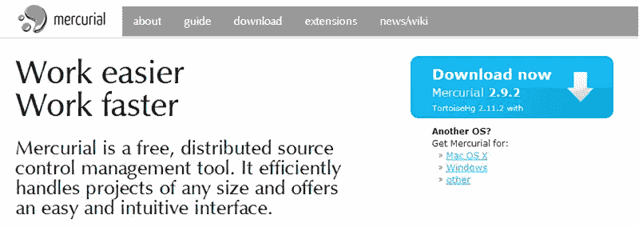

# 2014 年版本控制软件:你有哪些选择？

> 原文：<https://www.sitepoint.com/version-control-software-2014-what-options/>

想象一下，软件可以在你的工作中创建检查点，并允许你在需要的时候返回到这些检查点。这实质上意味着及时重温你的工作。一旦你回到这样一个关卡，你也可以偏离你最初选择的道路。这正是[版本控制系统](http://en.wikipedia.org/wiki/Revision_control)为你做的！

当使用版本控制时，主要代码存在于一个中央存储库中，或者分布在许多存储库中。每个从事代码工作的人都有他们在本地或远程系统中所做工作的本地副本。这个本地副本可能是一个文件、一些文件和目录或整个存储库，具体取决于软件。版本控制系统软件有助于管理这些代码。除此之外，非程序员也可以使用这样的软件，比如用[来管理文档](https://medium.com/tech-talk/49c85d3f647d)。

在这篇文章中，我将提供一个关于版本控制软件选项的快速回顾。版本控制软件大致分为两类——集中式和分布式。**集中式**系统在服务器上有一个单一的代码中心副本，开发人员只对这个中心副本提交变更。在**分布式**系统中，每个用户都有一份代码副本，包含项目的全部历史。

## [去](http://www.git-scm.com/)

Git 是一个分布式版本控制系统，可以说是当今最流行的版本控制系统。它是由 Linus Torvalds 开发的，用来解决现有版本控制系统的速度问题。世界范围内的许多组织更喜欢用 Git 来管理他们的代码，因为 Git 提供了大量的特性。

随着 GitHub、GitLab、BitBucket 等热门网站的出现，[使用 git 进行代码审查变得非常容易](https://www.sitepoint.com/using-git-open-source-projects/)。这就是为什么新的组织选择 git 而不是其他组织。

使用 Git 进行版本控制的著名互联网巨头有 [Twitter](http://opensource.com/business/12/8/open-source-technology-behind-twitter) 和 [Quora](https://www.quora.com/What-kind-of-version-control-system-does-Quora-use/answer/Charlie-Cheever) 。事实上，Twitter 的开源作品是 GitHub 上的[。截至 2014 年 3 月，他们的](https://github.com/twitter) [Bootstrap 项目](https://github.com/twbs/bootstrap/)是 GitHub 上最受欢迎的存储库，拥有大约 67，000 颗星星和超过 24，000 个分支！

如果你对 Git 开发背后的哲学感兴趣，这里有一段 Linus Torvalds 在 Git 上的 Google tech talk 视频。他谈到了 CVS 和 SVN 的问题以及 Git 如何解决这些问题。

如果你是 Git 新手，可以试试[这个初学者教程](http://try.github.io/levels/1/challenges/1)。

## [颠覆(SVN)](http://subversion.apache.org/)

Subversion 是作为对 CVS(并发版本系统)的替代而创建的，它已经存在了大约三十年。因此，Subversion 提供了 CVS 的最佳特性，并做了一些改进。Subversion 强调集中的代码，而今天其他流行的版本控制系统是“分散的”(或分布式的)。

尽管 Subversion 克服了 CVS 的一些不足，但它也有自己的一些缺点。人们经常发现 Subversion 很慢，而且缺乏其同类产品的某些特性。例如，与 Git 或 Mercurial 相比，subversions 分支缺少许多特性。

使用 Subversion，分支是集中创建的，而不是在您的本地机器上，这意味着不能有两个同名的分支。正如 Linus 在上面链接的演讲中解释的，从“test1”到“test5000”也可能有分支，这使得理解起来非常困难！Subversion 还以一种奇怪的方式实现了对文件的重命名。它以新名称复制文件或目录，并删除与旧名称关联的文件或目录。

近年来，许多流行的开源组织[如 Rails](http://weblog.rubyonrails.org/2008/4/2/rails-is-moving-from-svn-to-git/) 和 [PHP](http://news.php.net/php.internals/55293) 已经从 Subversion 转移到 Git。

如果大型组织正在放弃 Subversion，那么今天为什么要使用 Subversion 而不是 Git 或 Mercurial 呢？Subversion 使您能够使用基于路径的授权来限制特定用户对特定目录的访问。同样的结构在 Git 中也是可能的，但是您必须将您的主存储库分成许多较小的存储库，并限制对其中一个所需的较小存储库的访问。这使得整个过程有点复杂。

关于 Subversion 的介绍，你可以看看这本免费的书，可以在线获得 HTML 格式或 PDF 格式。

## [水银](http://mercurial.selenic.com/)

Mercurial 很像 Git，是一个免费的分布式开源系统。Mercurials 的主要目标是高性能、可伸缩性以及高级分支和合并功能。它有类似于 Git 的优点，但是也有某些缺点。

虽然它与 Git 几乎同时出现，但 Git 目前占据优势。一个从 Subversion 服务器(带有 Git 镜像)转移到 Mercurial 的组织是脸书。他们选择 mercurial 而不是 Git 的主要原因是 Mercurial 干净、模块化的 Python 代码更容易扩展。因此，脸书工程师为 Mercurial 做出了积极贡献。

如果你更喜欢 Mercurial 而不是 Git，你可以把你的代码放在 [BitBucket](https://bitbucket.org/) 上。

对于 Mercurial 的初学者教程，可以查看 [Hg Init](http://hginit.com/) 。

## 值得注意的提及

虽然我们已经介绍了最流行的版本控制系统，[还有相当多的这样的系统](http://en.wikipedia.org/wiki/Comparison_of_revision_control_software)。一个，已经提到过，是 [CVS(并发版本系统)](http://www.nongnu.org/cvs/)，从 80 年代就有了。它被广泛使用，直到 Subversion 和 Git 的出现。CVS 允许用户在先到先得的基础上注册他们的更改，并且只允许对最新版本的代码进行操作和编辑。这意味着如果您不想合并其他人的更改，您需要首先提交您的代码！

我应该提到的另一个版本控制系统是 [Perforce](http://www.perforce.com/) 。这是一个商业版本控制系统，被像[英伟达](http://www.perforce.com/customers/success-stories/nvidia)和[育碧](http://www.perforce.com/customers/success-stories/ubisoft)这样的公司使用。Perforce 还有一个 [Git 插件](http://www.perforce.com/product/components/git-fusion)来集成您现有的 Git 库。

还有一个选择是集市。像 Git 和 Mercurial 一样，Bazaar 也是一个分布式版本控制系统，其宣传口号是“人类的版本控制”。如果你感兴趣，你可以看看他们写得很好的[文档](http://doc.bazaar.canonical.com/en/)。

## 结论

从这个列表中可以明显看出，当涉及到版本控制系统时，你有很多选择。你选择用什么，很大程度上取决于你的要求，也在一定程度上取决于你的品味。一般来说，人们会选择他们已经有一些经验的系统。我应该注意的是，许多其他服务，如[谷歌文档](https://drive.google.com/)提供基本的版本控制，如果你的需求很少，你应该考虑一个更简单的服务。

如果你有任何版本控制的替代选项的经验，请在评论中告诉我们。

## 分享这篇文章