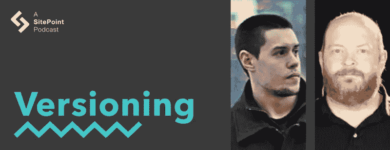

# 播客和网络技术的未来

> 原文：<https://www.sitepoint.com/versioning-show-episode-0-with-m-david-green-and-tim-evko/>

第零集？我们录制了版本控制节目的测试集，做起来很有趣，所以我们想把它公之于众。在这一集的版本控制节目中，主持人 Tim 和 David 向观众介绍了自己，并讨论了“版本控制”这个名称的含义、网络技术的未来以及他们对播客未来的展望。

[https://w.soundcloud.com/player/?url=https%3A//api.soundcloud.com/tracks/274105004&color=ff5500&auto_play=false&hide_related=false&show_comments=true&show_user=true&show_reposts=false](https://w.soundcloud.com/player/?url=https%3A//api.soundcloud.com/tracks/274105004&color=ff5500&auto_play=false&hide_related=false&show_comments=true&show_user=true&show_reposts=false)

[访问版本控制展示主页](https://www.sitepoint.com/versioning-show/)

**[在 iTunes 上订阅](https://itunes.apple.com/us/podcast/the-versioning-show/id1135300597) | [在 Stitcher 上订阅](http://www.stitcher.com/podcast/sitepoint/the-versioning-show) | [查看所有剧集](https://www.sitepoint.com/blog/)**

## 显示注释

*   推特上的蒂姆·埃夫科:[@泰夫科](https://twitter.com/tevko)
*   米（meter 的缩写））大卫·格林在推特上: [@mdavidgreen](https://twitter.com/mdavidgreen)
*   Twitter 上的版本展示: [@versioningshow](https://twitter.com/versioningshow)
*   [泡泡吧](https://www.baublebar.com/)
*   蒂姆的项目[restaurantmenubuilder.com](https://restaurantmenubuilder.com/)。(GitHub repo:[RestaurantMenuGenerator](https://github.com/tevko/RestaurantMenuGenerator)
*   [密码笔](http://codepen.io/)
*   [有效的敏捷](http://www.agilethatworks.com/)
*   [Scrum:新手到忍者](https://www.sitepoint.com/premium/books/scrum-novice-to-ninja)
*   [JavaScript 简介](https://www.sitepoint.com/premium/courses/introduction-to-javascript-2908)
*   [JavaScript:下一步](https://www.sitepoint.com/premium/courses/javascript-next-steps-2921)
*   [黑掉流程](http://www.hacktheprocess.com/)
*   [xkcd](http://xkcd.com/)
*   [事情解释者](https://xkcd.com/thing-explainer/)
*   xkcd 的作者创建的在线文字处理器。

## 副本

Tim:

嘿，大家好啊！这是蒂姆·埃夫科—@推特上的泰夫科…

David:

嗨，我是大卫·格林先生。我几乎无处不在…

Tim:

…您正在收听的是版本控制播客的第 0 集。这是一个我们每两周坐下来讨论从开发到设计的网络产业的地方——一些人今天让它发生，并计划它在下一个版本中的走向。

David:

通常，在这个时候，我们会介绍我们的客人。但这是我们的预发布集，所以今天我们将互相介绍，让你知道我们是谁，我们为什么要这样做，以及我们未来的计划。

那么，让我们开始这个版本吧…

* * *

Tim:

这对我们意味着什么？什么是版本控制播客？你如何定义它？

David:

嗯，术语<q>版本化</q>是指从一个阶段转移到另一个阶段，以及你如何定义处于版本 0、版本 1、版本 1.1 意味着什么。将版本号应用于某个东西的原因是为了让使用它的人了解一点你在你自己的开发过程中的位置，以及你沿着你的轨迹的位置。

Tim:

我喜欢这样。那真的很好。我也会选择这个作为我的答案。

*【笑声】*

我开玩笑的。出于这些原因，我喜欢标题<q>版本化</q>。我喜欢它也是因为，对我来说，它感觉不仅有增量版本，而且在网络连续体上每个人都有*不同的*版本——或者有些人选择称之为网络平台。

所以对我来说，我使用的网络版本是这个开发空间，在这里我构建软件，并与人们一起工作以实现商业目标——而对其他人来说，他们的网络版本可能是做出漂亮的设计，或者做出新的和直观的商业决策，或者创造不同的东西。

所以我喜欢标题版本化的另一个原因，只是因为它是每个人的创作空间的不同版本。

David [2:10]:

我真的很喜欢你带来的东西，因为当我在谈论版本控制时，我几乎是在考虑序列——几乎是旋律线——而你在谈论和声，这可以是多个人从他们自己的角度同时并行使用同一事物的不同版本。

Tim:

我喜欢这种活力。

进展顺利——我喜欢这样！

*【笑声】*

* * *

Tim:

说到我们，我们是谁？我想这是个好问题，对吧？

David:

是啊，我们是谁？你是谁？我是谁？

我知道你叫蒂姆。我知道你是 Twitter 上的@tevko，我也知道我们坐在这里讨论版本控制。

但是告诉我一点你的背景。是什么让你卷进来的，你为什么在这里？

Tim:

是啊，肯定的。所以，从我记事起，我就一直想做一些不同的事情作为职业。我曾一度想参军，曾一度想成为一名医生…现在仍然有点想成为一名医生，但是…以后，也许吧！

但是我最终去了一所社区大学，仍然不知道我这辈子想做什么。最终我掉进了网里。我知道我喜欢写作，所以我想开一个博客。我有了这个想法——我在这个拖放编辑器上有这个东西，它完全是基于 Flash 的。

我给我一个有 iPhone 的朋友发了一个预览，他回复给我一个什么都没有的截图。他说，<q>使用 WordPress</q> 。我不知道 WordPress 是什么，所以我研究了一下，我看到了这个博客平台。

所以，好吧，我得安装东西，我得做一个网站，我不知道怎么做。慢慢地，我开始挑选不同的东西，在 WordPress 上建立我想要的博客，慢慢地学习如何做更多。在某一点上，一切都一拍即合，我就像，<q>哦，我真的很喜欢这个！</q>

我真的很喜欢在网上构建、创造和制作东西，我决定，你知道吗，我要尽可能多地学习这方面的知识。

因此，每天我都会从仓库或一元店的兼职工作中回家——无论我当时在哪里工作——学习 CSS 和 HTML，很快就学习了 JavaScript。很快就有了一份真正的工作，为网络工作。从那以后，就一直是同样的事情——建造东西，回家，学习更多。而且，到目前为止，我真的还没有厌倦。

David [4:48]:

我喜欢这样。这意味着，在你的职业生涯中，作为一名工程师，你基本上是自学的。

Tim:

是的，是的。我已经在社区大学学习了几个学期，并且在谷歌上搜索了很多关于栈溢出的内容。

David:

所以，现在你已经开始走这条路了，我要问你一个哲学问题，我们喜欢问我们所有的客人。在你目前的职业生涯中，你是什么版本，为什么？

Tim:

好吧，我知道会这样，但我还是没有准备好！让我想想:我认为自己是 1.0 版本。当我构建软件时，我不喜欢发布 1.0。我喜欢发布 0.1，或者 0.01。我喜欢这样做，因为这是在发展中，它还没有准备好；这只是一个在这个空间公开的事情，但它没有完成。Done 是 1.0，然后之后的一切都在迭代，让它变得更好——至少对我来说是这样。

所以，我会说我已经通过了发展的一面。我有很好的基础，很好的了解这个空间，现在正在迭代。在我的职业生涯中，每天我都学到一些新东西——比如, <q>O，我不知道这是怎么回事,</q>或<q>我对语言的这一部分或网络的这一部分一无所知。</q>所以我会说我现在就在那里——1.0。

David [6:20]:

那么，除了主持播客，你最近都在做什么？

Tim:

是的，所以，这些天我在一家名为 [BaubleBar](https://www.baublebar.com/) 的公司有一份全职工作，在那里我是一名首席前端工程师，这意味着我制作人们与之互动的网站的一部分。有很多 HTML、CSS、JavaScript，我们也在努力为我们的电子商务网站建立一个新的平台。所以，现在我正在用 JavaScript 的 Node 和 Express 写很多中间件级别的东西。

所以，这就是我在那里做的。我也喜欢写很多。我时不时会写文章，我还会发微博…如果那很重要的话！

*【笑声】*

David:

如今，这一点绝对重要。

Tim:

哦，是的，是的。所以是的，这就是我一直在做的。我是一个狂热的侧边放映员。所以，只要我能，我就在做兼职项目。

David:

酷毙了。你能告诉我们一个你特别满意的副业项目吗？

Tim:

是的。事实上，我发起的最后一个副业项目是一个叫做 restaurantmenubuilder.com 的项目。

告诉我，大卫，如果这种情况以前发生在你身上——你正在寻找一家新餐馆吃饭，你在手机上调出一些东西，你正在浏览，你看到，啊，一个菜单链接。所以我要点击它，对吗？会发生什么？你必须下载一个 PDF 文件。

现在，对于大多数理性的人来说，这可能不是什么大问题。但我就是不想下载一个 PDF，损失手机的存储空间。所以我做了这个东西，让你只需要填写一堆表单选项，它就可以用 HTML 和 CSS 创建一个动态菜单。这是一个无服务器的应用程序，它只是在你的浏览器中运行，它创建了这个完整的菜单。它会将其保存到本地存储，最后，当您完成后，您可以下载并保存到您的设备上。

David [8:28]:

有意思！人们是如何使用它的？这是如何分配的？

Tim:

现在，只有 restaurantmenubuilder.com。我稍微推广了一下；我发了一些推文，我在网上发了一些帖子给不同的社区，告诉他们:<q>嘿，这是一个工具。</q>

我有谷歌分析，但我不怎么看。这是一个很难让我理解其中逻辑的项目，在我建立并购买域名并启动它之后，我休息了一段时间。我当时想，现在已经够了，以后我会推广剩下的。

但是我还没有看到任何人使用它。到目前为止，这只是一件我感到非常高兴的事情。

David:

我知道当你有这样的渴望时是什么样的，你只是[想]，<q>我知道如何建造它，我想把它放在那里，我只想把它给全世界。</q>

Tim:

是啊，肯定的。

David:

酷毙了。顺便问一下，你用什么建造的？

Tim:

我最初是在 [CodePen](http://codepen.io/) 中开发的——这是一个由 Chris Coyier 和他的团队发布的在线 IDE。很直观。它被用于从会议到教学的许多场合。我的很多副业都是这样开始的。如果它们只是 HTML、CSS 和 JavaScript，我会直接跳到 CodePen 上演示一些东西。一旦我有了一个工作产品，我就会在 GitHub 中打开一个库，然后把它编码出来。

所以，这都是普通的——普通的 HTML。我正在使用 Sass——或 SCSS——和 JavaScript，以及本地存储和 web workers。

David:

非常酷。所以这是非常通用的。它不依赖于自身以外的任何东西。

Tim:

是啊。我喜欢尽可能以那种方式建造。我在这方面非常固执——我相信我们总有一天会进入这个领域。

David [10:13]:

嗯，我们可能会发现自己站在了这场争论的同一边。

Tim [10:22]:

不错！

那么，你呢，大卫？你是怎么进入这个行业的？

David:

嗯，这取决于你说的是什么行业。作为开发者，还是作为播客？

Tim:

哦，这是一个很好的分裂。所以先说发展。

David:

好的。嗯，我不是开发者*【咯咯笑】* …但我曾经是。我做了很多年的前端 web 工程师，也做过一些角色的设计师——因为公司有时并不真正知道前端工程师和设计师之间的区别。所以我得到了这个称号，尽管我不认为我应该得到它。

但作为一名前端开发人员，我进入其中只是因为对代码着迷。我开始是一名作家，网络就发生在我身边。我看着它，我说，<q>这是我想玩的东西。我自学了我需要知道的东西。</q>

Tim:

那真的很酷。你说你不再是开发商了？就像，你不全职开发，或者你真的不再编码了？

David:

好吧，我真的不再专业编码了。我编码是为了好玩；我为自己做了一些小项目。但我以前是全职的。我曾经在创业公司工作，是团队的一员，我为 StumbleUpon 编写了很多前端代码。我为保险公司做过类似的事情。事实上，很久以前，我是 www.apple.com 的网站管理员。

但是，最近几年，我发现自己更倾向于项目管理。我变得非常迷恋 scrum 和敏捷流程。我看到我的团队成员如何能够改善他们的合作方式，提高他们的生产力，提高他们评估事物的能力，我想更多地参与其中，并帮助更多的人发现这一点。

所以，我已经不再是一名亲力亲为的开发人员，现在，我经营着一家名为 [Agile 的小公司，在](http://www.agilethatworks.com/)工作。我是一名敏捷教练，我帮助公司进行敏捷过程，帮助他们改进 scrum 的工作方式。

Tim [12:38]:

那真的很酷。哇，首先，apple.com 的站长！那是一件非常令人兴奋的事情！

David:

公平地说，那是在 apple.com——嗯，[www.apple.com](http://www.apple.com)——还是个新事物的时候。Apple.com 存在的时间要比这长得多，因为苹果公司已经成为中坚力量很长时间了。但是 www.apple.com 的 T2 在 1994 年复苏了。它是由苹果图书馆的某个人托管的——事实上，是戴尔·米德——他把它保存在他桌子下面的一台 Power Macintosh 850 上……因为那时网络对很多人来说并不存在，也没有人知道它的存在。

我向企业沟通副总裁提出了一个项目，将它引入苹果的企业沟通团队，让它正式存在，创建产品库，以及人们需要的许多其他信息，然后将出现在公司不同部门的许多不同的 www.apple.com 小部门集中起来。

所以这很有趣，在大约一年半的时间里，我是那个网站的网站管理员，和一个优秀的团队一起工作，他们教会了我很多关于 HTML、网络分析和冗余的知识…

从企业沟通的背景进入 it 行业，我学到了很多东西，这让我着迷。当我离开苹果的时候，我已经是一名成熟的工程师了。*【咯咯笑】*

Tim:

这太不可思议了——真的很酷。你说过你用敏捷做了很多事情。还有什么？似乎你现在参与了很多事情。那么，还有什么其他的东西呢？

David:

这些天来，敏捷已经占据了我生活的大部分。我最近与 SitePoint 合作出版了一本书，名为 *[scrum:新手到忍者](https://www.sitepoint.com/premium/books/scrum-novice-to-ninja)* ，这本书完全是关于 scrum 的价值——特别是对于 web 和移动开发团队，因为我觉得那真的是 Scrum 大放异彩的地方，这也是我认为 Scrum 变得如此受欢迎的原因之一，因为很多人都在那个领域工作。

但是我也为 SitePoint 编写课件，我刚刚发布了关于 JavaScript 的入门课程。我正在[学习 JavaScript](https://www.sitepoint.com/premium/courses/javascript-next-steps-2921) 的中级课程。我还主持了另一个名为 [Hack the Process](http://www.hacktheprocess.com/) 的播客，在那里我帮助人们弄清楚如何从有意识地计划某事转变为实际做某事。

Tim [15:09]:

哇，那么，播客、创作、<q>教程</q> …

David:

对我来说，最难的部分似乎是决定我想专注于哪里。因为，直到几年前，我还是一名全职员工。我的职位是各公司的高级前端工程师，或者高级平台开发人员——或者其他什么。那是我感到舒服的地方。

但是我意识到，当我开始从事更敏捷的工作时，这是我可以更多地造福世界的事情。我觉得独立工作更舒服，从一家公司转到另一家公司，有点像在周围撒敏捷的仙尘。

Tim:

是啊，肯定的。那非常令人兴奋。

好了，现在是哲学问题的时候了。在你目前的职业生涯中，你是什么版本，为什么？

David:

哇哦。我现在的职业生涯，我不得不说我是 0.1 版本——因为，正如我所说的，我已经做了这么多我正在尝试做的不同的事情。而且，虽然我被开发工作吸引，我被课件创作吸引，我被播客吸引，我被敏捷教练吸引，但这些事情都没有成为我做的一件事。我不想放弃他们中的任何一个，在我心中，我觉得他们之间有一种相关性，如果我继续追求他们中的每一个，直到我不再觉得我想做些什么。

因此，正因为如此，在这一点上，我将称自己为 0.1，因为我仍在努力寻找它们如何融合在一起——而不一定要放弃任何仍然吸引我的东西。

Tim:

那真的很酷。是啊，肯定的。我喜欢网络的一点就是你正在做的事情:这个行业有这么多方面，有这么多不同的部分，无论是开发，还是播客，或者只是告诉人们如何更好地使用它。那真的很酷。

David [17:13]:

这很有趣。我有一个很好的理由来主持一个关于从计划到行动的播客，因为这是我自己职业发展的一个非常重要的部分——我意识到我所做的需要被分享，需要有一个观众。就好像这幅画不是艺术，直到有人对它做出反应。直到有了观众，直到有了反应，才真正有了意义。

Tim:

绝对的。

David:

蒂姆，我们正在做的这个播客怎么样？我们希望*这个*是什么？

Tim:

我们希望这是什么？这是一个非常好的问题。所以，我们首先通过讨论版本化对我们的意义来打开这个话题。有鉴于此，我真正感兴趣的网络版本之一就是构建它。我喜欢 web 开发，喜欢参与不同的项目，制作有趣或令人兴奋的东西。

所以，我真正想完成的事情之一是谈论为网络而建设。它是如何完成的，接下来会有什么，有什么新的，在版本方面会有什么新的东西出现，作为增量？十年前有表格，现在是 div、flexbox、floats 等等。

所以我肯定想花点时间谈谈它的机制。我们使用的是什么东西，即将出现的是什么新的令人兴奋的东西，我们最近看到的是什么东西？诸如此类的事情。

David:

那很有趣。这是很多人有兴趣定期关注和保持的事情。

当我想到版本控制时，我变得很有哲理，实际上，我开始思考这对我们的生活有什么影响，思考这种改变的方式。我与人们进行了令人惊讶的对话，例如，我们现在的许多社交交流正在从记录和永久存档的系统转移到更短暂的新交流方式，就像我们在街上的谈话一样。这对于我们交流的方式以及我们如何使用这些技术有什么影响？

Tim [19:43]:

是啊，肯定的。这是一个大问题，尤其是在沟通方面。我们可以有一整集都是关于这个的！*【咯咯笑】*

David:

所以我希望我们能带来一些嘉宾，他们不仅能谈论他们现在在做什么，他们如何应对这些事情，还能谈论他们正在做的工作对我们所有人的影响，因为我们基本上是在建立这个巨大的共享交流媒介。

Tim:

是的，我也喜欢哲学的角度，因为网络现在正在爆炸。我很少有机会谈论这意味着什么，你知道。虽然我可以告诉你如何建造这个东西，但我并不经常坐下来思考这意味着什么，这将产生什么影响，这将如何在更大的画面中发挥作用。

David:

我认为我们中有很多人——我知道多年来我就是这样——如此沉迷于这是最新的框架，我需要花费我所有的大脑周期来学习它。

我没有时间停下来想，等一下，花我所有的时间去学习我知道至少在六个月到一年后会过时的东西，这意味着什么？我在想我在用它建造什么，我在想如何建造它。

Tim:

是啊，我肯定是有罪的。

David:

我相信也有很多人，我们都被这些通信技术如何改变我们生活的浪潮所吸引，互联网是我们这些天所做的许多事情的核心。

Tim:

是啊。对我们中的很多人来说——比如对我来说，我的工作只是思考“我如何建造这个东西？”不太关心“我在建造什么？这意味着什么？”所以，这是一个令人兴奋的发展。我喜欢这样。

David [21:40]:

我的很多想法来自于我被误认为是一名设计师，一名开发人员，因为我在前端工作。这迫使我学习了很多关于设计的知识，以及设计中需要考虑的问题。

我学到了很多关于用户体验测试的知识，了解我们对用户做了什么，他们在期待什么；我们造成了什么样的痛苦，我们解决了什么样的痛苦。这让我有点忘乎所以，从“我必须做一个能做这件事的小工具”变成了“一个人通过小工具与另一个人互动意味着什么？”

Tim:

这是一个非常好的观点。我们不常想到这一点。我也很高兴你提到了设计，因为我认为这凸显了本期播客的另一个目标——我们不只是想谈论我们在建造什么以及如何建造。我们也想谈谈进入其中的过程:就网络媒介而言，什么是设计，或者什么是用户体验。或者甚至从商业的角度，对吗？

David:

当然，一般的网络业务。我不知道你，我在旧金山。2016 年的旧金山，也就是我们现在所在的地方，也是我们现在所在的地方，是一个创业公司不断涌现的神奇地方。这就像是技术的淘金热。

你可以走在街上，听到人们在谈论，“我要收购-雇用这些人……”整个城市都在发生中产阶级化，因为人们正在四处流动，以便为所有的技术公司提供空间。它改变了人们在现实生活中的互动方式。

Tim:

是啊，那很有趣。我在布鲁克林。在我工作的曼哈顿，我经常听到一些创业语言，但我听到很多人谈论特定的技术。有时我只是走在街上，我会听到有人谈论代码。这仍然让我有点惊讶。我觉得这是两个海岸之间的动态。在旧金山，你会听到很多关于创业世界的事情，而在纽约，我听到很多关于通用技术的事情，还有“网站这个”、“CMS 那个”、“JavaScript 这个”。我见过很多这种模式，你想到一个基于网络的产品，那就是你的公司。

*【咯咯地笑】*

这对我来说一直是一件奇怪的事情。你想想你的传统公司——你的 IBM、3M——这些类型的公司，它们只有多种产品。例如，想想 3M 公司生产的不同数量的东西。

然后想想你在地铁上看到的最新应用广告牌。我想到的最新的一个是一个平台，它的存在只是为了让你可以有人来打扫你的房子。那现在是公司了。就是这样！这非常有趣，而技术让你可以无缝地做到这一点，我想补充一点，但这好吗？安全吗？它是可持续的吗？

David [25:00]:

这对我们所有人的生活都有一定的影响。我不知道你是怎么想的，但我已经足够老了，我成长的那个时代，理想的职业是你去一家公司工作，你在那里工作 40 年，他们给你一块金表，然后你退休。

当我在我的第一家公司工作了大约 12 年的时候，我意识到这已经不是我生活的世界了。如今，当人们看我的简历，看到我在一家公司工作了 12 年，他们会问“你为什么在那里呆了这么久？”

Tim:

是的，变化这么大真奇怪。我是在那个时代的末期长大的。现在，我听到在那个时代长大的人告诉我，过去是这样，但现在你呆一年，你就到处跳。

处理这些事情很奇怪，因为有时候我去工作，我觉得这是我想要支持的事情，我想要帮助的事情，我想要做的事情。很明显，今天结束时我会得到一份薪水。但对我来说，“我当然不想在同一个地方呆上 40 年，”但与此同时，这个行业正在推动“在这里呆上一年，六个月，一年半，然后继续前进。”我认为这也有它的含义。

David:

绝对的。事实上，你提到为一个地方工作是因为你想支持他们正在做的事情:我知道至少有同样多的人在公司工作，因为他们喜欢免费的午餐，或者他们喜欢开放式的工作空间。或者是他们每天练的瑜伽。他们真的不关心公司的愿景是什么。他们只是雇员，他们拥有所有这些东西的股票期权，但这并不意味着他们会实现这些股票期权。他们只会在这些地方呆一年，也许两年，然后就离开。

Tim [26:56]:

是啊。对某些人来说，这是可行的。我是这样一个人——我和我的工作非常非常紧密地联系在一起。有时这是一个弱点，但有时这驱使我真正地把我的心倾注到我正在做的工作中。有时熬夜到很晚，并真正关心我在一天结束时交付的东西。有些人，恰恰相反，帮助他们做同样的事情。

但是，我发现对我来说，如果我真的不在乎我正在做的工作，有时候我在家的时候真的会想它，甚至在工作的时候也不会想它:如果我没有这种心态，我就很难继续回来并全力以赴。

David:

有趣的是:我听到了你的话，但有时我觉得自己犹豫不决。因为我曾在那些初创公司工作过，那里的每个人都必须呆到 9:30，否则他们会被视为懒鬼——不是指现在那种用 Slack 交流的“懒鬼”，而是指过去那种不努力工作的懒鬼。

但是，另一方面，现在我已经独立工作了，我从一家公司转到另一家公司，我在做教练，我怀念那种已经建立起来的感觉，那种拥有一个我是其中一员的团队的感觉。

很难将这两者结合起来。这是员工拥有的独立人士没有的东西之一。

Tim:

是的，当我第一次进入这个行业时，我做了一点自由职业，从一个客户到另一个客户，我绝对喜欢这种自由。我相信你会有同感:没有什么比看手表更好的了，现在是周五下午 3 点，你会想，“好吧，我今天就到此为止了。”我开始这样做，开车回家，高速公路是空的——或者地铁，取决于你在哪里。但是在它的下面总是有一种“这里只有我一个人”的感觉

David [28:55]:

是啊。例如，今天，我去参加了一个会议。我不需要问任何人我是否能去参加这个会议，我也不需要为这个会议申请预算。我只是说，“这是一个我需要去的会议，”我去了。

拥有这种独立性很好，但感觉自己是比自己更大的事物的一部分也很好。

Tim:

是啊，当然。

*【插曲】*

因此，对于我们想要谈论的事情类型，我们似乎有一个非常好的路线图——从特定类型的技术到该技术的意义，再到该行业的不同方面。

David:

哇哦。我们很难缩小嘉宾名单，因为我们几乎可以和任何从事技术工作的人交谈……*【吃吃地笑】*……并且仍然有关于这些哲学问题的话要说。

Tim:

我们可以；我喜欢这样。我认为无论我们带来什么类型的客人，我们都可以突出这些单独的话题。我们可以谈论它如何影响技术，然后我们可以谈论他们用来创造它的具体技术。

David:

我认为那会很有趣。我有一种感觉，我们的观众会有点分裂。会有一些人是更铁杆的技术专家，他们可能会珍惜这个机会，对他们正在做的事情的哲学进行更多的思考。

然后可能会有一些自己没有技术背景的人。他们可能会因为有机会听到更多关于是什么造就了他们的生活而变得丰富多彩。

Tim:

我很高兴你提到了这一点，因为在谈论特定技术时，我喜欢做的一件事就是尽我所能从初学者的角度出发。

我喜欢能够向非技术人员和非常技术的人员描述技术事物。所以，这也是我这个播客的目标之一:不管你处于什么水平，我希望我们能够解释非常复杂的技术。即使对我来说，我也不是很擅长设计，所以也许我需要有人向我解释复杂的设计哲学。

但我想确保，无论谁在收听，他们都不会觉得“这一集不适合我，所以我要跳到下一集。”

David [31:10]:

学会如何用人们能理解的术语解释事情是非常重要的。

事实上，我前几天刚刚看到了一个在线文字处理器[，它是由网络漫画](http://xkcd.com/simplewriter/)[的作者 xkcd](http://xkcd.com/) 创建的，他最近出版了一本名为[事物解释者](https://xkcd.com/thing-explainer/)的书。他所做的就是用英语中最常见的 1000 个单词来解释复杂的概念。他还发明了一个文字处理器，当你使用一个不属于英语中 1000 个最常见单词的单词时，它会提醒你。

所以它迫使你接受抽象的概念和复杂的问题，并把它们用任何熟悉基础英语的人都能理解的术语表达出来。

Tim:

那听起来非常困难。伙计，这里有个兼职项目。

*【笑声】*

David:

嗯，就像我说的，这是在线的，值得尝试。我尝试过用这个东西写一两篇博文，但都被卡住了。*【笑】*但也面临着创造性的挑战，这确实迫使我思考，“如果我不能用每个人都能理解的语言来表达，我真的明白我在说什么吗？”

Tim:

是的，那真的很好。这是技术帮助改善沟通的一个很好的例子——我们可以花相当多的时间来讨论，这非常适合这种形式。

David:

嗯，我们可以花很长时间来谈论这些事情，但我认为我们即将结束这一集零。

我认为我们已经涵盖了我们可能想要谈论的广泛内容，我认为给人们一点关于谁是蒂姆和谁是大卫的介绍。

Tim:

大卫，谢谢你的加入和对我的采访。

David:

蒂姆，谢谢你面试我。我想我说的可能比我预期的要多。*【咯咯笑】*

Tim:

我确实学到了很多，我想我们的客人也是。

* * *

非常感谢大家的聆听。我们一直很高兴能与大家谈论技术。

David:

我们还要感谢 SitePoint.com 和我们的制片人 Adam Roberts 和奥菲利·勒沙特。请随时在 Twitter 上给我们发送您的评论——[@ versioningshow](https://twitter.com/versioningshow)——并在 iTunes 上给我们评分。

让我们知道我们做得怎么样。

Tim:

我们下次再见，希望你喜欢这个版本。

## 分享这篇文章