# 将你在 WordPress 中的视觉内容提升到一个新的水平

> 原文：<https://www.sitepoint.com/visual-content-in-wordpress/>

图片是增强你的 WordPress 网站或博客的一个极好的方法。自动地，图片给你的网站增加了色彩和活力。他们吸引你的网站访问者，通过帮助访问者与你的内容建立情感联系，使你的网站更令人难忘。它们甚至可以增强 SEO(只要你添加描述性的文件名和 alt 标签),随着社交网络变得越来越可视化，带有图片的网站帖子更有可能在社交媒体平台上分享。

最近写了一篇关于[八个 WordPress 插件打造出令人敬畏的图片效果](https://www.sitepoint.com/8-wordpress-plugins-create-awe-inspiring-image-effects/)的文章。今天，我想我会把对伟大形象的探索进行得更深入一点。首先，我将解释如何在 WordPress 内部编辑图片。

然后，我会跑遍一些可以让你的内容脱颖而出的外部软件平台。有无数的平台可用于编辑和增强图像。许多这样的平台已经存在很多年了。被图形设计师和摄影师广泛使用，他们丰富的遗产有助于图像增强水平，这不是通过 WordPress 插件那么容易实现的。在上传到你的 WordPress 媒体库之前，使用第三方平台和软件来增强你的图片并没有错。从长远来看，你的 WordPress 网站甚至会感谢你。

最后，我将带你浏览一些 WordPress 图片管理工具，旨在保持你的媒体库整洁。

## 使用 WordPress 编辑图片

当谈到为 WordPress 网站编辑图像时，人们往往会忘记 WordPress 本身就有内置的图像编辑器。如果你需要做的只是执行简单的图像编辑(比如裁剪、调整大小、翻转或旋转)，那么甚至不需要离开 WordPress 仪表盘。只需遵循以下简单步骤:

1.  导航到你的 WordPress 仪表盘的媒体库部分。
2.  上传您想要编辑的图像(使用页面顶部的“添加新图像”按钮)，或者单击已经上传的图像。
3.  一旦你选择了你想要编辑的图像，你会看到下面的屏幕。在你图片的正下方，最左侧，有一个“编辑图片”按钮。点击它。
4.  然后，您将看到一系列选项，包括:缩放图像的原始尺寸，使用纵横比裁剪图像，水平翻转，垂直翻转，顺时针或逆时针旋转。
5.  然后，您可以选择是要对图像的所有变体进行所有这些更改，仅更改缩略图，还是更改除缩略图之外的所有内容。

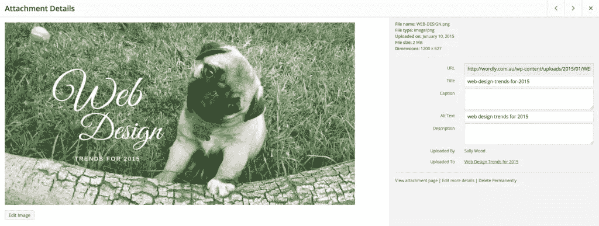

最棒的是，在编辑图片时，WordPress 甚至有一个特殊的内置安全网。所以，如果你碰巧修改了一张图片，然后突然决定不喜欢最终结果，WordPress 有一个“恢复图片”选项。您只需选择您编辑过的图像，点击与第一次相同的“编辑图像”按钮，您会在屏幕右侧看到一个名为“恢复原始图像”的下拉选项。这将放弃您所做的任何更改，使您的图像再次恢复到以前的辉煌。

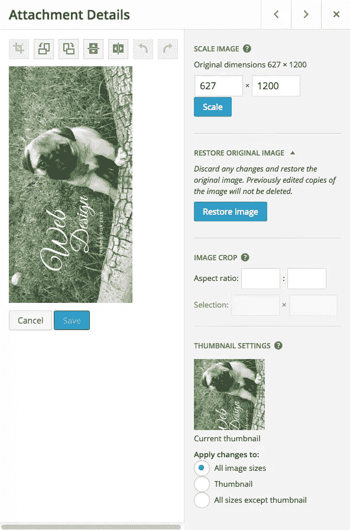

如果你想在 WordPress 内部进行一些更高级的图像编辑，那么可能是时候研究一些插件了，比如那些在[八个 WordPress 插件中提到的，来创造令人惊叹的图像效果。](https://www.sitepoint.com/8-wordpress-plugins-create-awe-inspiring-image-effects/)

## 非 WordPress 图片编辑和设计工具

### [Photoshop](http://www.photoshop.com/)

作为 Adobe 创意产品套件的一部分， [Photoshop](http://www.photoshop.com/) 是世界领先的数字图像软件平台。它创建于 1988 年，在过去的 25 年里，它迅速成为行业领先的图像编辑软件，甚至催生了一个新的动词:photoshopping。Photoshop 为一系列用户提供了一系列价位，个人用户从每年 119 美元起。

Photoshop 提供的一些最有用的功能包括:

*   智能锐化:这个漂亮的小工具可以让你减少图像背景中的噪声(这会让你的图像看起来稍微失焦)，同时锐化手边的主题边缘。
*   透视扭曲:使用该功能，您可以先拍摄，然后再调整图像的透视。你可以让你的照片看起来像是从左边一点或者右边一点拍摄的。此外，如果您需要合成从两个完全不同的角度拍摄的两张照片，您可以更改其中一张照片的视角，以便将两张照片无缝结合为一张照片。

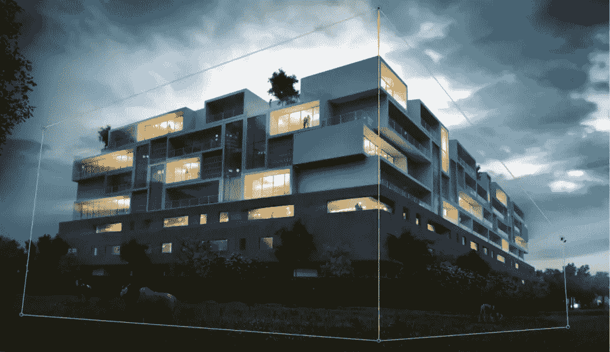

*   调整图像大小:调整图像大小是一项为网络调整图像时经常要做的工作。太多时候，图像需要放大，最终导致不太清晰的结果。有了 Photoshop，你放大的图像可以有所挽救。Photoshop 提供了一个对话框，让你可以调整很多不同的选项，包括最重要的“放大时保留细节”复选框。
*   内容感知移动:当你第一次开始玩这个功能时，它看起来很神奇。它允许您选择图像的一个区域，将该区域移动到图像的不同部分，然后填充留下的空白。它并不总是渲染完美的结果，但您可以在事后调整适应，这决定了移动的对象如何适应其新的背景。Adobe 有一个关于如何使用这个工具的精彩教程。

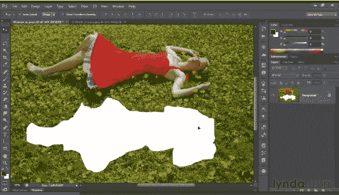

*   直立:此功能使您能够拉直地平线和建筑物，操纵垂直和水平元素，并拉直稍微倾斜的场景。
*   减少抖动:此设置允许您消除用不稳定的手拍摄的图像的模糊。您甚至可以专注于照片中特别模糊的部分，以使锐化更加准确。在下面的例子中，结果不言自明。

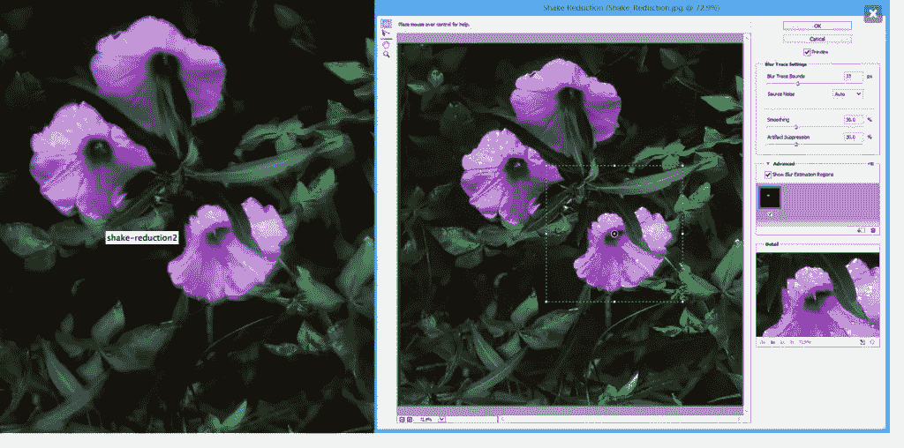

Photoshop 有如此多的其他功能和工具，几乎不胜枚举。您可以调整图像的不透明度、图像的颜色填充、减少红眼、添加笔触、进行自动镜头校正、恢复旧的或损坏的图像、混合像素等等。

### [坎瓦](https://www.canva.com/)

相对较新的在线图像编辑器和图形设计工具， [Canva](https://www.canva.com/) 是一家澳大利亚初创公司，于 2013 年 8 月推出。Canva 有很多优点:

*   它是免费的(总是一个成功的功能！).
*   它是在线托管的，所以没有必要在你的硬盘上安装一个大的软件包。
*   它使用简单，有一个任何人都能掌握的界面。所以，如果你不是一个平面设计师(或者一个有图形思维的人)，你仍然可以用它来编辑你的图像，或者创建令人惊叹的图形。
*   它有一个超过一百万张图片和数千种字体的内置库。
*   您可以轻松地与团队成员、客户、家人或朋友进行在线协作。
*   它允许您共享图像，并能够上传您自己的图像、徽标、插图和图形。

Canva 的介绍视频很好地总结了这一切。

[https://www.youtube.com/embed/3FZGN7BCs6k?feature=oembed](https://www.youtube.com/embed/3FZGN7BCs6k?feature=oembed)

Canva 的一些功能包括:

*   照片编辑:您可以使用 Canva 的滤镜编辑图像，并调整对比度、亮度、饱和度、模糊度、淡色和晕影等元素。
*   预设模板:Canva 已经为用户设置了大量的设计模板。有一个用于博客图片、照片拼贴、邀请和各种社交媒体模板(Twitter 帖子、脸书横幅和广告、Google+封面和 Pinterest 帖子)。此外，如果预设的模板都不符合您的喜好，您可以创建自定义尺寸的图像。
*   预设布局:一旦你选择了一个模板，你会看到一系列预设的布局供你选择。所有这些布局已经包含了圆滑、光滑的排版，结合了漂亮的图形元素。只需几次点击，您就可以轻松地将自己的图像拖放到布局中，创建个性化的图像，并随时上传到您的网站。

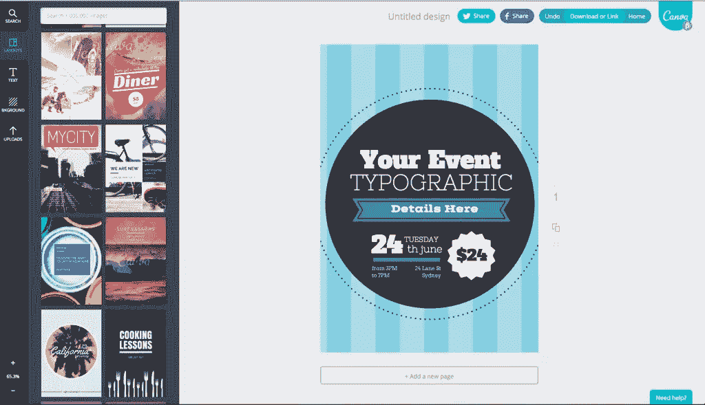

然后，只需两次点击，您就可以轻松地改变您的布局背景，完全改变你的形象的外观和感觉。

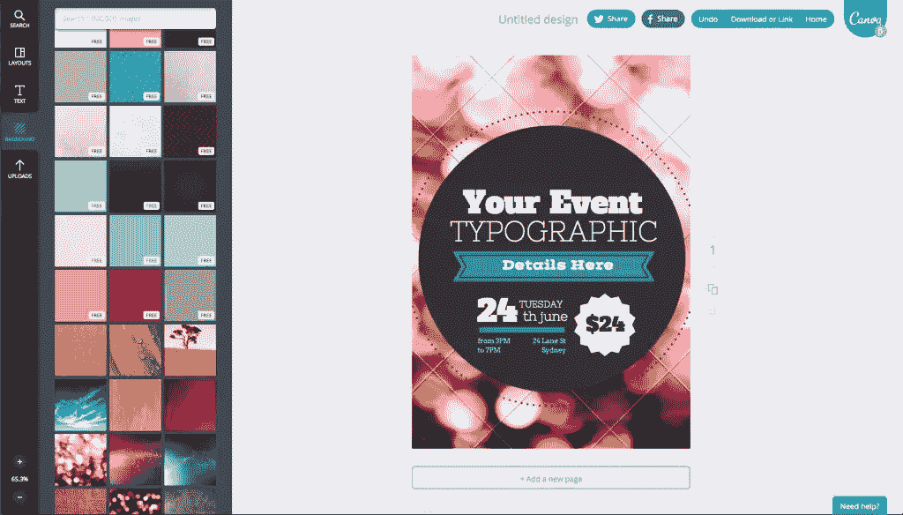

### [PicMonkey](http://www.picmonkey.com/)

PicMonkey 是一个名副其实的软件平台，它的口号是:让你的图像更进一步。PicMonkey 很像 Canva，是一个免费的图片编辑和图形设计工具，完全在线托管。不需要下载软件，也不需要支付年费，当然，除非你愿意。PicMonkey 为用户提供升级到付费高级版本的选项，该版本被称为 Royale，价格为每月  33 英镑)。使用 Royale，您可以访问无广告编辑模式，以及附加的修饰工具、效果、框架、叠加和纹理选项。

PicMonkey 有四个主要特性:

*   照片编辑:红眼、过度曝光和模糊等令人讨厌的问题可以通过 PicMonkey 的几次点击得到纠正。你可以给你的图片添加一些光晕，内置滤镜，比如光线和聚焦效果。
*   润色:有了 PicMonkey 这个锦囊妙计，你再也不用害怕在网站上发布自己的头像了。修饰工具包括一系列面部特征过滤器。使用喷枪，您可以消除瑕疵，让自己容光焕发。使用除皱剂可以让你看起来年轻。用牙齿增白剂让你的珍珠白更白。甚至有胡须生长可以产生面部毛发，或者给你现有的飘逸的头发添加亮点。其他修饰效果包括睫毛膏、眼部增亮、喷雾晒黑、唇彩和最终抛光；有点像你拍大头照的化妆包。不过，对于这个小特性，有一点需要提醒:这很容易让人忘乎所以。所以试着克制一下，否则你的照片看起来会有点假。

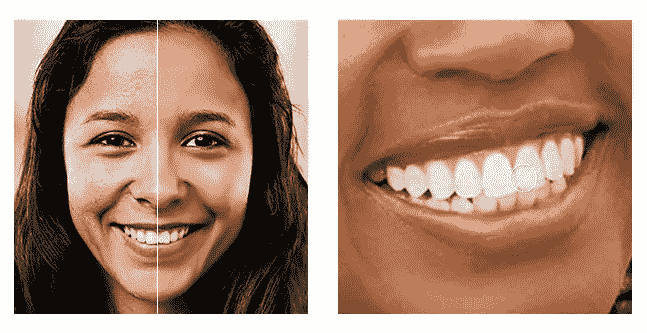

*   拼贴:使用 PicMonkey 的一系列预设模板，您可以快速轻松地创建图像拼贴。或者，定制布局，创建一个独特的，个人的图像拼贴。您甚至可以在 PicMonkey 的拼贴视图中编辑图像，从旋转和翻转图像到调整曝光和光圈。
*   设计:最后，但绝不是最不重要的，您可以使用 PicMonkey 来创建非常棒的视觉效果。与 Canva 非常相似，PicMonkey 拥有您可能需要的所有预设模板，或者，您可以创建自己的定制大小。

### [for](http://www.fotor.com/)

于 2012 年推出的 [Fotor](http://www.fotor.com/) 是另一款在线照片编辑工具。虽然它与 Canva 和 PickMonkey 有许多相同的功能，但 Fotor 是唯一一个为用户提供 HDR(高动态范围)摄影技术的在线图像编辑工具。

HDR 摄影的重点是强调照片的强度等级范围，以便最准确地反映现实生活。要使用这个特殊的功能，你需要上传三张图像(捕捉完全相同的场景)到 Fotor:一张图像曝光正常，一张曝光不足，另一张曝光过度。一旦上传，Fotor 算法就会发挥它们的魔力，生成一张色调映射图像。这幅图像的每一个区域都将有精确的曝光量。您可以捕捉阴影、高光和细节，这些通常只有使用更昂贵的图像编辑软件才能实现。

此外，如果照片中有物体移动(比如旗帜在微风中飘动)，您可以使用 Fotor 的选择“减少鬼影”工具来纠正不一致或模糊的区域。

## WordPress 插件保持你的媒体库简洁干净

显然，如果你对图像设计和编辑工具感兴趣，你会很清楚视觉资产对任何网站有多重要。所以，很有可能，你有相当多的媒体文件被加载到你的 WordPress 网站的后端。所以，可能是时候投资一些插件来保持你的媒体库干净整洁了。

虽然不是严格意义上的图像设计或编辑工具，但是一旦你的图像编辑和设计完成，所有这些 WordPress 插件都会派上用场！

### 给你的图片库分类的插件

如果你发现在你的媒体库中定位特定的文件，或者管理大量的文件变得太困难，那么也许是时候投资下面的插件了。所有这些插件的设计都有一个明确的目标:帮助你对媒体库进行分类。

#### [启用介质替换](https://wordpress.org/plugins/enable-media-replace/)

说到媒体文件管理，这个插件是一个省时的工具。它允许你替换你的 WordPress 媒体库中的现有文件，只需上传一个新文件。不再需要删除、重命名或重新加载图像文件。安装后，在“编辑媒体”视图中会出现一个附加选项:“替换媒体”。超过 4000，000 的总下载量，超过 100，000 的活跃下载量和 4.8 星的评分，这个插件肯定是做对了一些事情。

#### [增强型媒体库](https://wordpress.org/plugins/enhanced-media-library/)

增强的媒体库插件允许你为你的媒体文件创建无限数量的媒体分类。您可以完全控制所有的分类法参数，并且可以非常容易地编辑、删除、分配和取消分配您认为合适的分类法。你甚至可以使用这个插件来创建新的 MIME 类型。如果你选择 Pro 版本的插件，你也可以同时为多个媒体文件设置多个分类，并且你可以兼容很多其他插件，比如 WooCommerce 和 Meta Slider。这个插件有超过 20，000 个活跃下载，4，7 颗星，兼容版本 4.1.1。

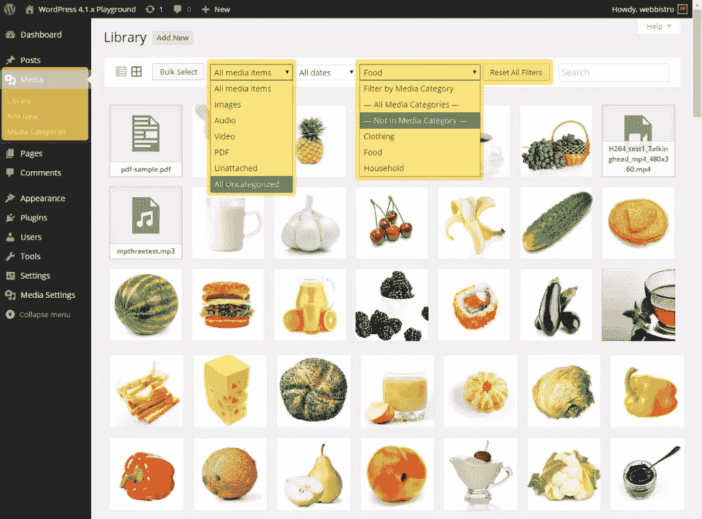

#### [高级媒体文件管理器](https://wordpress.org/plugins/media-file-manager-advanced/)

这个媒体管理插件有 8000 次下载，但不如上面那个受欢迎。但是，它仍然充满了冲击力。不用创建分类法，使用这个插件，你可以在你的媒体库中创建文件夹和子焊料，这样你就可以轻松地对媒体进行分类，而不用担心会破坏链接。它使用与 WordPress 中图片相同的简单的拖放操作。它只有 3.5 星级，并且只兼容 4.0.0 版本(所以值得等到升级后再安装)。

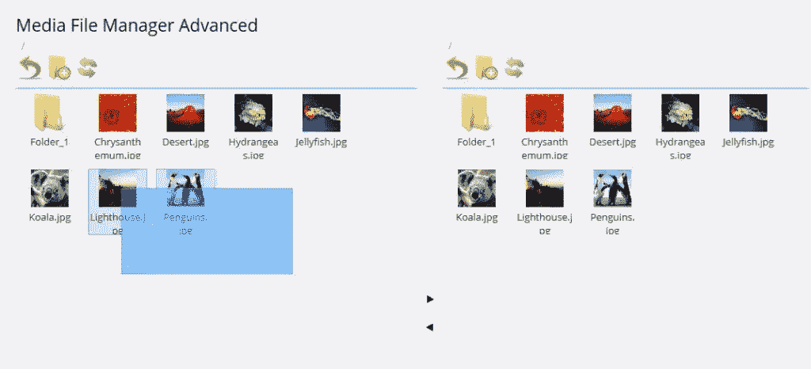

#### [媒体库类别](https://wordpress.org/plugins/wp-media-library-categories/)

这个插件有一个特性，而且只有一个特性，但是它做得非常好。它可以让你添加类别到你的 WordPress 媒体库。一旦安装到您的网站上，它将激活您的媒体库中一个很大的下拉类别列表。它还允许您通过批量操作同时更改多个图像文件的类别。这个插件似乎定期更新，与 WordPress 的 4.1.1 版本兼容，目前已获得 4.5 星评级，活跃下载量超过 10，000 次。

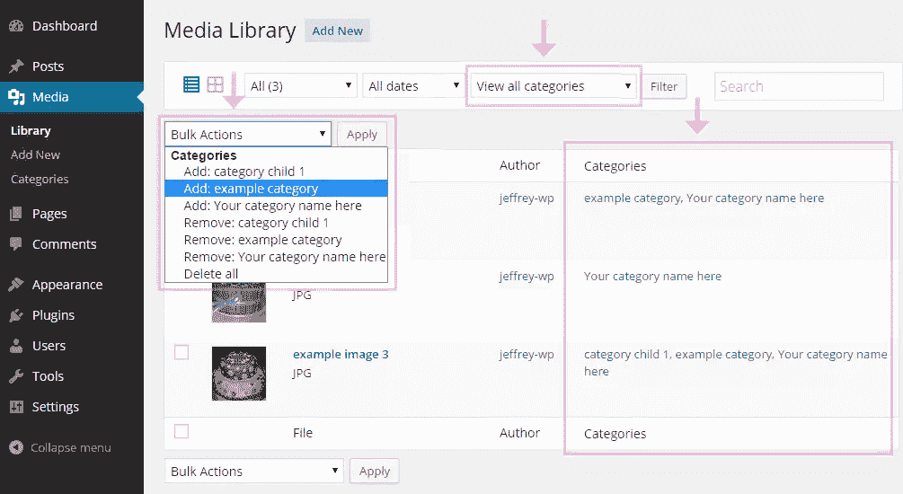

### wordpress 插件优化你的图片

一旦你有大量的图片上传到你的 WordPress 仪表盘，你真的需要监控你的 wesbite 的整体加载时间。你需要确保你的网站的整体性能不会受到影响，特别是考虑到谷歌现在将网站速度作为其搜索引擎排名算法的一个因素。

如果你的网站速度受到影响，那么一个图像优化插件可能正是医生所要求的。在某些情况下，这些插件能够将你的整体图像尺寸缩小高达 90%,而实际上不会降低质量或图像本身。

#### [WP Smush.it](https://wordpress.org/plugins/wp-smushit/)

根据 WordPress 插件目录，这个图像优化器是同类中最好的插件。鉴于这一崇高的声明，我认为从这里开始是恰当的。WP Smush.it 的下载量超过了 100 万次(其中 30 万次是活跃的),并且(在撰写本文时)刚刚在五天前更新。但是，它只能管理 3.5 颗星。它的工作原理是从你的图像中剥离大量隐藏的数据，并且只需点击一下就可以设置剥离所有现有的图像。有免费版，还有 pro 版；主要的区别在于免费版可以处理 1MB 以内的图像，而专业版可以处理 5MB 以内的图像。

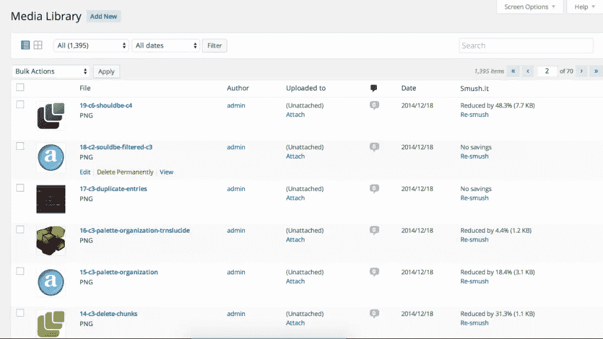

#### [EWWW 图像优化器](https://wordpress.org/plugins/ewww-image-optimizer/)

与 WP Smush.it 类似，EWWW Image Optimiser 使用所谓的无损技术来减少图像的文件大小，无论是在您上传图像时，还是批量上传到您网站上的所有现有图像。该方法使用算法来减少图像质量损失，从而产生比更静态的图像压缩级别好得多的图像质量。如果您愿意，它还允许您恢复图像的原始版本。这个插件有多种语言版本，有超过 100，000 次的活跃下载，并且兼容 WordPress 的 4.1.1 版本。

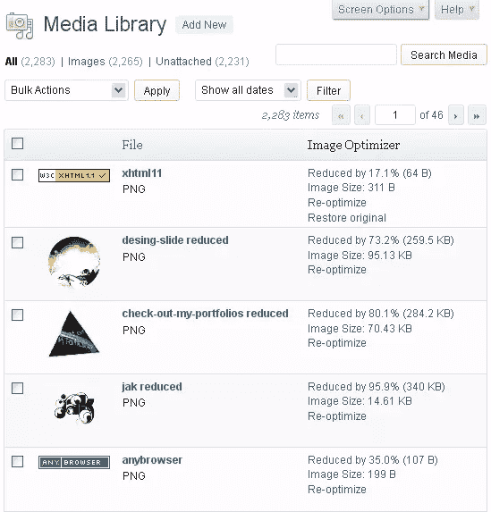

## WordPress 可视化内容创建变得简单

虽然 WordPress 确实提供了一系列的图像设计功能，由一些创建令人惊叹的图像效果的[插件支持](https://www.sitepoint.com/8-wordpress-plugins-create-awe-inspiring-image-effects/)，但不幸的是，有时(真的只是有时)当涉及到图像编辑和图形设计时，WordPress 插件不能提供相同的输出。毕竟，WordPress 最初并不是为图像编辑而构建的。

所以，要想让你的图像真正脱颖而出，有时你需要使用专业的编辑和设计软件，比如专门为图像设计和编辑而开发的 Photoshop。

一些较新的软件平台，如 Canva 和 PicMonkey，也为 WordPress 网站提供了无限的潜力。你可以使用他们的预设模板生成令人瞠目结舌的博客标题、时尚的媒体工具包、漂亮的广告和一些前所未见的最复杂的信息图表。所有这些都可以在一个比紧张还紧张的时间框架内轻而易举地实现。有了这些免费的工具，你还有什么可失去的呢？

不要忘了，一旦你编辑和设计了你漂亮的引人注目的图片，花时间整理它们；为什么不试试上面提到的媒体库分类插件。毕竟，如果网站图像很快迷失在混乱无序的媒体库中，那么创建惊人的网站图像就毫无意义。

欢迎在下面的评论中分享我错过的任何其他工具或插件。

## 分享这篇文章