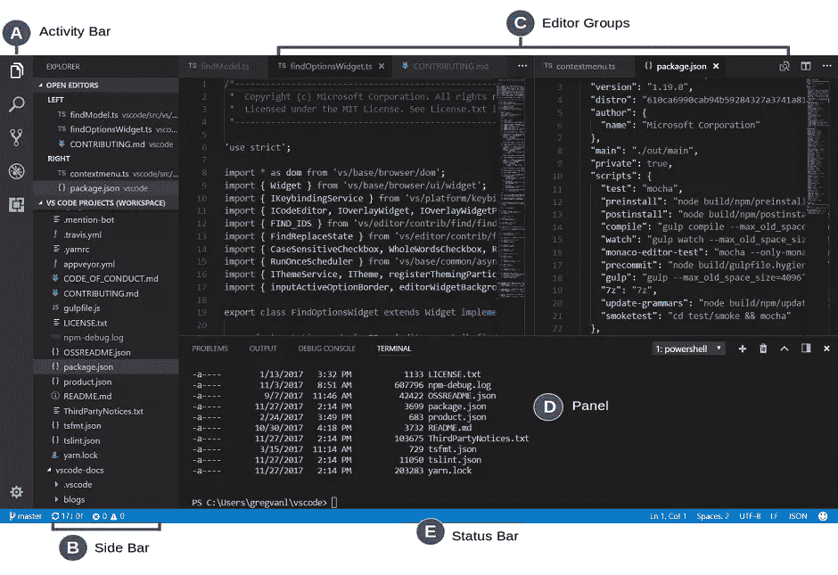
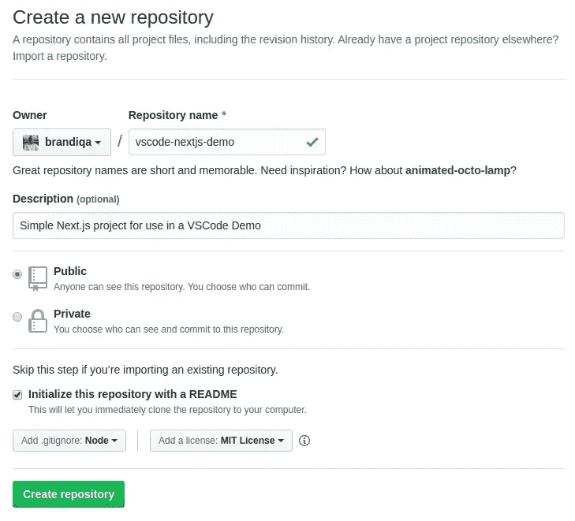
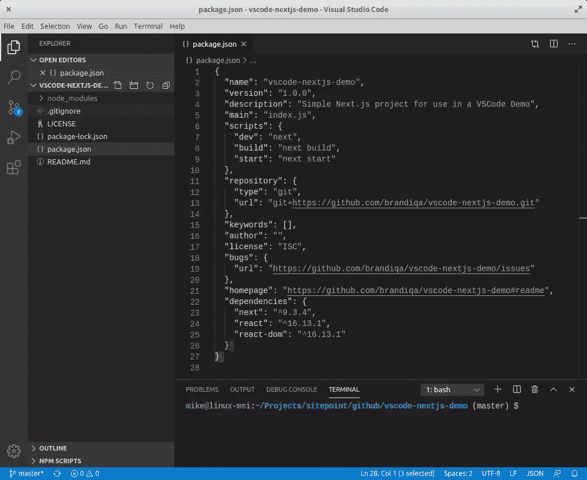
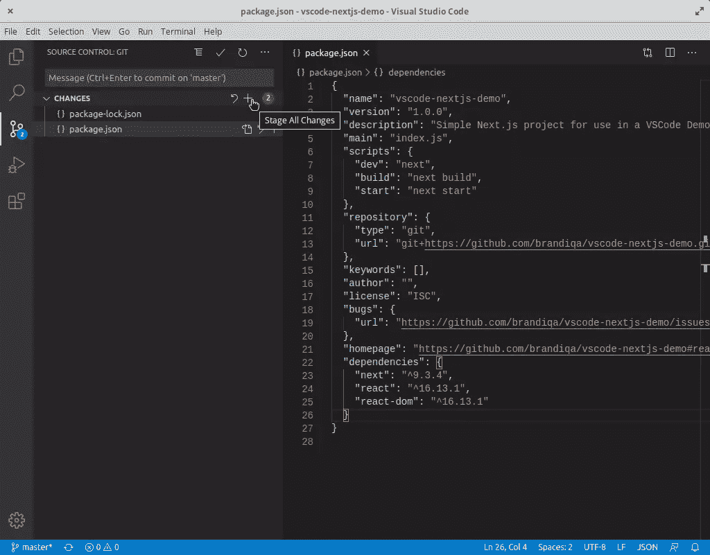
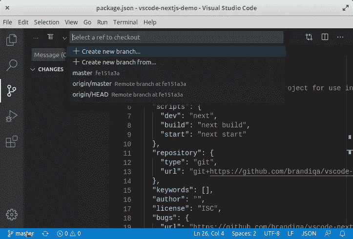
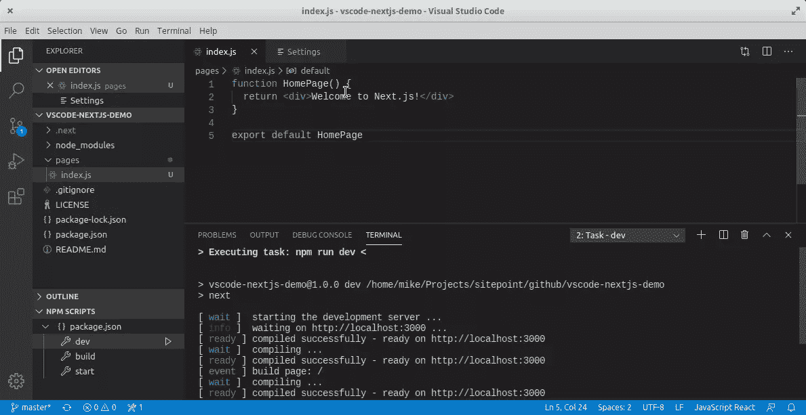
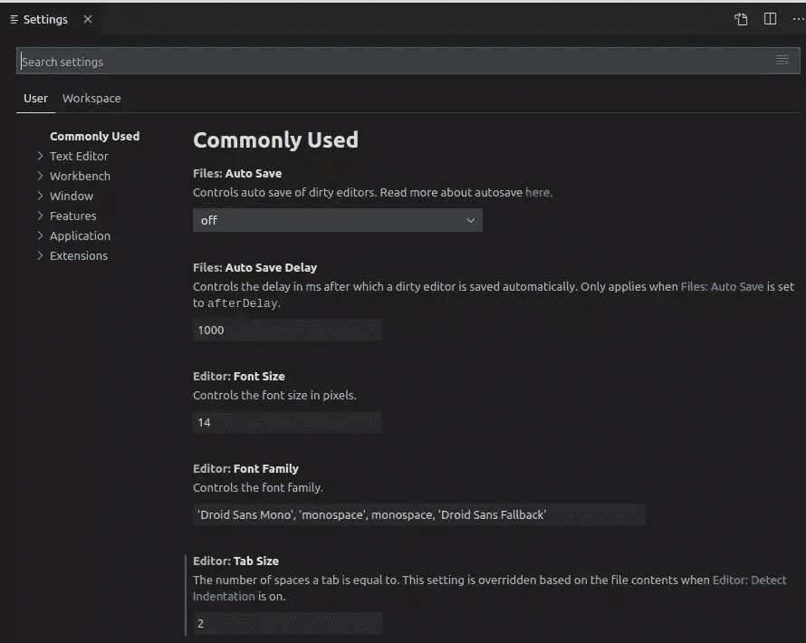
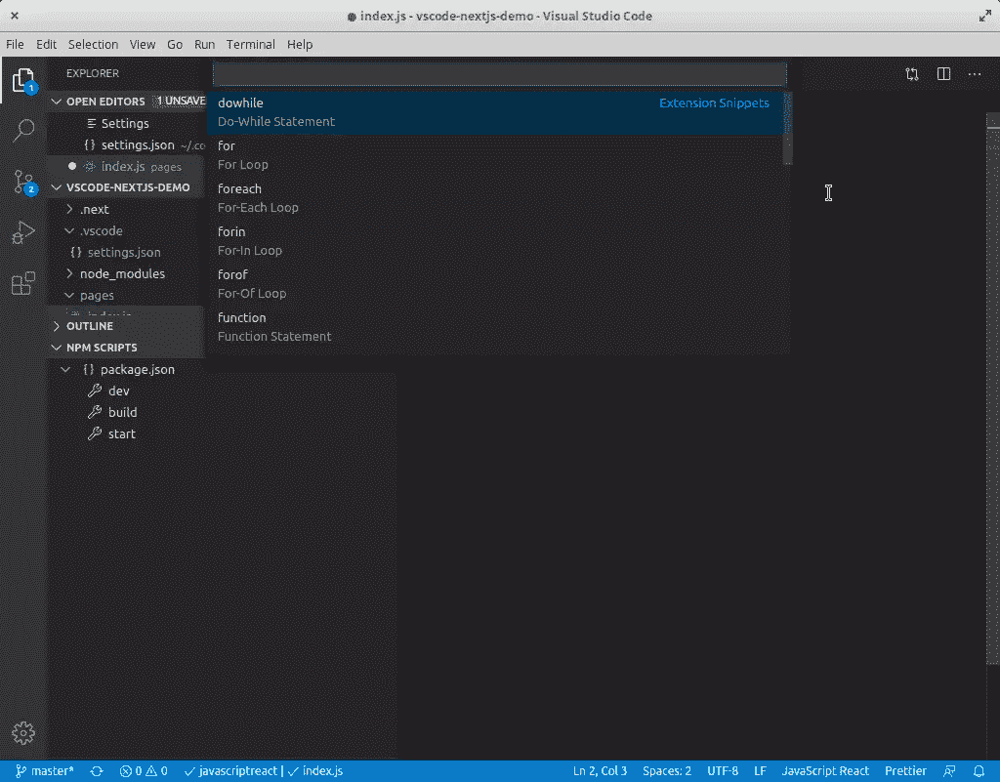

# Visual Studio 代码:高级用户指南

> 原文：<https://www.sitepoint.com/visual-studio-code-power-user-guide/>

在本指南中，您将学习如何利用 Visual Studio 代码来增强您的开发工作流程。

本文是为 Visual Studio 代码初学者以及希望从应用程序中获得更多益处的用户编写的。众所周知，VS 代码被认为是“轻量级”代码编辑器。与占用千兆字节磁盘空间的完全集成开发环境(IDE)编辑器相比，VS 代码在安装时使用的空间不到 200MB。

尽管有“轻量级”这个术语，Visual Studio 代码提供了大量的功能，并且随着每次新的更新而不断增加和改进。在本指南中，我们将介绍最常用的特性。每个程序员都有自己的工具集，当他们发现新的工作流时，他们会更新这些工具集。如果你想了解 VS Code 提供的每一个工具和特性，查看他们的官方文档。此外，您可能希望跟踪[更新](https://code.visualstudio.com/updates)以获得新的和改进的功能。

## 先决条件

为了遵循这个指南，您需要精通至少一种编程语言和框架。您还需要熟悉使用 [git](https://www.sitepoint.com/git-for-beginners/) 对项目代码进行版本控制。您还需要拥有一个远程存储平台(如 GitHub)的帐户。我建议你设置 [SSH 密钥](https://help.github.com/en/github/authenticating-to-github/connecting-to-github-with-ssh)来连接你的远程回购。

我们将使用一个最小的 [Next.js](https://nextjs.org/) 项目来演示 VS 代码特性。如果你是新手，不要担心——本指南的重点不是框架或使用的语言。您可以将我们将教授的技能转移到您在 Visual Studio 代码中使用的任何语言和框架中。

## 一点历史

不久前，我们提供了完全集成的开发环境:

*   [Visual Studio IDE](https://visualstudio.microsoft.com/)
*   [NetBeans](https://netbeans.org/)
*   [月食](https://www.eclipse.org/)
*   [IntelliJ IDEA](https://www.jetbrains.com/idea/)

这些平台提供了完整的开发工作流程，从编码到测试和部署。它们分析代码，突出错误，并具有各种其他提供帮助的特性。它们还包含许多大多数开发人员不使用的特性，尽管它们对一些团队来说是必不可少的。因此，这些平台占用了大量磁盘空间，启动速度很慢。许多开发人员更喜欢使用高级文本编辑器，比如 emacs T1 和 T2 vim T3 来编写他们的代码。

不久，一批新的独立于平台的代码编辑器出现了。这些轻量级编辑器提供了许多以前只有 ide 才有的特性。我把它们按发行顺序排列如下:

*   [崇高文字](https://www.sublimetext.com/):2013 年 7 月
*   atom . io:2015 年 6 月
*   [Visual Studio 代码](https://code.visualstudio.com/):2016 年 4 月

Mac 开发者可以使用 2004 年 10 月发布的 TextMate。所有这些编辑器使用的 snippets 系统都源自 TextMate。根据 [Stack OverFlow](https://insights.stackoverflow.com/survey/2019#development-environments-and-tools) 在 2019 年做的一项开发者调查，Visual Studio 代码是最受欢迎的代码开发环境，使用率为 50.7%。Visual Studio IDE 次之，NotePad++第三。

历史和数据已经足够了。让我们向您展示如何使用 Visual Studio 代码的功能。

## 安装和更新

Visual Studio Code 的包安装程序小于 100MB，完全安装时消耗不到 200MB。当您访问[下载](https://code.visualstudio.com/)页面时，它会检测您的操作系统并为您提供正确的下载链接。

更新 VS 代码很容易。当更新可用时，它会显示通知提示。对于 Windows 用户，你必须点击通知来下载和安装最新版本。当您工作时，下载过程在后台进行。当它准备好安装时，会出现一个重启提示。单击此按钮将为您安装更新并重新启动 VS 代码。

对于基于 Ubuntu 的发行版，点击**更新通知**就会打开网站让你下载最新的安装程序。更简单的方法是简单地运行`sudo apt update && sudo apt upgrade -y`。这将更新所有已安装的 Linux 包，包括 Visual Studio 代码。这样做的原因是因为 VS 代码在初始安装时将它的 repo 添加到了您的包 repo 注册表中。你可以在这个路径找到回购信息:`/etc/apt/sources.list.d/vscode.list`。

## 用户界面

让我们先熟悉一下用户界面:



[Image source](https://code.visualstudio.com/assets/docs/getstarted/userinterface/hero.png)

Visual Studio 代码的用户界面分为五个主要区域，您可以轻松地对其进行调整。

*   **活动栏**:允许您在浏览器、搜索、版本控制、调试和扩展视图之间切换。
*   **侧栏**:包含活动视图。
*   编辑器:这是你编辑文件和预览降价文件的地方。您可以并排排列多个打开的文件。
*   **面板**:显示不同的面板:集成终端、调试信息输出面板、错误和警告。
*   **状态**:显示当前打开的项目和文件的信息。还包含用于执行版本控制操作以及启用/禁用扩展功能的按钮。

还有顶部的**菜单栏**，在这里你可以进入编辑器的菜单系统。对于 Linux 用户，默认的集成终端可能是 **Bash** shell。对于 Windows 用户来说，它是 **PowerShell** 。幸运的是，在终端下拉菜单中有一个 shell 选择器，允许您选择不同的 shell。如果已安装，您可以选择以下任一选项:

*   命令提示符
*   PowerShell
*   PowerShell 核心
*   去吧，巴什
*   WSL Bash

## 使用项目

与完整的 ide 不同，Visual Studio 代码不以传统方式提供**项目创建**或**项目模板**。它只适用于文件夹。在我的 Linux 开发机器上，我使用下面的文件夹模式来存储和管理我的项目:

```
/home/{username}/Projects/{company-name}/{repo-provider}/{project-name} 
```

这个`Projects`文件夹就是我所说的**工作区**。作为一名自由撰稿人和开发人员，我根据我为哪家公司工作以及我使用哪种回购协议来划分项目。对于个人项目，我将其存储在自己虚构的“公司名称”下。对于我出于学习目的而尝试的项目，以及我不打算长期保留的项目，我将只使用诸如`play`或`tuts`之类的名称来代替`{repo-provider}`。

如果您想创建一个新项目并在 VS 代码中打开它，您可以使用以下步骤。打开终端并执行以下命令:

```
$ mkdir vscode-demo
$ cd vscode-demo
# Launch Visual Studio Code
$ code . 
```

您也可以在文件资源管理器中执行此操作。当您访问鼠标上下文菜单时，您应该能够在 VS 代码中打开任何文件夹。

如果你想创建一个链接到远程回购的新项目，在回购网站上创建一个更容易——例如， [GitHub](https://github.com/) 或 [BitBucket](https://bitbucket.org/) 。



记下所有已填写和选择的字段。接下来，转到终端并执行以下命令:

```
# Navigate to workspace/company/repo folder
$ cd Projects/sitepoint/github/

# Clone the project to your machine
$ git clone git@github.com:{insert-username-here}/vscode-nextjs-demo.git

# Open project in VS Code
$ cd vscode-nextjs-demo
$ code . 
```

编辑器启动并运行后，您可以使用键盘快捷键`Ctrl+~`(波浪号键)启动集成终端。使用以下命令生成`package.json`并安装包:

```
# Generate `package.json` file with default settings
$ npm init -y

# Install package dependencies
$ npm install next react react-dom 
```

接下来，打开`package.json`并用以下内容替换`scripts`部分:

```
"scripts": {
  "dev": "next",
  "build": "next build",
  "start": "next start"
} 
```

整个 Visual Studio 代码窗口应该如下所示:



在我们看下一节之前，我想提一下 VS 代码也支持[多根工作区](https://code.visualstudio.com/docs/editor/multi-root-workspaces)的概念。如果你正在处理相关的项目——前端、后端、文档等。—您可以在一个编辑器的单个工作区中管理它们。这将使您的源代码和文档保持同步变得更加容易。

## 使用 Git 进行版本控制

Visual Studio 代码内置于 Git 源代码管理器中。它提供了一个 UI 界面，您可以在其中存放、提交、创建新的分支并切换到现有的分支。让我们提交刚刚在项目中所做的更改。在**活动栏**上，打开**源控制面板**，找到**舞台所有变化**加号按钮，如下图所示。



点击它。接下来，输入提交消息“Installed next.js dependencies”，然后点击顶部的**提交**按钮。它有一个勾号图标。这将提交新的更改。如果您查看位于底部的状态，您会在左上角看到各种状态图标。`0 ↓`表示没有从远程回购中提取的内容。`1 ↑`意味着您有一个需要推送到远程回购的提交。单击它将显示将要发生的操作的提示。点击**确定**到`pull`和`push`你的代码。这将使您的本地回购与远程回购同步。

要创建新的分支或切换到现有分支，只需点击状态栏左下角的**分支名称** `master`。这将弹出一个**分支面板**供你采取行动。



为了更好地体验 Git，请务必查看以下扩展:

*   [去镜头](https://marketplace.visualstudio.com/items?itemName=eamodio.gitlens)
*   [Git 历史记录](https://marketplace.visualstudio.com/items?itemName=donjayamanne.githistory)

对不同类型的 SCM 的支持，比如 SVN，可以通过从市场上安装相关的 SCM 扩展来添加。

## 创建和运行代码

在**活动栏**上，回到**浏览器面板**，使用**新建文件夹**按钮在项目的根目录下创建文件夹`pages`。选择该文件夹，使用**新建文件**按钮创建文件 **pages/index.js** 。复制以下代码:

```
function HomePage() {
  return <div>Welcome to Next.js!</div>;
}

export default HomePage; 
```

使用**浏览器面板**，你应该会看到一个叫做 **NPM 脚本**的部分。对此展开并悬停在`dev`上。旁边会出现一个`run`按钮(播放图标)。点击它，这将在**集成终端**中启动一个 Next.js 开发服务器。



它应该需要几秒钟才能旋转起来。使用网址`http://localhost:3000`上的`Ctrl` + `Click`在浏览器中打开。页面应该会成功打开，显示“欢迎”消息。在下一节中，我们将了解如何更改 Visual Studio 代码首选项。

## 用户和工作区设置

要访问 VS 代码偏好设置，使用快捷键`Ctrl` + `,`。您也可以通过菜单命令访问它，如下所示:

*   在 Windows/Linux 上-**文件** > **首选项** > **设置**
*   在 macOS 上-**代码** > **首选项** > **设置**

默认情况下，会出现一个**设置编辑器**图形界面。它有助于用户轻松地更改首选项，因为有数千种可编辑的设置可用。**设置编辑器**为每个设置提供用户友好的名称和描述。此外，相关设置已被分组在一起，并且有一个搜索栏用于查找特定设置。



使用编辑器更改设置时，请注意顶部的活动范围。请注意，并非所有设置都可以通过图形界面进行配置。为此，您必须直接编辑文件`settings.json`。当你向下滚动**设置编辑器**时，你会遇到一个快捷方式带你到这个文件。

Visual Studio 代码设置分为两个不同的范围:

*   **用户设置**:设置存储在用户账户下。它们将对您从事的所有项目产生影响。
*   **工作区**:设置存储在项目或工作区文件夹中。它们将仅适用于特定项目。

根据您的平台，您可以在以下位置找到 VS 代码的用户设置:

*   视窗:`%APPDATA%\Code\User\settings.json`
*   苹果电脑:`$HOME/Library/Application Support/Code/User/settings.json`
*   Linux: `$HOME/.config/Code/User/settings.json`

对于**工作空间**，只需在项目的根目录下创建一个文件夹`.vscode`。然后在这个文件夹中创建文件`settings.json`。如果使用**设置编辑器**面板，当您在**工作区**范围下更改设置时，它会自动为您完成此操作。以下是我更喜欢使用的全局设置的子集:

```
{
  "editor.minimap.enabled": false,
  "window.openFoldersInNewWindow": "on",
  "diffEditor.ignoreTrimWhitespace": false,
  "files.trimTrailingWhitespace": true,
  "javascript.updateImportsOnFileMove.enabled": "always",
  "workbench.editor.enablePreview": false,
  "workbench.list.openMode": "doubleClick",
  "window.openFilesInNewWindow": "default",
  "editor.formatOnPaste": true,
  "editor.defaultFormatter": "esbenp.prettierVS Code",
  "editor.formatOnSave": true,
  "editor.tabSize": 2,
  "explorer.confirmDelete": false
} 
```

我倾向于同时处理多个项目，因此设置`window.openFoldersInNewWindow`允许我在不关闭(替换)当前项目的情况下打开新的项目文件夹。对于`editor.defaultFormatter`，我已经把它设置为**更漂亮**，这是我安装的一个扩展。我们将在稍后的部分讨论这一点。接下来，我们来看看语言联想。

## 语言协会

我用 React 做了很多项目。最近，大多数 React 框架使用`.js`扩展而不是`.jsx`来生成组件。因此，当您开始编写 JSX 代码时，格式化和语法着色就成了一个问题。要解决这个问题，您需要将`.js`文件与`JavaScriptReact`相关联。你可以通过`Ctrl` + `Shift` + `P`命令面板改变**语言模式**来轻松实现。您还可以通过添加以下配置来更新`settings.json`:

```
{
  "files.associations": {
    "*.js": "javascriptreact"
  }
} 
```

下次打开 JS 文件时，它将被视为 React JSX 文件。我在全局设置中指定了这一点，因为我经常使用 React 项目。不幸的是，这样做会破坏一个名为 [Emmet](https://emmet.io/) 的内置特性。这是一个流行的插件，帮助开发人员以非常直观的方式自动完成 HTML 和 CSS 代码。您可以通过在`settings.json`中添加以下配置来解决此问题:

```
{
  "emmet.includeLanguages": {
    "javascript": "javascriptreact"
  }
} 
```

下一次，当您为特定的文件扩展名或语言激活 Emmet 遇到问题时，检查一下是否可以通过在`emmet.includeLanguages`中添加语言关联来解决。更多信息，请查看 VS 代码 Emmet 的官方文档。

## 快捷键

到目前为止，我们已经介绍了两种键盘快捷键:

*   `Ctrl` + `,`:打开设置
*   `Ctrl` + `Shift` + `P`:打开命令调板

**命令面板**提供了对 Visual Studio 代码全部功能的访问，包括常见操作的键盘快捷键。如果您安装了扩展，任何手动触发的操作都会在此列出。然而，对于像**更漂亮**和**美化**这样的扩展，它们将使用相同的**格式**命令。Visual Studio 代码也有自己内置的格式化程序插件。要指定哪个插件应该执行动作，您需要进入**设置编辑器**并更改**默认格式化程序**的配置。下面是我如何在我的例子中设置它的例子:

```
{
  "editor.defaultFormatter": "esbenp.prettierVS Code"
} 
```

您还可以为特定的语言模式指定不同的格式化程序。这里有几个你需要记住的键盘快捷键:

*   `Ctrl` + `P`可让您通过键入文件名导航至任何文件或符号
*   `Ctrl` + `Tab`将引导您浏览最后打开的文件
*   `Ctrl` + `Shift` + `O`将让您导航到文件中的特定符号
*   `Ctrl` + `G`将让您导航到文件中的特定行

以下是我在编写代码时经常使用的命令:

*   `Ctrl` + `D`:多次按下，选择相同的关键字。当您开始键入时，它会重命名所有选定的关键词
*   `Ctrl` + `Shift` + `Up/Down`:在上方或下方添加光标，一次编辑多行
*   `Alt` + `Shift` + `Click`:在多个位置添加光标，以便同时编辑代码的不同部分
*   `Ctrl` + `J`:将两行或多行加为一行。如果您在编辑代码时有一个活动的格式化程序，就可以很好地工作
*   `Ctrl` + `F`:在当前文件中搜索关键字
*   `Ctrl` + `H`:在当前文件中搜索并替换
*   `Ctrl` + `Shift` + `F`:搜索所有文件

如果你访问**菜单**选项，你会发现大多数命令的快捷键。就我个人而言，由于长时间使用 Atom 等编辑器，我从未习惯 Visual Studio 代码附带的一些默认快捷键。我找到的解决方案是简单地安装 [Atom Keymap](https://marketplace.visualstudio.com/items?itemName=msVS%20Code.atom-keybindings) 。这允许我使用快捷键`Ctrl` + `\`来切换**侧栏**。如果你想自己编辑键盘绑定，只需进入**文件** > **首选项** > **键盘快捷键**下的菜单。(**代码** > **首选项**>**MAC OS 上的键盘快捷键**)。

[https://gfycat.com/ifr/KlutzyShadowyChicken](https://gfycat.com/ifr/KlutzyShadowyChicken)

## 代码编辑器功能

在这一节中，我们将快速了解 Visual Studio 代码提供的各种对开发人员友好的功能，以帮助您编写更快、更干净和更易维护的代码。

### 智能感知

这是一个流行的特性，也称为“代码完成”或自动完成。开箱即用，VS 代码提供了智能感知:

*   JavaScript，类型脚本
*   超文本标记语言
*   CSS，SCSS 和更少

当您键入代码时，会出现一个弹出窗口，列出可能的选项。你输入的越多，列表就越短。一旦您想要的关键字突出显示，您可以按下`Enter`或`Tab`来自动完成您的代码。按下`Esc`将移除弹出窗口。在关键字末尾插入一个`.`或按下`Ctrl` +空格键将触发智能感知弹出窗口出现。

[https://gfycat.com/ifr/CluelessEveryIaerismetalmark](https://gfycat.com/ifr/CluelessEveryIaerismetalmark)

如果您正在使用一种开箱即用不受支持的语言，您可以从 [marketplace](https://marketplace.visualstudio.com/vscode) 安装一个语言扩展来激活您想要的编程语言的智能感知。查看[官方文档](https://code.visualstudio.com/docs/editor/intellisense)，了解更多关于如何定制智能感知的信息。

### 片段

键入重复的代码，如`if`语句、`for`循环和组件声明可能会有点累。您可能会发现自己复制和粘贴代码以提高工作速度。幸运的是，Visual Studio Code 提供了一个名为`Snippets`的特性，它只是代码的模板。例如，不用输入`console.log`，只需输入`log`，智能感知就会提示您插入代码片段。

只要您记住了触发代码片段插入的速记或关键字，就可以访问许多代码片段。因为你是新手，你可以通过**命令面板** > **插入片段**访问所有可用的片段列表:



上下滚动以查看整个列表。请注意，大多数代码片段都有制表符，允许您在插入代码时替换相关的代码段。您可以在市场上找到更多代码片段扩展。你也可以自己创造。这篇[文章](https://www.sitepoint.com/boosting-workflow-angular-5-snippets-vs-code/)向你展示了如何做到这两点。你可以查看[官方文档](https://code.visualstudio.com/docs/editor/userdefinedsnippets)，了解更多关于如何定义你自己的代码片段的信息。

### 格式化

通常，当输入或粘贴不同来源的代码时，我们倾向于混合编码风格。例如:

*   使用空格和制表符缩进
*   以分号结尾
*   双引号还是单引号

格式化很重要，因为它使代码可读。但是，当您遇到大段无格式代码时，这可能会很耗时。幸运的是，Visual Studio 代码可以通过一个命令为您执行格式化。您可以通过**命令面板**执行格式化命令。Visual Studio 代码支持以下现成语言的格式:

*   Java Script 语言
*   以打字打的文件
*   JSON
*   超文本标记语言

您可以通过将以下设置更改为`true`或`false`来自定义 Visual Studio 代码的格式化行为:

*   `editor.formatOnType`:输入后格式化该行
*   `editor.formatOnSave`:保存时格式化文件
*   `editor.formatOnPaste`:格式化粘贴的内容

但是，内置的格式化程序可能不符合您的编码风格。如果您正在使用 React、Vue 或 Angular 等框架，您会发现内置格式化程序往往会弄乱您的代码。您可以通过禁用特定语言的格式来解决此问题:

```
"html.format.enable": false 
```

然而，最好的解决方案是从市场上安装一个格式化程序扩展。我最喜欢的是【更漂亮】(https://market place . visual studio . com/items？itemName=esbenp.prettierVS Code)，因为它支持大量语言，包括:

*   流量 JSX JSON
*   CSS SCSS 少
*   有角度的
*   GraphQL 降价 YAML

安装后，您需要将其设置为默认格式化程序:

```
{
  "editor.defaultFormatter": "esbenp.prettierVS Code",
  "
": {
    "editor.defaultFormatter": "esbenp.prettierVS Code"
  }
} 

It’s also recommended you install prettier package locally as a dev dependency:

```
npm install prettier -D --save-exact 
```

Prettier 实施的默认格式选项可能对您有用。如果没有，您可以通过在项目的根目录或主目录中创建一个`.prettierrc`配置文件来进行定制。您可以在此放置自定义格式规则。这里有一个例子:

```
{
  "trailingComma": "all",
  "tabWidth": 2,
  "semi": false,
  "singleQuote": true
} 
```

请随意查看其他的[格式扩展](https://marketplace.visualstudio.com/search?target=VSCode&category=Formatters&sortBy=Downloads)。然而，你会发现越漂亮越受欢迎。
林挺
一个 **Lint** 或 **Linter** 是一个工具，它可以分析你的代码并检查语法错误、样式问题、调用未声明的变量、使用不赞成使用的函数、误用作用域和许多其他问题。Visual Studio 代码没有附带任何 Linter。然而，为您正在使用的编程语言设置一个确实很容易。例如，如果你正在开发一个新的 Python 项目，你会得到一个[提示](https://code.visualstudio.com/docs/python/linting)来为你安装一个。也可以打开**命令面板** ( `Ctrl` + `Shift` + `P`)选择 **Python: Select Linter** 命令。
对于 JavaScript，你需要安装一个扩展，比如最流行的 [ESLint](https://marketplace.visualstudio.com/items?itemName=dbaeumer.vscode-eslint) 。这个扩展需要你安装 ESLint 作为一个开发依赖。你可能还需要一个或多个 ESLint 插件来帮助你理解你所使用的编码风格和框架。你可以查看我们的[指南](https://www.sitepoint.com/up-and-running-with-eslint-the-pluggable-javascript-linter/)关于如何配置 ESLint。还有其他的[棉绒工具](https://www.sitepoint.com/comparison-javascript-linting-tools/)你可以看看。我推荐使用 ESLint，因为它更容易配置，支持更多的 JavaScript 风格和框架。
一旦你设置了林挺工具，每当你保存文件的时候，VS Code 会自动地 lint 你的代码。您还应该更新您的`package.json`脚本，以包含运行 lint 工具的命令。
排除故障
如果您使用 print 语句来调试，您应该停止，因为有更好的方法来调试您的代码。使用 VS 代码，您可以在代码运行时设置断点并检查变量。


[Image source](https://code.visualstudio.com/assets/docs/editor/debugging/debugging_hero.png)

查看我们的[指南，用 VS 代码和 Chrome 调试器](https://www.sitepoint.com/debugging-javascript-projects-vs-code-chrome-debugger/)调试 JavaScript 项目，获得如何调试代码的分步指导。

## 摘要

我们现在已经到了指南的末尾。如前所述，此处的信息将帮助您开始使用 Visual Studio 代码改进编码工作流。我推荐你看看我们的 VS 代码的[十大必备扩展。虽然大多数 VS 代码工具很容易学习并集成到您的工作流中，但其他工具需要一些时间来理解和习惯。尽管如此，掌握 VS 代码的特性将会使你成为一个高效的更好的软件开发人员。](https://www.sitepoint.com/vs-code-extensions-javascript-developers/)

如果你想用 Visual Studio 代码达到生产性能的绝对巅峰，请查看 [Visual Studio Code:面向 Web 开发人员的端到端编辑和调试工具](https://www.sitepoint.com/premium/books/visual-studio-code-end-to-end-editing-and-debugging-tools-for-web-developers/?utm_source=blog&utm_medium=articles)。这是一本来自威利的非常棒的书，你可以在线阅读(或者离线阅读！)在我们的高级图书馆。

## 分享这篇文章

```