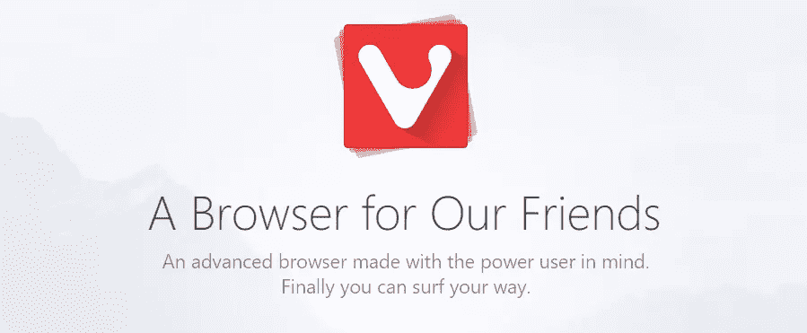
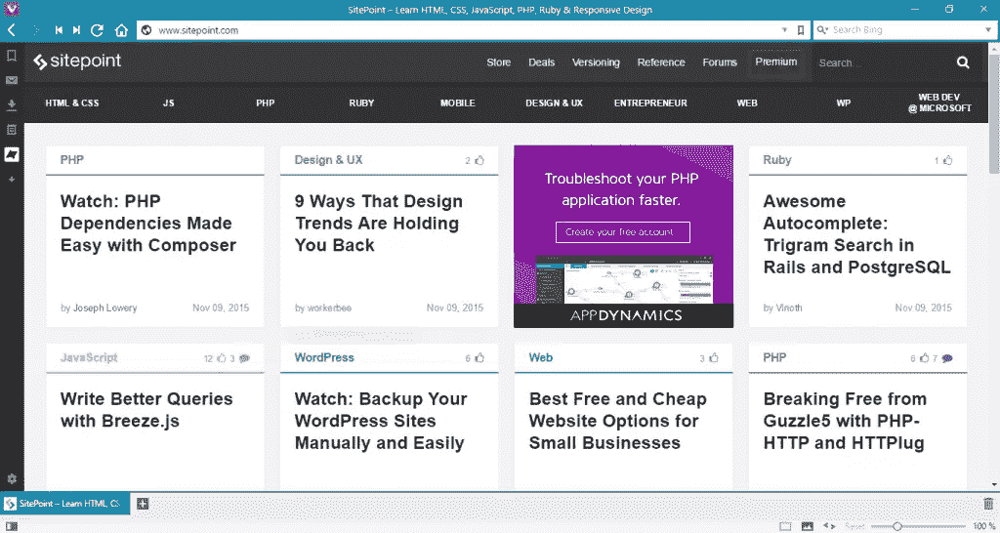
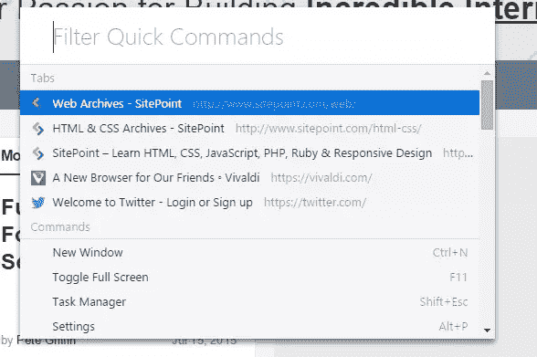
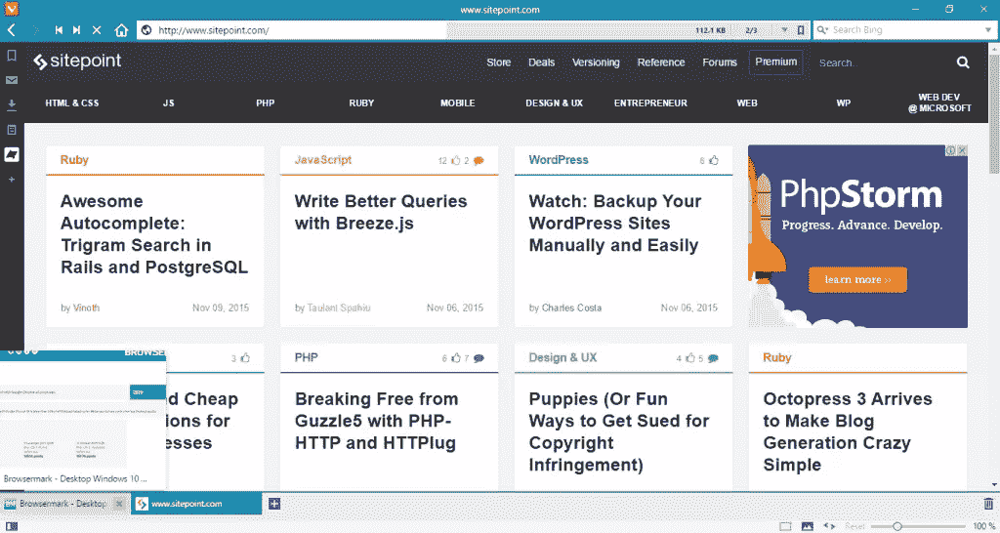
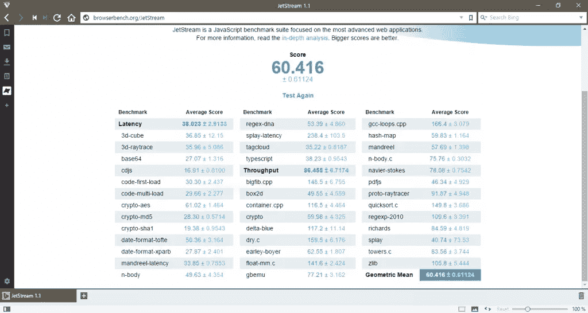
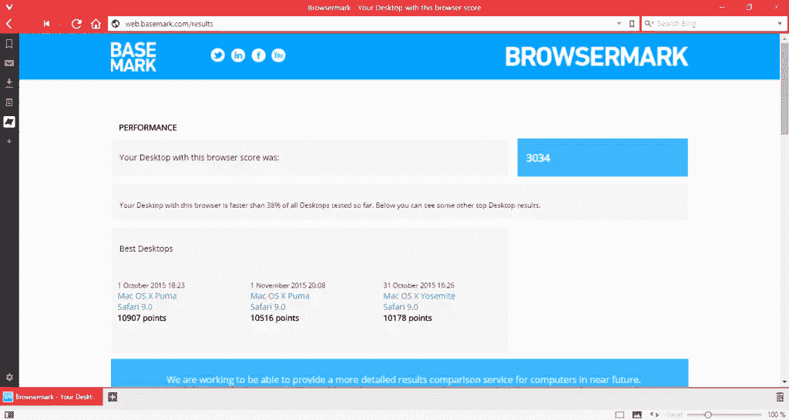

# 维瓦尔第，你的下一个浏览器？

> 原文：<https://www.sitepoint.com/vivaldi-your-next-browser/>

早在三月份，我们[写了一个名为](https://www.sitepoint.com/vivaldi-operas-spiritual-successor/)[维瓦尔第](https://vivaldi.com/)的新浏览器，它建立在 Opera 12 的基础上，面向高级用户。当时它只是一个预览版，不太稳定，但最近 Vivaldi Beta 在 4 次技术预览后推出，增加了许多功能，并进行了无数改进。

Vivaldi 基于 Chromium 的开源平台，运行在 Blink 上，这是 Opera 和 Chrome 使用的相同渲染引擎。该接口内置于 JavaScript、CSS 和 Node.js 中，具有跨平台和可定制性。你可以在 Windows、OS X 和 Linux 上安装 Vivaldi(有`.deb`和`.rpm`两个包)。

### 不同的哲学

除了底层技术，Vivaldi 拥有与 Chrome 和其他浏览器完全不同的哲学。当谷歌创建 Chrome 时，他们的使命是制作一个简单易用的浏览器，让人们能够浏览内容。Vivaldi 的创作者希望给你一个功能齐全、高度灵活的浏览器，因为他们相信不是每个人都希望浏览器消失在背景中。

然而，当你第一次打开它时，你不会真正注意到这一点。界面干净、简单、扁平，几乎像地铁。你需要开始深入挖掘，去发现所有让它与众不同的酷功能。

## 连接

当我第一次打开它时，我注意到的第一件事是标签和地址栏的颜色根据你访问的页面的主要配色方案而变化——类似于 Chrome 在移动设备上的表现。它将用户界面与内容无缝地融合在一起，同时当你打开了很多标签页时，它还能帮助你找到你的活动标签页。

## 别管鼠标了

维瓦尔第的一个特点是，你几乎可以做任何事情，而不用从键盘上抬起手指。几乎所有东西都有一个键盘快捷键，更好的是，这些快捷键是可定制的。

如果你想选择一个链接，又不想在之前的链接中跳来跳去，你可以试试**空间导航**，通过按下`shift`并使用箭头键在各个方向导航，你可以在链接间移动。选定的链接以橙色突出显示。

然后是**快捷命令**——让我想起苹果的 Spotlight 搜索——当你按下`F2`时就会弹出。从那里，你可以搜索你打开的标签，书签，历史和不同的键盘快捷键。我非常喜欢它，以至于我发现自己在 Chrome 中按下`F2`的次数比我愿意承认的还要多。

## 自定义

作为一款面向高级用户的浏览器，Vivaldi 提供了许多定制选项。您可以根据自己的喜好更改界面，从标签、地址栏、书签栏和侧面板的位置开始。此外，您可以更改界面颜色、起始页上的背景图像、选项卡循环顺序和快速拨号。几乎每个功能都有定制选项，您可以根据需要打开或关闭这些选项。

我更喜欢将标签放在底部，因为这样更容易导航，对我来说更直观。你也可以将标签堆叠在一起，这在你搜索一个特定的主题并且不想让你的标签栏混乱的时候非常有用。

测试版推出时推出的一个新功能是扩展支持，它让你可以更好地控制设置浏览器的方式。它几乎支持 Chrome 网上商店的所有扩展，所以在定制方面你有很大的选择余地。

## 独特的功能

维瓦尔第在正常的后退和前进按钮旁边有**快进**和**倒带**按钮。“倒带”会找到你在那个特定领域访问的第一个网站，而“快进”会使用一种算法把你带到下一个自然页面<q>，这在论坛和多页评论网站中非常有用——尽管，不可否认，它有时会完全错过目标。</q>

有按需图像和插件控制，让您关闭图像或只加载缓存的图像。**页面操作**让你以灰度、棕褐色或反色显示页面，禁用过渡，显示轮廓，将字体改为等宽字体，以及其他一些功能。

我喜欢的其他功能是悬停时的标签预览，以及**网页面板**，在这里你可以将一个网站添加到侧面板以便快速访问。另一个我最喜欢的是页面大小:一个小部件显示每个网页加载时的大小，以兆字节为单位。你会惊讶于一些你最喜欢的网站有多大。

非常令人惊讶的是，Vivaldi 增加了对鼠标手势的支持——这对于鼠标来说不太实用，但对于支持触摸的设备来说非常有帮助。

## 速度和性能

### HTML5 支持

测试版之后，Vivaldi 增加了 HTML5 支持，我决定将它与其他浏览器进行对比测试。毫不奇怪，Vivaldi 获得了与 Chrome 几乎相同的分数，因为它们都使用了 Blink 引擎，并且基本上优于市场上的其他浏览器。

### JavaScript 性能

在测试 JavaScript 性能方面，我使用了新的 JetStream 测试，它是 SunSpider 的继任者。从结果来看，维瓦尔第似乎比 Chrome 快一点( **60.416** 比 **58.937** )，但它在偏差范围内。另一方面，与微软 Edge 相比，它们都相形见绌，后者的得分令人印象深刻 **70.152** 。

### 浏览器标记

令我惊讶的是，维瓦尔第在 [Browsermark](http://www.basemark.com/product-catalog/browsermark/) 中的表现优于 Chrome，获得了 **3034** 的分数，而 Chrome 仅获得了 **2868** 。显然，维瓦尔第团队已经设法在引擎盖下做了一些改进。

与其他浏览器相比，它过去有点慢，但现在速度似乎加快了不少，使用起来和其他浏览器一样快。

## 结论

Vivaldi 已经被定位为我们的朋友们的浏览器，它似乎正在兑现这一承诺，给用户一种表达他们的担忧并投票决定下一步应该实现什么功能的方式。这让用户感觉自己是这个项目的一部分，并希望帮助 Vivaldi 团队为每个人提供更好的浏览器。

鉴于 Vivaldi 仍然是测试版产品，我实际上预计它会有点粗糙。但实际上它感觉稳定流畅，我还没有遇到任何会阻止我把它作为日常浏览器使用的重大问题。

## 分享这篇文章