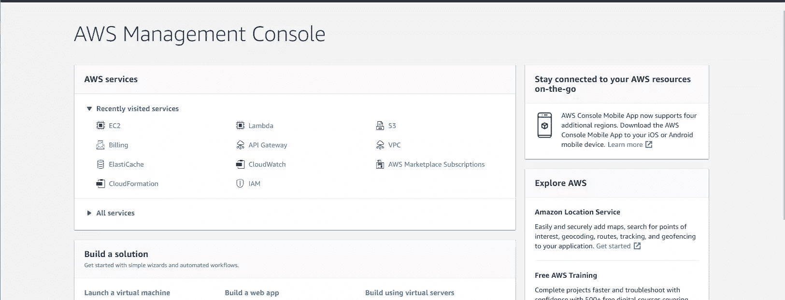
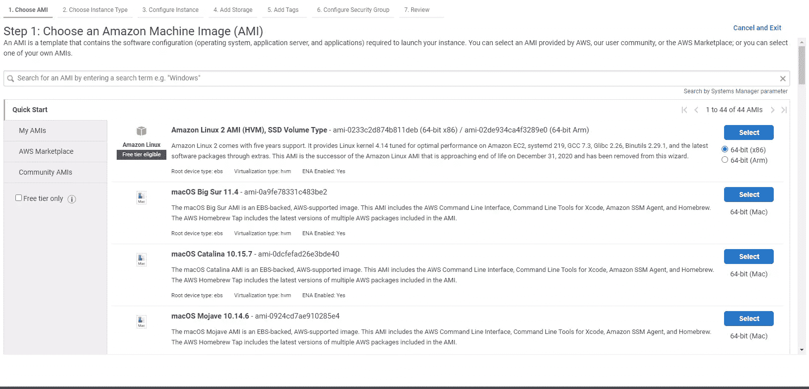
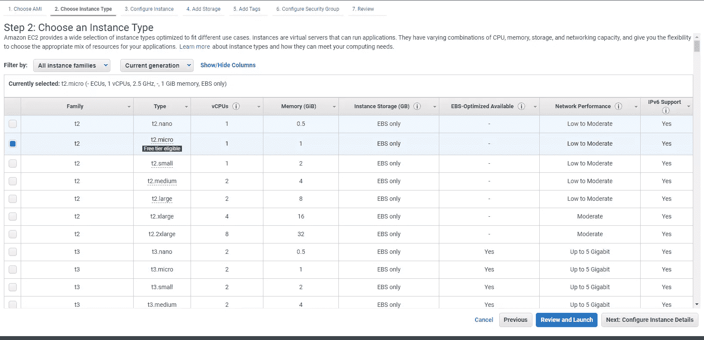
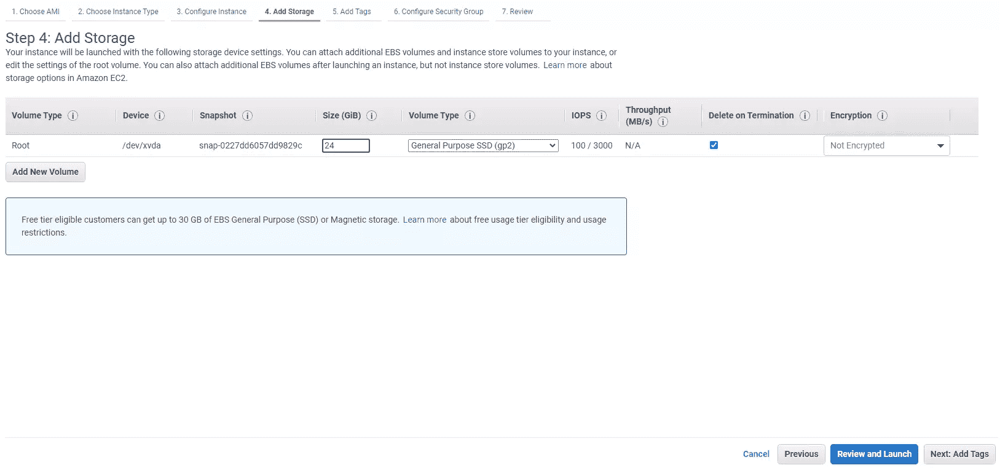
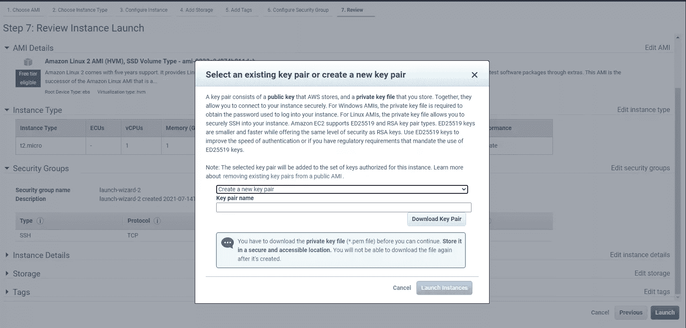
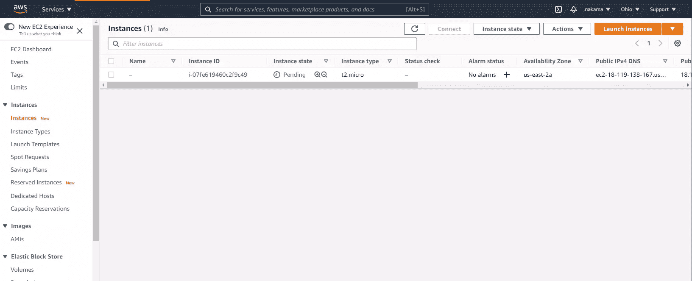
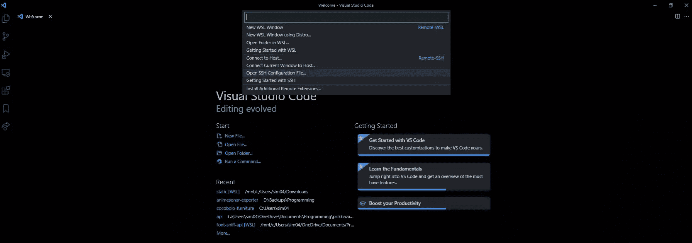
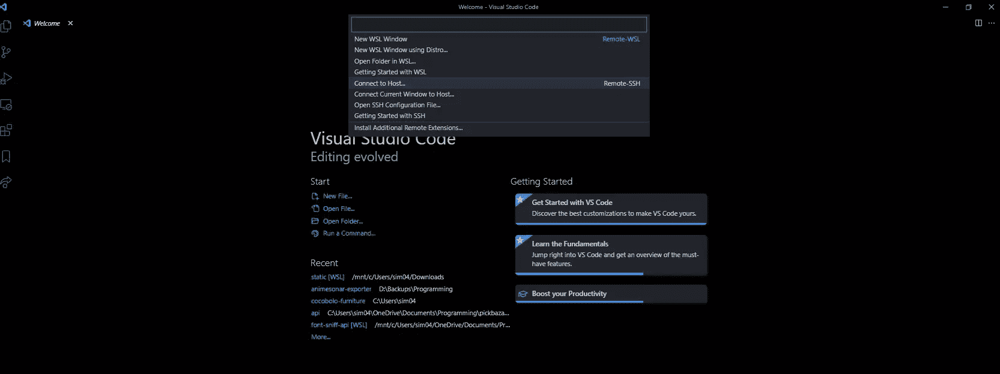
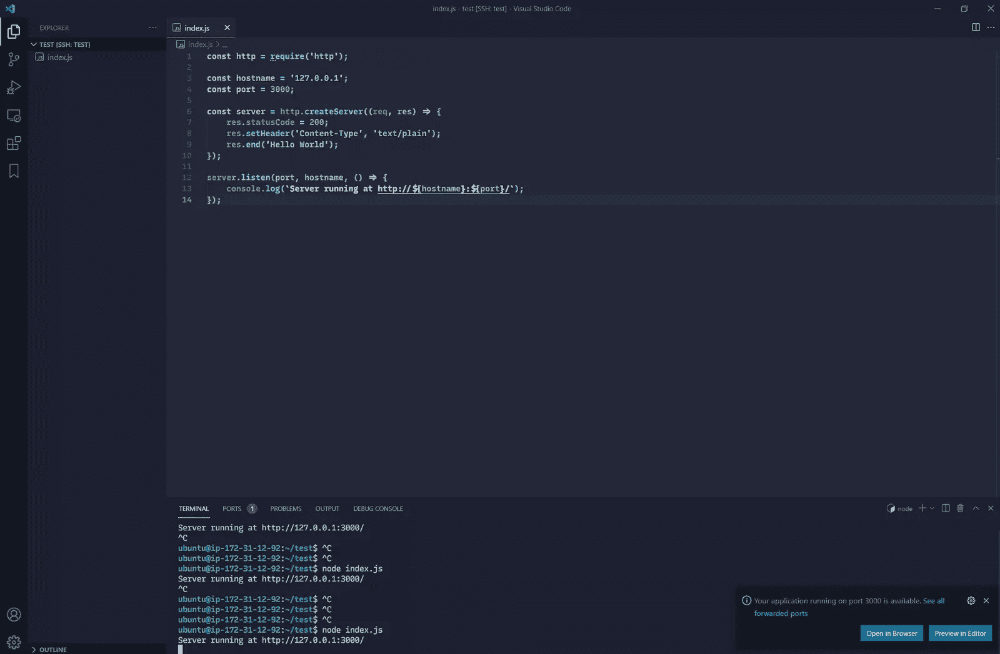

# 如何在 Amazon EC2 上免费设置 VS 代码远程开发

> 原文：<https://www.sitepoint.com/vs-code-remote-development-amazon-ec2/>

远程开发就是在远程服务器上进行开发。从您的本地机器到云中的服务器建立了一个 SSH 连接。SSH 代表安全外壳或安全套接字外壳，这是一种通过终端在两台计算机之间进行安全通信的协议。

Image source: [code.visualstudio.com](https://code.visualstudio.com/docs/remote/ssh)

Amazon Elastic Compute Cloud (EC2)提供可扩展的计算资源来构建应用程序(服务器),而无需承担管理物理计算机的责任。在我们的例子中，我们将使用 Visual Studio 代码编辑器，并通过 SSH 连接将其连接到 EC2 实例。

在本文中，我们将创建一个 AWS EC2 自由层实例，并通过[远程 SSH 插件](https://marketplace.visualstudio.com/items?itemName=ms-VSCode-remote.remote-ssh)将其连接到 VS 代码编辑器。

### 先决条件

要跟随本教程，您需要以下内容:

1.  安装了 WSL2 的基于 Linux 的操作系统或 Windows 10。
2.  安装在您机器上的 SSH 客户端。这应该是大多数 Linux 机器的标准。如果没有，请参考此[受支持客户端列表](https://code.visualstudio.com/docs/remote/troubleshooting#_installing-a-supported-ssh-client)。
3.  已激活的 AWS 帐户。没有的话，[按照官方教程](https://aws.amazon.com/premiumsupport/knowledge-center/create-and-activate-aws-account/)来。

## 远程开发的利与弊

但是在我们进入如何之前，让我们看看为什么。以下是在服务器上开发的一些利弊。

首先，优点:

*   **便携性**:你可以在任何可以上网的设备上编写代码。您的代码并不局限于本地机器，因此，您可以在任何地方使用任何可用的设备进行编码。

*   **电源**:您可以根据工作负载轻松扩展您的远程服务器。对于一些数据科学工作负载，启动 32GB RAM [AMD EPYC](https://www.amd.com/en/processors/amd-epyc-aws) 实例非常简单。

*   **生产-开发同步**:通过拥有一个类似于您的生产环境的远程开发环境，您可以最大限度地减少任何部署问题。

*   **无缝开发**:远程编码让你能够为手头的项目创建特别定制的环境。例如，一个项目可能需要不同版本的 MySQL、C++和系统库，如 LibPng 和 ImageMagick。管理这些的不同版本可能会相当忙乱，因为由此出现的任何错误都不容易被复制。

*   可靠性:云服务器远比你的本地机器更可靠。根据您的配置，您的服务器数据可以复制到世界上不同地方的服务器。

现在让我们来看看缺点。

避免在远程环境中编码的主要原因是访问远程服务器需要互联网连接。通过快速的互联网连接，在打开、创建和键入文件以及与远程服务器的命令行交互时，远程开发体验就像是在本地一样。但如果使用慢速 3G 网络，您可能会断开与服务器的连接，这可能会导致几秒到几分钟的工作丢失。

说完这些，让我们进入文章的核心——设置一个自由层 EC2 实例，并将其连接到我们的本地 VS 代码编辑器。

## 创建和配置 AWS 服务器

让我们来看一下创建和配置云实例的步骤。

登录 [AWS 管理控制台](https://aws.amazon.com/console/)。



点击 **EC2** 前往 EC2 仪表板。点击**启动实例**按钮。您将被引导到 AMI 选择页面。


在 AMI 选择页面，搜索 **Ubuntu** 并选择你喜欢的版本。确保架构设置为 x86。我们将使用 x86 架构，因为与 ARM 相比，它具有更广泛的软件支持。



选择 **t2.micro** 作为实例类型。



将其余步骤保留为默认设置，直到进入**添加存储**步骤。我建议您使用最少 24GB 的内存。如果您正在为 Node.js 开发，npm 库会占用相当多的空间，使用较少会使您陷入困境，所以宁可小心也不要出错。



一旦到达**配置安全组**步骤，您将需要允许传入的 SSH 连接，您有两个选择:

*   **启用所有传入的 IP 地址**:选择此项将允许任何 IP 地址访问您的 SSH 端口，如果您的情况需要方便而不是安全，请选择此项。
    

*   **我的 IP** :如果安全更重要，请从下拉列表中选择此选项，将 IP 地址限制为您自己的。
    

一旦你点击 **launch** ，你将被要求选择或者创建一个 SSH 密钥对。选择**创建新的密钥对**。命名密钥对。



点击**下载密钥对**按钮将获得您的私钥文件。这将下载一个`pem`文件，您应该将它存储在一个方便的目录中，并记下它的目录路径。

接下来，单击 **Launch Instances** 按钮，您的 EC2 实例将开始创建过程。转到 instances 页面，您应该会找到新创建的实例。



最后，单击实例导航到它的详细信息页面，并记下它的公共 IPv4 DNS 地址。


我们将这个地址称为实例的“主机名”。

## 安装和配置 Visual Studio 代码扩展

现在我们已经成功创建了 EC2 实例，让我们看看在 Visual Studio 代码中需要做什么。如果您的机器上没有安装 Visual Studio 代码，请前往他们的[下载页面](https://code.visualstudio.com/Download)并获取适合您系统的正确软件包。

### 安装远程 SSH VS 代码扩展

一旦安装了 VS 代码，在编辑器中打开**扩展**标签(你可以选择使用快捷键`Ctrl` + `Shift` + `X`)，在扩展市场中搜索“远程 ssh”。

找到并安装 Remote-SSH 扩展，确保它是正确的扩展(由 Microsoft 编写，在撰写本文时已有 430 万次安装)。

### 配置远程 SSH 扩展

单击编辑器左下角的“新建”按钮。这将打开命令面板，在这里您应该选择**Remote-SSH:Open Configuration File**。



将弹出一个 SSH 配置文件(如果扩展识别多个配置文件，请选择当前用户的配置文件)，您可以在其中输入以下配置:

```
Host VS Code-ssh-tutorial
HostName <HOSTNAME>
User ubuntu
IdentityFile <PATH TO IDENTITY FILE> 
```

*   `Host`可以是任何名字。这将出现在 VS 代码中。
*   `HostName`是服务器的 IP 地址。我们在创建 EC2 实例时注意到了这一点。
*   `User`是默认的 Ubuntu 用户名(本例中为`ubuntu`)。
*   `IdentityFile`是我们之前下载的私钥(`pem`文件)的完整路径。

## 测试设置

点击左下角的 **remote-ssh** 按钮，在出现的下拉菜单中点击**连接主机**。



将出现另一个下拉菜单。选择您在上一步中创建的主机配置(`VS Code-ssh-tutorial`)。如果一切正常，应该会出现一个新的编辑器窗口，要求您选择工作目录。

至此，您已经建立了您的远程开发环境。现在让我们使用 Node.js 创建一个简单的演示应用程序。

### 创建一个演示节点服务器

使用快捷方式打开终端:`Ctrl` + `Shift` + ```，然后使用以下命令安装 Node.js:

```
sudo apt update
sudo apt install nodejs 
```

接下来，在新目录`test`中创建一个`index.js`文件:

```
 mkdir test && cd test && touch index.js 
```

将以下内容放入`index.js`文件:

```
//index.js
const http = require('http');

const hostname = '127.0.0.1';
const port = 3000;

const server = http.createServer((req, res) => {
  res.statusCode = 200;
  res.setHeader('Content-Type', 'text/plain');
  res.end('Hello World');
});

server.listen(port, hostname, () => {
  console.log(`Server running at http://${hostname}:${port}/`);
}); 
```

在服务器终端中使用以下命令运行此测试服务器:

```
node index.js 
```

运行这段代码后，VS 代码编辑器的右下角会弹出一个小窗口，如下所示。



你有两个选择，**在浏览器中打开**和**在编辑器中预览**。无论你选择哪一个，你都会发现服务器的端口已经被转发到你的本地主机，可以用 *localhost:3000* 访问。


## 解决纷争

如果到目前为止，您在连接到创建的实例时遇到了任何问题，以下是一些故障排除提示:

1.  检查配置文件，确保私钥文件路径正确。
2.  确保主机名正确。
3.  请检查您的 AWS 实例防火墙设置。如果您将它设置为允许特定的 IP，请确定您当前的 IP 没有改变。
4.  如果您重新启动 AWS 实例，它的 IP 地址将会改变，所以记得用新的 IP 地址更新配置文件。

## 结论

在本教程中，我们创建了一个自由层 AWS t2.micro 实例。我们将它设置为允许来自本地机器的 SSH 连接，并通过远程 SSH 扩展连接到本地机器。最后，我们能够访问我们在远程环境中创建的端口转发服务器。

## 分享这篇文章