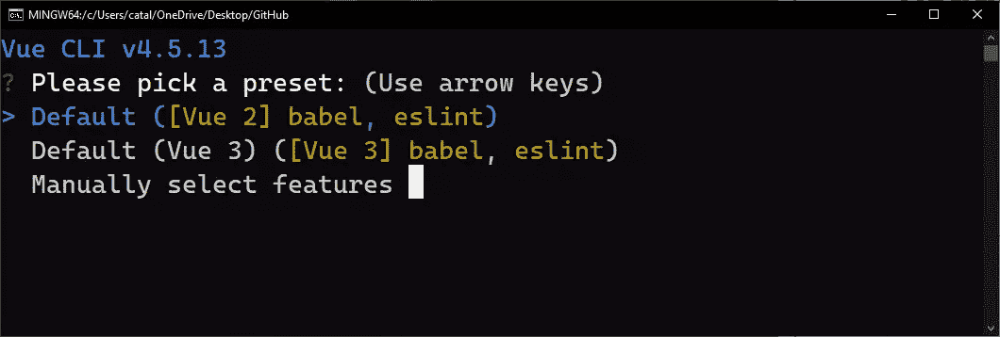
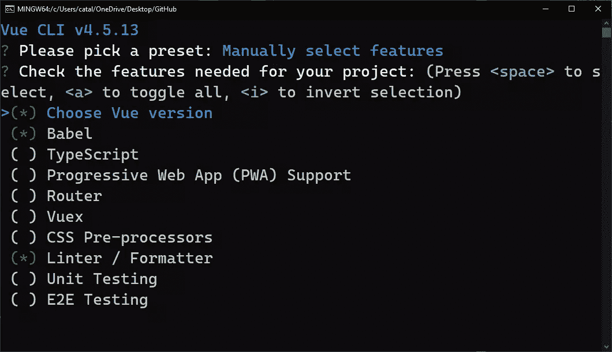
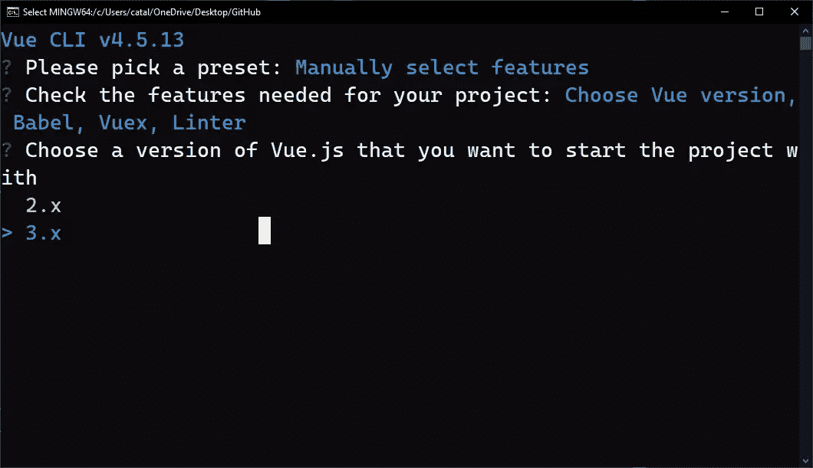
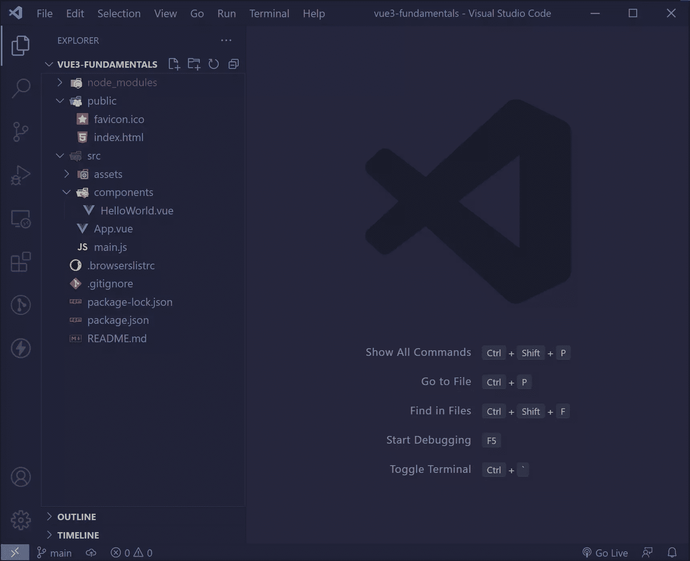
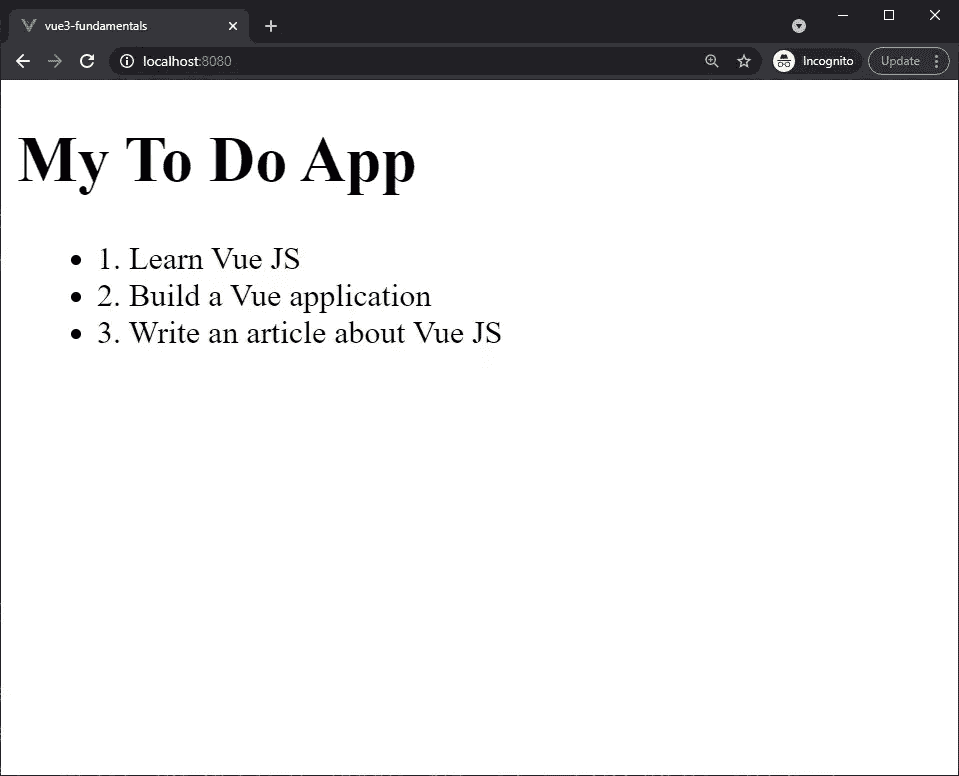
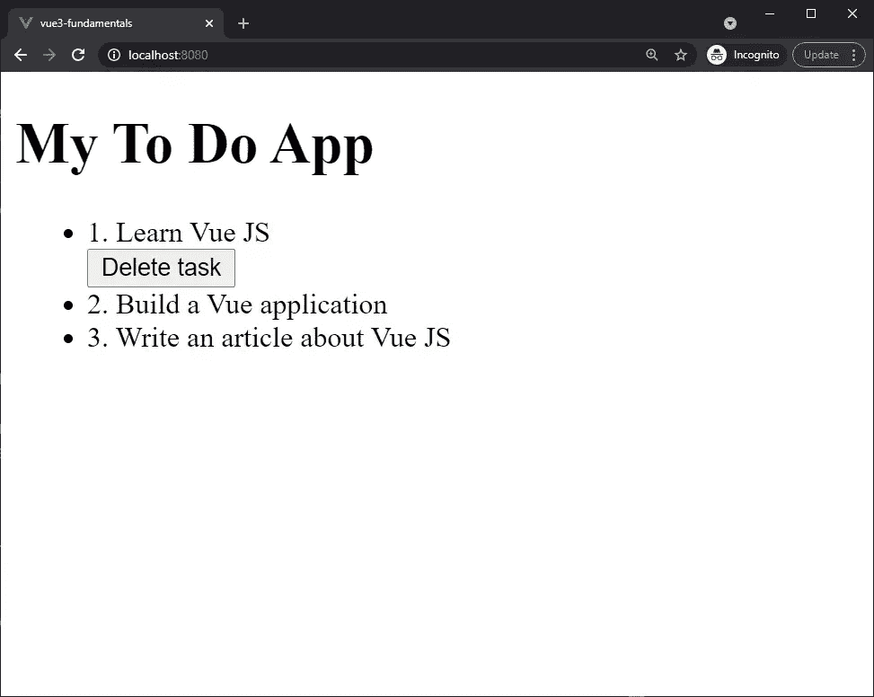
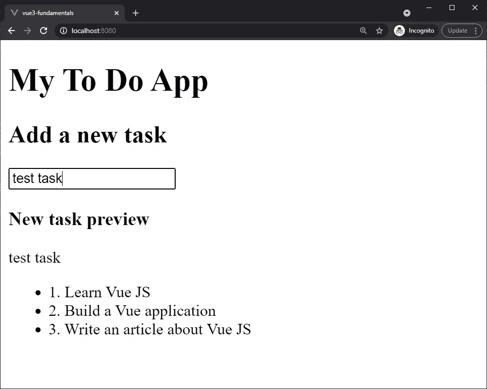
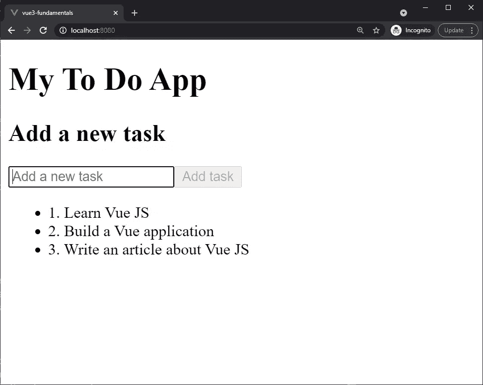
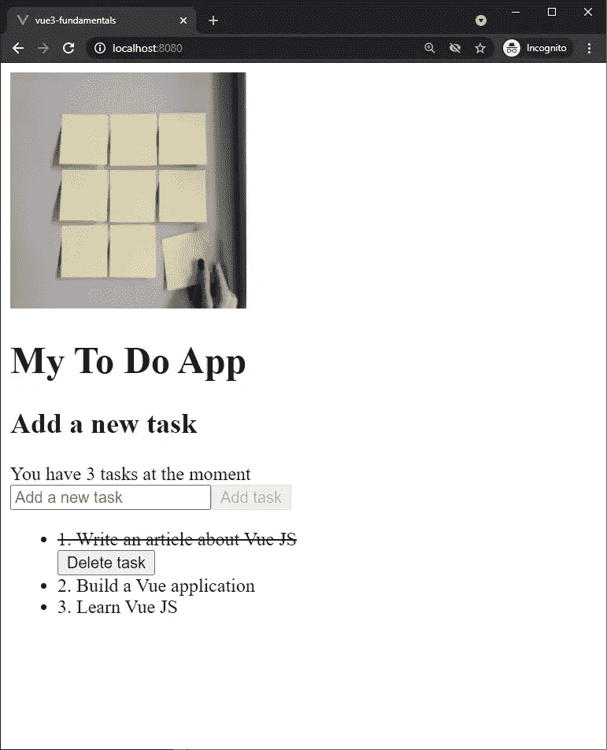

# Vue 3 初学者指南

> 原文：<https://www.sitepoint.com/vue-3-beginner-guide/>

在本文中，你将学习 Vue.js 的基础知识。尽管本文使用的是 Vue 3，但这些基础知识也适用于旧版本的 Vue。

我们将介绍如何:

*   使用 Vue CLI 创建 Vue 应用程序
*   呈现列表
*   使用条件呈现
*   利用动态 CSS
*   处理用户输入和事件
*   使用方法和计算属性
*   使用 HTML 属性绑定

我们将从使用 CLI 创建一个框架应用程序开始。

## 使用 Vue CLI 创建应用程序

Vue 命令行界面允许我们从头开始创建和配置新的 Vue 项目。也就是说，CLI 会为我们做这件事，而不是我们自己添加软件包和配置。

让我们安装 Vue 命令行界面。

### 安装 Vue CLI

本教程假设您的计算机上没有安装 Vue CLI。要安装它，请运行以下命令:

```
npm i -g @vue/cli 
```

或者，您可以使用纱线安装，如下所示:

```
yarn global add @vue/cli 
```

一旦你运行了上面的命令，安装就开始了，这需要几秒或几分钟的时间。安装完成后，您可以使用以下命令创建项目:

```
vue create your-project-name 
```

### `vue create`命令

一旦我们运行了`vue create`命令，我们将被提示一些问题。这些问题的目的是配置项目以满足我们的需求。



图 Vue CLI 欢迎屏幕

上面的图 1 显示了我们运行`vue create your-project-name`时得到的欢迎屏幕。然后，我们必须在三个不同的选项中做出选择:

1.  创建默认的 Vue 2 项目
2.  创建默认的 Vue 3 项目
3.  手动选择功能

前两个选项将为我们安装一个默认的 Vue 项目。然而，我们不想要一个默认的项目。对于本教程，我们将为我们的项目手动选择特性。一旦我们选择了第三个选项，我们会得到一系列的问题。



图 2:用 Vue CLI 配置 Vue 项目

上面的图 2 展示了我们选择第三个选项时看到的情况，即*手动选择特性*。我们可以选择项目中需要的功能，例如:

*   向我们的项目添加单元和 E2E 测试
*   为项目选择棉绒/格式化程序
*   添加选项，如 Vuex、TypeScript、路由器等

之后，系统会提示我们为项目选择一个 Vue 版本。对于本教程，我推荐选择 Vue 3，如下图。



图 3:在 Vue CLI 中选择 Vue 版本

最后，根据我们在第一步中选择的特性，我们需要回答更多的问题，如图 2 所示。

在继续之前，我想确保我们在同一页上:

1.  在您的终端中运行`vue create vue3-fundamentals`。
2.  选择“手动选择功能”。
3.  取消选中除**巴贝尔**之外的所有特征。对于本教程，我们不需要任何额外的功能。
4.  选择 Vue 版本 3。
5.  当它询问你在哪里放置 Babel 的配置时，选择“在专用配置文件中”,等等。
6.  不要为将来的项目存储预置。

完成上述步骤后，项目结构应该如图 4 所示。



图 4:我们的 Vue 3 项目结构

项目配置就是这样！现在我们已经准备好开始工作并学习 Vue 了！

如果你想看一篇关于 CLI 的更全面的文章，请查看这篇 [Vue CLI 文章](https://catalins.tech/get-started-with-vue-cli-and-ui)。

## 准备应用程序

有些东西我们在应用中并不需要。首先，转到`src` > `components`，删除`HelloWorld.vue`组件。

现在转到`App.vue`文件，从文件中删除`HelloWorld`的所有引用。此外，删除带有 Vue 徽标的图像。最后，修改`export default {}`代码块。

请看下面`App.vue`的完整代码:

```
<template>
  <h1>{{ title }}</h1>
</template>

<script> export default {
  data() {
    return {
      title: 'My To Do App'
    }
  }
} </script> 
```

设置一个`title`属性并显示在模板中。

## 列表呈现

我们要介绍的第一个概念是如何在 Vue 应用程序中呈现列表。然而，在我们这样做之前，我们需要一个列表。

打开文件`App.vue`并添加以下数组:

```
<script>
export default {
  data() {
    return {
      title: 'My To Do App',
      tasks: [
        { id: 1, name: 'Learn Vue JS', finished: false },
        { id: 2, name: 'Build a Vue application', finished: false },
        { id: 3, name: 'Write an article about Vue JS', finished: false }
      ]
    }
  }
}
</script> 
```

在上面的代码片段中，我们添加了一个对象数组。每个对象代表一个单独的任务，每个任务包含以下内容:

*   ID:我们可以通过每个任务的唯一 ID 来识别它
*   **一个名字**:它描述了任务的内容
*   **完成字段**:表示该人员是否完成了任务

下一步是循环数组，并将其呈现在页面上。在 Vue 中，我们可以用`v-for`指令循环遍历列表。`v-for`指令具有`task in tasks`的形式，其中每个`task`代表数组中的一个单独的项目，`tasks`代表数组。

我们可以在下面的代码片段中看到`v-for`指令的作用:

```
<ul>
    <li v-for="task in tasks" :key="task.id">
      {{task.id}}. {{ task.name }}
    </li>
</ul> 
```

我们可以使用 Mustache 符号来呈现每个`item`或`task`。我们用双花括号来表示胡子。

目前，它只显示任务的 ID 和名称。但是我们也可以显示它是否完成，如下所示:

```
{{ task.id }}. {{ task.name }} - {{ task.finished}} 
```

然而，在本教程的后面部分，我们将把该字段用于其他目的。如果我们保存代码并运行应用程序，我们应该会看到如下内容:



图 5:带有 v-for 指令的 Vue 中的列表呈现

您可以看到任务呈现在页面上，每个任务都有一个 ID 和一个名称。

### 唯一键

您可能已经注意到以下代码:

```
:key="task.id" 
```

建议我们在遍历列表时使用`:key`属性。原因是每个 DOM 元素都有一个惟一的键。因此，Vue 可以跟踪每个节点的身份，以重用和重新排序现有的元素。因此，它也提高了应用程序的性能。

通常，我们使用项目的 ID 作为属性`:key`，就像上面的例子一样。

*检查[这个要点](https://gist.github.com/SitePointEditors/e9b87fbac4fc134755b505b33b05ef57)看看`App.vue`文件应该如何查找到这一点。*

## 条件渲染

有时，我们希望根据特定条件在页面上显示某些内容。因此，我们可以使用`v-if`指令根据条件来呈现一段代码。

仅当提供的表达式返回真值时，才呈现代码块。例如，在我们在本教程中构建的应用程序中，我们可能希望在完成任务后显示一个**删除任务**按钮。因此，我们可以在完成任务后删除它。

让我们添加**删除任务**按钮。转到`App.vue`文件，在无序列表中添加以下代码:

```
<ul>
    <li v-for="task in tasks" :key="task.id">
        {{ task.id }}. {{ task.name }}

        <div v-if="task.finished">
            <button>Delete task</button>
        </div>
    </li>
</ul> 
```

你可以看到新的`div`和`v-if`指令。它的目的是检查任务是否完成。如果任务完成，它会显示“删除”按钮。如果任务没有完成，按钮将被隐藏。

将任何任务上的`finished`字段从`task`数组更改为 true。之后，刷新应用程序，我们应该看到删除按钮。

如果您遵循了所有步骤，您应该会看到以下内容:



图 6: Vue 条件渲染

当我们想要基于条件呈现某些东西时,`v-if`指令非常方便。

在继续之前，重要的是要注意我们也可以使用`v-else-if`和`v-else`。例如，我们可以有类似这样的东西:

```
<ul>
    <li v-for="task in tasks" :key="task.id">
        {{ task.id }}. {{ task.name }}

        <div v-if="task.finished">
            <button>Delete task</button>
        </div>
        <div v-else-if="task.edit">
            <button>Edit task</button>
        </div>
        <div v-else>
            <p>No button</>
        </div>
    </li>
</ul> 
```

你可以看到条件渲染是多么强大。然而，对于本教程，我们只使用了`v-if`。

*检查[这个要点](https://gist.github.com/SitePointEditors/87d7e287ccc04cdaaad3fc1eefa576fd)看看`App.vue`文件应该如何查找到这一点。*

## 处理用户输入

下一步是处理用户输入。首先，转到`App.vue`文件，在应用程序标题下添加以下 HTML 代码:

```
<h2>Add a new task</h2>

<div>
   <input type="text"
     v-model="newTask"
     placeholder="Add a new task"
   >
</div>

<div v-if="newTask.length > 0">
   <h3>New task preview</h3>
   <p>{{ newTask }}</p>
</div> 
```

在上面的代码片段中，我们添加了一个允许用户添加新任务的文本输入。此外，您会注意到`v-model`指令。`v-model`指令使我们能够在输入字段和应用程序状态之间创建双向绑定。(你可以在“了解 Vue 3 中的新反应系统[中了解更多关于`v-model`。)](https://www.sitepoint.com/vue-3-reactivity-system/)

在我们尝试代码之前，在 Vue 实例中添加`newTask`字段，如下所示:

```
return {
      title: 'My To Do App',
      newTask: '',
      tasks: [
        { id: 1, name: 'Learn Vue JS', finished: false },
        { id: 2, name: 'Build a Vue application', finished: false },
        { id: 3, name: 'Write an article about Vue JS', finished: false }
      ]
    } 
```

如果我们运行应用程序并在输入字段中键入任何内容，我们将看到文本出现在输入字段下。



图 7: Vue 处理用户输入

在上面的代码中，我们在 HTML 代码中添加了`<p>{{ newTask }}</p>`，它表示“newTask”字段。因此，每当我们在输入字段中添加任何内容时，它都会更新并呈现在页面上。它出现在输入字段下。

*检查[这个要点](https://gist.github.com/SitePointEditors/cf25d043f07421262971413e37d7b46c)看看`App.vue`文件应该如何查找到这一点。*

## 方法

在学习处理用户事件之前，我们需要学习方法。原因是我们将使用方法来处理这些用户事件。

所有的 Vue 实例都有一个名为`methods`的属性，我们在其中添加所有的方法。例如，我们将添加一个允许我们添加任务的按钮。因此，我们将该按钮的逻辑封装在一个方法中，并将其添加到`methods`字段。

打开文件`Vue.app`，在`data()`后添加以下代码:

```
methods: {
    addTask() {
      if (this.newTask.length < 1) return

      this.tasks.push({
        id: this.tasks.length + 1,
        name: this.newTask,
        finished: false
      });

      this.newTask = ''
    }
  } 
```

上面的代码只在用户在输入字段中输入内容时添加一个任务，然后清除该字段。这是为了防止在我们的任务列表中输入空字符串。

现在，我们可以像在任何其他应用程序中一样使用`addTask()`方法。我们调用方法，方法将运行，这正是下一步要做的。

**请注意**:应用程序将有两个以上的方法:

*   删除任务
*   完成任务(打开和关闭任务)

然而，出于可读性的考虑，我将它们排除在上述代码片段之外，但是您将在要点中看到它们。*你可以看到[这个要点](https://gist.github.com/SitePointEditors/413e784c6195dd9797e32001f9c0ac27)以及到目前为止`App.vue`的完整代码。*

## 处理用户事件

既然您已经知道了什么是方法，那么是时候学习如何处理用户事件了。例如，当用户点击**添加任务**按钮时会发生什么？

我们可以向该按钮添加一个事件侦听器。在 Vue 中，我们可以用`v-on`指令监听事件。当用户单击按钮等事件被触发时，应用程序运行指定的方法。

让我们看看它的实际效果。转到`App.vue`文件，在输入字段下添加一个按钮。我们应该有以下代码:

```
<div>
    <input type="text"
        v-model="newTask"
        placeholder="Add a new task"
    >

    <button
      @click="addTask"
      :disabled="newTask.length < 1"
    >
      Add task
    </button>
  </div>

  <div v-if="newTask.length > 0">
    <h3>New task preview</h3>
    <p>{{ newTask }}</p>
</div> 
```

遵守`@click="addTask"`代码。`v-on`指令有一个简写符号，即`@`符号。因此，我们可以不写`v-on:click`，而是像上面这样写。

点击**添加任务**按钮触发方法`addTask()`，该方法添加任务。因此，使用`v-on`指令，我们可以监听用户事件，并在它们被触发时调用特定的方法。



图 8:我们禁用的按钮

在图 8 中，您可以看到新创建的按钮。起初，它是禁用的，但一旦我们开始打字，它就工作了！

*见[此要诀](https://gist.github.com/SitePointEditors/0fc466537250310b7dfb43ddadb45812)与到此为止`App.vue`的完整代码。*

## 计算属性

Vue 中另一个方便的特性是计算属性。它们类似于方法，除了它们*不应该*改变数据。然而，计算出的属性对于操纵数据和在我们的应用程序中重用数据非常有用。

对于这个应用程序，我们将添加两个计算属性:

*   返回所有任务数的函数。
*   一个以逆序返回任务数组的函数。为什么？我们需要它在列表顶部显示最新的任务。

因此，在`App.vue`中，在`methods`属性下添加以下代码:

```
computed: {
    allTasks() {
        return this.tasks.length
    },
    latest() {
        return [...this.tasks].reverse()
    }
  } 
```

您可能已经注意到,`latest()` computed 属性返回一个新的反向数组。如前所述，计算属性不应该改变现有数据。

此外，当我们使用计算属性时，使用`return`关键字很重要。如果我们不退货，就没用了！现在我们可以使用新创建的属性了。

在我们的模板中，找到“添加新任务”部分，并在下面添加以下行:

```
<span>You have {{ allTasks }} {{ allTasks > 1 ? 'tasks' : 'task' }} at the moment</span> 
```

上面一行显示了我们列表中的所有任务。此外，它还根据任务的数量确定何时使用“任务”或“任务”。

最后，转到我们遍历任务数组的那段代码，将`task in tasks`改为`task in latest`。我们的代码现在应该是这样的:

```
<ul>
      <li v-for="(task, index) in latest" :key="task.id">
        {{ index + 1 }}. {{ task.name }}

        <div v-if="task.finished">
          <button>Delete task</button>
        </div>
      </li>
</ul> 
```

我们现在对`latest`进行循环，现在我们还有一个“索引”字段。新字段用于显示任务在列表中的位置。


图 9:运行中的计算属性](computed-properties.png)

图 9 展示了运行中的计算属性。您可以看到它显示了任务总数，并且还按照任务添加的顺序显示了任务。

### 计算属性与方法

在继续之前，我想再次强调，它们相似但又不同。我们应该*使用方法来改变数据*并且*使用为表示层*计算的属性。

改变计算属性中的数据可能会导致难以发现的错误。

*检查[这个要点](https://gist.github.com/SitePointEditors/1e5c158d01276f563d40158920141dd9)看看`App.vue`文件应该如何查找到这一点。*

## 属性绑定

在 Vue 中，我们可以用`v-bind`指令将 HTML 属性绑定到 Vue 数据。也就是说，我们可以对属性使用动态值，而不是硬编码值。

让我们通过添加一个徽标来利用属性绑定。转到`Vue.app`，添加两个新字段`logoURL`和`logoCaption`。我们的代码应该如下所示:

```
data() {
    return {
      title: 'My To Do App',
      newTask: '',
      logoURL: 'https://images.unsplash.com/photo-1507925921958-8a62f3d1a50d?ixid=MnwxMjA3fDB8MHxwaG90by1wYWdlfHx8fGVufDB8fHx8&ixlib=rb-1.2.1&auto=format&fit=crop&w=1955&q=80',
      logoCaption: 'A photo by Kelly Sikkema on Unsplash showing post-it notes',
      tasks: [
        { id: 1, name: 'Learn Vue JS', finished: false },
        { id: 2, name: 'Build a Vue application', finished: false },
        { id: 3, name: 'Write an article about Vue JS', finished: false }
      ]
    }
  }, 
```

然后，在同一个文件中，在应用程序标题上方添加以下 HTML `img`元素:

```
 
```

观察`:src`和`:alt`属性中的冒号。它们是`v-bind`的简写。因此，我们不写`v-bind:src`，而是写`:src`。

假设我们在多个地方使用徽标，但没有单独的组件。这意味着在多个位置复制粘贴同一个`img`标签。如果我们想改变标志，我们将不得不在许多地方做出改变。然而，通过使用属性绑定，我们只需要在 Vue 实例中做一个改变。

下图展示了一个带有`img`元素的例子。但是，我们也可以将属性绑定用于其他 HTML 元素。例如，我们也可以将它与`href`元素一起使用。


图 10:Vue 中的 HTML 属性绑定

图 10 展示了运行中的图像！

*检查[这个要点](https://gist.github.com/SitePointEditors/6e008e12223d242212d65eab4bc0bc0e)看看`App.vue`文件应该如何查找到这一点。*

## 动态 CSS

在 Vue 中，我们可以使用动态 CSS。这意味着一个类是否被使用是由一个数据属性决定的。待办事项应用程序的一个例子是在任务完成时添加类`strikeout`。

转到`App.vue`文件，在`@click`属性后添加`:class`属性。参见下面的代码:

```
<ul>
    <li 
      v-for="(task, index) in latest" 
      :key="task.id"
      @click="finishTask(task)"
      :class="{ strikeout: task.finished }"
    >
      {{ index + 1 }}. {{ task.name }}

      <div v-if="task.finished">
          <button>Delete task</button>
      </div>
    </li>
</ul> 
```

另外，在`App.vue`的末尾，添加 CSS 的以下位:

```
<style> .strikeout {
  text-decoration: line-through;
} </style> 
```

那么，现在发生了什么？在上面的代码中，我们还添加了一个用户事件— `@click="finishTask(task)"`。这意味着我们可以点击任务来完成它。方法`finishTask(task)`将`finished`字段切换为真/假。如果`finished`字段设置为真，则添加`strikeout`类。



Vue 中的动态 CSS

图 11 展示了当我们点击任务时会发生什么。因此，动态 CSS 非常适合这种情况。

值得注意的是，如果我们想要添加多个动态类，我们可以使用数组符号。我们可以这样做:

```
<li 
    v-for="(task, index) in latest" 
    :key="task.id"
    @click="finishTask(task)"
    :class="[ 
        task.finished ? 'strikeout' : '',
        task.postponed ? 'text-gray' : '',
        'simple-class'
   ]"
>
    {{ index + 1 }}. {{ task.name }}

    <div v-if="task.finished">
        <button>Delete task</button>
    </div>
</li> 
```

因此，通过这种方式，我们可以基于多个条件添加多个动态类。*此外*，我们可以在数组中添加静态类。见上文`simple-class`。

*检查[这个要点](https://gist.github.com/SitePointEditors/db271398dce6e0efc24357934d6e0162)看看`App.vue`文件应该如何查找到这一点。*

## 最后的润色

完成应用程序还剩下两件事:

*   允许用户通过按键盘上的`enter`键来添加任务
*   让删除按钮工作

打开文件`App.vue`并找到输入字段。找到它后，添加以下代码:

```
<input type="text"
    v-model="newTask"
    @keyup.enter="addTask"
    placeholder="Add a new task"
> 
```

您会注意到`@keyup.enter`，当用户按下`enter`键时，它调用方法`addTask`。

其次，在我们的应用程序中找到 delete 按钮，并添加以下代码:

```
<div v-if="task.finished">
    <button @click="removeTask(task.id)">Delete task</button>
</div> 
```

现在它监听一个点击事件，每当点击**删除任务**按钮时，它将触发方法`removeTask`。它还传递任务的 ID，所以它知道要删除什么任务。

现在我们可以按`enter`键输入任务，也可以删除任务。

*检查[这个要点](https://gist.github.com/SitePointEditors/d8f6575b9c019929d381024c1bb1fa5e)看看`App.vue`文件应该如何查找到这一点。*

## 结论

为构建您的第一个应用程序做得很好！从这里开始，您就可以深入研究 Vue 组件、Vue 路由器和其他概念了！

你可以在这个“ [final-app.vue](https://gist.github.com/SitePointEditors/d8f6575b9c019929d381024c1bb1fa5e) ”要点中找到整个应用。如果您想尝试一下，只需将所有代码复制到您的`App.vue`文件中。

## 分享这篇文章