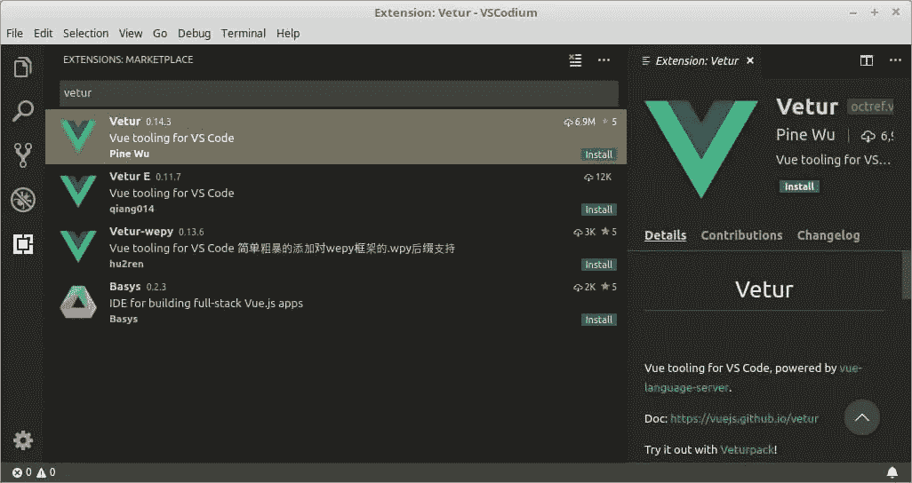
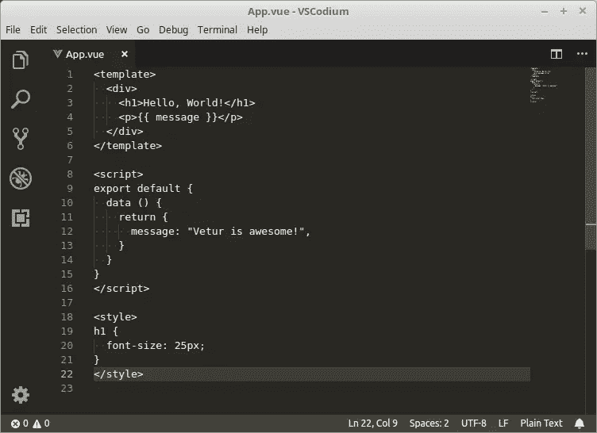
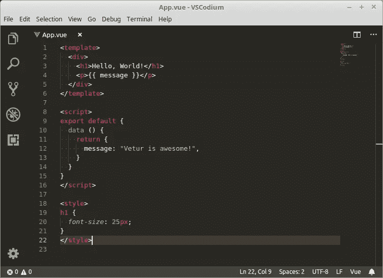
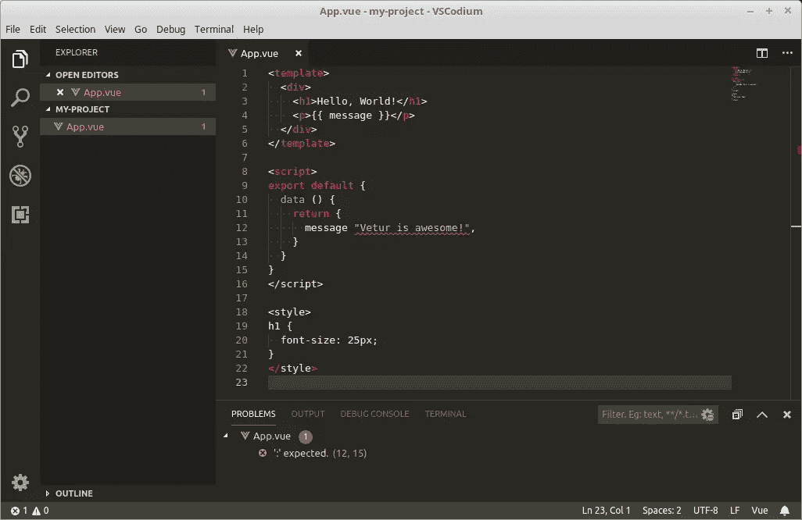
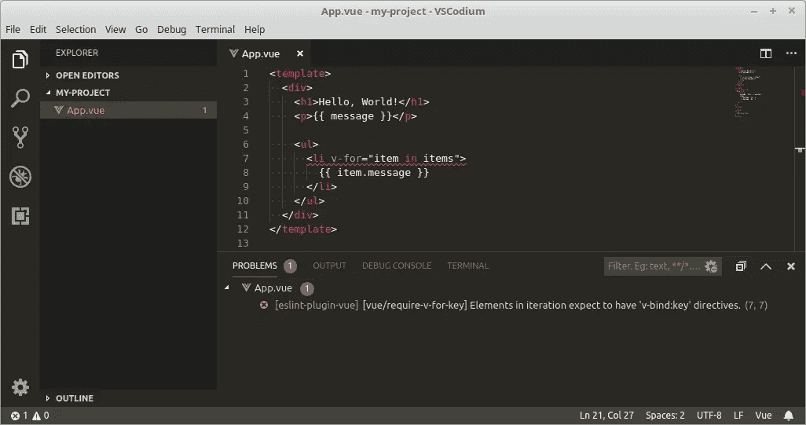
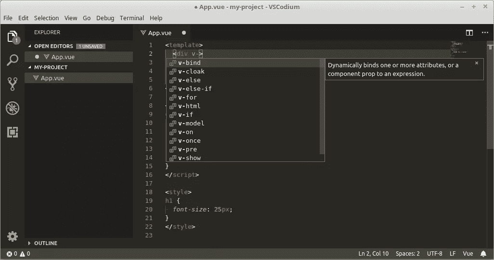
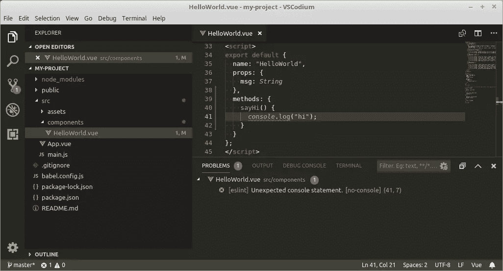
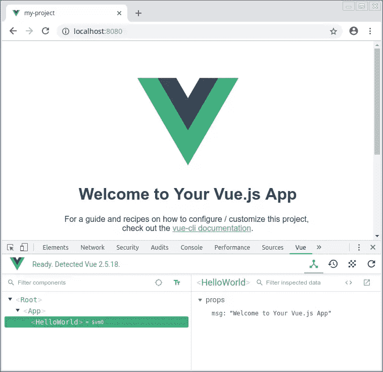

# 如何建立一个 Vue 开发环境

> 原文：<https://www.sitepoint.com/vue-development-environment/>

如果你打算用 Vue 做大量的工作，从长远来看，投资一些时间来建立你的编码环境是值得的。一个强大的编辑器和一些精心挑选的工具会让你更有效率，最终成为一个更快乐的开发者。

在这篇文章中，我将演示如何配置 VS 代码来使用 Vue。我将展示如何使用 ESLint 和 Prettier 来 Lint 和格式化您的代码，以及如何使用 Vue 的浏览器工具来查看 Vue 应用程序中正在发生的事情。当你读完之后，你将有一个工作开发环境，并准备像老板一样开始编写 Vue 应用程序。

我们开始吧！

*想从头学起 Vue.js？这篇文章是从我们的优质图书馆摘录的。使用 SitePoint Premium 获得涵盖基础知识、项目、技巧和工具&的 Vue 书籍全集。[现在就加入，每月仅需 9 美元](https://www.sitepoint.com/premium/products/Z2lkOi8vbGVhcm5hYmxlL1Byb2R1Y3QvMzA3?utm_source=blog&utm_medium=articles)。*

## 安装和设置编辑器

我说过我将在本教程中使用 [VS 代码](https://code.visualstudio.com/)，但恐怕我撒谎了。我实际上将使用 [VSCodium](https://github.com/VSCodium/vscodium) ，它是 VS 代码的开源分支，没有微软的品牌、遥测和许可。该项目正在积极开发中，我鼓励你去看看。

使用哪个编辑器并不重要；两者都适用于 Linux、Mac 和 Windows。您可以[在此](https://github.com/VSCodium/vscodium/releases)下载最新版本的 VSCodium，或者[在此](https://code.visualstudio.com/Download)下载最新版本的 VSCode，并根据您的操作系统以正确的方式安装。

在本指南的其余部分，为了保持一致，我将把编辑器称为 VS 代码。

### 添加 Vetur 扩展

当您启动编辑器时，您会注意到窗口左侧的工具栏中有一组五个图标。如果你点击这些图标的底部(方形的)，将会打开一个搜索栏，允许你搜索 [VS 代码市场](https://marketplace.visualstudio.com/)。在搜索栏中输入“vue ”,你会看到列出了几十个扩展，每个都声称做了一些稍微不同的事情。

根据您的用例，您可能会在这里找到适合您的东西。有很多可用的。例如，如果您正在处理一个涉及 TypeScript 的 Vue 项目，那么 Vue 的 TSLint 可能会很方便。现在，我将把重点放在一个叫做 [Vetur](https://marketplace.visualstudio.com/items?itemName=octref.vetur) 的项目上。

在搜索框中键入“Vetur”并选择 Pine Wu 创作的包。然后点击*安装*。



一旦安装了扩展，点击*重新加载激活*，你就可以开始工作了。

### 探索 Vetur 的特征

如果你访问这个项目的主页，你会看到这个扩展给了你很多特性:

*   语法突出显示
*   片段
*   蚂蚁
*   林挺/错误检查
*   格式化
*   自动完成
*   排除故障

现在让我们来看看其中的一些。

*注意:这些特性中的许多只有在您建立了项目后才起作用。这意味着您需要创建一个文件夹来包含您的 Vue 文件，使用 VS 代码打开该文件夹并通过 VS 代码的资源管理器访问这些文件。*

#### 语法突出显示

随着应用程序的增长，你无疑会希望利用[单文件组件](https://vuejs.org/v2/guide/single-file-components.html) (SFCs)来组织你的代码。它们有一个`.vue`结尾，包含一个模板部分、一个脚本部分和一个样式部分。如果没有 Vetur，这就是 VS 代码中 SFC 的样子:



然而，安装 Vetur 会使它看起来像这样:



#### 片段

正如你在 [VS 代码网站](https://code.visualstudio.com/docs/editor/userdefinedsnippets)上看到的，代码片断是模板，它使得输入重复的代码模式更加容易，比如循环或者条件语句。Vetur 使您可以在单个文件组件中使用这些片段。

它还附带了一些自己的片段。例如，尝试在语言区域之外的区域键入“scaffold”(不带引号)，它将生成您使用 SFC 所需的所有代码:

```
<template>

</template>

<script>
export default {

}
</script>

<style>

</style> 
```

#### 蚂蚁

Emmet 将片段的概念提升到了一个全新的水平。如果你从未听说过这个，并且花了很多时间在文本编辑器上，我建议你去 Emmet 网站，花些时间熟悉它。它有可能极大地提高你的生产力。

简而言之，Emmet 允许您将各种缩写扩展成 HTML 或 CSS 的块。Vetur 在默认情况下会打开此功能。

尝试点击一个`<template>`区域并输入以下内容:

```
div#header>h1.logo>a{site Name} 
```

然后按下`Tab`。应该扩展成这样:

```
<div id="header">
  <h1 class="logo"><a href="">sitename</a></h1>
</div> 
```

#### 错误检查/林挺

开箱即用，Vetur 提供了一些基本的错误检查。这对于发现代码中的错别字很方便。



在上面的例子中，Vetur 注意到我忘记了对象属性名后面的冒号，因此用红色下划线标出。打开错误面板(点击左下角的小十字)会给出错误的描述。

Vetur 还使用 [eslint-plugin-vue](https://github.com/vuejs/eslint-plugin-vue) 来 lint 模板。在下一节中，我们将进一步了解为什么林挺你的代码是一个好主意，但是现在，让我们先看看它是如何工作的。

让我们给我们的`data`属性添加一个`items`键:

```
export default {
  data () {
    return {
      message: "Vetur is awesome!",
      items: [
        { message: 'Foo' },
        { message: 'Bar' }
      ]
    }
  }
} 
```

然后添加一些代码，将其输出到我们的模板中:

```
<template>
  <div>
    <h1>Hello, World!</h1>
    <p>{{ message }}</p>

    <ul>
      <li v-for="item in items">
        {{ item.message }}
      </li>
    </ul>
  </div>
</template> 
```

我们马上会看到`<li v-for="item in items">`用红色下划线标出。怎么回事？

嗯，您可以将鼠标悬停在有问题的代码上，或者打开错误控制台来查看是什么在困扰 Vetur。



错误似乎是我们忘记声明一个键。让我们补救一下:

```
<li v-for="(item, i) in items" :key="i">
  {{ item.message }}
</li> 
```

错误从我们的编辑器中消失了。

#### 智能感知

[智能感知](https://code.visualstudio.com/docs/editor/intellisense)是我在 VS 代码中最喜欢的特性之一，但它仅限于编辑器可以理解的几种格式。安装 Vetur 使 IntelliSense 在您的`.vue`文件中可用，这非常方便。

您可以通过单击 Vue 组件的`<template>`区域并在任何标签上键入“v-”来尝试一下(去掉引号)。您应该看到这个:



这允许您从任何列出的指令中进行选择，并且还为您提供了每个指令的功能解释。

这并不是 Vetur 所能做的全部，但是我们将把扩展留在那里，并把我们的注意力转向用 Vue 的 CLI 建立一个项目。

## 使用 Vue CLI 的示例项目

当构建一个新的 Vue 应用程序时，快速启动并运行的最佳方式是使用 [Vue CLI](https://cli.vuejs.org/) 。这是一个命令行实用程序，允许您从一系列构建工具中进行选择，然后它会为您安装和配置这些工具。它还将为您的项目搭建支架，为您提供一个可以构建的预配置起点，而不是从头开始。

*注意:如果 CLI 对您来说是新的，您可能想看看我们在这个 Vue 系列中的教程“[Vue CLI](https://www.sitepoint.com/vue-cli-intro)初学者指南”。*

要开始，您需要在系统上安装 Node。你可以从[官方网站](https://nodejs.org)为你的系统下载二进制文件，或者使用[版本管理器](https://www.sitepoint.com/quick-tip-multiple-versions-node-nvm/)来完成。我推荐这两种方法中的第二种。

安装节点后，执行以下命令:

```
npm install -g @vue/cli 
```

使用以下命令创建一个新的 Vue 项目:

```
vue create my-project 
```

这将打开一个向导，要求您选择一个预置。选择手动选择特性，然后接受所有的缺省值，除了当你被要求选择一个 linter/formatter 配置时。在这一步中，一定要在保存时选择*ESLint+beauty*和 *Lint，并将配置文件放在`package.json`中。*

### 用 ESLint 林挺你的代码

如果你打开这个新创建的项目，看一眼`package.json`文件，你会注意到 CLI 已经为你设置了 [ESLint](https://eslint.org/) 。这是一个可以自动检查代码潜在问题的工具。这提供了许多好处，例如:

*   保持代码风格的一致性
*   发现潜在的错误和不良模式
*   遵循[风格指南](https://www.sitepoint.com/why-use-javascript-style-guide/)时加强质量
*   由于上述原因节省了时间

*注意:如果你想更深入地了解 ESLint，可以看看我们的文章“[启动并运行 ESLint——可插拔 JavaScript Linter](https://www.sitepoint.com/up-and-running-with-eslint-the-pluggable-javascript-linter/) ”。*

如果你查看`package.json`中的`devDependencies`属性，你会发现 CLI 也在使用 [eslint-plugin-vue](https://github.com/vuejs/eslint-plugin-vue) 。这是 Vue.js 的官方 ESLint 插件，可以检测你的`.vue`文件中的代码问题。

让我们来测试一下。

用`npm run serve`启动 Vue dev 服务器并导航到 [localhost:8080](http://localhost:8080) 。

在 VS 代码中，用 CLI 打开刚刚创建的项目(*文件* > *打开文件夹*，然后在 VS 代码浏览器中导航到`src/components/HelloWorld.vue`。让我们向 Vue 实例添加一个方法:

```
export default {
  name: 'HelloWorld',
  props: {
    msg: String
  },
  methods: {
    sayHi() {
      console.log("hi");
    }
  }
} 
```

现在，如果你查看 dev 服务器正在运行的终端窗口，你会看到 Vue 在抱怨。


这是因为，在幕后，Vue CLI 已经将 ESLint 配置为使用`eslint:recommended`规则集。这将启用 [ESLint 规则页面](https://eslint.org/docs/rules/)上任何带有复选标记的规则，其中 [no-console](https://eslint.org/docs/rules/no-console) 是其中之一。

虽然 CLI 在终端中向我们显示 ESLint 错误很好，但是如果我们也能在编辑器中看到它们不是更好吗？幸运的是我们可以。跳回 VS 代码，点击扩展图标，输入“ESLint”(不带引号)。最上面的结果应该是 Dirk bauemer 命名为 *ESLint* 的[包。安装并重启 VS 代码。](https://marketplace.visualstudio.com/items?itemName=dbaeumer.vscode-eslint)

最后，您需要编辑您的 VS 代码首选项。进入*文件* > *首选项* > *设置*，编辑*用户设置文件*，添加以下配置:

```
"eslint.validate": [
  "vue"
] 
```

这将告诉我们刚刚安装的 ESLint 插件对`.vue`文件进行验证。



如果您愿意，您可以在`package.json`的`rules: {}`部分关闭该(或任何)规则:

```
"eslintConfig": {
  ...
  "rules": {
    "no-console": 0
  },
  ...
} 
```

### 用更漂亮的来格式化你的代码

漂亮是一个固执己见的代码格式化程序。正如你在[项目主页](https://github.com/prettier/prettier)上看到的，它通过解析你的代码并根据自己的规则重新打印代码来强制执行一致的风格，这些规则考虑了最大行长度，并在必要时包装代码。

起初这听起来有点苛刻，但是一旦你习惯了，你就再也不用考虑代码格式了。如果你是一个团队的一员，这是非常有用的，因为 Prettier 将停止所有正在进行的关于他们歌曲风格的辩论。

*注意:如果你不相信，你可以[在这里](https://prettier.io/docs/en/why-prettier.html)阅读更多关于为什么你应该用更漂亮的。*

beauty 与 Vue CLI 配合使用的方式类似于 ESLint。为了查看它的运行情况，让我们从上一个例子中的`console.log("hi");`语句末尾去掉分号。这将在终端中显示一条警告:

```
warning: Insert `;` (prettier/prettier) at src/components/HelloWorld.vue:41:24:
  39 |   methods: {
  40 |     sayHi() {
> 41 |       console.log("hi")
     |                        ^
  42 |     }
  43 |   }
  44 | };

1 error and 1 warning found.
1 warning potentially fixable with the `--fix` option. 
```

由于我们之前安装的 ESLint 插件，它还会在 VS 代码中显示一个警告。

每当我们保存一个文件时，我们还可以让更漂亮地修复任何格式错误。为此，转到*文件* > *首选项* > *设置*并编辑*用户设置文件*以添加以下配置:

```
"editor.formatOnSave": true 
```

现在，当你点击保存时，所有内容都将根据[appeller 的标准规则集](https://prettier.io/docs/en/rationale.html)进行格式化。

请注意，您可以通过`package.json`文件中的`"prettier"`键在 Prettier 中配置一些规则:

```
"prettier": {
  "semi": false
} 
```

例如，上面的代码会关闭分号规则。

你可以在这里阅读更多关于配置选项[的信息。](https://prettier.io/docs/en/options.html)

## Vue 浏览器工具

在这一节中，我想看看 Vue.js devtools，它既可以作为浏览器插件用于 [Chrome](https://chrome.google.com/webstore/detail/vuejs-devtools/nhdogjmejiglipccpnnnanhbledajbpd) 和 [Firefox](https://addons.mozilla.org/en-US/firefox/addon/vue-js-devtools/) ，也可以作为[的跨平台电子应用](https://github.com/vuejs/vue-devtools/blob/master/shells/electron/README.md)，它也可以调试运行在移动设备上的 Vue 应用。

一旦你安装了它们，你可以通过访问一个正在运行的 Vue 应用程序，打开你的浏览器控制台，点击 *Vue* 按钮来访问它们。然后你会看到另外三个部分:*组件*、 *Vuex* 和*事件*。

第一部分提供了组成应用程序的所有组件的层次视图。从树中选择一个组件允许您在右侧窗格中检查它的状态(例如，它接收到的`props`)。它的一些值(比如它的`data`对象)可以在应用程序运行时动态编辑。



只有在应用程序中检测到 Vuex 商店时, *Vuex* 选项卡才有效。(有关这方面的更多信息，请查看本 Vue 系列中的“Vuex 入门:初学者指南”。)它允许您检查任何时间点的存储状态，以及所有已提交的突变。您甚至可以在变化中来回移动，有效地在应用程序的状态中进行时间旅行。

*Events* 选项卡聚集了您的应用程序从组件树中的任何地方发出的所有事件。选择一个事件将在右边的窗格中显示关于它的更多信息，允许您查看哪个组件发出了它以及发送的任何有效负载。

Vue 的浏览器工具比我在这里演示的要多得多，所以我鼓励您安装它们，并随着应用程序的增长进行试验。

## 结论

就这样结束了。在本指南中，我演示了如何为 VS 代码安装 Vetur 插件，并强调了它的几个特性。我还展示了如何使用 Vue CLI 生成一个项目，以及如何使用 ESLint 和更漂亮的来确保代码质量和一致性。我们还简要地看了一下 Vue 的浏览器工具，了解了如何检查正在运行的 Vue 应用程序的状态，这对调试非常重要。

这将帮助你在编写 Vue 应用程序的过程中拥有一个合理的环境，并有希望让你成为一个高效而快乐的开发人员。

## 分享这篇文章