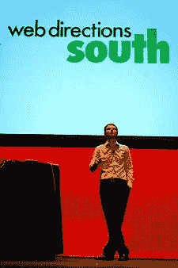

# WDS07 额外功能:安迪·克拉克和卡梅隆·亚当斯

> 原文：<https://www.sitepoint.com/wds07-bonus-feature-andy-clarke-cameron-adams/>

昨天在悉尼举行的 2007 年 Web Directions South 大会上，我采访了 SitePoint 的作者卡梅隆·亚当斯([themaninblue.com](http://themaninblue.com/))和著名设计师安迪·克拉克([stuffandnonsense.co.uk](http://www.stuffandnonsense.co.uk/))，他们两人都在会上发了言。

安迪谈到了漫画书的设计和布局(Matt Magain 的总结)，以及它可以教给我们的关于网页设计的一些经验。我问安迪关于漫画书排版的问题。

> 卡梅隆·亚当斯
> 
> “安迪，这也意味着你在提倡*更多地*使用漫画吗？”安迪·克拉克
> 
> “漫画桑斯是我绝对喜欢的字体之一，我期待它在几个项目中出现。”
> 
> 卡梅隆·亚当斯
> 
> “你先听到这里。”
> 
> 

Cameron 谈到，由于 JavaScript 库的成熟，设计师现在可以获得广泛的用户界面可能性，并使用它们来提供真正可定制的用户体验。

[听采访](https://media.sitepoint.com/presentations/2007-09-28_wds07andycam.mp3) (17'11，7.9MB MP3)
[看笔录](https://www.sitepoint.com/premium/library/)

标签: [wds07](http://technorati.com/tag/wds07)

## 分享这篇文章