# 用 Photoshop 创建 Web 2.0 效果，第 1 部分文章

> 原文：<https://www.sitepoint.com/web-2-0-effects-photoshop-1/>

与 Web 2.0 这个术语联系在一起的视觉风格越来越流行；放眼望去，公司网站、网络服务网站、电子商务网站，甚至个人博客都在使用干净、极简的设计和花哨的图形效果。如果你想赶时髦，这篇文章就是为你准备的！使用 Photoshop，我将向您展示如何使用非破坏性技术将 Web 2.0 图形的优点添加到您的站点设计中。它甚至可以让你的网站从无聊变成时尚！

我不会假设太多，如果你没有使用最新版本的 Photoshop 也没关系。如果你是一个 Photoshop 老手，毫无疑问，你会很高兴浏览前几个技巧，而我们涵盖了基础。但是如果 Photoshop 高手在这个过程中没有学到至少一些东西，我会感到惊讶。

哦，还有一件事——每当我提到可以使用快捷键的工具时，我都会在括号中标明快捷键。如果你是一个键盘迷，你会知道掌握这些快捷键是一个真正的节省时间。

那我们开始吧，好吗？

##### 创建简单渐变

Photoshop 中最容易实现的效果之一就是微妙的渐变。看看 Web 2.0 网站的任何组合，你会看到渐变被用作页面背景，在顶部横幅或标题区域的后面，在界面栏上，以不同的形状出现(见下面的星星点点)。

制作渐变效果最简单的方法之一是对现有图层应用图层样式。下面是创建一个有渐变的矩形的一系列快速步骤。

**1。**点击工具栏中的色标，为你的矩形设置一个基色，如图 1 所示，然后选择你想要使用的颜色。

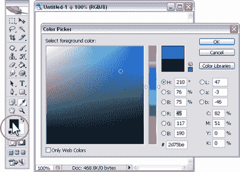
**2。**要创建一个矩形形状，选择矩形形状工具(键盘快捷键:U)并通过点击、拖动和释放在画布上绘制一个矩形，如图 2 所示。

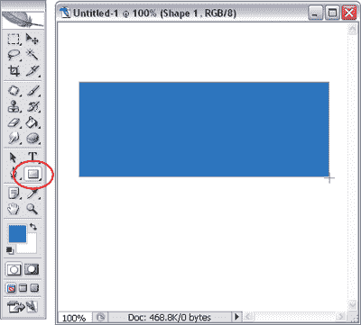
**3。在图层面板中，点击图层效果图标，选择渐变叠加，如图 3 所示。**

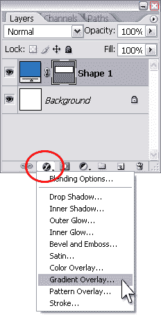
**4。**对于一个简单的渐变，改变混合模式为正片，不透明度降低到 40%左右。单击确定。(多重混合模式允许黑/白渐变(您可以在色标中看到)简单地加深现有颜色。降低不透明度可以防止颜色变得太暗。)

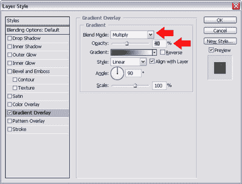
**5。**图 5 显示了矩形上完成的渐变效果。特别方便的是，您可以在任何时候通过双击图层面板中图层名称旁边的效果图标(下面圈起来的)来编辑效果。

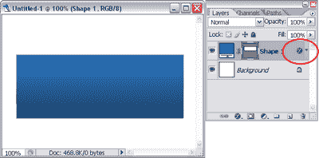

***变异***

*   在图层样式对话框中设置混合模式为屏幕。这将使基色变亮，而不是变暗。
*   单击“图层样式”对话框中的渐变色标以编辑渐变。拖移底部颜色滑块以调整渐变的褪色速度。
*   在“图层样式”对话框中，将混合模式设置为“正常”，然后单击渐变色标来编辑渐变。您可以选取一个预设渐变，或者编辑色标并将其添加到渐变编辑器的底部，以创建您自己的自定渐变。如果你设置混合模式为正常，自定义渐变会完全覆盖你的形状，所以你的矩形原来的颜色并不重要！
*   您可以将图层样式应用于任何图层，而不仅仅是矩形。这意味着您可以将此技术应用于圆角矩形、圆形、星形，您可以将渐变叠加应用于您在图层上创建的任何东西。

##### 创建背景渐变

如果你想应用一个渐变到背景层，这不允许层的效果？首先用你想要的底色填充背景层。然后，将您的前景色更改为您想要用于渐变的新颜色。选择渐变工具，它是油漆桶弹出菜单的一部分(键盘快捷键 G)。

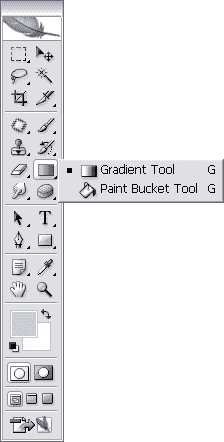

在选项栏中，选择前景到透明渐变。

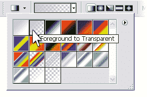

确保在图层面板中选择了背景图层。然后单击背景层顶部附近，并按住鼠标按钮。按住 Shift 键(这会将渐变效果限制在垂直轴上)，向下拖动，然后在您希望渐变结束的位置释放鼠标按钮。你的背景层现在已经应用了渐变！

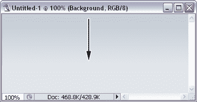

##### 创建条纹背景

另一个不错的 Web 2.0 效果是条纹背景的应用。与渐变类似，条纹背景可以应用于页面背景、页眉、横幅和形状。它们甚至可以与渐变相结合，产生令人惊叹的效果。

**1。首先，你需要一个条纹图案。创建一个大小仅为 4×4 像素的新文档。将前景色设置为黑色，并选择铅笔工具，如图 9 所示。**

**2。**放大，如果需要，画一条对角线，如图 10 所示。

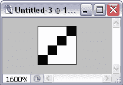
**3。**键入 Ctrl-A (PC)或 Command-A (Mac)来选择整个画布。转到编辑>定义图案。在对话框中，输入画笔的名称(例如“对角线图案”)，然后单击 OK(参见图 10)。如果您愿意，可以关闭模式文档而不保存，因为您不再需要它了。

**4。**创建另一个矩形，点击图层样式图标，选择图案叠加。改变混合模式为乘，不透明度为 30%，并选择你的新的对角线模式从模式下拉。如果您的设置窗口如图 12 所示，那么您可以开始了——单击 OK。

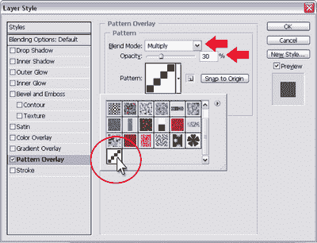
**5。**如图 13 所示，一个条纹图案现在被应用到矩形上。

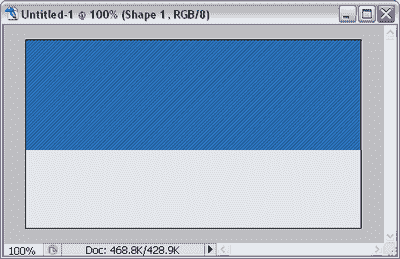

对于一些额外的 Web 2.0 的好处，应用渐变叠加层效果:

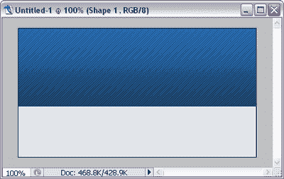

##### 透明层

创建稍微透明的图层非常容易。只需在图层面板中选择想要透明的图层，然后通过更改百分比或拖动滑块来更改不透明度。在下面的图 15 中，白色的矩形被制作成稍微透明的，这样你就可以看到它后面的条纹渐变背景——非常适合，比如说，一个导航栏。

##### 微妙的反射

现在你已经有了一些很棒的背景，让我们把一些 Web 2.0 的效果应用到文本和对象上。你可能经常看到的效果之一是标准反射。这种效果可以通过文本层、形状层或图形层来创建。

**1。第一步是复制你的图层。拖动图层面板中的图层，将其放在面板底部的“新建图层”图标上(如图 16 所示)。**

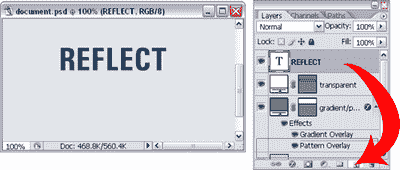
**2。**这创建了一个层的副本，你现在可以将它上下翻转。选择复制的层，键入 Ctrl-T(Mac 上的 Command-T)以“变换”形状。您将看到一个边界框，其角部和侧面带有控制柄，出现在图层周围。单击顶部的手柄，按住 Shift 键，向下拖动以垂直翻转文本，如图 17 所示。

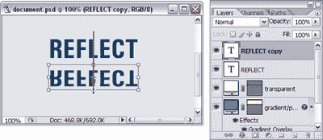
**3。**在边界框内双击提交变换，然后切换到移动工具(V ),将图层向上移动到原始图层的底部。稍微降低不透明度，就像我在图 18 中做的那样。

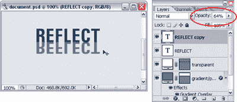
**4。**添加另一个层次的视觉趣味，添加图层蒙版淡出倒影的底部部分。单击图层面板底部的添加图层蒙版图标。如图 19 所示，您将看到一个链接的空白方块附加到您的层。

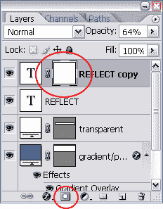
**5。**设置前景色为黑色，选择渐变工具(G)，在选项栏中选择前景色为透明。

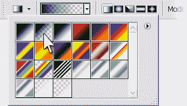
**6。**点击图层面板中的白色蒙版缩略图，确保你要编辑它，然后点击你的反射图层底部下方一点。按住 Shift 键，并向上拖动，直到您差不多在您的层的顶部。释放你的鼠标按钮，你会看到一个渐变已经在蒙版层上完成，如图 21 所示。蒙版的黑色区域隐藏了层，所以渐变有效地淡出了你的反射层。

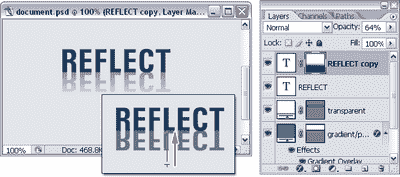
*提示:你可以添加一个图层蒙版到任何一个图层来获得类似的褪色效果。或者，添加图层蒙版，然后使用绘画或形状工具隐藏图层的一部分——黑色将完全隐藏您绘制的区域，不同的灰色阴影将提供不同程度的不透明度！*

##### 玻璃状物体

玻璃状的按钮和条是 Web 2.0 网站给设计增加视觉效果的另一种常见方式。让我们从一个简单的玻璃棒开始。

**1。**从一个现有的矩形形状开始，作为你的酒吧的底部。这可以是一个纯色，但为了增加深度，你可能想从一个渐变条开始，甚至是一个稍微透明的条，就像我们之前创建的渐变矩形。

**2。**画一个比基础形状稍短的白色矩形。这是你的高光层。

**3。**添加图层蒙版，淡出高光图层的底部，降低不透明度，实现玻璃般的高光效果:

创建一个基本的玻璃状按钮或形状涉及一个类似的过程-从渐变形状层开始，添加一个略小的适当形状的白色高光层，然后用图层蒙版淡出高光层。如果你想一步一步地了解如何做到这一点，请查看我的书、[、*和 Photoshop 选集*、](https://www.sitepoint.com/books/photoshop1/)中的摘录[，其中使用了几个不同的例子来描述如何创建玻璃按钮。](https://www.sitepoint.com/web-domination-photoshop/)

##### 摘要

在这篇文章中，我们学习了一些创建 Web 2.0 视觉效果的 Photoshop 技巧。

正如你所看到的，为你自己的站点创建这些效果是非常容易的！在下一篇文章中，我们将增加一些新的技术，这样你就可以确保你的网站设计既现代又流畅。

我还创建了一个[主文档，你可以下载](https://www.sitepoint.com/examples/photoshop/document.zip)，它包含了所有这些效果，这样你就可以挑选图层和图层样式，以便更好地理解它们是如何完成的。

## 分享这篇文章