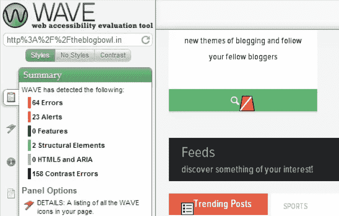
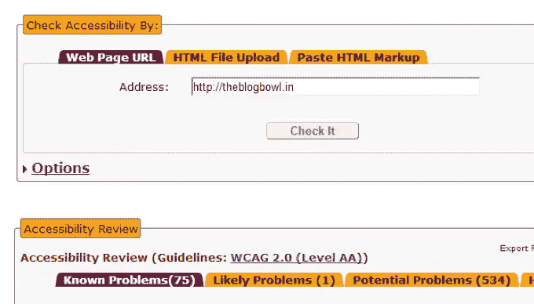
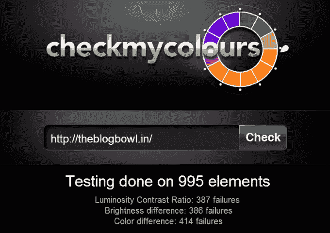
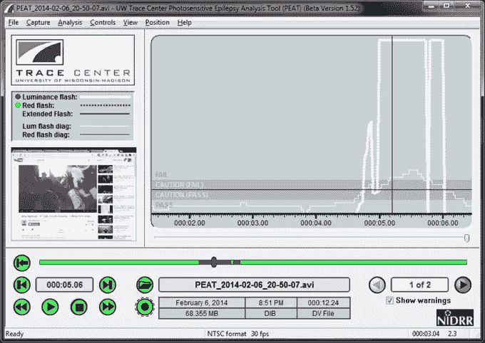
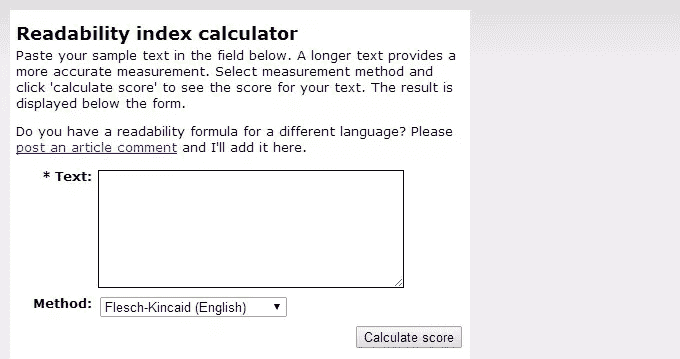

# 网页可访问性:工具和考虑

> 原文：<https://www.sitepoint.com/web-accessibility-tools-considerations/>

网页可访问性是让所有能力的人都能访问你的网站的过程。这是关于给每个人平等的访问和机会，从而允许尽可能多的人无障碍地访问您的功能。考虑到遵守 W3C 制定的可访问性标准的潜在法律义务，web 开发人员正在认真对待这个问题。

网上有很多评估工具可以测试你的网站的可访问性。这些工具自动化了发现潜在错误的过程。然而，这些工具通常是一个指南，只要有可能，您应该总是手动检查结果。

在这篇综述中，我们将讨论一些工具以及它们可能有用的场景。在我们继续之前，您可以[查看 W3C](https://www.w3.org/WAI/ER/tools/complete.html) 维护的完整工具列表。

## 常见错误

在我们进入评估工具之前，让我们讨论一下在许多网站上出现的潜在的可访问性问题。了解这些错误将使您能够更好地判断下面列出的工具的结果。

### 图像的替代文本

所有图像都必须有替换文本，该文本放在`img`标签的`alt`属性中。这是屏幕阅读器在使用辅助技术时向盲人用户读出的。

### 正确的 HTML 标记

随着 CSS 变得非常流行，有一种趋势是使用 CSS 而不是定制的 HTML 标签来实现某些样式(比如避免使用`h1`到`h6`并且完全使用 CSS 类来实现它们的样式)。web 开发人员必须始终尝试恰当地使用内置标签，因为辅助技术很容易解释网页的内容。

### 代替文本的图像

现在这已经不是什么问题了，但是开发人员有时会用图像来代替文本。尽管应该避免这种情况，但如果没有其他选择，就必须提供适当的`alt`文本。

### 跳过链接

对于只使用键盘进行导航的用户来说，在进入主要内容之前浏览整个菜单可能会变得很困难。因此，应该提供链接来跳转到页面顶部的主要内容或导航(否则是不可见的)。

### 指定一种语言

虽然这听起来可能微不足道，但是指定一种语言可以使屏幕阅读器以正确的发音读出文本。您可以使用`<html>`元素上的`lang`属性指定一种语言。

### ARIA 合规性:

最后，您必须确保您的标记符合 ARIA。它定义了一组可以与元素相关联的属性，以帮助辅助技术以正确的方式解释标记。这些属性告诉屏幕阅读器等辅助技术使用这些标签的实际目的。例如，你可以通过给菜单的`ul`或`div`分配一个`role=menu`来告诉屏幕阅读器一个元素是菜单的一部分。要进一步了解它的用法，你可以看看 W3C 的 ARIA 指南集。

## 手动检查和屏幕阅读器

您可以执行的最简单的检查是没有屏幕阅读器的手动检查。首先，您可以尝试通过跳转页面来浏览网页。在这个过程中，如果跳过了某些不应该跳过的元素，您应该通过使用适当的标记或添加 ARIA 角色或`tabindex`属性来纠正它们。

除此之外，你可以安装一个免费的屏幕阅读器(像 [NVDA](http://www.nvaccess.org/) )。遮住你的屏幕，尝试只使用键盘和屏幕阅读器的输出来浏览页面，会让你体会到对于一个有视觉障碍的用户来说有多难。

或者，你可以安装 Firefox 屏幕阅读器模拟器 [FANGS](https://addons.mozilla.org/en-US/firefox/addon/fangs-screen-reader-emulator/) 。这个附加组件创建一个网页的文本表示，以与其他屏幕阅读器相同的方式读出它。

## 网页可及性评估工具(WAVE)

WebAIM 的 WAVE 是比较知名的工具之一。使用这个，你输入你想要评估的 URL，它会在网页上给你一个可视的覆盖，任何错误都显示在侧边栏中。

覆盖图采用颜色编码，因此您可以识别错误(红色)、警报(黄色)等。它还可以选择查看没有样式的页面，并包括一个对比度检查器。

## IDI 网页可访问性检查器

由多伦多大学开发的 [IDI 网页可访问性检查器](http://achecker.ca/checker/)提供了我在上面“常见错误”中提到的基本检查。类似于 HTML 验证器，您可以提供 URL、上传 HTML 文件或直接粘贴您的标记。报告的常见错误包括缺少可选文字、没有标签的输入和颜色对比错误。您也可以在设置中启用 HTML 和 CSS 的有效性检查！

## 检查我的颜色

值得注意的是，无障碍测试的目标不仅仅是盲人，还有其他视觉障碍的人，如色盲和低能见度。这意味着在设计网页时，亮度和对比度是重要的考虑因素。文本内容需要 4.5:1 的对比度，标题(或大文本)需要 3:1 的对比度。

[检查我的颜色](http://www.checkmycolours.com/)通过分析页面上的每个元素，计算它们的对比度来帮助你。它让您知道哪些元素没有通过对比测试，并生成一个完整的报告以供审查。

## 光敏癫痫分析工具(PEAT)

如果网页的闪烁率很高，某些患有癫痫症的用户容易受到攻击。PEAT 是一款 WIndows 桌面软件，它会检查网页是否存在漏洞。PEAT 在您使用屏幕时捕获您的屏幕，并对捕获的数据执行某些测试，以生成有关任何风险的报告。

## 可读性指数计算器

除了网页可访问性的技术方面，[可读性指数计算器](http://www.standards-schmandards.com/exhibits/rix/index.php)还通过计算音节、单词和句子来分析内容的可读性。然后，它对收集的数据进行标准测试，如[Flesch reading easy test](https://en.wikipedia.org/wiki/Flesch%E2%80%93Kincaid_readability_tests)，以分析其可读性。

## 结论

尽管我们已经介绍了一些可用的 web 可访问性评估工具，但是还有更多工具有待探索。为了进一步阅读，您可以查看 W3C 维护的此类工具的完整列表。如果你尝试过其他工具，请在评论中告诉我们。

## 分享这篇文章