# 充分利用 SQL Server 的 Web 助手向导

> 原文：<https://www.sitepoint.com/web-assistant-wizard-2/>

**在我之前的文章[用 SQL Server 的 Web 助手](https://www.sitepoint.com/article/servers-web-assistant-wizard)发布动态数据中，您了解到在互联网上共享您的数据库数据不需要任何 HTML 技能。**

该向导可以处理所有的格式设置，并逐步引导您创建网页。此外，可以将 SQL Server 的 Web 助手向导指向包含要检索或监视的数据的表。因此，也不需要查询技能。

事实上，Web 助手向导的主要优点之一是，您可以在线发布数据库数据，而无需任何 Web 开发或查询构建专业知识。该向导非常简单，甚至可以帮助初级程序员。但是正如我们将在本文中看到的，当您需要使用向导中更高级的选项时，HTML 和 SQL 技能非常有用。

在本文中，我将解释 Web 助手向导的两个高级选项:

1.  调整 HTML 输出

3.  调整 SQL 查询

##### 为什么使用高级选项？

乍一看，Web 助手向导可以处理您的所有工作。那么，为什么会有人想使用它的高级选项呢？

Web 助手向导可以用简单的数据自动创建一个布局简单的 HTML 页面。这就是它的能力停止的地方。理论上，这可能没问题，但在现实世界中，您会发现需要在应用程序中使用不同的布局或特定的数据子集。例如，您可能只想使用在特定时期由特定员工处理的订单数据。通过该向导，您可以更深入地研究该工具可以生成的标准布局和表查询。

##### 调整 HTML 输出

向导的默认选项将生成一个类似如下的 HTML 页面:

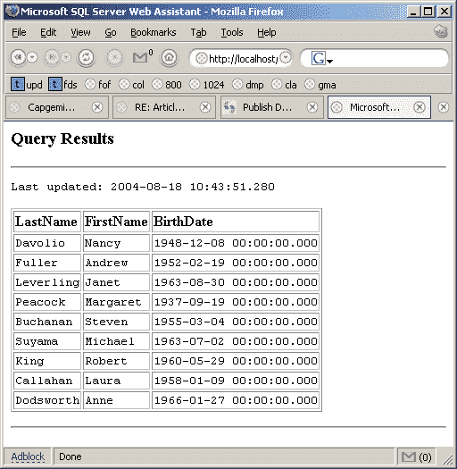

该向导允许您更改一些设置。为了举例，我们假设您已经遵循了我的原始文章中的前六个步骤，即[使用 SQL Server 的 Web 助手向导](https://www.sitepoint.com/article/servers-web-assistant-wizard)发布动态数据。

通过这个过程，我们检查了先决条件、要发布的数据、调度机制以及向导应该监视的更改。在那篇文章的[步骤 7 中，我们观察了 SQL Server 应该生成来反映您的数据的 HTML 页面。](https://www.sitepoint.com/servers-web-assistant-wizard/)

在步骤 7 中，以下屏幕标志着布局配置的开始:


我将在本文后面讨论模板功能，所以现在选择“是的，帮我格式化网页”。您可以保留字符集选项的默认值，除非您使用的是非标准字符，如中文或东欧文字。当你点击下一步，你会到达标题布局选项。

##### 定义标题布局

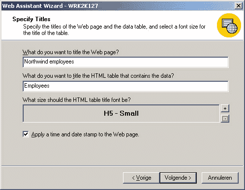

如果您按照上面的示例填写文本，在您的网页上,“Northwind Employees”字样将出现在浏览器的标题栏中。表格前面的标题文本将包含单词“雇员”。尽管我不喜欢大字母，我们还是决定表格标题应该是“H1-最大的”。

*   ##### 格式化表格

    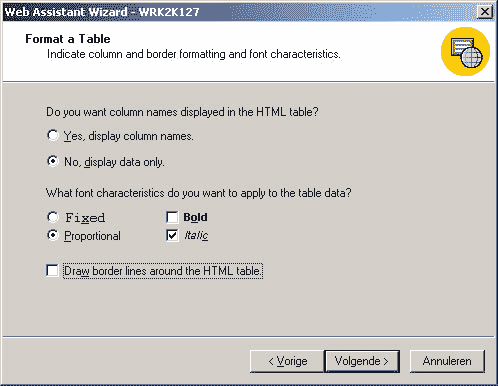

    SQL Server 将在表中发布数据。在此屏幕中，您可以决定是否要显示列名，是否要为表格文本添加额外的字体选项(可能包括:固定或比例、粗体、斜体)，以及是否要在每个表格单元格周围显示边框。

    在这个例子中，我选择改变所有默认选项。

    *   ##### 添加超链接

    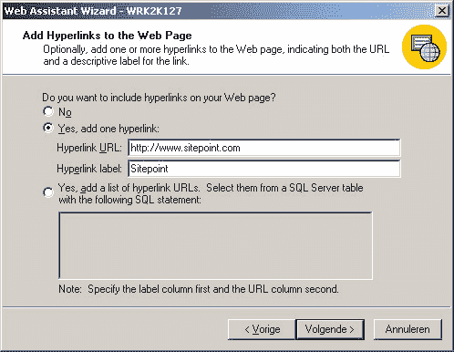

    这一步在这个过程中很不合适。它实际上与更改数据的布局无关，但使您能够向页面添加一个或多个超链接。大多数时候，你会在这一点上添加一个到你公司主页的链接。

    添加多个链接是可能的，但老实说，微软为此提供的解决方案确实有些牵强。您必须预定义并填写一个单独的表，您可以在底部字段中使用类似于“SELECT label，url FROM hyperlinks”的查询来访问该表。

    在本例中，我只是填写了 SitePoint URL 和一个标签描述，然后单击 Next。

    *   ##### 限制行数

    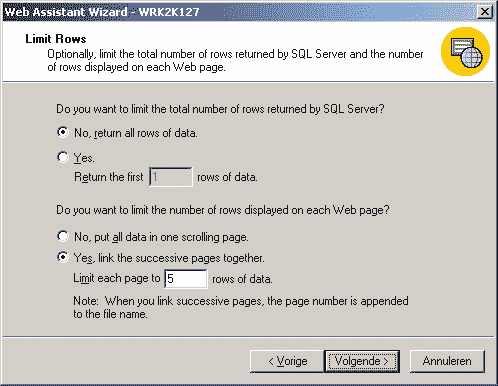

    数据库表可以由数千行组成。通常你最不想做的事情就是发布包含大量信息的无休止滚动的网页。在这一步中，Web 助手向导为您提供了将数据分成多个页面的可能性。此外，向导将自动添加一个链接到下一页的超链接。

    *   ##### 检查结果

    这是最后一步。在确认页面上单击“完成”,让向导生成 HTML 文件。如果导航到该文件，您将看到以下结果:

    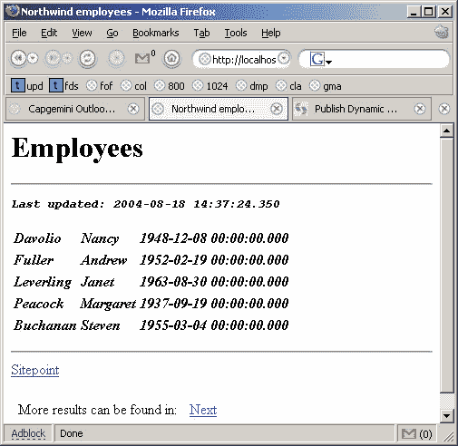

    在这里，您可以看到我们所做的所有更改:

    *   浏览器标题栏中的文本“Northwind Employees”
    *   表格上方的大号“员工”标题文本
    *   前五行以成比例的粗体斜体字体显示
    *   指向 SitePoint 的链接
    *   对下一行的引用

    ##### 使用模板调整 HTML 输出

    对于熟练的 HTML 开发人员来说，这种方法可能优于前一种方法。

    让我们再来看看“格式化网页”屏幕。您会注意到“不，使用模板”选项:

    

    如果您选择此选项，Web 助手向导将让您导航到应该由您预定义的模板。这很容易做到。您唯一需要记住的是，您必须告诉向导在哪里插入数据库数据。向导将查找三个标签:

    1.  `<%begindetail%>`

    这个标签标志着记录的开始。您在此标签后包含的所有内容将在每条记录中重复。

    *   `<%insert_data_here%>`

此标签标记记录中的字段值。您必须为结果集中的所有字段重复标记。

*   `<%enddetail%>`

这个标签标志着记录的结束。

一个示例模板将阐明这一点:

```
<html>  

<head><style>h1 {font: bold 15px Verdana} li {font: 12px Verdana}</style></head>  

<body>  

<h1>Employees</h1>  

<ol>  

<%begindetail%>  

<li><%insert_data_here%>, <%insert_data_here%></li>  

<%enddetail%>  

</ol>  

</body>  

</html>
```

将此代码复制并粘贴到一个文本文件中，并将其保存为 northwind.tpl。现在，通过选中“否，使用模板”恢复“格式化网页”屏幕，然后选择刚刚保存到磁盘的 northwind.tpl 文件。

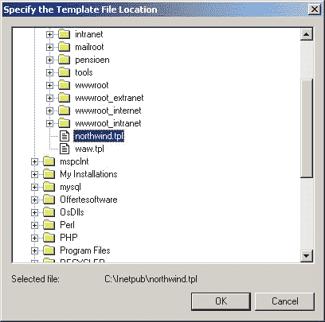

选择“下一步”、“下一步”和“完成”,结束这一切。如果您现在在浏览器中重新加载 HTML 文件，您将看到以下结果:

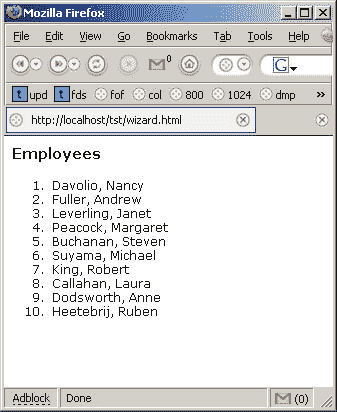

您可以尝试使用模板来获得您想要的布局结果。考虑到调整和保存模板不足以看到布局的变化。底层 HTML 文件只会在数据改变时改变。

##### 调整 SQL 查询

如果你还没有任何 SQL 查询知识，Web 助手向导非常方便。但是，如果您了解 SQL，向导的功能可能会增强十倍。

让我们回到我最初文章的第 4 步，在这一步中，我们选择了 SQL Server 应该为您发布的数据。我们选择了第一个也是最简单的选项:我们只是将 SQL Server 指向正确的表，并让它为我们做艰苦的工作。但是如果您想对数据源进行更多的操作，就需要使用存储过程或 Transact-SQL 语句。

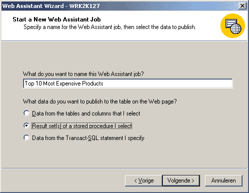

解释如何创建存储过程或者结构化查询语言的语法如何工作，远远超出了本文的范围。请参考大卫·克拉克的[PHP 和微软 SQL Server 上的存储过程](https://www.sitepoint.com/article/php-microsoft-sql-server)来了解更多关于此事的信息。

如果您在此选择“我选择的存储过程的结果集”，向导将让您选择一个预定义的存储过程作为数据源。

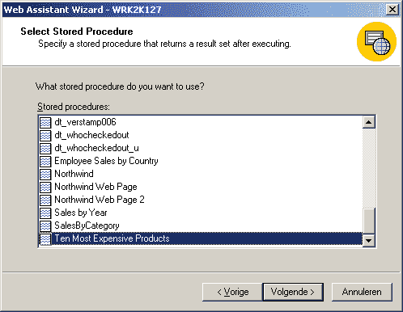

Northwind 数据库由一些示例存储过程组成。例如，选择“十种最贵的产品”,跟着屏幕流程看到底。您的 HTML 结果应该如下表所示。

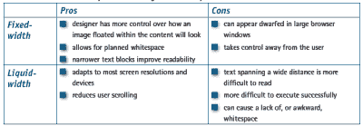

如果选择“我选择的 Transact-SQL 语句中的数据”，向导将显示一个文本区域，您可以在其中键入自己的 t-SQL 查询。

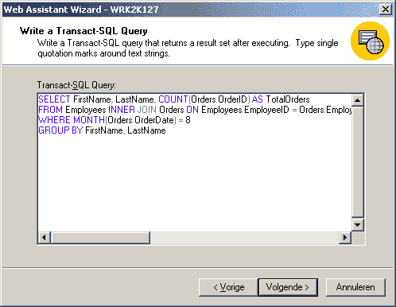

如果您在此屏幕中输入以下示例代码，向导将为您生成一个网页，其中包含每位 Northwind 员工在八月份发货的订单的概述。

```
SELECT FirstName, LastName, COUNT(Orders.OrderID) AS TotalOrders   

FROM Employees INNER JOIN Orders ON Employees.EmployeeID = Orders.EmployeeID   

WHERE MONTH(Orders.OrderDate) = 8   

GROUP BY FirstName, LastName
```


##### 包扎

如果你是一个熟练的 HTML 和/或 SQL 程序员，调整 SQL Server Web 助手向导结果的可能性是极高的。在本文中，我们研究了向导提供的两个更高级的选项。

首先，我们研究了如何影响结果页面的布局。我们可以利用向导的内置选项，比如改变字体特征，但是，最好是使用我们自己预定义的 HTML 模板。

接下来，我们看一下如何操作 SQL 的源数据来发布更复杂的信息。“Web 助手向导”为您提供了两种高级方法来解决单个表的问题。让 SQL Server 使用任何预定义的存储过程，或者直接在向导中输入您自己的 T-SQL 查询。

使用这些选项中的任何一个，您都可以使 Web 助手向导变得更加强大。祝你好运！

## 分享这篇文章