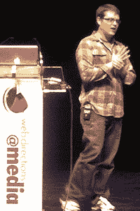
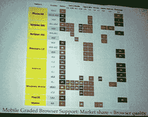

# Web 方向反思，第 2 部分:John Resig 和 Jonathan Stark 的移动开发

> 原文：<https://www.sitepoint.com/web-directions-reflections-part-2-mobile-development-with-john-resig-and-jonathan-stark/>

在上个月的 [Web Directions @media](http://atmedia.webdirections.org/) 上，最热门的话题是移动网络。几乎每个演讲者都有话要说，但其中最引人注目的是约翰·瑞西格和乔纳森·斯塔克。

## John Resig:测试移动网络应用

**jQuery 拯救了你的理智吗？这是该感谢的人。**

jQuery 作者和 JavaScript 大师 John Resig 花了一个小时讨论他在移动平台开发中的经历、快乐和挫折。好消息是，移动浏览器正在成为可行的平台——它们还没有出现，但应该会在 3 年内出现。

John 希望构建一个支持移动设备的 jQuery 版本，该版本支持过去 3 年中发布的大多数流行设备。注意，不会有专门针对手机的 jQuery 版本；这将是一个单一的统一库，支持所有流行的桌面和移动浏览器。

因此，有必要获取平台使用统计数据。这比约翰预想的要困难得多:

*   许多移动供应商和数据运营商对使用统计数据讳莫如深。
*   大多数开发者专注于为自己的设备(通常是 iPhone)开发软件，很少考虑其他平台。因此，Web 统计数据受可用应用程序的影响，而非平台本身。

> 跨浏览器移动 web 开发太疯狂了！

**你认为测试半打桌面浏览器很难！…**

作为一个粗略的指南，移动市场与桌面市场相反，Opera 在顶部，Firefox 和 IE 在底部。不幸的是，如果你讨厌桌面浏览器测试，你肯定不会喜欢开发移动 web 应用程序。浏览器的数量要多得多，功能也千差万别，测试过程也很复杂。约翰的浏览器测试网格很吓人！

移动模拟器可以帮助…当他们可用的时候。不幸的是，模拟器的可用性和质量差异很大。其中最棒的是 [Opera 迷你/移动模拟器](http://www.opera.com/developer/tools/)和用[蜻蜓](https://www.sitepoint.com/opera-dragonfly-open-source/)进行远程调试。

然而，John 指出，很少有模拟器是准确的，它们不能代替在真实的手机上测试您的应用程序。这里是它变得昂贵的地方:购买一系列 A 级手机，如 iPhone，iPad，诺基亚 N97，Palm Pre 和 Androids，大约需要 2500 美元。如果你想测试 B 级浏览器，这个成本会翻倍。

## 乔纳森·斯塔克:构建移动应用

Jonathan 精彩的演讲从提醒我们移动市场已经变得多么巨大开始:

*   大约有 46 亿手机用户
*   智能手机约占市场的 15%
*   56%的公共 wi-fi 连接来自移动设备

在构建移动应用程序时，Jonathan 建议开发人员在选择技术之前仔细考虑他们的目标和目标市场:

1.  原生应用程序:最好的外观和功能，但受到碎片化的困扰——每个移动设备都需要一个单独的应用程序。
2.  Web 应用程序:最容易测试、分发和支持，但受到限制，并且(目前)无法访问手机硬件或操作系统，如通讯录或摄像头。
3.  命令行应用程序(SMS):提供更容易的开发和支付选项，但用户更难发现。

然而，Jonathan 认为 web 应用程序是最具成本效益、最标准化和最容易分发的。像 jQTouch 这样的库(Jonathan 现在维护的库)使得这个过程变得简单多了，他开始创建一个具有离线功能的 iPhone 应用程序。20 分钟的演示令人印象深刻。

最后，乔纳森称赞了 PhoneGap，这是一个开源项目，允许开发者使用网络技术为多种设备构建本地应用。它可以提供本机和 web 应用程序世界的优势。

乔纳森的幻灯片可以在网上找到，你也可以阅读他在 T2 的采访。

在接下来的网络方向反思文章中:布鲁斯·劳森说不出话来，雷米·夏普晚餐吃 HTML5

## 分享这篇文章