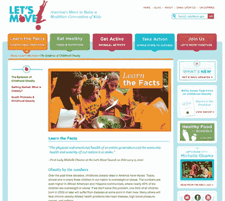
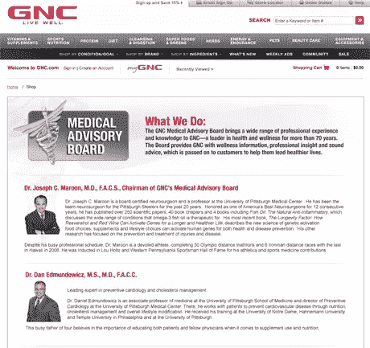
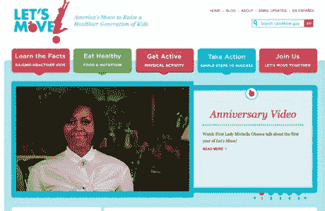
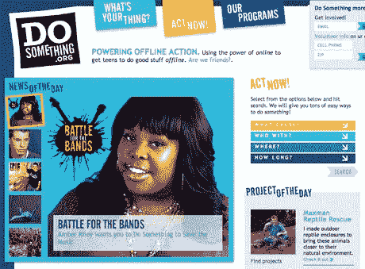

# 网络说服——权力和责任

> 原文：<https://www.sitepoint.com/web-persuasion-power-and-responsibility/>

不劝人的网站是失败的。你的网站不能销售护肤品，说服人们全球变暖的存在，赢得人们对你的育儿方法的信任，或者鼓励女性不使用一些说服技巧就去做乳房 x 光检查。

既然它如此普遍，我们应该看看我们可用的不同的说服技巧。

## 诉诸智力和理性

### 说服的主要途径

当你写的内容是你想让人们仔细阅读并认真思考的时候，你是在依赖一条说服的核心路线。像这样的网站使用统计数据、理性、逻辑论证、专家证明和信息图表。

严重依赖中央路线来说服的网站的一些例子是 LetsMove.gov 的 T1 和 SkepticalScience.com 的 T3。

诉诸事实，努力说服儿童活动

可信的来源更有可能在信息呈现后立即导致态度或行为的改变。这就是为什么 [DermaDoctor](http://www.dermadoctor.com/article_Acne--Topical-Therapies_264.html "DermaDoctor uses articles to educate") 提供了几十篇非常详细和信息丰富的文章，但却充满了他们产品的链接，提供了根据信息采取行动的机会。

一篇有价值的文章中的植入式广告链接

#### 睡眠者效应

不幸的是，随着时间的推移，*少于*可信来源的声明实际上会增加说服力，而可信来源的效力会降低。这被称为睡眠者效应，它发生在阅读内容的人将其从原始来源中分离出来的时候。随着时间的推移，他们忘记了它是否值得信任，而只是记住了大概的内容。

这就很容易理解，为什么说服比高质量的信息更重要。

## 诉诸情感和本能

### 说服的外围路线

GoDaddy 没有使用丹尼卡·帕翠克和吉利安·迈克尔斯的视频和照片，因为他们是域名服务专家。鲍伯·帕森斯知道在网站上放上他们的头像会更有说服力，因为人们会根据有影响力的线索做出决定，而这些线索实际上并不相关。这就是所谓的外围说服路线。

### 可靠性

仅仅利用一个可信人物的存在就能增加信任度和说服力。对不同的受众来说，可信度有不同的含义——可以是名人、专业形象(例如，穿着实验服的人)、一定的教育水平等。

下面的每个网站对什么是可信度做出了不同的假设:

#### GNC

这些医生背书会说服你从 GNC 购买吗？

#### 积极主动的

谁会比名人更关心粉刺呢？

#### 我们走吧

LetsMove.gov 不仅仅使用中心路线来说服

### 吸引力、可爱度和相似度

几项研究发现，有吸引力的人比不太有吸引力的人更能成功地影响他人的态度和行为。那些被认为讨人喜欢、与我们相似的人也是如此。我们通过态度、背景、价值观和外表来衡量相似性。

#### 梯子

TheLadders.com 在它的主页上使用可信度，但它也以有吸引力的、可爱的、专业的个人为主导，这些个人可能看起来与阶梯的目标受众相似。即使这些人不是真正的员工，他们也让公司看起来平易近人，充满爱心。当然，在我们为他们的服务付费之前，我们不知道这些声明是否真实。

这些友好、迷人的人迫不及待地想帮助你！

#### Chantix

伐尼克兰是一种用于戒烟的药物。他们没有以吸烟危害的事实和数据为导向，而是创建了一个使用非常有效的视频故事的网站。这些故事是由不同的人讲述的，这些人无疑是根据他们与伐尼克兰目标受众不同部分的相似性而选择的。

Chantix 使用观众可以理解的视频故事

### 生动和恐惧

生动的、有时会引起恐惧的图像或文字非常有说服力，尤其是在信息被消费后，配上清晰的行动。

考虑一下[不加糖的真相](http://www.thetruth.com "The Truth uses vivid imagery")运动，它清楚地描绘了大量吸烟的最坏结果。他们没有采取明确的行动，让人们在看完这些令人不安的图片后可以采取这些行动，而这些行动可以最大化这种技术的有效性。

生动的图像诱发与吸烟相关的恐惧。

## 负责任的劝说

你可能已经注意到，说服几乎总是包括一些来自中心和外围路线的策略。事实上，最成功的网站将所有这些原则结合在一起，真正产生影响。

考虑一下[DoSomething.org](http://www.dosomething.org)，它结合了大量相当有条理且有帮助的信息、可爱度/相似度、生动的意象、清晰可操作的项目、名人代言和社会影响力。

上述许多技术都包含在 DoSomething.org 网站中

“说服”这个词可以带着包袱而来，是操纵的代名词。这就是为什么了解我们的网站可能如何影响他人是很重要的，这样我们就可以做出负责任的、消息灵通的决定，如何最好地利用这些技术。

## 分享这篇文章