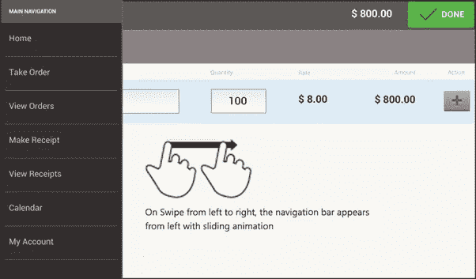
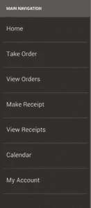
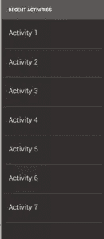

# 触摸手势的网络原型

> 原文：<https://www.sitepoint.com/web-prototyping-for-touch-gestures/>

许多网页设计师的工作过程涉及使用线框，一个静态的页面布局轮廓，可以填充设计元素，也许是从 Photshop comp 中提取的。

然而，开发人员需要构建静态线框中没有的功能。web 原型更像是一个工作模型，允许开发人员试验 web 页面上的工作方式。

在本文中，您将学习如何使用简单易用的 HTML、CSS 和 jQuery 创建一个带有触摸手势的 web 原型。

## 触摸原型制作

在最近的一个项目中，我想加入一个设备，允许适当的屏幕响应触摸手势。我设计了一个静态线框，然后想建立一个丰富的 web 原型，在平板设备上运行，向利益相关者演示。

考虑到它只是一个原型，不会用于实际开发，并且鉴于我对编程的了解有限(这是设计师的一个常见问题)，我正在寻找一个简单的 JavaScript 框架，允许滑动手势在移动浏览器上工作，特别是平板电脑和 iPads。

主要要求是当用户从左向右滑动手指时，用滑动动画显示主导航栏。我开始谷歌，尝试了从 jQuery mobile 到 hammer.js 的各种框架，我尝试的所有框架要么太复杂无法使用，要么在移动浏览器上响应不太快。

最后，我尝试了另一个名为 wipetouch.js 的框架，它以我想要的方式工作。它非常简单易用，滑动手势在 iOS 和 Android 等平台上非常灵敏。

注意:这个演示主要是为 iPad 和平板电脑设计的，但它也能在桌面浏览器上运行良好。对于桌面，用户可以滑动鼠标指针来代替滑动。要查看结果，请在 iPad 或 Android 平板电脑上打开链接，然后从左到右、从右到左和从上到下滑动手指。

[观看演示](https://blogs.sitepointstatic.com/examples/web-prototyping-for-touch-gestures/index.html)



### 用于本练习的文件

*   html 的 index.html
*   样式化的 style.css
*   JavaScript 的 common.js
*   jquery . wipe touch . js–用于滑动手势的框架
*   并链接到 jQuery 文件

### 本练习中使用的图像

**从左向右滑动:**
用滑动动画显示左侧菜单栏



**从右向左滑动:**
用滑动动画显示右栏



**从上到下滑动:**
在这个例子中，我想使用向下滑动手势来添加产品，而不用点击+图标，因为滑动比点击小图标更容易、更快。

但是，由于这种触摸手势具有可发现性的问题，所以添加产品的图标在那里，以防用户不知道这种手势。


## 入门指南

**注意:**为了使文章简单明了，我将只解释在从左向右滑动 swipe 时用于滑动左侧菜单的代码。对于右侧和顶部的菜单，代码基本相同(在实际的演示源文件中提供)。

### 步骤 1–链接 JavaScript 和 jQuery 文件

首先，我们将在 HTML 页面中链接这个原型所需的 jQuery 文件和 wipetouch.js 框架。我们将使用 jQuery 显示滑动动画，使用 wipetouch.js 显示滑动手势。Common.js 是用于该赋值的 JavaScript 文件。

```
<script src="https://ajax.googleapis.com/ajax/libs/jquery/1.5/jquery.min.js"></script>

<script src="https://ajax.googleapis.com/ajax/libs/jqueryui/1.8/jquery-ui.min.js"></script>

<script src="jquery.wipetouch.js"></script>

<script src="common.js"></script>
```

文件名–index.html

下载 [wipetouch.js](http://wipetouch.codeplex.com/)

### 步骤 2–添加图像

在 HTML 中，我们将添加`left_menu.png`图像并给它一个 ID。我们将在 CSS 和 JS 文件中使用这个 ID。

```

```

文件名–index.html

### 步骤 3–CSS 代码

在 CSS 中，我们将图像放在页面上滑动动画开始的位置。

```
/* Set Position of Left bar */
#menuLeft {
    position:absolute;
    left:0;
    top:0px;
    z-index:99;
}
```

文件名–style . CSS

### 步骤 4–当页面加载时隐藏#menuLeft

```
$("#menuLeft").hide();
```

文件名–common . js

这里的`menuLeft`是应用于`left_menu.png`的 ID。

### 步骤 5–当用户从左向右滑动时，用滑动动画显示导航栏

```
wipeRight: function(result) {
    $("#menuLeft").show("slide", { direction: "left" }, 1000);
}
```

文件名–common . js

这里的`wipeRight`是当用户从左向右滑动手指时触发的来自 wipetouch.js 的函数。

在这个滑动动作中，我们显示了 menuLeft 图像，带有从左边滑动的动画。

### 第 6 步–滑动轻敲的图像

现在，当用户点击图片时，我们需要滑动相同的图片。

```
$("#menuLeft").click(function () {
    $("#menuLeft").hide("slide", { direction: "left" }, 1000);
});
```

在图像上点击，它滑回隐藏。

**注意:**为了让文章简单明了，我只解释了从左向右滑动左边菜单的代码。对于从右向左滑动和从上向下滑动，代码几乎相同，并在实际的演示源文件中给出。

[下载演示源文件](https://blogs.sitepointstatic.com/examples/web-prototyping-for-touch-gestures/WebPrototype_Using_TouchGestures.zip)

## 最后

毫无疑问，可用的原型工具将很快涵盖触摸手势，但现在这个解决方案做到了。我希望这个演示能为您提供一个良好的基础，让您使用简单的代码构建一个原型，在触摸设备上显示触摸手势和基本动画。

如果你有任何改进的建议，请告诉我。请在下面的评论区分享你的想法、观点和想法。

## 进一步阅读

[http://www.netcu.de/jquery-touchwipe-iphone-ipad-library](http://www.netcu.de/jquery-touchwipe-iphone-ipad-library)
使用 touchwipe.js 创建的另一个不错的演示程序，可以在滑动时播放幻灯片

[http://eightmedia.github.com/hammer.js/](http://eightmedia.github.com/hammer.js/)
另一个非常流行的移动设备 JS 框架

http://www.appliness.com/multitouch-with-hammer-js/
这是一个很好的演示程序，使用 hammer.js 来展示拖放

## 分享这篇文章