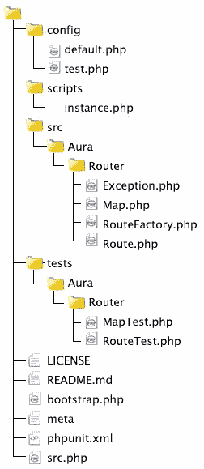

# 用 Aura 实现 PHP 中的 Web 路由。路由器

> 原文：<https://www.sitepoint.com/web-routing-in-php-with-aura-router/>

每个人都对 SEO 友好的 REST 风格的 URL 感兴趣。Apache 可以通过 mod_rewrite 规则进行 URL 路由，但是这很难并且容易出错。为什么不用 PHP 本身来处理路由呢？

Aura 是由 Paul M Jones 为您带来的一个独立的 PHP 5.4 库集合。在这里，我们将向您介绍 Aura.Router. Aura。Router 是一个简单易用的 PHP 网络路由库。在这篇文章中，你将学习如何在 PHP 的帮助下创建 SEO 友好的 REST 风格的 URL。

## 要求和安装

我们在掩护光环。需要 PHP 5.4+的路由器版本 1(最新版本 2 正在使用 PHP 5.3)。您可以通过多种方式安装它:

1.  从 GitHub 下载一个[焦油球](https://github.com/auraphp/Aura.Router/tarball/master)或[压缩文件](https://github.com/auraphp/Aura.Router/zipball/master)。
2.  如果您使用的是 git，请通过命令行下载:

```
git clone https://github.com/auraphp/Aura.Router.git
```

一旦你下载了光环。路由器，您将看到一个目录，其文件结构如下:



所有的源文件都在`src`目录中，从那里开始遵循自动加载器的 [PSR-0 标准](https://github.com/php-fig/fig-standards/blob/master/accepted/PSR-0.md "fig-standards/accepted/PSR-0.md at master - php-fig/fig-standards - GitHub")。所有单元测试都驻留在`tests`目录中；您可以通过调用`tests`目录中的`phpunit`来运行测试(只要确保您安装了 PHPUnit)。

## 和 Aura 一起工作。路由器

需要在`.htaccess`中编写一组最小的 mod_rewrite 规则，将传入的请求指向单个入口点。

```
RewriteEngine On
RewriteRule ^$ index.php [QSA]
RewriteCond %{REQUEST_FILENAME} !-d
RewriteCond %{REQUEST_FILENAME} !-f
RewriteRule ^(.*)$ index.php/$1 [QSA,L]
```

上述规则检查现有的文件和目录，并将所有其他请求指向`index.php`。

或者，如果您使用 php 的内置服务器，您可以运行如下代码:

```
php -S localhost:8080 index.php
```

气场。路由器的`src/Aura/Router`文件夹中包含四个文件:`Map.php`、`Route.php`、`RouteFactory.php`和`Exception.php`。`RouteFactory`是创建新的`Route`对象的工厂类。`RouteFactory`包含一个`newInstance()`方法，它接受一个关联数组。这些值被传递给`Route`类的构造函数。

`Route`对象用名称、路径、参数、值等表示一条单独的路线。你永远不需要直接实例化一个`Route`；你应该用`RouteFactory`或者`Map`来代替。

`Route`和`RouteFactory`接受带有以下键的关联数组:

*   `name`–路线名称的字符串。
*   `path`–带有参数标记占位符的路径字符串。
*   `params`–将标记映射到 regex 子模式的参数数组。
*   `values`–如果找不到任何参数，则为参数的默认值数组。
*   `method`–HTTP 方法的字符串或数组；服务器`REQUEST_METHOD`必须匹配这些值中的一个。
*   `secure`–服务器是否必须使用 HTTPS 请求。
*   `routable`–如果为真，则可以匹配该路线；如果没有，它只能用于生成路径。
*   `is_match`–评估路线的可调用函数。
*   `generate`–生成路径的可调用函数。
*   `name_prefix`–名称的字符串前缀。
*   `path_prefix`–路径的字符串前缀。

不要太担心方法参数。我很快会给你看一些例子。

`Map`班是 URI 路线的集合点。`Map`的构造函数接受一个`RouteFactory`和一个附件组数组中的路由。这允许您分离路线的配置和构造。

你可以通过`add()`方法给一个`Map`对象添加单独的路线，或者使用`attach()`方法附加一系列路线。无论你用哪种方式添加一个路由，所有的路由规范都存储在`Map`对象的`definitions`属性中，这是一个数组。

只有当你调用`generate()`和`match()`方法时，对象才会被创建。创建对象的顺序就是定义对象的顺序。它不会为所有定义的路线创建所有的`Route`对象。如果路线名称相同，它将使用`Route`对象的`generate()`方法生成路线。`match()`方法同样适用。`match()`方法内部调用`Route`对象的`isMatch()`方法，以了解路线是否相同。如果有先前创建的路线，它将按顺序首先遍历它们。如果在创建的路线中没有找到，它将为剩余的路线创建`Route`对象并查看。理解`Map`类很简单，因为它只有 400 行注释代码。如需更多信息，请随意查看。

## 基本用法

创建一个`Map`对象的实例的最简单的方法是需要位于脚本目录中的文件`instance.php`。

```
<?php
$map = require "/path/to/Aura.Router/scripts/instance.php";
```

或者，您可以手动创建对象，这正是`instance.php`脚本所做的。

```
<?php
use AuraRouterMap;
use AuraRouterDefinitionFactory;
use AuraRouterRouteFactory;

$map = new Map(new DefinitionFactory(), new RouteFactory());
```

接下来，您希望使用 add()方法向对象添加路由。

```
<?php
// add a simple named route without params
$map->add("home", "/");

// add a simple unnamed route with params
$map->add(null, "/{:controller}/{:action}/{:id:(d+)}");

// add a complex named route
$map->add("read", "/blog/read/{:id}{:format}", [
    "params" => [
        "id" => "(d+)",
        "format" => "(..+)?"],
        "values" => [
            "controller" => "blog",
            "action" => "read",
            "format" => "html"
        ]
    ]);
```

`add()`方法接受路径名、路径和关联数组。正如我前面提到的，values 包含 params 数组的默认值。因此，在路由“read”的示例中，如果没有指定，您可以看到默认格式总是“html”。

你想知道为什么我们需要一个默认格式吗？对于类似 REST 的应用程序，控制器和动作是相同的。接受格式的数据呈现方式不同。这样我们就不需要从一个动作到另一个动作重复相同的代码。例如，以 URIs 为例:

```
example.com/blog/read/42.html 
example.com/blog/read/42.json
example.com/blog/read/42.atom
```

我们需要输出的数据是相同的，但是格式不同，比如 json、html 和 atom。因此，如果没有出现任何格式，例如:

```
example.com/blog/read/42
```

那么它将假设请求是 HTML。

对于一个真正的 REST API 来说，文件扩展名不应该用来表示想要的格式。应该鼓励客户端使用 HTTP 的 Accept 请求头。要了解更多关于 REST 的信息，你可以阅读[REST——除了拼写它，你还能做什么？在 SitePoint 这里的](https://www.sitepoint.com/rest-can-you-do-more-than-spell-it-1/ "REST – Can You do More than Spell It? Part 1")系列，或者是那本 [REST API 设计规则手册](http://shop.oreilly.com/product/0636920021575.do "REST API Design Rulebook - O'Reilly Media") Mark Massé。

## 匹配路线

一旦添加了路线，您将需要识别用户请求了哪条路线。借助于`Map`对象的`match()`方法，这是可能的。在内部，`Map`对象正在调用`Route`对象的`isMatch()`方法。对于匹配方法，您需要传递路径和`$_SERVER`值，如下所示:

```
<?php
// get the route
$path = parse_url($_SERVER["REQUEST_URI"], PHP_URL_PATH);
$route = $map->match($path, $_SERVER);
```

您可能想知道为什么我们需要传递路径和服务器值。为什么不能气场。路由器从你传递的`$_SERVER`数组中获取路径本身？这是为了一些灵活性。

1.  `match()`方法不解析 URI，也不在内部使用`$_SERVER`。这是因为不同的系统可能具有表示该信息的不同方式(例如，通过 URI 对象或上下文对象)。只要能传递字符串路径和一个服务器数组，就可以使用 Aura。应用基础或框架中的路由器。
2.  有时 URI 可能像`http://example.com/base/path/controller/action/param`，这里我们有一个基本路径。因此，在我们寻找匹配方法之前，我们需要删除基本路径。
3.  在某些情况下，当你的服务器只能理解`/index.php/home/index`而不能理解`/home/index`时，你可能会从`REDIRECT_PATH_INFO`获得`PATH_INFO`。

如果找到匹配，该方法返回一个`Route`对象的实例，否则返回 false。获得对象后，您可以像这样访问其值:

```
<?php
$route->values["controller"];
$route->values["action"];
$route->values["id"];
```

从`$route->values`中我们知道我们想要调用什么样的渲染，什么样的类，什么样的方法来进行调度。

## 调度路线

如果找到了一条路线，那么创建控制器对象和适当的方法就很容易了。这个简单的例子改编自 Aura 文档:

```
<?php
if (!$route) {
    // no route object was returned, You can also set error controller depending on your logic
echo "No application route was found for that URI path.";
exit();
}

// does the route indicate a controller?
if (isset($route->values["controller"])) {
    // take the controller class directly from the route
    $controller = $route->values["controller"];
}
else {
    // use a default controller
    $controller = "Index";
}

// does the route indicate an action?
if (isset($route->values["action"])) {
// take the action method directly from the route
    $action = $route->values["action"];
}
else {
// use a default action
    $action = "index";
}

// instantiate the controller class
$page = new $controller();

// invoke the action method with the route values
echo $page->$action($route->values);
```

## 微框架路由

有时候不妨把 Aura 作为一个微框架。也可以将匿名函数分配给控制器:

```
<?php
$map->add("read", "/blog/read/{:id}{:format}", [
	"params" => [
		"id" => "(d+)",
		"format" => "(..+)?",
	],
	"values" => [
		"controller" => function ($args) {
			$id = (int) $args["id"];
			return "Reading blog ID {$id}";
		},
		"format" => ".html",
	],
));
```

当你使用光环的时候。路由器作为一个微框架，调度程序看起来类似于下图:

```
<?php
$params = $route->values;
$controller = $params["controller"];
unset($params["controller"]);
echo $controller($params);
```

## 生成路线路径

您可能希望在视图中生成路线。借助于 map 的`generate()`方法，这是可能的。map `generate()`方法内部调用`Route`对象的`generate()`方法。

```
<?php
// $path => "/blog/read/42.atom"
$path = $map->generate("read", [
    "id" => 42,
    "format" => ".atom"
]);

$href = htmlspecialchars($path, ENT_QUOTES, "UTF-8");
echo '<a href="' . $href . '">Atom feed for this blog entry</a>';
```

当然，输入“blog/read/42.atom”会更短，但是硬编码的路径不太灵活，使得更改路径更加困难。考虑下面的例子:

```
<?php
$map->add("read", "/blog/read/{:id}{:format}", [
    "params" => [
        "id" => "(d+)",
        "format" => "(..+)?"],
        "values" => [
            "controller" => "blog",
            "action" => "read",
           "format" => "html"
        ]
    ]);
```

想把`/blog/read/42.atom`改成`/article/view/42.atom`会怎么样？或者，当你的客户提到他们想转到多语言网站时会发生什么？如果你有硬编码的路径，你可能需要在很多地方修改它们。`generate()`方法总是很方便。

方法的第二个参数是一个关联数组。您可以传递带有 is_match 键的可调用函数，这些键可以返回 true 或 false。根据该值，当调用`match()`方法时，它将返回路线。例如:

```
<?php
$map->add("read", "/blog/read/{:id}{:format}", [
    "params" => [
        "id" => "(d+)",
        "format" => "(..+)?",
    ],
    "values" => [
        "controller" => "blog",
        "action" => "read",
        "id" => 1,
        "format" => ".html",
    ],
    "secure" => false,
    "method" => ["GET"],
    "routable" => true,
    "is_match" => function(array $server, ArrayObject $matches) {
        // disallow matching if referred from example.com
        if ($server["HTTP_REFERER"] == "http://example.com") {
            return false;
        }

        // add the referer from $server to the match values
        $matches["referer"] = $server["HTTP_REFERER"];
        return true;
    },
    "generate" => function(AuraRouterRoute $route, array $data) {
        $data["foo"] = "bar";
        return $data;
    }
]);
```

如果这里的`HTTP_REFERER`是`example.com`，我们将无法加载内容。你可以像上面一样传递你自己的可调用函数。这就产生了灵气。路由器更加灵活。

## 结论

在本文中，我们已经介绍了使用 Aura 的一些基本和高级特性。用于 web 路由的路由器。为什么不试试光环呢？路由器？我相信它会让你的网络路由生活比以前更容易。看看[http://auraphp.github.com/Aura.Router](http://auraphp.github.com/Aura.Router "Aura for PHP -- A web routing implementation")吧，因为它比我们在当前的文章中要说的更多。

图片 via[Fotolia](http://us.fotolia.com/?utm_source=sitepoint&utm_medium=website_link&utm=campaign=sitepoint "Royalty Free Stock Photos at Fotolia.com")

## 分享这篇文章