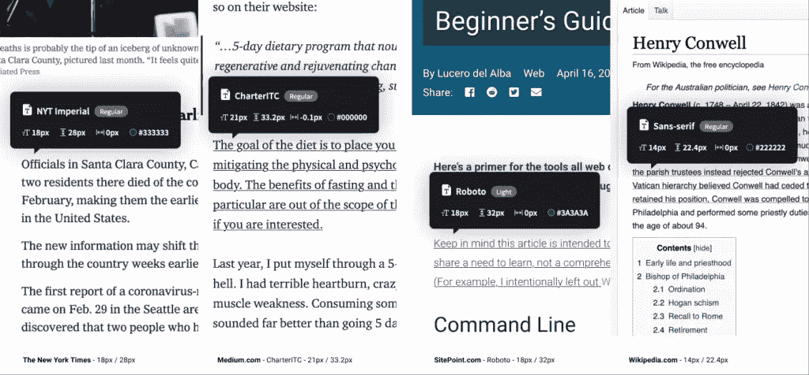
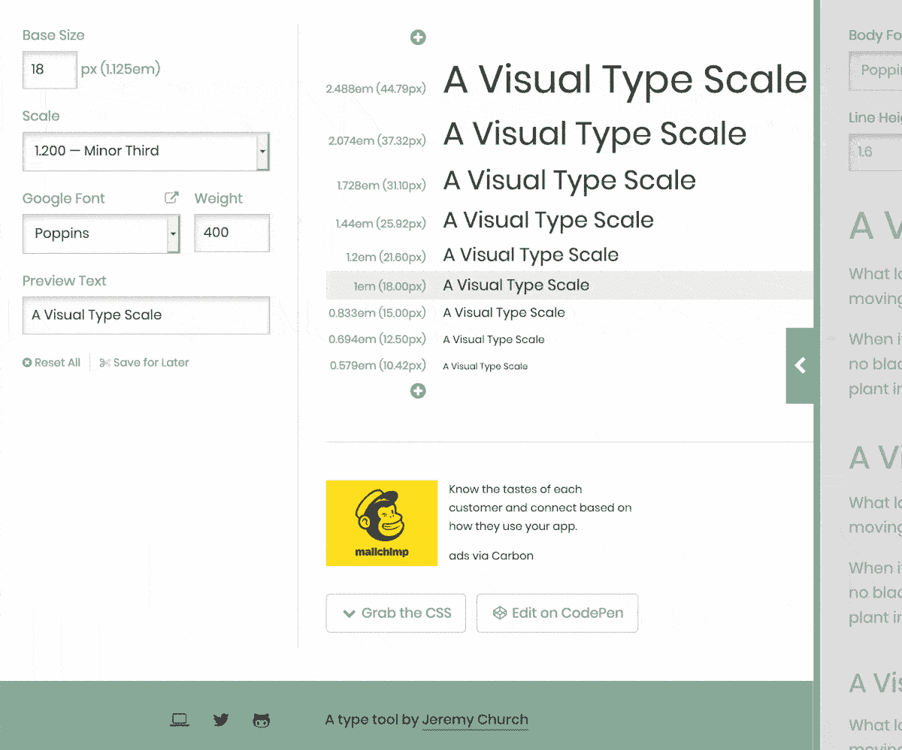
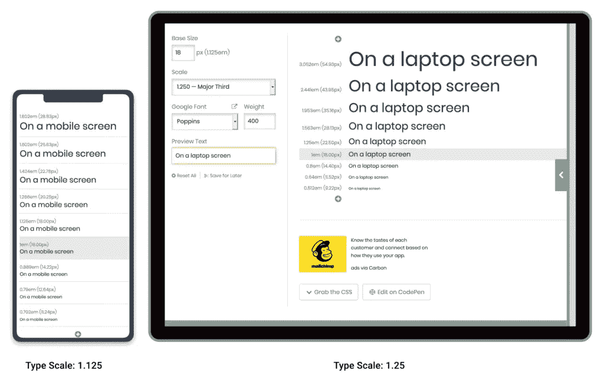
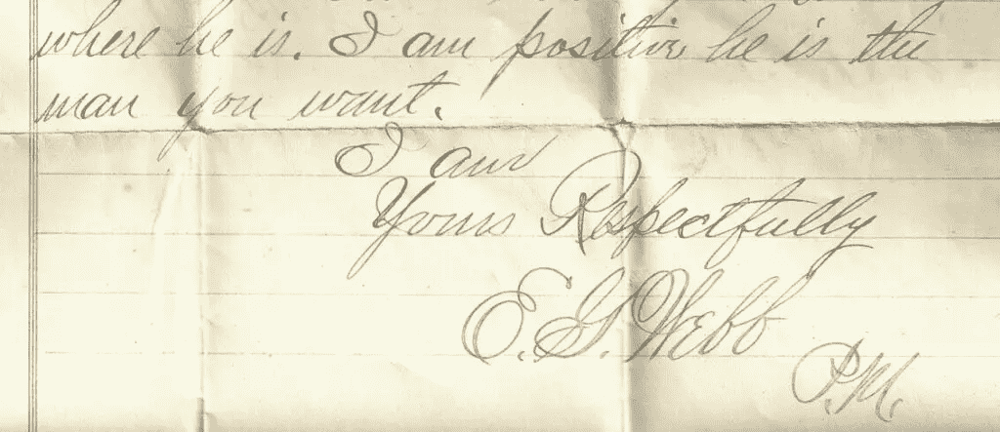
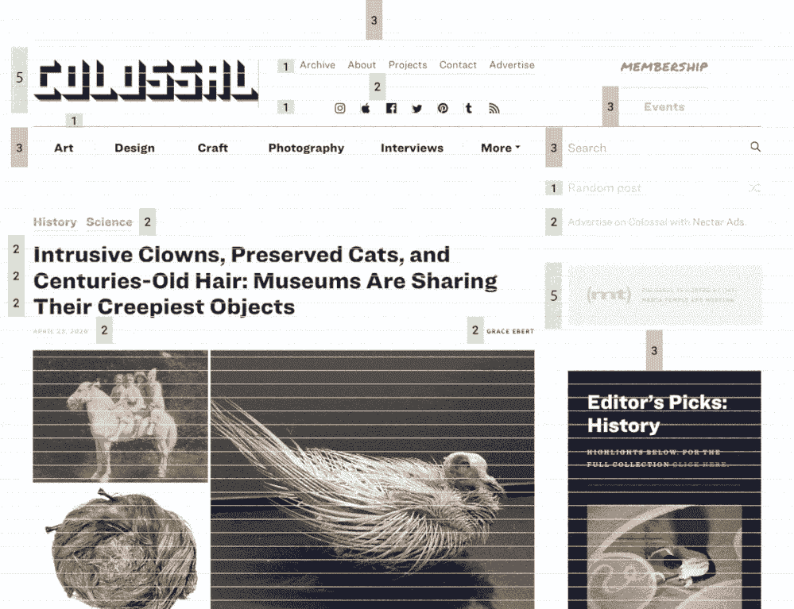
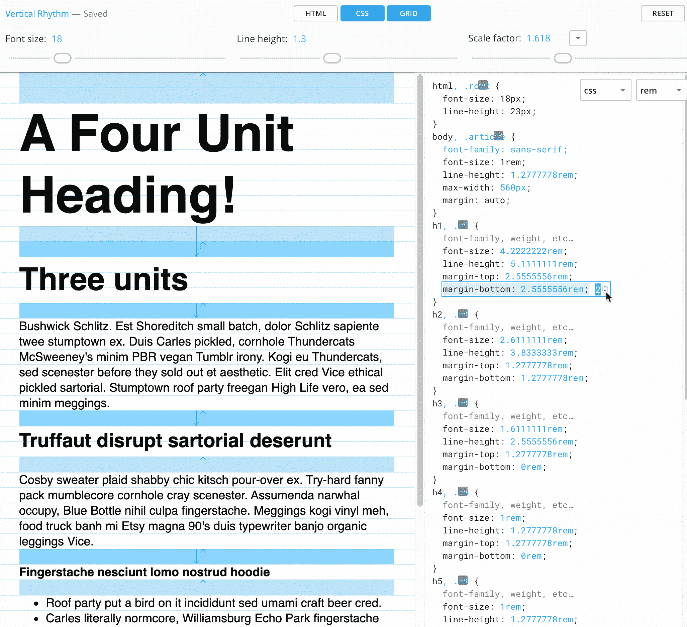
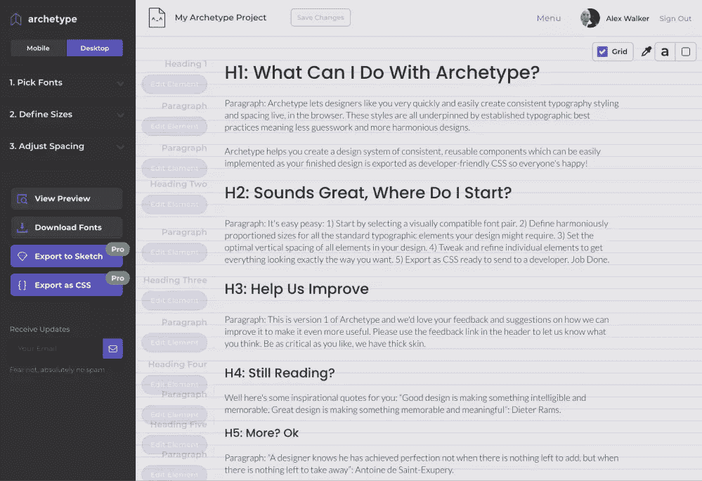

# 网络排版:建立强大的排版系统

> 原文：<https://www.sitepoint.com/web-typography-establishing-a-strong-typographic-system/>

为任何新项目设置排版总是一项复杂的任务。实际上有数百个可调整的变量，很容易花费数不清的时间来调整大小、行高、边距和粗细。拯救你的理智的最好方法是拥有一个设计系统，它能对大多数小问题产生快速的答案——让你专注于“大画面”决策。

由于读者会比任何其他文本尺寸消耗更多的正文，通常我们的第一个关键排版决定是为我们的默认布局设置正文字体大小(现在让我们把响应式设计放在一边)。多年来，16 像素被认为是网页的默认大小。

然而，随着今天更大的屏幕，博客和新闻服务等文本密集型网站通常选择 18 像素到 21 像素的字体大小。使用更繁忙、更模块化的 UI 单元的社交媒体和电子商务应用已经倾向于 14px 到 16 像素的字体。显然，这些是大趋势，而不是硬性规定，但是你可以在下面的列表中看到这些大趋势。

### 知名网站的典型正文字体大小



Body font-size samples for The New York Times, Medium.com, SitePoint.com and Wikipedia.com

*   [Medium.com](http://Medium.com):`21px`
*   [NYTimes.com](http://NYTimes.com):`18px`
*   [CNN.com](http://CNN.com):`18px`
*   [Airbnb.com](http://Airbnb.com):`18px`
*   [SitePoint.com](http://SitePoint.com):`18px`
*   [BBC.co.uk](http://BBC.co.uk):`16px`
*   [Developer.mozilla.org](http://Developer.mozilla.org):`16px`
*   [Twitter.com](http://Twitter.com):`15px`
*   [Etsy.com](http://Etsy.com):`14px`
*   [Wikipedia.com](http://Wikipedia.com):`14px`
*   [Facebook.com](http://Facebook.com):`14px`

请记住，这些大的互联网公司做了大量的用户测试，所以考虑一下你的应用程序在这个列表中的位置。当你确定了你的基本文本尺寸后，在真实的屏幕、平板电脑和手机上测试它们，直到你对它们感到满意为止。

## 缩放您的类型

那么，现在你已经设置了你的字体大小。你如何决定标题、章节标题、副标题、列表和块引用的大小？

对我来说，答案曾经是，“嗯…调整它，直到它看起来…有点正确？“我会放大一个标题，增加一点重量，向上推一个像素，…向下推，…然后再向上推。坦率地说，这是令人疲惫的，因为有太多挑剔的小决定和很少完全错误的答案。

**类型缩放**—有时也称为**模块缩放**——让您使用*简单的*数学来给你*简单的*印刷答案。它允许我们设置一个单一的缩放比例来生成我们所有的字体大小，同时保持它们的和谐。这就像是字体大小的音阶。

### 实践中的类型缩放

先说一个`18px`的正文字体大小。这使得我们的默认段落大小`1em`(或`18px`):

```
body{font-size: 18px;}
p   {font-size: 1em; /* (or 18px) */ } 
```

我要设置一个`1.25`的类型标度。为了计算我的`h5`字体大小，我简单地将我的段落字体大小乘以`1.25`。那就是`1em * 1.25`，或者说`1.25em`:

```
h5 = p * 1.25 = 1.25em 
```

我们的`h4`标题将是`h5`大小乘以`1.25` ( `1.25em * 1.25`)或`1.563em`。继续这个过程会得到这样的结果:

```
/* Using a type scale of 1.25 */
h5 {font-size: 1.25em;}  /* 22.50px */
h4 {font-size: 1.563em;} /* 28.13px */
h3 {font-size: 1.953em;} /* 35.16px */
h2 {font-size: 2.441em;} /* 43.95px */
h1 {font-size: 3.052em;} /* 54.93px */ 
```

如果我觉得我的`h1`标题在那个比例下有点过大，我可以把我的文字比例降低到`1.2`来得到这个结果:

```
h5 {font-size: 1.2em;}   /* 21.60px */
h4 {font-size: 1.44em;}  /* 25.92px */
h3 {font-size: 1.728em;} /* 31.10px */
h2 {font-size: 2.074em;} /* 37.32px */
h1 {font-size: 2.488em;} /* 44.79px */ 
```

好吧，所以我需要一个袖珍计算器来计算我的文本？令人高兴的是，没有。有一些很棒的工具可以让你实时调整和测试生成的 CSS 中的类型比例。我最喜欢的是杰瑞米·丘奇的[Type-scale.com](https://type-scale.com/)(下图)，这个工具可以让你快速测试不同的字体等级并生成可工作的 CSS。在右边的面板上甚至有一个虚拟布局来测试你的作品和一个 CodePen 导出选项。这是你的 CSS 排版的一个很好的基础。



Type-scale.com generates an consistently scaled set of font sizes

### 单一类型比例适用于所有尺寸的设备吗？

答案是，不，通常不会。我们可以在这里学习传统的印刷格式。如果你将一份典型报纸的排版与一本经典平装小说的排版进行比较(如下)，你会注意到除了明显的纸张尺寸之外的一些有趣的差异。


The Times employs a steeper type scale than The Wizard of Oz.

虽然它们的正文字体大小可能非常相似，但报纸上的标题字体大小却有很大差异。常识告诉你《泰晤士报》的那些标题根本不适合作为《绿野仙踪 T2》的章节标题。一般来说，较小的格式(如手机和小说)需要较浅的字体大小。



Type scales: Small increases compound to make a large difference.

请注意，字体大小的差异不需要很大。如上图所示，从`1.125`到`1.25`的文字缩放比例的小幅增加会产生一个更大的顶层标题。虽然《T2》这个标题在笔记本电脑上看起来不错，但它在移动设备上占用了太多的空间。

简而言之，明智的做法是使用 CSS `@media`查询来服务于两种类型尺度——一种更陡峭的类型尺度用于大屏幕，一种更压缩的类型尺度用于小屏幕。我们将在项目的后期处理这个问题。

现在，我们有了一个可靠的、可重复的过程来缩放设计中的字体，让我们来看看该字体的之间的间隔*。*

## 什么是垂直基线节奏？

**垂直基线节奏**——有时也被称为**垂直度量**——是一个水平线网格，你可以用它来“悬挂你的字体”。这和我们很多人学过的蓝线学校作业本没什么不同。

诀窍是让你的大字体单元和你的正文文本放在同一个格子里。在一封简单的手写信件中(如下)，例如，韦伯允许他的签名多一行。他可能在用基线节奏，甚至不知道它叫什么。



This beautiful vintage hand calligraphy has a built-in baseline.

在 *[将排版风格的元素应用于网页](http://webtypography.net/2.2.2)* 中，理查德·鲁特这样描述基线节奏:

> 标题、副标题、大块引用、脚注、插图、题注和其他对文本的干扰，创造了切分和变化，违背了有规律的引导行的基本节奏。这些变化可以而且应该给页面增添活力，但是正文也应该在每个变化之后准确地按节拍和相位返回。

这在网络上是如何运作的？让我们看一个真实世界的例子。优秀的 [*巨型*杂志](https://www.thisiscolossal.com/)采用了非常开放、通风的布局，然而它仍然设法给人以强烈的结构感。它是怎么做到的？事实证明，如果我们在整个布局上叠加一个`21px`垂直网格(见下文)，我们会看到一个先前隐藏的结构出现。对于这个例子，我将把这个网格的一行称为“单元”。

你会注意到:

*   网站品牌很适合放在一个五个单位高的盒子里
*   主导航有三个单位高
*   文章标题高两个单位
*   二级导航和社交链接高一个单位

[](https://www.thisiscolossal.com)

The excellent ‘This is Colossal’ art and design magazine

事实上，大多数 UI 元素“挂”在底层网格上，就像袜子挂在看不见的晾衣绳上一样。尽管我们看不到潜在的网格，但我们通过一种平衡与和谐的感觉意识到它。感觉就是对的。

注意，我们谈论的不仅仅是字体大小，而是文本占据的整个空间——包括行高和边距。所以在*巨大的*例子中，文章标题的行高是`42px`，或者每行两个单位。

然而，你会注意到*并不是每个*元素都锁定在这个网格上。设计师们选择将照片等元素从网格中偏移出来。那也很好。电网是一个伟大的起点，而不是戒严。

### 在用户界面设计中使用布局网格

大多数现代图形布局工具(如 Sketch、Figma 或 Adobe XD)可以轻松地为任何画布/框架添加垂直基线。在这个 Figma 示例中(见下文)，我选择了文档框架，并使用 **+** 按钮在布局网格面板中添加单独的行和列。


可以使用眼睛图标打开和关闭这些网格层。我发现，有了网格并打开了“网格对齐”功能，有网格的项目比没有网格的项目更容易调整大小。这让你的生活更轻松。

甚至有一个工具可以帮助你解决 CSS 问题。[Gridlover.net](https://gridlover.net/try)(下图)是一个优秀的免费工具，可以让你尝试不同的基本字体大小、行高和字体缩放——全部锁定在一条垂直基线上。如果您尝试调整右侧 CSS 面板上的任何行高或边距，您会注意到数字每次只改变一个完整的“网格单位”。

[](https://gridlover.net/try)

[Gridlover.net:](https://gridlover.net/try) A great tool for generating vertical baseline rhythm.

您可能还会注意到，该工具避免在其排版中使用 CSS 填充。我发现在使用垂直基线系统时，这通常是一个好的策略。在你的容器单元上随意使用填充，但不要在排版上使用。即使是文本按钮也可以通过行高设置而不是 CSS 高度或填充来指定高度。

Gridlover 不仅编写了有用的 CSS，而且它真的帮助我理解了垂直基线和类型缩放在现实世界中是如何工作的。我相信这是一个开始你的 CSS 排版的好地方。

原型是另一个设计用来帮助你创建计划良好的集成类型系统的工具。它在一个精心构思的用户界面中提供了对字体大小和基线节奏的控制。它甚至鼓励你为移动和桌面设置不同的字体比例。我相信这是这个领域最复杂的工具。

对原型的唯一警告是，目前解锁“导出为 CSS”选项的费用是每年 59 美元。很明显，这比 Gridlover(免费)的花费要大，但是如果你花很多时间制作类型系统，它可以节省你很多时间(和金钱)。原型*是*很好。

[](https://archetypeapp.com)

[Archetype](https://archetypeapp.com): Pro-level type system design tool.

### 垂直基线节奏是一种工具，而不是宗教

垂直基线是一个非常有用的工具，但是它们不应该成为你设计的最终目标。我不得不承认，曾经有一段时间，我花了太多的汗水试图弯曲每个页面元素，以遵守我强大的网格规则。我一直在和排版的百分比和页边空白较劲，“撞上格子”本身就成了一个目标，而不仅仅是帮助我更好地设计的工具。

那既不好玩也没用。

今天，我认为最好将垂直基线视为乐队中强有力的低音鼓——有规律的节拍，有助于测量乐队其他成员的演奏空间。建立一个每个人都能感觉到的好的背景，但是不要害怕放弃一些不寻常的华丽辞藻。通常他们能给作品(视觉的或音乐的)增加能量和味道。

我个人喜欢从强网格开始。如果标题或段落之间有空白，也可以是一个、两个或三个完整的“垂直单位”，而不是`1.3`或`2.75`单位。而那一成不变的 ***立刻让人感觉到*** 的平衡与和谐。

同样地，你的英雄图像可能正好是 *`12`个单位高，而不是`11.8`或`12.3`，因为现在图像的底部边缘更可能与它旁边的任何文本的底部边缘对齐。是“自我整理”。*

 *但是，另一方面，如果图片上的标题超过 25 像素行高时看起来太过空洞，那也没关系。忘了那里的网格吧。只是让它看起来很好。

## 外卖

最终，大多数设计工作只是一长串“为什么”问题的答案。

*   你为什么把主要标题设置为 49 像素高？
*   为什么下边距是 17 像素？
*   为什么`h3`的行高是`1.7778`？

诸如此类。

即使在一个小项目中，也可能有数百个这样的小问题。你可能有足够的天生的“设计师直觉”来回答所有问题——最终。问题是，这是*精疲力尽*。

然而，如果你能想出一个可重复的系统，为大多数无聊的小问题提供可行的答案，你就可以把你的设计师直觉留给更大、更重要的问题。

这通常是有趣的部分。

#### 相关文章

*   [排版备忘单:要避免的 6 大错误](https://www.sitepoint.com/typography-cheat-sheet/)
*   [消除网络排版中的猜测](https://www.sitepoint.com/taking-guesswork-typography-web/)
*   [为你的用户界面选择最好的版式](https://www.sitepoint.com/best-typography-ui/)

摘自:[美丽网页设计的原则:第四版](https://www.sitepoint.com/premium/books/the-principles-of-beautiful-web-design-4th-edition/)* 

## *分享这篇文章*