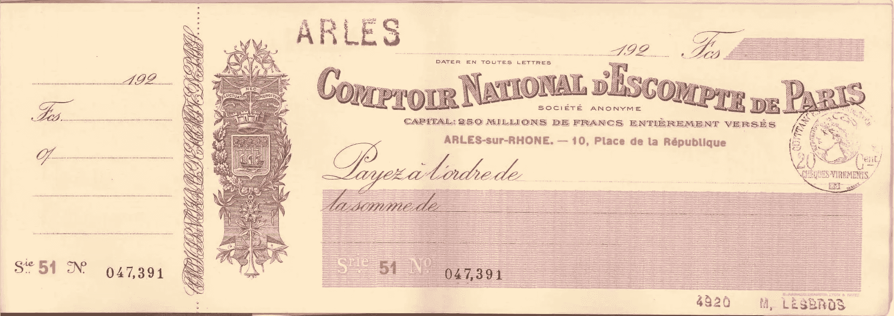
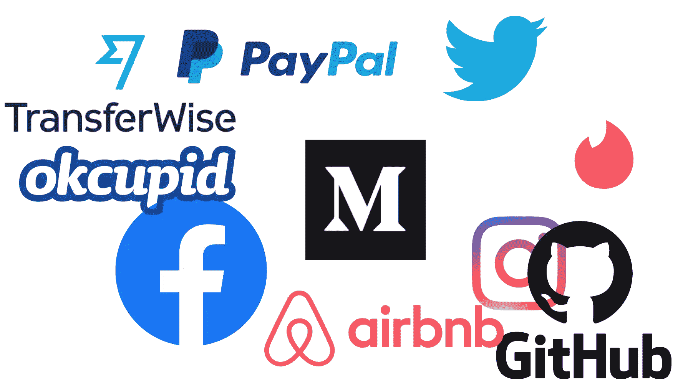
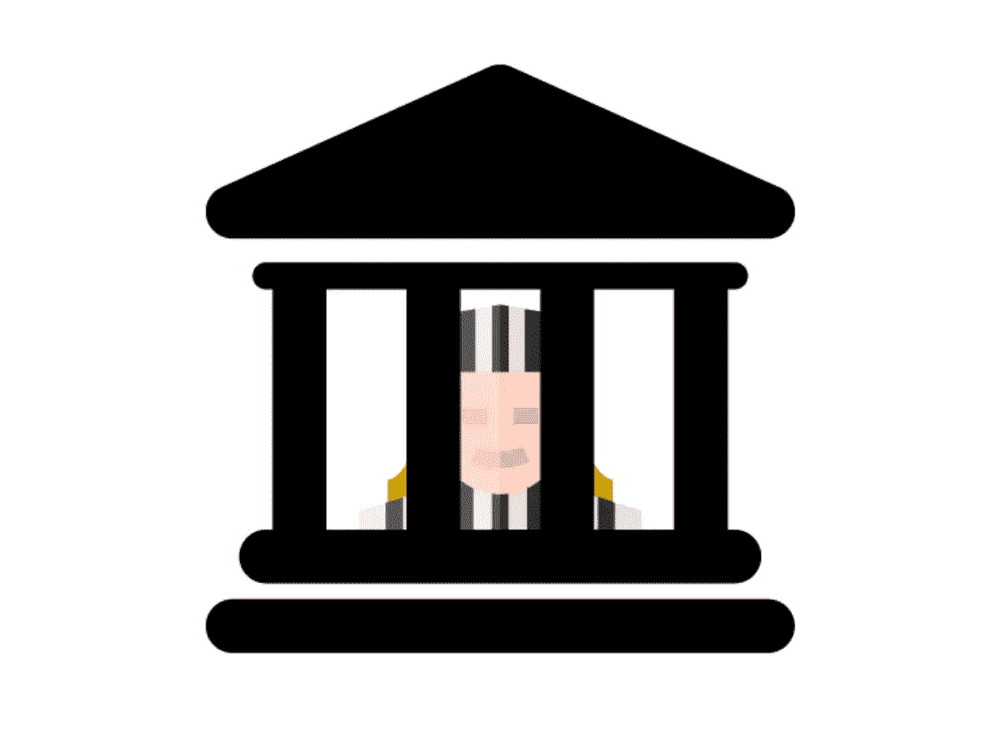
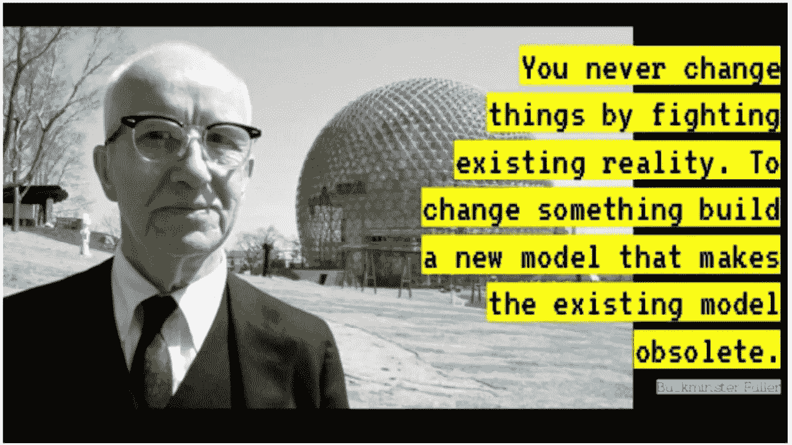
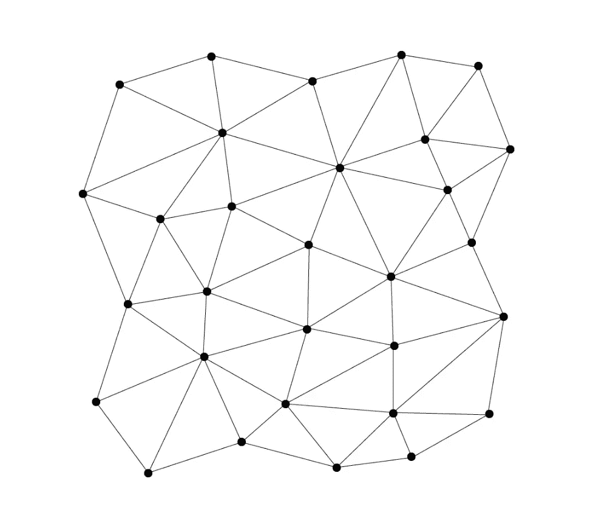
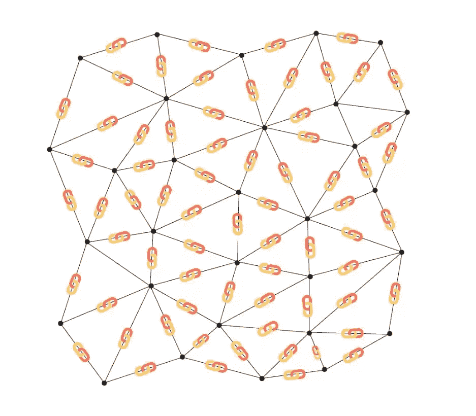
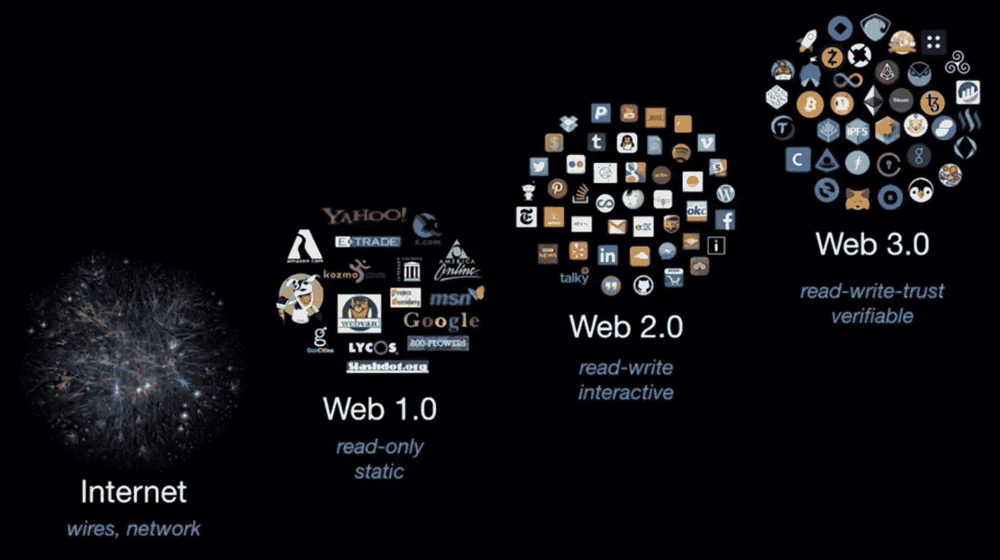

# 网络 3:新世界的新网络

> 原文：<https://www.sitepoint.com/web3-new-web-new-world/>

自从人类用两条腿站立以来，我们就无法信任彼此。我们一直需要中间人——确保协议双方履行承诺的人。今天的中介包括银行，他们为我们提供资金；律师，他们提出我们的论点和要求；和社交网络，它们传递我们的信息。

这种高度中介化的原因是完全缺乏信任。当你不知道一个人在想什么的时候，你很难相信他。但值得庆幸的是，正如我们已经能够创新过去看似不可能的问题——如掌握飞行、建造摩天大楼和信息民主化——我们也能够开发一种新技术，消除我们的信任问题。进入 Web3。

要理解 Web3 是什么，我们首先要理解什么是中介。在一个非常基本的层次上，中介做以下事情:

*   接受来自外部的消息。在银行的情况下，这将是来自客户 A 的向客户 b 汇款的消息。
*   一旦通过验证，就对这些消息采取行动。一旦银行确认客户 A 的账户有资金并被授权汇款(账户有可能被冻结)，他们就会开始转账。
*   这些行动的结果必须经过计算。银行确认转账是否成功。
*   计算的结果必须被存储，并可能在另一个交互中用作消息。银行通过分类账和收据保存交易记录。

不难发现，从技术上讲，计算机是一个完美的中介。但是如果计算机是完美的中介，为什么到现在还没有取代我们人类的中介？

要回答这个问题，我们必须首先考虑权威和授权。

## 权限和授权

中间人的一个关键功能是决定某一主张中谁是谁非。因此，如果客户 A 要给客户 B and B 汇款，但声称他们没有收到，两人可以去存储记录的银行解决问题。银行可以这样做，因为它有权力，但它有权力只是因为客户授权它代表他们行事(如记录他们的交易，等等)。

一开始，我们在纸上简单的签名。

但是现在我们已经离开了它，进入了数字领域。

我们传递授权，并通过点击按钮、扫描指纹或输入密码，赋予中介机构掌控我们命运的权力。事实上，生活是美好的。由我们支配的服务使我们的生活变得无比轻松。

PayPal 让我们可以随时随地汇款。Twitter 把我们变成无情的键盘战士。脸书让我们和失去的朋友们叙旧。Medium 允许我们在一个简单易用的平台上自动向全球受众推广我们的作品。甚至像 Tinder 和 OkCupid 这样的东西也可以说改善了一些生活。然后是 GitHub，它让我们可以和世界上任何一个人一起编写计算机代码，还有 Airbnb，它让我们不用和租客面对面就可以从空公寓里赚钱。如果这是令人兴奋的，想象一下 20 年前的人会怎么想！

现在，如果我们坚持真理，那么它并不都是美好的。“银行”的图标看起来像监狱，这不是巧合。

除了银行，所有这些服务都有失态的时候。

PayPal 和 TransferWise 都因在没有提供理由的情况下关闭客户账户而闻名，切断了个人和企业生存所需的收入。想象一下，有一天早上醒来，发现你每月 5000 美元的生意被关闭了，却没有给出合理的理由。

或者考虑一下 GitHub 的案例:【2019 年 7 月，GitHub 抹除了所有伊朗开发者的账号。他们干脆删除了他们的存储库，失去了他们几个月的工作和协作。为什么？因为他们的权威(美国政府)告诉他们:“没有伊朗”。作为一个集权而脆弱的公司，他们别无选择，只能服从。(注意，2021 年 1 月， [GitHub 获得了美国政府的许可](https://developer-tech.com/news/2021/jan/08/github-restored-iran-us-gov-permits-sanctions-exemption/)再次为伊朗 devs 服务。)

由于历史的发展，我们可以看到，在任何有*可囤积*权力(中央集权)的系统中，某些人必然会囤积这种权力。这是没有办法的。囤积权力没有任何问题，尤其是当它被某个高贵而有效的人囤积的时候。不幸的是，人类已经被我们的心灵搞糟了，因为我们当中最坏的人似乎更容易获得这种力量。我这么说，并不是说只有我们当中最坏的人会掌权。相反，每当我们拥有权力时，将我们的利益置于群体利益之前的诱惑是如此之大，以至于只有少数人能够成功。这就是本叔叔告诉彼得·帕克“权力越大，责任越大”的原因。要是能像蜘蛛侠一样应付自如就好了。

就我们改变生活的 21 世纪服务而言，担心这些强大中间人的不仅仅是出售个人数据和缺乏隐私。还有一个事实是，第三方可以访问这些信息，然后可以随心所欲地使用它们，不管这些信息有多邪恶。

2020 年，专注于构建硬件加密货币钱包的公司 Ledger 遭到黑客攻击，数十万客户、经销商和投资者的地址、电话号码和电子邮件记录等个人信息被泄露。这是一个骗子的天堂:一份保证拥有足够加密货币的人的名单，使其值得购买硬件钱包。从那时起，许多人收到了不同种类的诈骗邮件——从简单的乞讨到死亡威胁。

在当前数字基础设施的表面下，潜伏着更多的怪物。社交媒体上存在审查制度，据称中立平台的政治倾向，以及应用程序和网站的垄断禁令。“自由”市场的最高层也存在腐败，他们协同攻击社区的货币自由(就像对冲基金和美国政府联手订购股票交易应用程序以阻止人们购买 GME，并为做空股票的人纾困)。

这种中介的情况我们能怎么办？有希望改变他们的坏习惯吗？

不，不是真的。巴克大臣富勒说得好:

> 对抗现实永远不会改变事情。要改变一些东西，建立一个新的模型，使现有的模型过时。

## 变化

为了摆脱中介，我们需要在机器之间直接读取和传递数据的方法。首先，我们需要关联数据。

**链接数据**是计算机可以在没有人类或人为适配器和翻译器的情况下相互读取的数据。换句话说，无人的计算机对计算机的通信。但这还不够。计算机需要能够从其他计算机获取这些数据，并且需要能够随时获取这些数据。这一步被称为**分布式数据**——可以从网络中的每个节点检索到的数据。

当分布式数据被链接时，网络中的任何计算机都可以随时从另一台计算机获取并理解数据。但是我们已经有一段时间了。它叫做 BitTorrent。如果你熟悉种子，那么种子和对等体仅仅意味着一些计算机正在发送存储的数据，而其他计算机正在下载这些数据。然而，这不足以创造一个组织互联网和我们生活的新模式。信任是缺失的部分。使用 torrent，我永远不能确定我的数字生活(计算机)是安全的。

然后，区块链点燃了分散化革命的火花。

以太坊、波尔卡多特或比特币等未经许可的区块链是全球数据库。它们为我们提供了一个每个人都可以用数学方法验证的共享真理。它们让我们能够直接更改数据库中的某些值，而不需要任何人来替我们做。当你与区块链互动时，每个人都会意识到这种互动，并知道它的确切结果。没有虚假陈述，没有寻租，没有审查。

区块链为这种分布式和链接的数据增加了一层可验证性，这样计算机就知道它不仅可以从对等机*获得*数据、*理解*它，而且*信任*它。这三个要素共同构成了 Web 3.0:

*   链接数据
*   分布式数据
*   可信数据

## Web 3.0

起初，只有电线和怀疑论者。“谁会想要连接电脑呢？”他们说。然后是 Web 1.0，只读的静态 Web。这是一个整洁有序的环境，用户大多精通技术，为了找到在线资源，他们必须访问某人手动管理的网络目录。

随着 Web 2.0(读写网络)的出现，我们接触到了改变我们生活的服务。社交网络、SaaS、优步、Airbnb、PayPal 和 Reddit 等服务。因为 Web 2.0，我们今天能做的所有美好的事情都成为可能。但是 Web 2.0 迎来了数字空间的中介和单点故障时代，这个空间很快就被破坏了。

进入 Web 3.0(又名 Web 3)。在这个网络中，用户可以完全控制自己的身份、行为和财务；在这个网络中，你是自己的银行，一切都是危险的，没有安全网，但有自由。

考虑这些问题:

*   对于普通人来说，在股市交易时间之外交易股票有多难？
*   缅甸人民现在组织起来有多难？
*   一个中国人在美国投资房地产或艺术品有多难？
*   一个阿根廷人或一个委内瑞拉人抵抗通货膨胀有多难？

有了 Web 3.0，所有这些都变得微不足道:世界上任何地方的任何人都可以投资任何公司。任何人都可以随时随地向任何人发送消息，并确保他们会收到。那条信息可以是金融方面的，只是一句“你好”，甚至是一些别人不想让你看到的内容(想想[防火长城](https://en.wikipedia.org/wiki/Great_Firewall))。

想想这样一个系统将会保证什么样的自由。Web3 证明其观点的一个完美例子是 2020 年发生在尼日利亚的抗议。尼日利亚年轻人厌倦了沦为比罪犯更恶劣的流氓警察部门的牺牲品，他们聚集在一起组织了一次和平抗议。两个星期以来，他们忍受并克服了政府试图驱散他们的恶劣企图，包括使用催泪瓦斯、水箱以及最可耻的流氓手段。

在被其公民的纯粹意愿击败后，政府转向银行寻求帮助，命令银行冻结任何为抗议活动提供便利的人的账户。十年前，这可能是对勇敢抗议的最后一击。但是在 2020 年，[尼日利亚政府被 Web3](https://www.nasdaq.com/articles/nigerian-banks-shut-them-out-so-these-activists-are-using-bitcoin-to-battle-police) 打败了。多亏了比特币和以太坊，和平抗议又持续了两周，这使得组织者可以接收来自世界任何地方的任何人的捐款。2020 年 10 月 20 日，政府最终通过[动用军队杀害自己的公民来平息抗议。](https://edition.cnn.com/2020/11/18/africa/lagos-nigeria-lekki-toll-gate-feature-intl/index.html)

如果这还不能说明 Web3 的必要性，那么我不确定还有什么能说明。

然而，不管世界怎么想，Web3 的建设者们都热衷于将这种新的范式带入主流，无论付出什么代价。有了 Web 3.0，我们**锁定了 Web 打开**。

## 分享这篇文章