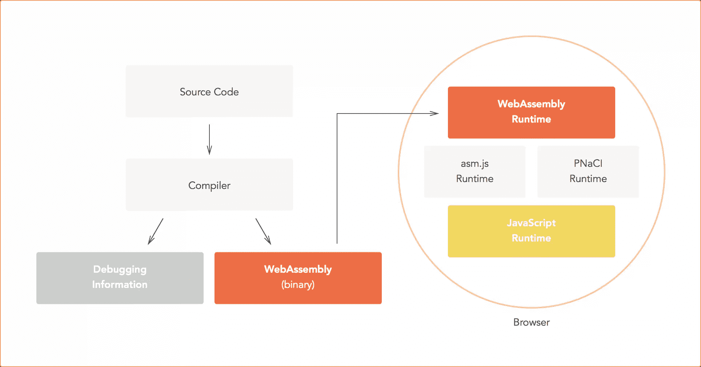

# WebAssembly 姗姗来迟:关于大型项目 JavaScript 的思考

> 原文：<https://www.sitepoint.com/webassembly-is-overdue-javascript-for-large-projects/>

在 [Auth0](https://auth0.com/?utm_source=sitepoint&utm_medium=gp&utm_campaign=webassembly_overdue) 的时候，我们大部分的软件都是用 JavaScript 开发的。我们在前端和后端都大量使用这种语言。

在本文中，我们将看看 JavaScript 作为一种通用语言的有用性，并简要介绍它的发展，从概念到今天。我还将采访一些高级 Auth0 开发人员，讨论大规模使用 JavaScript 的利弊，最后看看 WebAssembly 如何有潜力完成这幅画面，并将该语言转变为成熟的开发平台。

## 作为通用语言的 JavaScript

对于今天的年轻开发人员来说似乎显而易见的事情在过去并不清楚:JavaScript 可以被认为是一种通用语言吗？我想我们可以有把握地同意，今天这个问题的答案是肯定的。但是 JavaScript 并不年轻:它诞生于 20 多年前的 1995 年！

在超过 15 年的时间里，JavaScript 在 web 之外几乎没有什么影响力，主要用于前端开发。许多开发人员认为 JavaScript 只不过是实现他们拥有更具交互性和响应性的网站的梦想的必要工具。毫不奇怪，即使在今天，JavaScript 也没有跨所有常见浏览器的可移植模块系统(尽管导入/导出语句是最新规范的一部分)。因此，从某种意义上说，随着越来越多的开发人员找到了扩展其用途的方法，JavaScript 开发慢慢地加快了步伐。

有些人会争辩说，能够做某事并不意味着它应该被做。说到编程语言，我觉得这有点苛刻。作为开发人员，我们倾向于获得某些品味和风格。一些开发人员喜欢经典的过程化语言，一些人爱上了函数式范式，而另一些人发现中间地带或厨房水槽语言非常适合他们。谁敢说 JavaScript，即使是过去的形式，不是他们的合适工具？

## 简要回顾 JavaScript 这些年来的进步

JavaScript 最初是作为 web 的粘合语言而诞生的。Netscape Navigator(90 年代的主要网络浏览器)的创建者认为，设计者和兼职程序员可以使用的语言将使网络更加动态。所以在 1995 年，他们请来了布兰登·艾希。艾希的任务是为浏览器创造一种类似 Scheme 的语言。如果你不熟悉 Scheme，它是来自 Lisp 家族的一种非常简单的语言。和所有 Lisps 一样，Scheme 的语法很少，很容易掌握。

然而，事情并不那么顺利。与此同时，Sun Microsystems 正在推动将 Java 集成到 web 浏览器中。来自微软的竞争和他们自己的技术也于事无补。所以，JavaScript 不得不仓促开发。更重要的是，Java 的兴起使得网景希望他们的新语言能作为它的补充。

艾希被迫尽快拿出原型；有人声称这是在几周内完成的。结果是一种动态语言，语法类似于 Java，但哲学却非常不同。首先，这种新语言中的对象模型与 Simula 派生的 Java 对象模型完全不同。这种语言的最初原型被称为 Mocha，后来被称为 LiveScript。

出于营销原因，LiveScript 刚推出不久就被重新命名为 JavaScript。Java 正在兴起，名字中有“Java”可以激发对这种语言的兴趣。

这个最初的版本是 JavaScript 的第一个版本，其中包含了令人惊讶的大量 JavaScript 内容。特别是，对象模型——基于原型——和语言的许多功能方面——闭包的语义、API 的异步特性——都是一成不变的。不幸的是，它的快速发展导致了许多奇怪的现象。

尽管这个版本在很多方面都很强大，但是它缺少一些在开发更大的系统时有用的显著特性。例外就是一个例子。

JavaScript 接下来的几个版本关注的是如何让它广泛可用。实现这一目标的第一步是使它成为一个标准。因此，标准化工作开始于 ECMA，后来是 ISO。ECMAScript 是标准化后采用的名称，与 Netscape Navigator 中包含的 JavaScript 的第一个版本非常相似。直到 1999 年 ECMAScript 3 或 JavaScript 1.5，我们今天所知道和使用的大部分 JavaScript 才最终定型。这个版本包括异常处理、instanceof、所有常见的控制机制(do/while、switch)、eval 和大多数内置函数和对象(数组、对象等)。).

从那以后，JavaScript 的黑暗时期开始了。竞争团体对 JavaScript 的开发有不同的想法。有些人提倡高级特性，如模块、一种静态类型和基于类的面向对象编程。其他人认为这太过分了。ECMAScript 4 的提案已经提出，实施者开始在他们的引擎中集成一些特性。不幸的是，社区从来没有决定包括哪些特性。微软也在开发 JScript，一种带有扩展的 JavaScript 实现。结果 ECMAScript 4 被抛弃了。

直到 2005 年，JavaScript 开发才开始加速。对 ECMAScript 3 进行了改进。其他几个特性(let、生成器、迭代器)是在标准之外开发的。失败的 ECMAScript 4 规范引起的混乱平息了，2009 年，大家同意将 ECMAScript 3 的改进重新命名为 ECMAScript 5。定义了未来开发的路径，并开始重新评估为版本 4 提议的许多特性。

该标准的当前版本 ECMAScript 7(也称为 2016)包括一些为第 4 版设计的功能，如类和导入/导出语句。这些特性旨在使 JavaScript 更适合中型和大型系统开发。这毕竟是 ECMAScript 4 背后的基本原理。但是 JavaScript 兑现了这个承诺吗？

让我们来看一个不太客观的 JavaScript 特性概述。

## 语言特点:好

### 句法熟悉度

C 语言家族有着广泛的共识。C、C++、Java、C#和 JavaScript 加起来可能比所有其他语言都多。尽管这可能是许多 JavaScript 怪癖的原因，但使 JavaScript 在语法上成为一种类似 C 语言的语言使得现有开发人员更容易掌握。这甚至在今天也有帮助，因为类 C 语言仍然主导着开发领域。

一个没有经验的开发人员在看了一两个常见的例子后，可以很容易地开始编写 JavaScript 代码:

```
function test(a, b, c) {
  a.doStuff(b.property, c);
  return a.property;
} 
```

### 异步性质

对于刚接触 JavaScript 的开发人员来说，最大的震惊可能是所有事情本质上都是异步的。这需要一些时间来适应，但是如果你考虑 JavaScript 是如何被构思的，这是完全有意义的:作为一种将可编程逻辑集成到网页中的简单方法。说到这里，有两件事需要考虑:非阻塞行为至关重要，共享内存太复杂。

解决方案:回调和闭包。

```
const consumer = new Consumer();

$.ajax({
  method: "GET",
  url: "http://test.com/resource"
}).done(function(data) {
  consumer.push(data);
}); 
```

可以说，由于这种方法的好处，JavaScript 看到了服务器端开发的兴起。诸如 async/await 等正在开发的特性将使异步开发变得更加容易。

### 功能特征和闭合

JavaScript 的多范式方法得到了回报。许多深深扎根于一种范式的语言，比如 Java，已经开始实现其他范式。JavaScript 从一开始就有这个。原型继承足够强大，可以实现所有 OOP 语义。闭包允许函数被当作一级对象对待，并像这样传递。带有方便符号(JSON)的对象和数组与这些特性相结合，使得 JavaScript 天生强大。

以下是摘自 RxJS 文档的一个示例:

```
const source = getAsyncStockData();

const subscription = source
 .filter(quote => quote.price > 30)
 .map(quote => quote.price)
 .forEach(price => console.log(`Prices higher than $30: ${price}`); 
```

## 语言特征:不好的

### 怪癖

JavaScript 是仓促开发的，这一点显而易见。例如，自动分号插入这一旨在简化非开发人员开发的功能可能会产生意想不到的结果:

```
function test() {
  functionCall();
  obj.operation();

  // Other code

  return  //<-- semicolon inserted here, returns undefined
    {
      key: "This object should be returned instead"
    }
} 
```

这些怪癖使得 JavaScript 不直观，并可能导致生产力损失。有经验的开发人员知道如何避免这些陷阱，所以中型和大型系统确实需要有经验的开发人员，在使用 JavaScript 而不是其他语言时可能需要更多。JavaScript Garden 列出了其中的一些怪癖。

### 弱键入和自动转换

尽管测试是 JavaScript 开发的重要部分，但并不是所有的测试都能捕捉到简单的转换错误。此外，JavaScript 执行许多隐式强制转换。专业开发人员非常清楚这些类型转换的语义，并尽可能避免它们。

下面是 JavaScript 转换工作原理的一个极端例子:

```
console.log((![]+[])[+!![]]); 
//This prints the character “a” 
```

这是可能的，因为能够将任何值转换为布尔值。第一次隐式强制转换导致值“false”被强制转换为整数，然后索引到其第二个值。狡猾又疯狂。

### 模块系统

ECMAScript 6 (2015) 最终定义了潜在的[模块系统](https://www.sitepoint.com/understanding-es6-modules/)的语法。然而，目前没有浏览器以可用的方式实现这一点。换句话说，即使在今天也需要外部模块加载器。

模块对于正确的软件开发是必不可少的。分割和重用代码的标准方法可能是它最基本的方面之一。谈到 [JavaScript 模块](https://auth0.com/blog/javascript-module-systems-showdown/?utm_source=sitepoint&utm_medium=gp&utm_campaign=webassembly_overdue)，我们仍然在使用竞争的解决方案:require (Node.js 模块)，import/export 加上一个模块加载器或 transpiler (Babel， [System.js](https://www.sitepoint.com/modular-javascript-systemjs-jspm/) ，Webpack)，甚至是普通的老式立即调用函数或 UMD。

### 全局和提升

[JavaScript 变量](https://www.sitepoint.com/how-to-declare-variables-javascript/)总是在函数作用域定义的(除非用 let 来声明它们，这是最近新增的)。这可能会导致变量发生意外变化。很容易想象变量的意外变化会给大规模开发带来多大的问题。

```
function test() {
  if (true) {
    var a = 1;
    console.log(a);
  }

  var a;
  if (a) {
    // This code runs, a === 1
    console.log("Here");
  }
} 
```

由于 JavaScript 预期由非开发人员使用，所以它对一些基本检查并不严格。所有的变量，即使没有被定义，也是在一定的环境中产生的。当没有指定上下文时，它们在全局上下文中创建。换句话说，如果出于某种原因，您忘记了为变量指定正确的上下文，那么它将在错误的位置被悄悄地创建和更新。

```
function test() {
  variable = "test";
}
test();
console.log(window.variable); 
```

幸运的是，在 JavaScript strict 模式下可以对全局变量进行更严格的检查。

### 缺少合适的整数类型

JavaScript 中的所有数值变量都是浮点类型的(除了非常特殊的情况)。这通常就足够了。不幸的是，许多算法期望定义良好的整数语义可用。通常可以在 JavaScript 数字类型的基础上实现这些语义，但是这会产生次优的代码。

对于 32 位整数类型，使用按位运算符可以获得最佳语义(这是 JavaScript 中 32 位整数可用的唯一情况)。不幸的是，对于 64 位整数(如今在许多平台上都有)没有本地替代方案。

部分由于这个原因，当前版本的 JavaScript 包含了类型化数组。然而，这些还不够。

## 用 JavaScript 开发大型系统之我见

在 [Auth0](https://auth0.com/?utm_source=sitepoint&utm_medium=gp&utm_campaign=webassembly_overdue) 的时候，我们大部分的软件都是用 JavaScript 开发的。我们早期在 Node.js 上进行了大量投资。到目前为止，它已经得到了回报。但是我们的一些最资深的开发人员有许多来自战壕的故事。

我们邀请了工程总监 Damian Schenkelman 和工程主管 Jose Romaniello 分享他们对此事的看法。


***问:你对 JavaScript 作为通用语言有什么看法？***

D. Schenkelman :我喜欢这门语言，因为它有一个非常小的核心概念集，闭包是一个非常强大的特性，你可以在它的基础上进行构建。

显然，它也有缺点:隐式类型转换和弱类型系统。我发现如果你坚持好的部分，JavaScript 会是一种很好的语言。当然，测试也是开发的重要部分。

J. Romaniello :我觉得还好。现在你几乎可以用它来做任何事情，但是它在很多情况下并不理想。
在某些时候看起来有利于实现某些目标的事情很容易变得对你不利。

这种语言本身以及它运行的平台(即浏览器或 Node.js)都很容易理解。JavaSacript 的真正力量来自工具、库及其庞大社区的生态系统。

我认为 Node.js 的理念非常正确(可能来自 Unix？)核心小，用户地广。

Node.js 的大多数模块只公开了一个功能，做一些非常具体的事情，并且有用于所有事情的模块。这些只是开发人员理解并用来解决问题的有据可查的小构件。

我认为这不能归因于包管理器或语言，但这更像是一种完成事情的实际方式。其他技术也有类似的工具，但它们没有库，而是有要么全有要么全无的“框架”，比如 Spring、WCF 等。

问:在你使用 JavaScript 开发高性能服务的这些年里，你能想出 JavaScript 完全解决问题或完全扭转局面的故事吗？

D. Schenkelman :实际上，我发现我们所犯的大部分错误都与缺少属性或错误类型的对象有关。这些错误很容易通过隐式类型检查来避免，并且需要更多的训练来用 JavaScript 编写彻底的测试。我认为渐进式打字在这些情况下会有很大帮助。不幸的是，我们还没有起草一套新的指导方针来开始这项工作，但这是我们正在认真考虑的事情。我认为 TypeScript 是朝着正确方向迈出的一步，特别是在模块间契约方面。当然，这并不是说 TypeScript 应该取代测试:一点也不，但是它可以帮助捕捉愚蠢的错误。棉绒也有很大的帮助。

在 Auth0 之前，马蒂亚斯、尤金尼奥、亚科和我来自一个非常不同的世界。我们是。NET 开发者多年。使用 Node.js 启动 Auth0 使我们能够以与其他语言相比难以置信的速度进行开发，因为我们在数据库(Mongo)中有 JavaScript，在后端(Node)中有 JavaScript，在浏览器中有 JavaScript。在基于模式的数据库中使用强类型语言通常需要编写适配器，并从一个模型映射到另一个模型。在 JavaScript 中，一直使用“哈希映射”。

我不能把任何具体的失败归因于语言本身。我们犯了很多错误，例如，我们学到了在 100k 个对象上循环来渲染一些东西会阻塞事件循环。特别是关于 Node.js，我们有时希望有更详细的错误。有些情况下，您只得到一个“ECONNRESET”异常，而没有任何其他详细信息。幸运的是，Node.js 代码库很容易理解，它允许我修复这些东西。

问:如果你可以选择任何一种语言或框架来开发像 Auth0 这样的后端，你会选择哪种语言或框架？你会再次选择 Node.js 和 JavaScript 吗？

d .申克尔曼:我认为这并没有看起来那么重要。我的意思是，开发一个平台，尤其是对于初创公司来说，不仅仅是编码。代码只是实现你产品的手段。只要这套工具能够合理地应用于所讨论的问题领域，编码就只是拼图中的一块。无论您选择 Java、JavaScript、C#还是其他许多经过实践检验的平台，您都会取得成效。

工程也必须考虑事物的商业方面。只要你能作为一个团队有合理的生产力，语言就没有运输、满足客户的需求或盈利重要。

总的来说，对于我们团队中的大多数开发人员来说，JavaScript 很容易掌握。当你成长很快的时候，这一点很重要。以我的经验，大平台都擅长这个。所以，很难说如果我们选择了别的东西会发生什么，但我也认为这并不太重要。

j . Romaniello:auth 0 后端正在向小型服务进化。这使我们能够自动扩展不同类型的负载，提高容错能力，更好地监控等。我们正在使用 Node.js，但使用的方式与开始时不同。我想我会再次选择 Node.js 或者类似 Erlang/Elixir 的东西。

* * *

总的来说，我们最有经验的开发人员认为 JavaScript 有一个很好的生态系统，它会带来回报，即使这种语言有时不太适合问题。但是如果我们可以向更多的工具开放这个生态系统呢？

## 输入 WebAssembly

在后端，你有很多选择。为这项工作找到合适的工具不成问题。但是当涉及到前端开发或客户端应用程序时，您就只能使用 JavaScript 了。而且，正如我们在上面看到的，JavaScript 对于许多应用程序来说是一个非常有效的工具。它在大型系统中越来越多的使用就是一个证明，但是认为它是所有情况下的正确工具是不诚实的。

WebAssembly 有可能改变这一切。想象一下为你的新项目选择公司内部经过测试的库的可能性。你有用 C 实现的内部算法库吗？没问题，把它编译成 WASM，然后加载到你的应用程序中。然后开发 JavaScript 中任何合理的部分。这是网络多年来一直缺失的一种力量，它终于即将到来。不仅仅是前端。Node.js 也应该允许加载 WASM 模块。从某种意义上说， [WebAssembly](http://webassembly.org/) 是 JavaScript 虚拟机从以语言为中心到通用虚拟机的蜕变。



自从。NET 平台于 2002 年发布以来，通用虚拟机数量猛增。例如，Java 已经成为新的和现有语言的平台。Scala 和 Clojure 可能是这一趋势的最大倡导者。全新的平台已经开发出来，其前提是拥有一套经过实践检验的工具，并结合正确的语言来解决问题。JavaScript 已经成为一个丰富的平台。

WebAssembly 过去的几个月令人兴奋:Binaryen，一个新的生成 WASM 文件的编译器基础设施已经开始工作；Firefox、Chrome 和 Edge 在实验性的标志后面有工作的 WebAssembly 实现；规格和设计文档的大小增加了。甚至有一个完整的、可运行的带有 ASM.js 回退的 Unity 示例演示可供您尝试。WebAssembly 就在眼前，但它仍然没有准备好。

与此同时，出于需要或缺乏灵活性，大型应用程序正在用 JavaScript 开发。应用程序越大，达到极限的机会就越大:大整数数学、SIMD、线程等等。WebAssembly 是 JavaScript 生态系统多年来缺失的补充。

## 结论

JavaScript 是许多应用程序的合适工具。功能特性、语法熟悉性、异步特性、大量的库和强大的社区使它成为最好的开发平台之一。

然而，缺乏与其他解决方案集成的灵活性迫使 JavaScript 成为不合适的工具。如果你只有一把锤子，所有的东西看起来都像钉子。

WebAssembly 将彻底改变这种情况，将 JavaScript 变成一个成熟的开发平台。WebAssembly 是 JavaScript 需要的最终推动力，它不会来得太快。

## 分享这篇文章