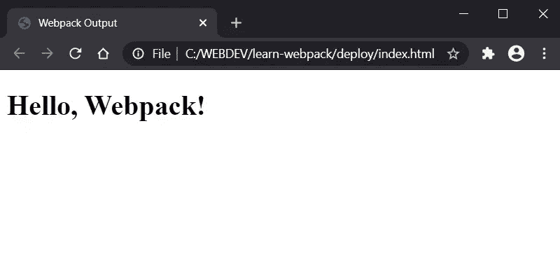
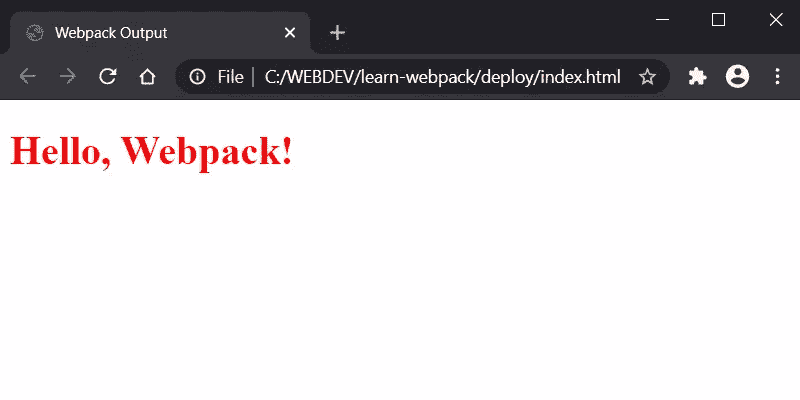
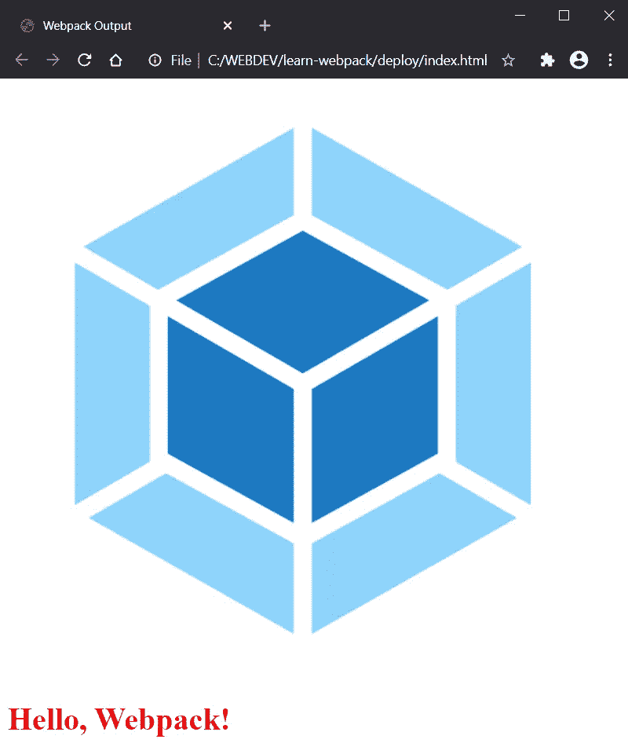
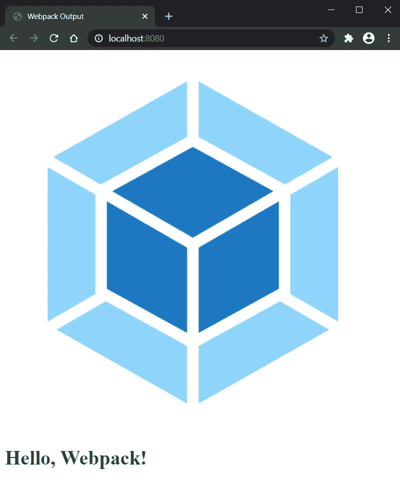

# Webpack 初学者指南

> 原文：<https://www.sitepoint.com/webpack-beginner-guide/>

如今，我们被迫使用许多辅助工具来简化、加速和优化我们的 web 开发工作流程。然而，这类工具通常会给堆栈增加额外的复杂性。因此，我们需要利用额外的时间和精力来学习、理解和正确使用这些工具。对于 [webpack](https://webpack.js.org/) 来说也是如此。

第一次使用 webpack 时，可能很难理解它的工作原理以及应该如何使用。虽然它有很好的文档，但对于新手来说，它可能令人望而生畏，并且它有一个陡峭的学习曲线。但是，webpack 是值得学习的，从长远来看可以节省相当多的时间和精力。在本教程中，我将介绍所有的核心概念，以帮助您开始。

注意:在本教程中，我使用的是 webpack 5.9.0。

## 什么是 Webpack？

作为其核心，webpack 是一个静态模块捆绑器。在一个特定的项目中，webpack 将所有文件和资源视为模块。在引擎盖下，它依赖于依赖图。依赖图描述了模块如何使用文件间的引用(**要求**和**导入**语句)相互关联。通过这种方式，webpack 静态地遍历所有模块来构建图，并使用它来生成单个包(或几个包)——一个 JavaScript 文件，其中包含来自所有模块的代码，这些模块以正确的顺序组合在一起。“静态”意味着，当 webpack 构建其依赖图时，它不执行源代码，而是将模块及其依赖关系缝合成一个包。这可以包含在你的 HTML 文件中。

现在，为了扩展以上粗略的概述，让我们来探索一下 webpack 使用的主要概念。

## Webpack 主要概念

Webpack 有一些主要概念，我们需要在深入研究它的实际实现之前清楚地理解它们。让我们逐一检查它们:

*   **入口**:入口点是 webpack 用来开始构建其内部依赖图的模块。从那里，它确定入口点依赖于哪些其他模块和库(直接和间接),并将它们包含在图中，直到不存在依赖关系。默认情况下，entry 属性被设置为`./src/index.js`，但是我们可以在 webpack 配置文件中指定一个不同的模块(甚至多个模块)。
*   **Output**:Output 属性指示 webpack 将包发送到哪里，以及为文件使用什么名称。这个属性的默认值对于主包是`./dist/main.js`,对于其他生成的文件是`./dist`——比如图像。当然，我们可以根据需要在配置中指定不同的值。
*   **加载器**:默认情况下，webpack 只理解 JavaScript 和 JSON 文件。为了处理其他类型的文件并将它们转换成有效的模块，webpack 使用加载器。加载器转换非 JavaScript 模块的源代码，允许我们在将这些文件添加到依赖图之前对它们进行预处理。例如，加载器可以将文件从 CoffeeScript 语言转换为 JavaScript，或者将内联图像转换为数据 URL。使用加载器，我们甚至可以直接从 JavaScript 模块中导入 CSS 文件。
*   **插件**:插件用于任何其他加载器不能做的任务。他们为我们提供了广泛的资产管理、捆绑包最小化和优化等解决方案。
*   典型地，当我们开发我们的应用程序时，我们使用两种类型的源代码——一种用于开发版本，一种用于生产版本。Webpack 允许我们通过将模式参数更改为**开发**、**生产**或**无**来设置我们想要生产哪一个。这允许 webpack 使用对应于每个环境的内置优化。默认值是**生产**。**无**模式意味着不使用默认优化选项。要了解更多关于 webpack 在**开发**和**生产**模式中使用的选项，请访问[模式配置页面](https://webpack.js.org/configuration/mode/)。

## Webpack 如何工作

在这一节中，我们将研究 webpack 是如何工作的。即使是一个简单的项目也包含 HTML、CSS 和 JavaScript 文件。此外，它还可以包含字体、图像等资源。因此，一个典型的 webpack 工作流将包括设置一个带有适当 CSS 和 JS 链接的`index.html`文件，以及必要的资产。此外，如果你有许多相互依赖的 CSS 和 JS 模块，它们需要被优化并适当地组合在一个单元中，以备生产。

要做到这一切，webpack 依赖于配置。从版本 4 和更高版本开始，webpack 提供了合理的默认设置，因此不需要创建配置文件。然而，对于任何重要的项目，您都需要提供一个特殊的`webpack.config.js`文件，它描述了文件和资产应该如何转换以及应该生成什么样的输出。这个文件可以很快变成一个整体，这使得很难理解 webpack 是如何工作的，除非你知道它工作背后的主要概念。

基于所提供的配置，webpack 从入口点开始，并解析它在构建依赖图时遇到的每个模块。如果一个模块包含依赖关系，这个过程将针对每个依赖关系递归执行，直到遍历完成。然后 webpack 将项目的所有模块打包成少量的包——通常只有一个——由浏览器加载。

## Webpack 5 中的新功能

webpack 5 版本[于 2020 年 10 月](https://webpack.js.org/blog/2020-10-10-webpack-5-release/)发布。这篇文章很长，探讨了对 webpack 的所有更改。不可能提到所有的变化，对于这样的初学者指南也没有必要。相反，我会试着列出一个小清单，列出一些重点:

*   持久缓存提高了构建性能。开发人员现在可以启用基于文件系统的缓存，这将加快开发构建。
*   长期缓存也得到了改善。在 webpack 5 中，对不影响最小化包版本(注释、变量名)的代码所做的更改不会导致缓存失效。此外，添加了新的算法，以确定的方式为模块和块分配短数字 id，为导出分配短名称。在 webpack 5 中，它们在生产模式下是默认启用的。
*   由于更好的树抖动和代码生成，改进了包的大小。由于新的嵌套树摇动特性，webpack 现在能够跟踪对导出的嵌套属性的访问。CommonJs 树抖动允许我们消除未使用的 CommonJs 导出。
*   支持的最低 Node.js 版本已从 6 增加到 10.13.0 (LTS)。
*   代码库被清理。webpack 4 中标记为不推荐使用的所有项目都将被删除。
*   自动 Node.js 聚合填充被删除。webpack 的早期版本已经包含了像`crypto`这样的本地 Node.js 库的 polyfills。在许多情况下，它们是不必要的，并且会显著增加包的大小。这就是 webpack 5 停止自动填充这些核心模块并专注于前端兼容模块的原因。
*   作为开发的改进，webpack 5 允许我们传递目标列表，并且还支持目标的版本。它提供公共路径的自动确定。此外，它还提供了自动的、惟一的命名，这可以防止多个 webpack 运行时之间的冲突，这些运行时使用相同的全局变量来加载块。
*   `webpack-dev-server`命令现在是`webpack serve`。
*   [引入资产模块](https://webpack.js.org/guides/asset-modules/)，取代`file-loader`、`raw-loader`、`url-loader`的使用。

请打开上面的公告链接，找到关于所有更新的更完整和详细的信息。

最后，如果你来自 webpack 4，这里有[迁移指南](https://webpack.js.org/migrate/5/)。

## 入门指南

*注:你可以在 [GitHub repo](https://github.com/sitepoint-editors/learn_webpack) 中找到我们项目的文件。*

既然有了扎实的理论基础，那就来实践一下吧。

首先，我们将创建一个新目录并切换到它。然后我们将初始化一个新项目:

```
mkdir learn-webpack
cd learn-webpack
npm init -y 
```

接下来，我们需要在本地安装 webpack 和 webpack CLI(命令行界面):

```
npm install webpack webpack-cli --save-dev 
```

现在，生成的`package.json`的内容应该类似如下:

```
{
  "name": "learn-webpack",
  "version": "1.0.0",
  "description": "",
  "main": "index.js",
  "scripts": {
    "test": "echo \"Error: no test specified\" && exit 1"
  },
  "keywords": [],
  "author": "",
  "license": "ISC",
  "devDependencies": {
    "webpack": "^5.9.0",
    "webpack-cli": "^4.2.0"
  }
} 
```

除了作为一个包管理器，`npm`还可以作为一个简单的任务运行器。我们可以创建 webpack 任务，方法是在`package.json`文件的`scripts`部分中包含任务的名称，后面跟着它的指令。让我们现在试试这个。打开`package.json`，将`scripts`对象改为如下:

```
"scripts": {
  "test": "echo \"Error: no test specified\" && exit 1",
  "dev": "webpack --mode development",
  "build": "webpack --mode production"
}, 
```

在`scripts`属性中，`npm`允许我们通过名称引用本地安装的 Node.js 包。我们使用那个和`--mode`标志来定义`dev`和`build`任务，它们将分别在开发(`npm run dev`)和生产(`npm run build`)模式下运行 webpack。

在我们测试刚刚创建的任务之前，让我们创建一个`src`目录，并在其中放一个`index.js`文件，这样它就包含了`console.log("Hello, Webpack!");`。现在我们已经可以运行`dev`任务以开发模式启动 webpack:

```
$ npm run dev

> learn-webpack@1.0.0 dev C:\WEBDEV\learn-webpack
> webpack --mode development

[webpack-cli] Compilation finished
asset main.js 874 bytes [emitted] (name: main)
./src/index.js 31 bytes [built] [code generated]
webpack 5.9.0 compiled successfully in 122 ms 
```

正如我之前提到的，webpack 将默认入口点设置为`./src/index.js`，将默认输出设置为`./dist/main.js`。因此，当我们运行`dev`任务时，webpack 所做的就是从`index.js`文件中获取源代码，并将最终代码捆绑到`main.js`文件中。

太好了！它像预期的那样工作。但是为了验证我们得到了正确的输出，我们需要在浏览器中显示结果。为此，让我们在`dist`目录中创建一个`index.html`文件:

```
<!doctype html>
<html>
  <head>
    <title>Getting Started With Webpack</title>
  </head>
  <body>
    <script src="main.js"></script>
  </body>
</html> 
```

现在，如果我们在浏览器中打开文件，我们应该会看到 *Hello，Webpack！*控制台中的消息。


到目前为止，一切顺利。但是手动编写我们的`index.html`文件在某些情况下会有问题。例如，如果我们更改入口点的名称，生成的包将被重命名，但是我们的`index.html`文件仍将引用旧名称。因此，每次重命名入口点或添加新入口点时，我们都需要手动更新 HTML 文件。幸运的是，我们可以很容易地用`html-webpack-plugin`解决这个问题。让我们现在安装它:

```
npm install html-webpack-plugin@next --save-dev 
```

*注意:注意我输入了`html-webpack-plugin@next`，而不仅仅是`html-webpack-plugin`。在撰写本文时，前者是 webpack 5 的正确版本，后者是 webpack 4 的版本。这在未来可能会改变，所以对于实际版本，请检查 [html-webpack-plugin repo](https://github.com/jantimon/html-webpack-plugin) 。*

此时，要激活插件，我们需要在根目录下创建一个`webpack.config.js`文件，内容如下:

```
const HtmlWebpackPlugin = require("html-webpack-plugin");
const path = require('path');

module.exports = {
  plugins: [
    new HtmlWebpackPlugin({
      title: "Webpack Output",
    }),
  ],
}; 
```

如您所见，要激活一个 webpack 插件，我们需要将它包含在文件中，然后将其添加到`plugins`数组中。如果需要，我们还会将选项传递给插件。请参见`html-webpack-plugin`回购协议，了解[所有可用选项](https://github.com/jantimon/html-webpack-plugin#options)以及[编写和使用自己的模板](https://github.com/jantimon/html-webpack-plugin#writing-your-own-templates)的能力。

让我们现在运行 webpack，看看会发生什么:

```
$ npm run dev

> learn-webpack@1.0.0 dev C:\WEBDEV\learn-webpack
> webpack --mode development

[webpack-cli] Compilation finished
asset main.js 874 bytes [compared for emit] (name: main)
asset index.html 234 bytes [emitted]
./src/index.js 31 bytes [built] [code generated]
webpack 5.9.0 compiled successfully in 151 ms 
```

让我们打开`index.html`。正如我们所见，插件自动为我们创建了一个更新的`index.html`文件，它使用了配置中的`title`选项:

```
<!DOCTYPE html>
<html>
  <head>
    <meta charset="utf-8">
    <title>Webpack Output</title>
    <meta name="viewport" content="width=device-width, initial-scale=1">
    <script defer src="main.js"></script>
  </head>
  <body>
  </body>
</html> 
```

现在让我们扩展我们的项目，并为`entry`和`output`属性指定自定义名称。在`webpack.config.js`中，我们在`plugins`属性前添加以下内容:

```
entry: {
  main: path.resolve(__dirname, './src/app.js'),
},
output: {
  filename: '[name].bundle.js',
  path: path.resolve(__dirname, 'deploy')
}, 
```

这里，我们将入口文件改为`app.js`，将输出文件夹改为`deploy`。我们还稍微修改了生成的包文件的名称。现在它将以条目的名称(“main”)开始，后面是单词“bundle”和文件扩展名`.js`。

现在，我们将创建一个`src/component.js`文件:

```
export default (text = "Hello, Webpack!") => {
  const element = document.createElement("h1");

  element.innerHTML = text;

  return element;
}; 
```

接下来，我们将`index.js`重命名为`app.js`以反映我们的更改，并将其内容替换为以下内容:

```
import component from './component';

document.body.appendChild(component()); 
```

现在，让我们再次运行 webpack:

```
$ npm run dev

> learn-webpack@1.0.0 dev C:\WEBDEV\learn-webpack
> webpack --mode development

[webpack-cli] Compilation finished
asset main.bundle.js 4.67 KiB [emitted] (name: main)
asset index.html 241 bytes [emitted]
runtime modules 668 bytes 3 modules
cacheable modules 230 bytes
  ./src/app.js 79 bytes [built] [code generated]
  ./src/component.js 151 bytes [built] [code generated]
webpack 5.9.0 compiled successfully in 194 ms 
```

让我们检查并澄清来自 webpack 输出的信息。在“编译完成”消息之后，您可以看到在`deploy`目录中生成的文件(`main.bundle.js`和`index.html`)。在它们下面，您可以看到源文件:入口模块(`app.js`)和它的依赖项(`component.js`)。

所以现在，在`deploy`文件夹中，我们有了新生成的包文件`main.bundle.js`。如果我们在浏览器中打开`index.html`文件，我们应该会看到 *Hello，Webpack！*显示在页面上。



同样，如果我们检查`index.html`的源代码，我们会看到`script`标签中的`src`属性的值被更新为`main.bundle.js`。

此时，我们可以删除 webpack 最初生成的`dist`文件夹，因为我们不再需要它了。

## 将现代 JavaScript 移植到 ES5

在这一节中，我们将发现如何将 ES6 转换成在所有浏览器中都能工作的符合 ES5 的代码。让我们从运行以下命令开始:

```
npm run dev -- --devtool inline-source-map 
```

这里，我运行 webpack，将`devtool`选项设置为`inline-source-map`，以使代码更具可读性。这样我可以更清楚地演示从 ES6 到 ES5 的代码转换。

接下来，我们来打开`main.bundle.js`:

```
/***/ "./src/component.js":
/*!**************************!*\
  !*** ./src/component.js ***!
  \**************************/
/*! namespace exports */
/*! export default [provided] [no usage info] [missing usage info prevents renaming] */
/*! other exports [not provided] [no usage info] */
/*! runtime requirements: __webpack_exports__, __webpack_require__.r, __webpack_require__.d, __webpack_require__.* */
/***/ ((__unused_webpack_module, __webpack_exports__, __webpack_require__) => {

__webpack_require__.r(__webpack_exports__);
/* harmony export */ __webpack_require__.d(__webpack_exports__, {
/* harmony export */   "default": () => __WEBPACK_DEFAULT_EXPORT__
/* harmony export */ });
/* harmony default export */ const __WEBPACK_DEFAULT_EXPORT__ = ((text = "Hello, Webpack!") => {
  const element = document.createElement("h1");

  element.innerHTML = text;

  return element;
});

/***/ }) 
```

正如您所看到的，默认情况下，来自`component.js`模块的现代 ES6 特性(箭头函数和`const`声明)没有转换成符合 ES5 的代码。为了让我们的代码在旧的浏览器中工作，我们必须添加 Babel loader:

```
npm install babel-loader @babel/core @babel/preset-env --save-dev 
```

然后，在`webpack.config.js`中的`output`属性后添加`module`:

```
module: {
  rules: [
    {
      test: /\.js$/,
      exclude: /node_modules/,
      use: {
        loader: 'babel-loader',
        options: {
          presets: ['@babel/preset-env']
        }
      }
    },
  ]
}, 
```

当我们为 webpack 加载器定义规则时，通常需要定义三个主要属性:

*   `test`，描述应该转换什么样的文件。
*   `exclude`，它定义了不应该从加载程序处理的文件，如果我们有这样的文件的话。
*   `use`，它告诉匹配的模块应该使用哪个(哪些)加载程序。在这里，我们还可以设置加载器选项，就像我们刚刚对`presets`选项所做的那样。

再次运行以下命令:

```
npm run dev -- --devtool inline-source-map 
```

这一次，`main.bundle.js`中的代码被编译:

```
/***/ "./src/component.js":
/*!**************************!*\
  !*** ./src/component.js ***!
  \**************************/
/*! namespace exports */
/*! export default [provided] [no usage info] [missing usage info prevents renaming] */
/*! other exports [not provided] [no usage info] */
/*! runtime requirements: __webpack_exports__, __webpack_require__.r, __webpack_require__.d, __webpack_require__.* */
/***/ ((__unused_webpack_module, __webpack_exports__, __webpack_require__) => {

__webpack_require__.r(__webpack_exports__);
/* harmony export */ __webpack_require__.d(__webpack_exports__, {
/* harmony export */   "default": () => __WEBPACK_DEFAULT_EXPORT__
/* harmony export */ });
/* harmony default export */ const __WEBPACK_DEFAULT_EXPORT__ = (function () {
  var text = arguments.length > 0 && arguments[0] !== undefined ? arguments[0] : "Hello, Webpack!";
  var element = document.createElement("h1");
  element.innerHTML = text;
  return element;
});

/***/ }) 
```

完美。现在，我们可以使用现代的 JS 特性，webpack 将转换我们的代码，以便它可以由旧的浏览器执行。

## 使用样式

在这一节中，我们将看到如何向我们的项目添加一些样式。为此，我们需要安装两个加载器:

```
npm install css-loader style-loader --save-dev 
```

*   将 CSS 解析成 JavaScript 并解析任何依赖关系
*   `style-loader`将我们的 CSS 输出到 HTML 文档中的`<style>`标签中。

让我们在`webpack.config.js`中添加必要的配置:

```
module: {
  rules: [
    ...
    { 
      test: /\.css$/, 
      use: ["style-loader", "css-loader"] 
    },
  ]
}, 
```

在这里，加载程序的顺序很重要。它们以相反的顺序进行评估，即从右到左，从下到上。在我们的例子中，首先计算的是`css-loader`，然后是`style-loader`。

现在，让我们创建一个文件`src/style.css`:

```
h1 {
  color: red;
} 
```

然后我们将其导入`app.js`:

```
import './style.css'; 
```

当我们运行 webpack ( `npm run dev`)然后打开`index.html`时，我们应该会看到 **Hello，webpack！**红色消息。



## 资产管理

大多数情况下，您的项目将包含图像、字体等资源。在 webpack 4 中，为了处理资产，我们必须安装一个或多个以下加载器:`file-loader`、`raw-loader`和`url-loader`。在 webpack 5 中，正如我们之前看到的，这已经不再需要了，因为新版本自带内置的[资产模块](https://webpack.js.org/guides/asset-modules/)。

在这里，我们将探索一个带有图像的例子。让我们在`webpack.config.js`中添加新规则:

```
module: {
  rules: [
    ...
    { 
      test: /\.(?:ico|gif|png|jpg|jpeg)$/i,
      type: 'asset/resource',
    },
  ]
}, 
```

这里使用类型`asset/resource`代替`file-loader`。

现在，为了测试加载程序，我们将在`src`目录中创建一个`image-component.js`文件，包含以下内容:

```
import image from "./image.png";

const img = document.createElement("img");
img.src = image;
document.body.appendChild(img); 
```

这里，我们将图像作为一个模块导入，并使用它来创建一个``标签。要让上面的代码工作，你需要[下载镜像](https://github.com/webpack/media/blob/master/logo/icon-square-small.png)，然后重命名为`image.png`，放在`src`目录下。

下一件事是在`app.js`中导入我们的图像组件:

```
import './image-component'; 
```

瞧啊。现在，当我们运行 webpack ( `npm run dev`)并打开页面时，我们应该会看到 **Hello，webpack 上方的图像！**消息。



如果你现在看一下`deploy`文件夹，你会发现其中生成了三个文件:`a1af828b4e65d37668e1.png`、`main.bundle.js`和`index.js`。以下是 webpack 在幕后所做的工作:图像被添加到`deploy`文件夹中，并被赋予一个唯一的散列，后跟图像扩展名。然后图像作为一个模块包含在新生成的`main.bundle.js`文件中。最后，参照`main.bundle.js`文件生成一个`index.html`文件。

## 使用`webpack-dev-server`加速开发过程

目前，我们需要在每次进行更改时重新构建代码。幸运的是，webpack 提供了一个实时重载的 web 服务器，它可以自动构建和刷新页面。要安装它，请运行以下命令:

```
npm install webpack-dev-server --save-dev 
```

我们需要在`package.json`中更新我们的`dev`脚本，以使用服务器:

```
"dev": "webpack serve --mode development" 
```

现在让我们通过在`output`后添加以下属性来配置`webpack.config.js`中的服务器:

```
devServer: {
  contentBase: './deploy',
  open: true
}, 
```

这告诉`webpack-dev-server`提供来自`deploy`目录的文件，并自动打开入口页面。

现在，如果我们运行 webpack ( `npm run dev`)，我们应该看到页面是如何在 [http://localhost:8080](http://localhost:8080) 上的浏览器中自动打开的。

*注意:在运行 webpack-dev-server 后，您将不会在`deploy`文件夹中找到任何文件(它将是空的),因为服务器在编译后不会写入任何输出文件。相反，它将包文件保存在内存中，并像它们是挂载在服务器根路径上的真实文件一样提供服务。更多信息参见[web pack 开发指南](https://webpack.js.org/guides/development/#using-webpack-dev-server)。然而，当您运行`build`命令时，`deploy`文件夹将会像预期的那样被生成的文件填充。*

如果我们现在更改任何源文件并保存它们，web 服务器将在代码编译后自动重新加载页面。例如，尝试将 CSS 文件中的颜色属性更改为绿色，您应该会看到页面中的颜色是如何适当更新的。



## 清理输出

随着我们项目的进展，`deploy`文件夹可能会变得非常混乱。在每次构建时，webpack 都会生成包，并将它们放在`deploy`文件夹中，但是它不会跟踪项目实际使用了哪些文件。因此，在每次构建之前清理`deploy`文件夹是一个好习惯，这样只会生成正在使用的文件。为此，我们需要安装和配置`clean-webpack-plugin`:

```
npm install clean-webpack-plugin --save-dev 
```

在`webpack.config.js`中:

```
const { CleanWebpackPlugin } = require('clean-webpack-plugin');

...

plugins: [
  ...
  new CleanWebpackPlugin()
], 
```

现在，运行 webpack ( `npm run build`)并检查`deploy`文件夹。您现在应该只看到从构建中生成的文件，没有旧的和未使用的文件。为了测试它，创建一个在项目中没有使用的简单文本文件，并再次运行`build`脚本。编译后，文件将被删除。

## 结论

Webpack 是一个有用且强大的工具。本教程只介绍了核心概念，但是 webpack 提供了更多的特性、插件和应用它们的不同技术，随着知识的增长，您可以采用这些技术。以下是我建议的进一步探索 webpack 功能的资源列表:

*   [官方 webpack 文档](https://webpack.js.org/concepts)。该文档为您提供了有关 webpack 的主要概念和配置的结构化信息，以及您可以在项目中使用的插件和加载器、基本指南和 API 参考。
*   [Webpack 5:从学徒到大师](https://survivejs.com/webpack/foreword/)。深入探究 webpack 各个方面的完整手册。由 webpack 的核心开发者 Juho vepsl inen 撰写。
*   Webpack:核心概念。webpack 的维护者之一 Sean Larkin 的一个很棒的视频入门课程。

## 分享这篇文章