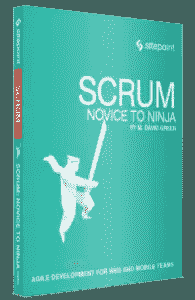
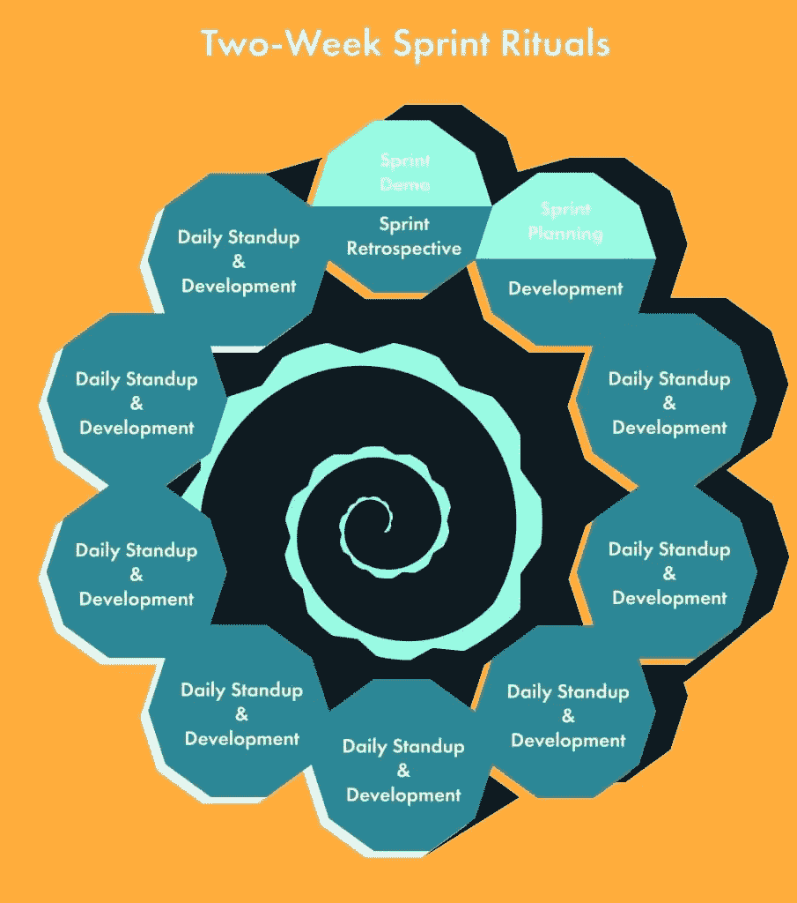

# 什么是 Scrum 仪式？

> 原文：<https://www.sitepoint.com/what-are-scrum-rituals/>

以下是摘自我们的书《Scrum:新手到忍者，作者是 M. David Green。世界各地的商店都有出售，或者你可以在这里买到电子书。

在 scrum 团队中工作的实践被组织成一系列的仪式。这些仪式标志着完成 sprint 工作过程中的关键事件。主持每一个仪式，并确保他们专注于他们的目标，并为了整个团队的利益产生期望的结果，这是 scrum master 的责任。

## 什么是仪式？

每个 **仪式** 都是实时的面对面聚会，它让人们远离他们正在做的工作，并为他们提供机会就工作的背景进行有针对性的交流。Scrum 更喜欢交流而不是文档，这就是为什么它为各种有用的面对面交流提供了定期和明确定义的机会。

### 不是另一个会议！

许多在公司工作的人对会议过敏，这是有充分理由的。他们可能被太多的会议压垮了，占用了他们太多的时间，却没有产生任何结果。他们可能习惯于召开会议来解决每一个小问题，而没有任何人负责确保问题得到解决。会议会让人们从他们正在做的工作中分心，打断他们的注意力，通常不会带来多少回报。

面对现实吧，大多数公司开会时都是 *可怕的* 。

与通常的会议不同，scrum 中的每个仪式都有一个特定的目标，针对特定的受众，有一个完成目标的明确的时间框架，并有一组可预测的结果。每个参加仪式的人在仪式开始前都知道期待什么，如何表现，以及承诺的结果应该是什么。scrum 的仪式关注他们的总体目标，尊重参与者的时间和注意力。

### 时间拳击

scrum 仪式中最重要的概念之一是 **时间盒** 。主持仪式的 scrum master 有责任让每个人都清楚地知道他们在这个仪式上投入了多长时间，以及他们在这个仪式中的任何一点上进行了多远。

通常 scrum masters 会在房间前面的白板上写下时间，或者保持一个大时钟可见，这样每个人都可以记录时间。(我曾带着一个标有“时间盒”的小立方体时钟参加仪式，并把它放在每个人都能看到的地方。)时间拳击的概念让仪式中所有积极的参与者在必要时鼓励彼此进入正题，并保持专注于仪式的目标。

### 注意:每个时间盒应该有多长？

团队在每个仪式上花费的时间长度通常取决于每个 sprint 分配的周数。唯一必须在 15 分钟时间内完成的仪式是每日站立。团队就每个仪式的时间框架达成一致，作为迭代和改进他们如何为 scrum 组织自己的过程的一部分。我在下面给团队提供了一些建议。

Scrum 通过在每个仪式的开始建立时间框，以及如何为仪式的不同方面分配时间，来显示它对每个参与者的时间和承诺的尊重。所有参与者都应该在仪式的时间范围内保持参与，并承诺除非所有参与者都同意延长，否则没有好的和实际的理由，仪式不会延长。

如果一个仪式似乎要超过它的时限，scrum master 应该征求每个人的同意，让仪式持续一段特定的时间。这样，每个人都预先知道要花多少时间做预算，如果预算需要延长，每个人都必须同意。

当然，我们都是人，在仪式中会出现一些次要的问题，感觉就像需要在当时和那里讨论一样。将注意力集中在手边的仪式上是 scrum 主管以及团队其他成员的责任。一个好的 scrum 大师需要跟踪这些问题，为了每个人的利益，保持对进行中的仪式的时间盒的尊重。

确保重要的次要讨论不被遗忘是一个共同的责任，但是 scrum 大师需要准备好在这个过程中扮演一个积极的角色。人们会更愿意搁置一个偏离主题的讨论，如果他们有信心以后还能继续的话。

### 冲刺的长度

在选择冲刺的长度时，团队需要做出一些选择。根据团队自己对完成的定义，Sprint 的长度应该允许团队期望完成的故事类型在一次 sprint 中完成。对于许多团队来说，仅仅一周的短时间冲刺与一周内容易完成的短篇故事相匹配。一些团队更喜欢处理无法在一周冲刺中完成的更复杂的故事，所以他们选择两周、三周、甚至四周或更长的冲刺。

冲刺的长度是另一个可以根据团队反馈修改的因素，但是对于一个团队来说，选择一个长度并坚持几次冲刺是很重要的。否则，团队可能永远不会从规律性中受益，因此他们可以学习如何一致地确定故事的大小，并从一个冲刺到下一个冲刺正确地估计它们。通常，更改 sprint 长度的选项可以通过改进故事的编写方式来解决，因此它们可以在 sprint 中完成。

### 注意:两周是一个很好的起点

对于网络和移动团队来说，两周的冲刺是一个很好的开始。两周的时间足够完成大多数与 web 和移动项目相关的故事，包括大多数情况下的发布过程。如果你的网络或移动团队刚刚开始使用 scrum，先尝试两周的冲刺周期是值得的，看看它有多适合你。

即使你的故事倾向于简短有限，一周冲刺也有值得考虑的缺点。一些较长的仪式会在每次冲刺时重复一次。有一周的冲刺意味着如此频繁地重复这些仪式可能会开始妨碍生产力。一些仪式，比如回顾，甚至可能在几周内被更改或忽略，这可能导致 scrum 迭代改进方面的崩溃。

倾向于产生更复杂故事的团队可能更喜欢长距离冲刺。请记住，超过两周的 sprint 意味着问题需要更长的时间才能浮出水面，并且对 backlog 的调整需要推迟到 sprint 完成之后。更长的冲刺也鼓励创造更复杂的故事。scrum 对于网络和移动团队的目标应该是创造简单而独特的故事。

这个图表代表了一个典型的 web 或移动开发冲刺的两周周期。每个更小的圆圈代表一个工作日，并且假设 sprint 从顶部开始，每两周循环一次，就标记出了惯例。

在接下来的几页中，我们将深入探讨这些习惯，确保您了解它们是如何工作的，以及它们如何应用于 web 和移动开发。

## 分享这篇文章