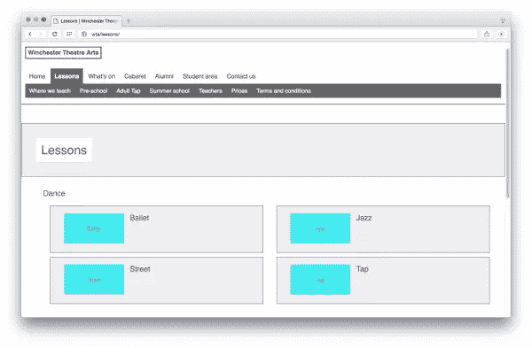
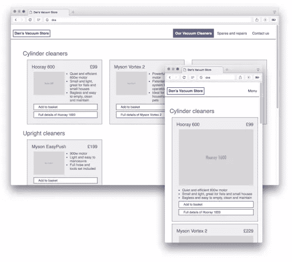
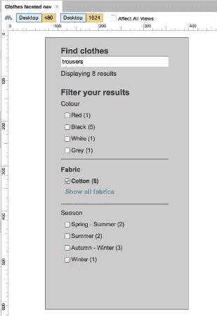

# UX:我们可以制作什么样的原型？什么是我们不能原型化的？

> 原文：<https://www.sitepoint.com/what-can-we-prototype-what-cant-we-prototype/>

以下是我们的书《设计 UX:原型制作 T2》的一小段摘录，作者是丹·古德温和本·科尔曼。这是原型制作的终极指南。SitePoint Premium 会员可以通过他们的会员身份访问，或者您可以在世界各地的商店购买一份。

## 我们能原型化什么？

简单来说，我们可能会考虑为我们可能会使用草图和线框来探索和设计的事物创建原型。

我们现在将回顾一些在网站设计中原型特别有用的项目。

### 信息架构和结构元素

将网站的结构以网站地图的形式呈现给项目团队和利益相关者通常是无效的。用这样的图表对结构元素进行用户测试更加困难。在更细的层次上，我们在测试和呈现信息架构的其他方面也有同样的问题，包括导航中的结构、行为和标签，或者分类法(比如用户可以用来细分和查询在线商店中的产品的类别)。

可以构建一个交互式原型，并用真实的结构元素填充它(例如，主要和次要页面导航、产品类别)。然后，我们可以测试这些结构:页面层次结构、导航行为，以及我们建议真实用户执行的真实任务的标签。我们可以用一种激动人心的、有形的方式向利益相关者展示我们的信息架构，让他们能够可视化和探索。

这特别有助于为原型加载真实内容，然后用于生产。我们可以从低保真度开始，将网站的结构加载到内容管理系统(CMS)数据库中作为原型。然后，我们可以通过添加占位符内容来增加保真度，然后进一步添加真实内容。然后，这些内容可能会用于生产实现中。这个我们会在[第 7 章](#chap7)详细讲。

### 布局和视觉层次

我们可以使用原型来设计、测试和交流组成页面的元素的整体布局和层次结构。这是一种我们传统上使用线框的设计。

以展示一系列真空吸尘器的网站为例。我们可能有一个按某种方式分组或分类的所有清洁工的列表；例如，每种清洁剂都有一个页面，显示规格、选项和用户评论。我们必须决定在列表中呈现什么内容，在一个更干净的页面上显示什么内容，以及如何布局。

我们可以使用来自用户研究的见解来帮助我们，例如不同类型的用户试图完成的任务，解决这些任务需要什么信息，以及什么被认为是重要/不重要的。从那里，我们可以为列表和单个页面提出一个建议的布局。然后我们可以在原型中实现这个提议，最好是使用一些真实的内容。

原型使我们能够向利益相关者提出建议，并在真实用户中进行测试。在原型的生命周期中，我们可以添加、删除和更改内容，也可以改变我们提出的布局。我们可以测试布局的小变化或激进的替代方案。如果我们原型的实现很好地分离了内容和表示，那么在保持基本内容不变的情况下改变布局的过程就很容易了。这意味着我们可以更快更容易地测试更多的布局。

### 互动元素

所有的网站都至少有一些交互元素(比如链接)，但是许多网站的交互元素更加复杂。这需要大量的用户界面设计。

考虑一个销售服装和配饰的电子商务网站的例子。用户在缩小服装搜索范围时往往有不同的要求，无论是尺寸、颜色、季节、服装类型、面料、品牌等等。这通常会导致电子商务商店的设计师考虑一种**分面导航模式**,在这种模式下，用户可以缩小几组标准的搜索范围——例如，中等尺寸、黄色和棉布——并迅速看到结果。

虽然听起来很简单，但这是一个非常复杂的设计特性。原型能够帮助我们尝试布局类别的想法，它们的交互方法，以及通过哪些类别来缩小结果的范围，这将极大地提高我们做到公正的机会。我们可以使用一组像样的代表性内容来快速实现一系列的想法，以呈现这些内容并与之交互。我们可以与利益相关者交流我们的想法，并与真实用户一起测试它们——在我们进行的过程中不断迭代、改变和试验。

如果没有原型，这种快速迭代只有在在线商店(至少)部分实现后才会发生。原型允许我们更早、更快、更便宜地完成它。

## 原型有哪些是*不能*做的？

到目前为止，我希望你对原型有很多想法，以及通过创建一个原型可以实现什么。也就是说，解决我们不可能用原型实现的事情是值得的。

### 使用定量研究来做决定

如果你想尝试一些设计理念，用一些标准来评估哪个“更好”(例如，更多的注册，更多的转化，最高的任务完成率)，原型可能帮不上忙。对于这些类型的测试，你需要一个大的样本量——通常是几千或几万；然而，利用定量研究做出这样的决定超出了本书的范围。

不过，值得指出的是，与草图或线框等替代方案相比，原型通常会帮助你在大量用户面前更成功地测试你的设计。这是因为用原型实现、共享、发布和运行测试，以及在其他方法之上迭代这些测试是很容易的。

### 完成/转换漏斗进度测试

试图通过用户测试来衡量任务完成/转换漏斗的成功(例如，电子商务网站的用户沿着销售漏斗前进了多远)通常不是一个好主意，无论是原型网站还是生产网站site point book*research UX:Analytics*:https://www . site point . com/premium/books/research-UX-Analytics中介绍了目标漏斗进展的定量测量。

这是因为在一个观察到的用户测试场景中，用户被激励去完成呈现给他们的任务，纯粹是因为他们是用户测试的参与者。我们可能期望听到类似“我现在已经放弃了”的评论，这在一定程度上是有用的。但是由于用户所说的和他们实际做的可能是完全不同的两件事，这样的评论只能在一定程度上有所帮助。当在自然环境中使用一个网站时，现实中的用户行为可能会非常不同，对糟糕设计的容忍度会低得多。

### 测试可访问性

大多数原型技术不能匹配最终的产品实现，因此，不能用于测试设计的可访问性；例如，衡量辅助技术用户访问内容和功能的能力。

通常，HTML 原型制作是以一种非常粗略和现成的方式完成的，所以编码标准和可访问性很少被提及。

可访问的实现是必不可少的，并且最好在发布之前在生产现场进行审计和测试。也就是说，如果您想测试原型中某些特性的可访问性(比如一个复杂的交互元素)，没有理由不按照相关标准构建这些特性并进行测试。

### 测试视觉设计的影响

一般来说，原型创建的保真度太低，无法测试视觉设计特征(如字体大小、背景颜色或边框)对设计视觉层次的影响。

一些原型制作工具和技术(如第 6 章中讨论的 InVision)确实允许从高保真设计模型中创建原型。因此，如果你能想出一个明智的用户测试策略，你可以用它来测试你的视觉设计变化的影响。

### 作为文件的唯一来源

比起全面的文档，敏捷(无论是小 A 还是大 A 敏捷)更喜欢工作软件，所以对于一些团队来说，仅仅依靠他们不断发展的原型来记录他们正在做的事情是很自然的。

原型本身并不记录创建设计的历史(尽管一个好的源代码控制工作流在这里会有所帮助)。因此，在开发原型时，注意记录版本之间的变化是很重要的。类似地，一个原型本身并不总是足以为完整的设计和开发提供足够的文档。此外，利益相关者或项目团队成员很容易因为没有点击原型的某个部分而错过重要的特性。

为了减轻这些问题，考虑如何生成足够的支持文档和决策历史，以便团队能够理解已经实现了什么以及为什么要实现。

## 分享这篇文章