# 什么是 Adobe XD(彗星计划)，你应该关心吗？

> 原文：<https://www.sitepoint.com/what-is-adobe-xd-or-project-comet-and-should-you-care/>

很长一段时间以来，我们一直在将 Sketch App 与 Adobe Photoshop 进行比较，因为坦率地说，Adobe 已经很久没有为严肃的用户界面设计师带来任何新鲜的东西了。嗯，直到“彗星计划”，也就是现在被吹捧为 Adobe XD。那么，什么是 Adobe XD，它对用户界面设计师有什么帮助？

几个月前，我们第一次听说了 Comet 项目(现在是 Adobe Experience Design CC T1，或简称为 T2 Adobe XD T3)，Windows 用户很高兴有机会拥有一个不局限于 macOS 用户的“类似草图”的用户界面设计应用程序。

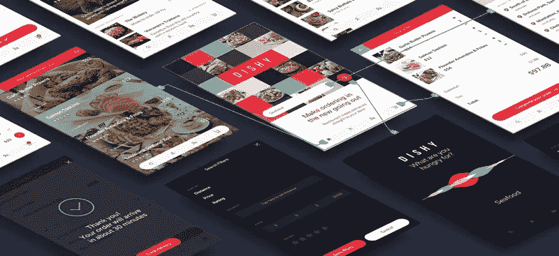

如果你喜欢 Sketch——或者如果你喜欢极简 ui、高度直观的工具、多种画板、内置的 iOS/Google 材料界面工具包、易于记忆的键盘快捷键和闪电般快速的导出工具——那么 Adobe Experience Design CC 肯定适合你。

[Adobe XD](http://www.adobe.com/products/experience-design.html) 仍处于“预览”阶段，目前也仅限于 Mac OS X**，但我确信在 2016 年末的某个时候，我们也会在 Windows 上看到 Adobe XD。我认为这是为了让 Adobe XD 在 Windows 上发布之前能够赢得 Sketch 用户的心。**

 **目前，Adobe XD 可以通过 Creative Cloud 应用程序免费使用。

## 看这个界面(或者缺少它)

有趣的是，Adobe XD 给人的感觉不像 Adobe 应用程序。与 Photoshop 和 Illustrator 相比，它的界面非常简洁；对于那些讨厌尝试新工具、喜欢坚持自己所知道的东西的人来说，这是非常小的威胁。

虽然它有自己的视觉美感(就像所有的 Adobe 应用程序一样)，但是 Sketch 使用的是原生的 Apple GUI。我不反对品牌应用程序，但是，我发现自己希望输入字段看起来更像输入字段。

All-all-in，界面看起来很有前途。

## 插入和选择对象

你可以在左侧看到插入工具，然而，键盘快捷键太简单了，你几乎不会用到它们。

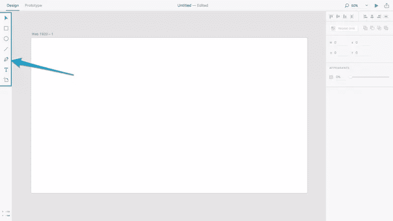

<small>通过工具栏插入对象</small>

*   选择: **V**
*   矩形: **R**
*   椭圆: **E**
*   行: **L**
*   笔: **P**
*   正文: **T**
*   画板: **A**

Sketch 用户将更习惯于在这里看到“层列表”,然而，Adobe XD 已经完全消除了它，我很惊讶我在没有它的情况下也能做得很好。如果您想要重新排序层层次，两个键盘快捷键可以为您做到这一点。

*   带进:**命令+]**
*   向后发送:**命令+[**

### 设计工具和造型

您可以使用右侧的界面设置图层样式。

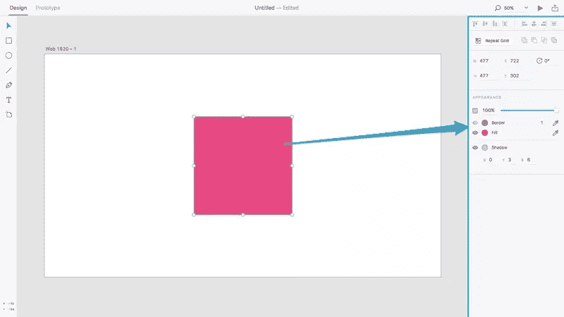

<small>寻找工具和样式层</small>

Adobe XD 的*看起来*没有任何矢量编辑工具，因为没有图标提示它，但事实上，你可以直接在画布上双击形状进入编辑模式，然后双击矢量的*点*将它们转换为贝塞尔曲线。我认为重要的工具实际上是隐藏的(没有界面，没有菜单选项，没有图标)，但是如果你仔细想想，它让工具栏**几乎是空的**。

Adobe 是否走得太远了，或者我们是否越来越意识到设计工具应该如何工作？也许他们说的是真的，最好的界面是*没有*界面！

Sketch 的工具栏中有一系列工具，还有文本标签，我一直认为这应该是一种标准的方法。由于 Adobe XD 决定保持整洁，工具栏几乎不存在了，取而代之的是，矢量重叠工具(加、减和相交)出现在样式化界面中，其他所有东西要么被排除在外，要么没有界面。

这里有一个 Adobe XD 的键盘快捷键列表，可以帮助你更有效地使用无界面工具。

<small>Adobe XD 与 Sketch:比较工具栏</small>

另一个缺失的元素是上下文/右键菜单，再次暗示任意特性的大量减少。

## 智能指南

智能指南于 2014 年引入 Photoshop，这是为了与 Sketch 竞争而添加的众多功能之一。这是 Adobe 的一个明显举措，表明他们在倾听用户的意见，但这也让 Photoshop 比以往任何时候都更庞大。

彗星计划需要发生，真的(如果他们想与 Sketch 竞争)。与 Photoshop 相比，Adobe XD 中的智能向导似乎更加直观；希望这一功能在未来变得更加易于使用，例如，很高兴看到 Adobe implement Sketch 的“option-hold”键盘功能，它允许您测量图层之间的距离。

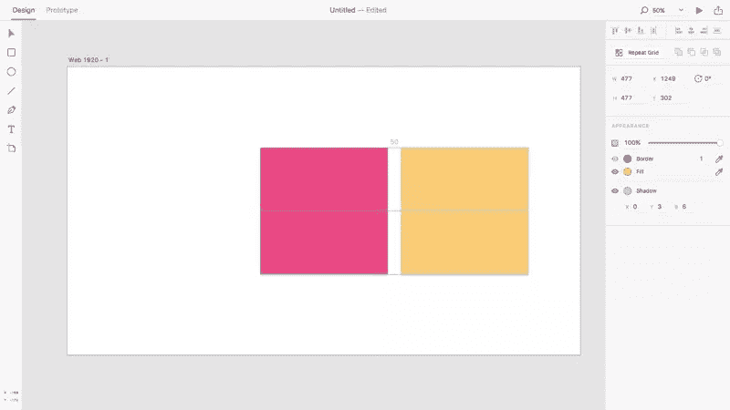

## 重复网格

[重复网格](https://www.sitepoint.com/adobe-xd-tutorial-a-pain-free-way-to-import-assets/)允许设计者选择层(或层的*组*)并将它们像堆叠的卡片一样水平和/或垂直平铺。当您对这些卡进行更改时，每个卡都会以同步方式更新，类似于 Sketch 的“符号”功能。

首先选择一个图层，点击“重复网格”按钮。

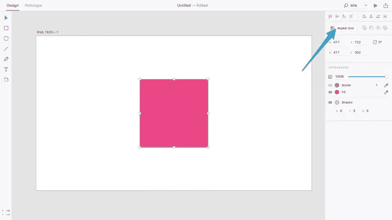

<small>激活重复网格</small>

之后，您可以拉动侧边手柄，根据需要多次重复这些卡片——您甚至可以单击每张卡片之间的间距，并用鼠标拖动来调整它。

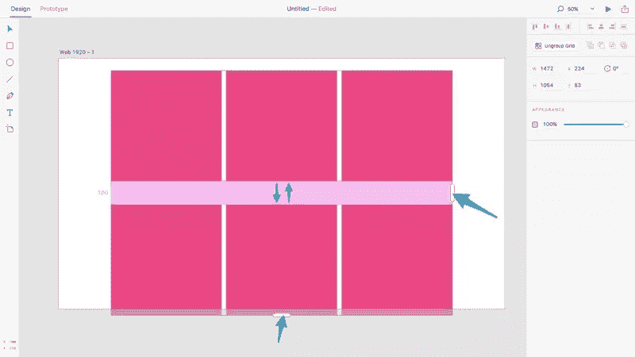

## 轻松分享

Adobe XD 提供了一个快速简单的画板共享功能，它类似于 Sketch 的*本地网络共享*，只是接收者不必与您在同一个互联网连接上，因为画板托管在 Adobe 服务器上。点击分享图标，让 Adobe 上传，然后点击“复制链接”。

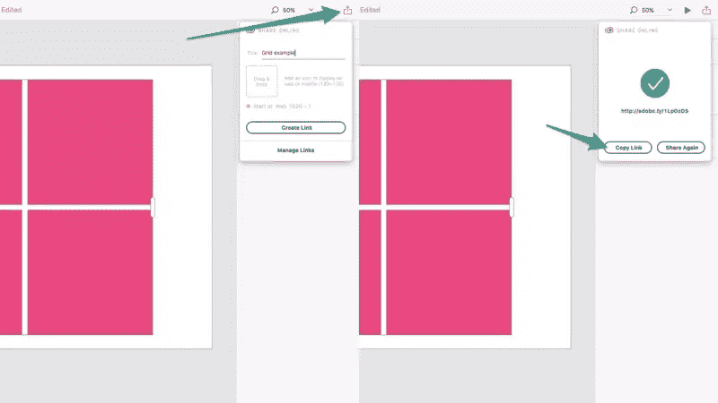

<small>共享画板</small>

如浏览器所示:

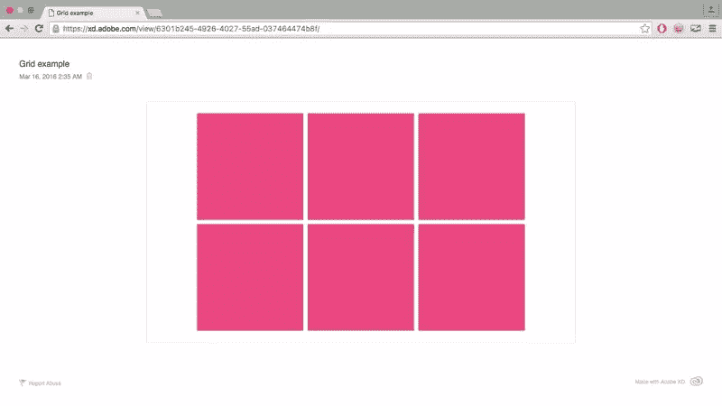

## 交互式原型

交互式原型是将 Adobe XD 与 Sketch 区分开来的杀手锏。到目前为止，Sketch 还相当静态，没有展示动态用户流或转换的功能，然而，Sketch 可能会依靠 [InVision App 对 Silver flow](https://medium.com/@abynim/silver-flows-joins-invision-faa3dd1fc250)的收购来构建一个 Sketch 插件，它可以处理这种类型的功能，并为您的工作流注入活力。

这一消息在 Adobe XD 发布的当天爆出绝非巧合，说明两者已经*是*对手了！

首先创建一个辅助画板/屏幕。之后，选择“原型”标签，选择一个层，并将其连接到第二画板。将出现一个模式，要求您定义当单击该层时，屏幕如何过渡到下一层。

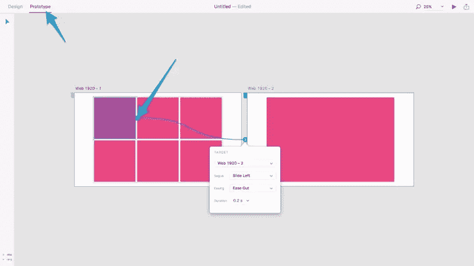

这才是奇迹真正发生的地方。

您可以再次分享该链接，让团队成员或客户自己(在浏览器中)浏览用户流，或者您可以自己录制*浏览网站/应用程序的*，并发送一个电影文件供他们观看。单击录制图标开始。

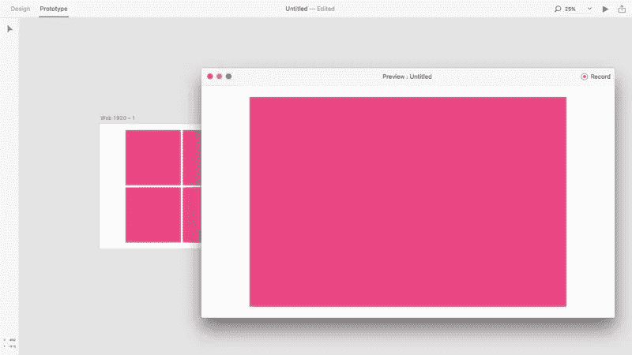

<small>记录用户流量</small>

## 导出资产

与智能指南一样，Adobe XD 在导出图像资产方面也有很大的改进空间。您可以一次选择多个层，但是 Adobe XD 不会记住您的导出设置，也不会提供任何自动化功能。

选择一个图层，使用键盘快捷键 **command+shift+e** ，然后选择设备类型、文件格式和分辨率。

Adobe XD 目前支持 PNG 和 SVG，但目前不支持 JPG、TIFF 或 PDF 格式

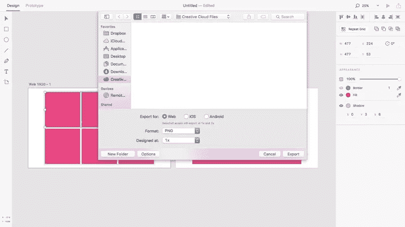

<small>导出图像资产</small>

## 结论

对于第一次尝试，我会说 Adobe XD 令人印象深刻，我强烈建议你至少尝试一下。如果你是一个 Windows 操作系统用户，不幸的是，你不得不为一个专业的用户界面设计工具再等一会儿，然而，当 Adobe XD 在 Windows 上发布时(*更新:它已经发布了！这将是一个完整的商业版本，具有丰富的功能增强和改进。*

对于 Sketch 的用户来说，目前我看不出有太多的动力去转换。Adobe XD 在取代 Sketch 之前还有许多障碍要跨越，但事实是 Adobe 正在宣传交互式原型是一项功能(在第一版中！)已经是保持关注 Adobe XD 的足够理由了。

**小心小品**！

*更新: [Adobe XD 成为 2017 年对抗 Sketch 的真正竞争者](https://www.sitepoint.com/adobe-xd-sketch-will-result-best-ux/)！他们引入了符号，现在甚至有了 Windows 版本！有兴趣了解更多关于设计、原型制作**和**与 Adobe XD 合作的细节吗？SitePoint Premium 会员可以下载我们的全新书籍 [Jump Start Adobe XD](https://www.sitepoint.com/premium/books/jump-start-adobe-xd) ！*

## 分享这篇文章**