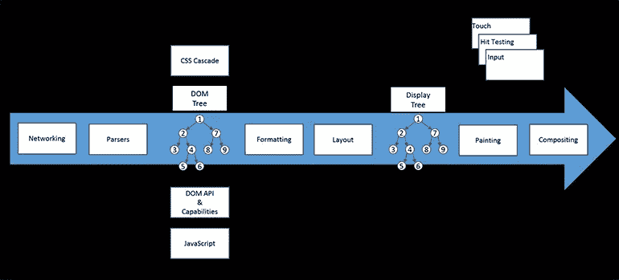
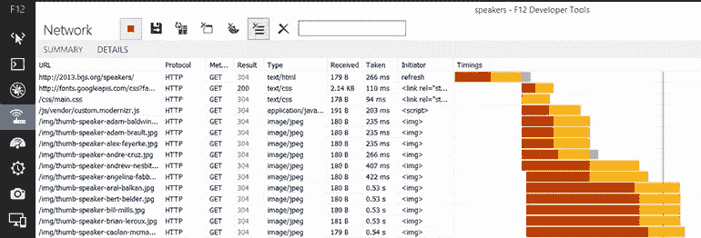
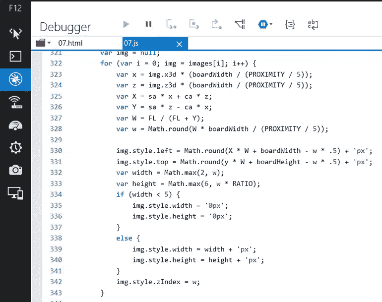
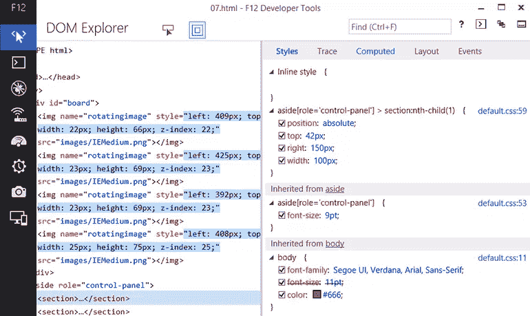

# 了解浏览器性能

> 原文：<https://www.sitepoint.com/what-makes-website-high-performance/>

### 什么是性能？

创建一个高性能的网站是一个微妙的舞蹈。许多人认为这只是关于 JavaScript 的执行速度。现实情况远不止如此。衡量绩效也有多种方式。

首先是加载时间。从用户点击链接或在地址栏中输入 URL 开始，加载该页面需要多长时间？甚至这也有多种定义，一方面是指完全加载页面需要多长时间，另一方面是用户对页面做一些有用的事情或做出响应之前需要多长时间的感知。

例如，您可以加载主要内容并使页面可用于交互，同时以编程方式返回到服务器并获取其余内容。

第二个性能指标更复杂。这是关于你的网站上的动画和交互在浏览器中的表现速度。

### Web 运行时架构

在这两种情况下，都需要对 web 运行时体系结构有很好的理解才能进行调优。我故意说 web 运行时架构而不是 IE 运行时架构，因为所有的浏览器在这个层面上都有大致相同的架构，因为它们都实现了相同的标准。它们的子系统可能有不同的名字，或者对一个子系统进行了优化，但一般来说，这是每个浏览器的流程。

大致来说，有三类事情需要考虑，影响网络的，影响 CPU 的和影响 GPU 的。

### 网络

首先发生的是联网。首次输入 URL 时，网络连接开始。现在，我将从一个 HTML 页面开始讨论，但事实是网络处理页面引用的任何类型的资源，包括 XML、JSON、IMG、PDF 等。不同的子系统对不同的资源起作用。

但是让我们从一个 HTML 文件开始。首先，浏览器开始下载 HTML 文件，当它被下载时，预处理开始。预处理在文件中查找浏览器可以开始下载的 HTML 引用的任何其他内容。这包括 CSS 文件、JavaScript 文件、图像或文件引用的任何内容。

这很重要，因为浏览器需要尽可能快地获得所有引用的内容，因为它们都是相互依赖的；HTML 依赖于 CSS 和 JavaScript，JavaScript 只能与从 HTML 构建的 DOM 对话，如果没有 JavaScript 可以操作的 HTML DOM，CSS 就没有任何样式。是的，这有点令人困惑，但希望它很快会变得更有意义。

要考虑的一个重要问题是，根据规范，浏览器只允许同时打开六个到任何给定服务器的连接，并且 HTML 中指定的每个资源都需要一个连接。当你查看包含大量图像内容、JavaScript 文件、CSS 文件(如脸书、Pinterest 等)的页面时，这听起来并没有太多联系。事实上，这听起来很严重。

它实际上是从规范开始的地方开始的，即两个同时连接！这种限制的原因是为了帮助服务器检测拒绝服务攻击(DOS 或 DDOS)，在这种攻击中，客户端打开尽可能多的连接，并尽可能多地占用服务器的带宽。关于 six limit 的好消息是它允许浏览器同时获取更多的内容。

我看到的绝大多数网站的所有内容都来自同一个网站。在有大量图片、CSS、JavaScript 或其他资源的情况下，最佳实践是将这些资源划分到不同的域中。这是使用 CDN(内容交付网络)的一个立竿见影的效果。这也是为什么使用通用 JavaScript 框架的托管版本比把它放在你自己的服务器上更有意义。

### 分析器

一旦一个项目被下载，它就被送到解析器。有几十种解析工具可以解析一切，包括但不限于 HTML、CSS、XML、XHTML、SVG、JavaScript 以及所有这些的变体。解析器的工作是创建内部数据结构，供浏览器在接下来的处理中使用。

我过度简化了解析器的工作，仅仅涵盖这些内容就可能是一篇完整的独立文章。目前讨论的重要部分是编写格式良好的文档——HTML、XML、XSLT、JSON…——可以缩短加载时间。

### 内部数据结构

浏览器需要许多不同的内部数据结构来完成其任务。其中最著名的是 DOM(文档对象模型)。如果您以前在网站上做过 JavaScript 编程，那么您可能在某种程度上与 DOM 有过交互。一般认为 DOM 是缓慢而痛苦的。现实要复杂得多。

每当有东西接触到 DOM，就会影响到下游的所有东西。为什么这是一个问题将变得更加清晰。

另一个需要理解的非常重要的结构是 CSS 级联。这是 HTML 和所有 CSS 文件中引用的所有 CSS 规则以及由 JavaScript 以编程方式设置的规则的合并。它包含了所有的优先顺序，比如什么优先于什么等等。

### Java Script 语言

JavaScript 沙箱是 JavaScript 解析、字节码生成、本机码生成和所有 JavaScript 执行的地方。这就是为什么 JavaScript 在浏览器中运行是安全的。这并不是说它是一种安全的语言。恰恰相反，这是一种非常强大的语言，如果不加控制，它可以在你的机器上肆虐。

相反，它是安全的，因为 JavaScript 只有两种方法可以跳出沙箱——调用 DOM API 或通过 XHR 请求调用网络。有大量的框架可以帮助完成这两项任务——jQuery 是最流行的框架之一。作为 DOM 的选择器，`$(“path statement”)`语法非常强大。`$.getJSON()`方法是一种非常简单且快速的 AJAX 请求方法。

### 样式–格式和布局

下一步，样式化，实际上涵盖了两个子系统。

第一个样式子系统是格式化。格式化很重要，因为 DOM 树完全不知道任何可视化的东西。它只知道元素和属性之间的父子关系。知道所有这些信息的是 CSS 级联。在格式化过程中，这些信息被连接起来，给出 DOM 元素的大小、颜色、背景、字体大小等等。

在这个子系统的末端，每个单独的元素都知道它们看起来像什么。

既然所有的 DOM 元素都知道它们看起来像什么，下一步就是弄清楚它们在页面上是如何组合在一起的——这就是布局过程。

CSS 本质上是基于块的布局。这意味着一切；图像、段落、div、跨度、事件形状(如圆形)实际上是 CSS 的块。最大的问题是一个街区有多大。HTML/CSS 本质上是一种基于流程的布局，除非有什么东西超越了它。这意味着，默认情况下，内容将移动到下一个合适的右上角。

因此，如果您的屏幕是 800 像素宽，并且您有四个元素，每个 300 像素宽，您将在顶部放置两个，第三个将放在下一行项目上。但是 CSS 级联可以覆盖这一点，并以关系或绝对方式定位项目。如果它是相关的，它的位置被指定为与屏幕上显示的前一个项目有一定的距离。

如果是绝对的，它会忽略所有的规则，并被放置在离页面右上角一定距离的地方。在这种情况下，它甚至可能会被放置在屏幕上的另一个项目上。

因此，布局引擎的主要工作是将所有的块放到屏幕上。这包括根据相对或绝对位置来定位对象，包装或缩放太宽的东西，以及所有其他需要进入俄罗斯方块闪电回合的东西。

在布局阶段的最后，浏览器有一个称为显示树的内部结构。这是一个有趣的数据结构。有些人会问为什么浏览器不直接使用 DOM 树，但是 DOM 树中的项目和显示树中的项目之间并不是一一对应的关系。虽然这可能需要一段时间来理解，但它是有意义的。

有些东西存在于 DOM 树中，但不存在于显示树中，比如元素 display:none 或输入字段 type=hidden。还有一些显示树中的东西不在 DOM 树中，比如有序列表中的数字( `<ol><li>asdf</li></ol>`)。

### 绘画和合成

此时，样式已经完成，显示树可以开始绘制了。这里有一个精心选择的词，因为浏览器已经准备好绘制，但还没有绘制。下一步需要硬件告诉浏览器下一次在屏幕上绘画。显示器一秒钟只能画这么多次。大多数现代电脑每秒钟能做 60 次，因此刷新率为 60 赫兹。

这意味着在大多数显示器上，刷新间隔是 1000/60(毫秒除以刷新率),大约是 16.67 毫秒。这听起来不是很多时间，但实际上，现代 I7 处理器可以运行大约 2138333333 条指令(根据维基百科每秒指令数/60 的记录，每秒数百万条指令)。我和你之间，这是一大堆指令。

它不是无限的，但是很多。这意味着在显示器刷新之间，计算机大约可以执行 35638889 条指令。

当监视器准备喷漆时，它发送硬件中断，启动喷漆周期。此时，浏览器将页面的层绘制到表面，对于 IE 来说是 DirectX 表面，这些表面被合成并显示在监视器上，供用户通过桌面窗口管理器(DWM)欣赏。

### 互动

此时，浏览器已经在屏幕上显示了一些内容，所以现在是加载时间。不过目前还没有动画，也没有任何互动。

交互包括鼠标、指针或键盘事件。所有这些都以某种形式或方式触及页面。当用户以某种方式触摸屏幕时，浏览器将不得不查看格式和布局，以了解被触摸的内容。然后，它必须查看 DOM，看是否有相应的事件需要在该项被触摸时被触发。如果发现了一个事件，那么 JavaScript 可以启动并执行事件代码，触及 DOM 树。

希望在这一点上你能看到问题所在。触摸 DOM 树意味着显示树不再是 DOM 的准确表示。这意味着浏览器需要重做布局和格式，并准备重新绘制。

这就是我之前所说的将 DOM 描述为“慢”是复杂的意思。并不是说操作 DOM 本身特别慢。缓慢的是，触摸它会产生多米诺骨牌效应，迫使其他子系统触发。

### 概述 Web 运行时架构

希望这能让您对整个 web 运行时架构有一个大致的了解。没有一个特定的组件驱动你的站点的性能。这是无数的事情，事实上，有时专注于一件事会导致另一件事遭受痛苦。例如，如果您将所有 JavaScript 文件合并成一个文件，那么只需要下载一个文件，但这也意味着您的页面可能会被阻止，直到下载并解析完整个 JavaScript 文件。

理解怎样做才能获得最佳性能，减少这些决策的影响，这是一个好的和真正伟大的 web 开发人员之间的区别。

## 分享这篇文章