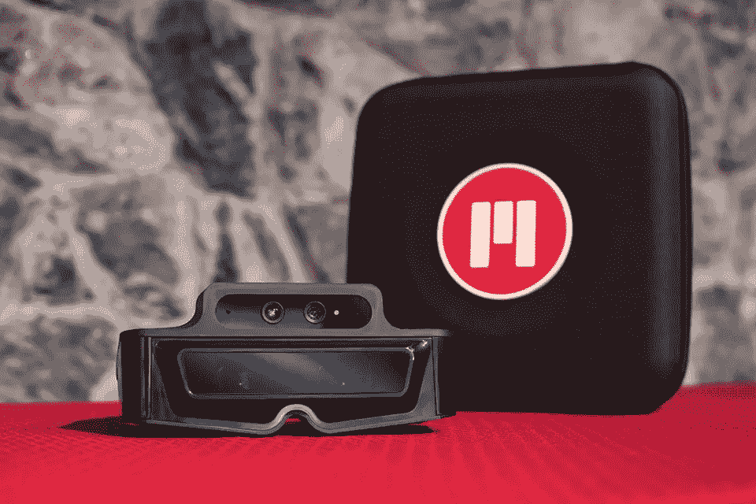
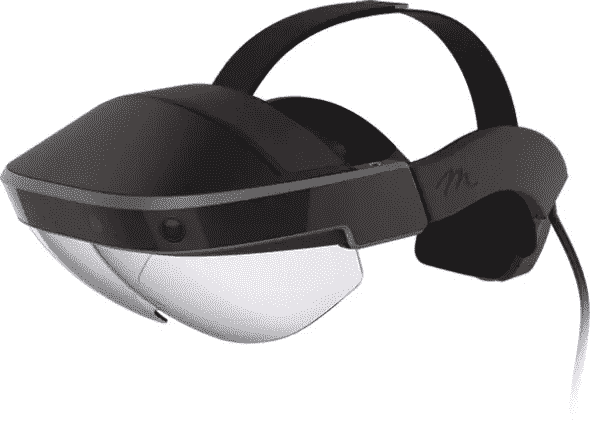
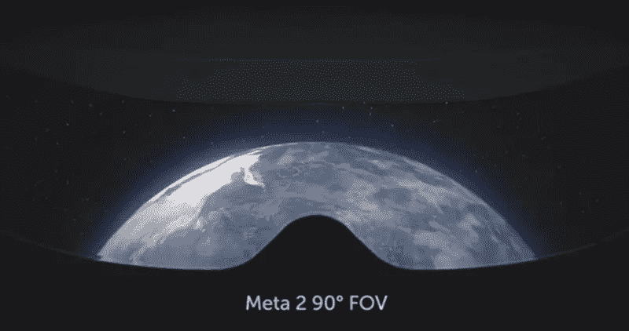
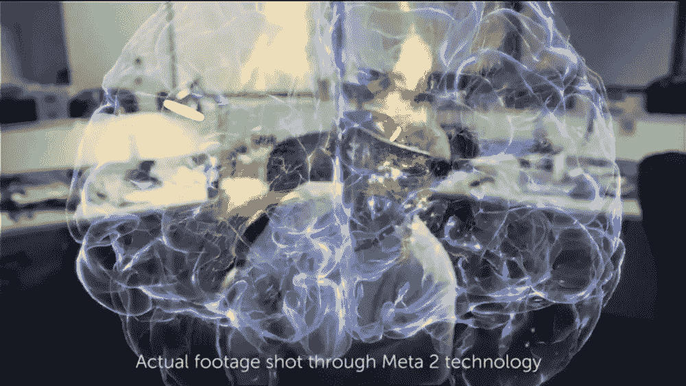
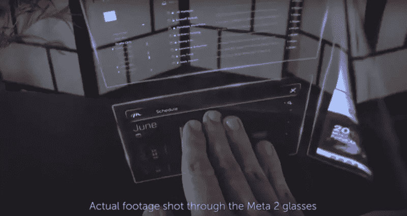

# Meta 2 对增强现实开发者意味着什么

> 原文：<https://www.sitepoint.com/what-the-meta-2-means-for-augmented-reality-developers/>

增强现实将成为计算领域的下一个大浪潮之一。当它发挥出真正的潜力时，它将改变我们使用和思考技术的方式。上周宣布的 Meta 2 开发套件是我们迄今为止看到的最接近这种潜力的一瞥。虽然有一些文章在谈论新耳机的发布，但我想真正关注这对开发者意味着什么。

在大约一年半的时间里，我已经足够幸运地拥有了一个 Meta 1 开发工具包，并花费了大量时间进行实验，并组装了我自己的概念原型应用程序。SDK 使得 Unity 中的过程比许多人预期的要容易得多。Meta 2 看起来将超越我花了无数时间摆弄的设备！

## 什么是 Meta？

Meta 是一家总部位于硅谷的公司，自 2013 年 5 月 Kickstarter 活动成功以来，一直致力于增强现实。那次活动后不久，他们也被著名的 Y Combinator 项目录取了。2014 年 9 月，他们开始向全球开发者发售 Meta 1 开发者套件。这个套件看起来是这样的:

Meta 1 提供了一种增强现实耳机体验，在有限的视野内将 3D 对象投影到您的面前。这些物体看起来就像和你在房间里一样，可以触摸、抓取和捏，提供了一些很棒的真实世界互动！增强现实对象甚至能够通过方形标记锁定现实世界中的区域，就像我在自己的 AR 应用程序中使用的这个:

上周，他们发布了全新耳机概念的细节 Meta 2。Meta 2 似乎具备上述所有功能，甚至更多。看起来是这样的:

## 改进的视野

到目前为止，AR 耳机的一个挑战是尽可能多地增强耳机视图。Meta 1、ODG R-7 智能眼镜和微软 HoloLens 的视野都略有有限，最好想象成你面前的透明屏幕，当你朝它们的方向看时，它会显示增强的对象。我发现的展示这种视野概念的最佳图像是来自微软 HoloLens 演示视频的这张图:

来源:[多边形为 GIF](http://www.polygon.com/2015/7/8/8915617/hololens-field-of-view-real-honest) 和[微软为演示视频本身](https://youtu.be/SKpKlh1-en0?t=48s)

Meta 1 配备了两种不同的镜头盖——一种具有 23 度视野，另一种具有 32 度视野。HoloLens 大约有 30 度的视野，ODG 最新未发布的原型有 50 度的视野。虽然这些测量值可能没有可比性(有些是水平的，有些是对角线的？)，你可以从这些数字中了解典型的 FOV 系列。

Meta 2 具有 90 度的视野，远远超过了这些。这意味着显示器的很大一部分现在被增强了。Meta 的 [Meta 2 产品发布视频](https://youtu.be/_x9462x6A0k)将视野想象成这样:

这将为开发人员提供一种以更加身临其境的方式展示他们的增强现实应用程序的好方法，并扩展 AR 应用程序中的可能性。更大的视野在界面上打开了更多的可能性，否则可能会与更小的视图尺寸混淆。

## 高分辨率显示器

Meta 1 为每只眼睛提供了 960 x 540 的分辨率(每只眼睛都有一个单独的投影屏幕)。我看到一些规格说微软 HoloLens 和 ODG 的 R-7 智能眼镜的每只眼睛都有更大的 1280 × 720 分辨率。

Meta 2 的显示屏整体分辨率为 2560 x 1440 DPI，分辨率足够高，能够舒适地阅读文本，并看到更精细的细节。对于视野，最终是每度 20 像素。考虑到不同类型的显示技术，我不太确定这与 HoloLens 和 R-7 智能眼镜相比如何。

这张图片显示了分辨率的一点预览:

来源:[罗伯特·斯考伯的脸书](https://www.facebook.com/RobertScoble/posts/10153908499494655)——他上传了一些 Meta 2 TED 活动的画面，查看他的脸书获得更多！

这是直接比较规格可能对开发人员没有帮助的领域之一。相反，潜在的体验才是这里的关键。再加上 90 度 FOV，拥有如此精细的细节意味着你的 AR 应用和界面可以拥有清晰易读的文本。您可以开发依赖于显示 3D 模型中更精细细节的应用程序——依赖于精度的领域，如医学、建筑和 3D 建模肯定会从中受益。

## 运行成熟的应用程序

Meta 2 看起来准备取代你的计算机显示器作为一个全职显示器，为你周围的虚拟显示器提供一个接口——这应该会让所有喜欢简化他们桌上大量显示器的开发人员兴奋不已！Meta 2 目前列出了对 Windows 应用程序的支持，包括 Microsoft Office、Adobe Creative Suite *(想象一下 AR 中的视频制作级应用程序！)*和 Spotify。我迫不及待地想看到其他应用程序也开始兼容。在增强现实中为增强现实编程是梦想成真！

来源:Meta 2 产品视频

## 连接到你的个人电脑(很快还有苹果电脑)

Meta 2 与微软和 ODG 的耳机之间的一个很大的区别是，Meta 2 需要一直连接到你的计算机上。它目前运行在 Windows 8.1 和 10 上，Mac 支持有望在今年晚些时候推出。这种共享似乎是一种权衡，以允许更高的视野、虚拟监视器功能和成熟的应用程序功能等等。然而，这也意味着不需要担心电池寿命。

对于开发人员来说，这无疑是短期使用该技术的一个限制。如果应用程序是为你呆在某个特定区域的使用而设计的，而不是在你的日常活动中穿着 Meta 2 到处闲逛，那么它将会工作得最好。

随着技术的进步，我相信 Meta 将会像 HoloLens 和 ODG 一样研究解开束缚——所以当这些可能性出现在未来的耳机中时，你可以随时设计应用程序。

## 可以戴眼镜！

头戴式耳机，尤其是 VR 头戴式耳机最大的一个缺点就是戴着眼镜使用起来很困难。幸运的是，有了 Meta 的新设计，戴眼镜不再是个问题！

## 自然的手部交互和设计指南

Meta 2 带有改进的手部跟踪和神经科学驱动的界面设计原则，以指导开发人员使用它。Meta 团队正致力于他们的“最小阻力神经路径”计算方法，该方法旨在帮助计算界面完全直观地供任何人基于神经科学原理使用。

这些界面设计原则和改进的手部跟踪应该有助于开发人员以更简单的方式与增强现实对象进行自然交互。开发人员可以利用元神经科学团队的工作，而不是必须在飞行中设计和提出这些原则(不是每个人都是用户界面专家，特别是当涉及到像 AR 这样的全新平台时！).我希望这有助于在该平台上构建的 AR 应用程序拥有一套相对简单和直接的直观交互原则作为基线。

我真的希望真正有洞察力的开发人员也采纳这些原则并加以扩展，为这个领域带来额外的新设计原则，添加到 Meta 团队设计的那些原则中。

他们的网站还表示，它可以跟踪笔或画笔等物体，这听起来类似于 Leap Motion 的项目跟踪——这在增强现实空间中也会非常方便！

## 空间制图

Meta 2 耳机的武器库中有一种算法 *(SLAM，同步定位和映射)*可以跟踪用户在环境中的位置，映射他们周围的空间，以便可以将对象放置在桌子和现实世界的表面上。HoloLens 也有类似的功能，但是搭配 Meta 的更大 FOV，这可能会给开发者带来一些非常身临其境和令人兴奋的可能性！

## 稍微实惠一点

Meta 2 耳机可以以 949 美元的价格预购，这比 HoloLens 的 3000 美元或 ODG R-7 智能眼镜的 2750 美元更容易获得。而 HoloLens 和 ODG R-7 智能眼镜都是自带的电脑系统，大幅提高了价格。许多开发人员可能更愿意支付大约三分之一的价格，在一个受限制的系统上构建 AR 应用程序。

## 团结协作

元应用程序开发通过 Unity SDK 工作。这对我有很大的吸引力——在我自己的元应用程序开发期间，我花在精通 Unity 上的时间在为虚拟现实等其他平台构建体验时也特别方便。这也意味着许多已经熟练掌握 Unity 的开发者将能够进入元开发，而不需要学习一个全新的开发平台。

## 结论

增强现实领域目前令人兴奋——Meta、微软 HoloLens、ODG 的智能眼镜以及这个领域的其他产品(还有很多！)真的在创新，并使其更接近主流潜力。虽然可能还需要两到三年的时间才能真正普及，但这项技术显然已经准备好让开发者开始试验了。Meta 2 耳机凭借其更大的 FOV、高分辨率和合理的价格，看起来是一个很好的选择。

如果你对 Meta 2 感兴趣，可以在 Meta 主页上预订。对于那些把 Meta 1 藏在壁橱里的开发者来说——我们也有一个指南，可以让你[开始使用增强现实技术，如果你想在这个新闻之后重新使用 Meta 1 耳机](https://www.sitepoint.com/getting-started-with-augmented-reality-and-meta/)！

开发者们——我很想听听你们对 Meta 2 耳机的想法。你预定你的了吗？

## 分享这篇文章