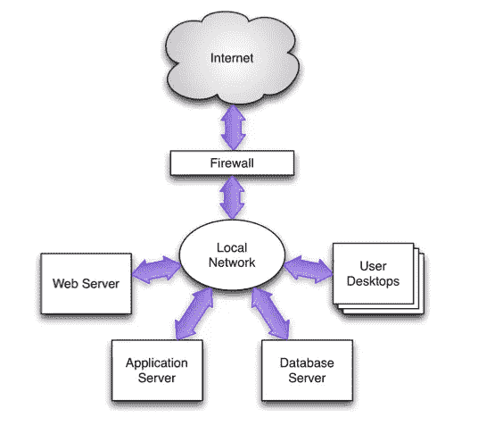

# 什么是云？

> 原文：<https://www.sitepoint.com/whats-a-cloud/>

我们大多数人都见过这样的架构图



互联网曾经以云为代表

云被用来表示互联网。随着时间的推移，“互联网”的含义已经发生了变化，现在它包括通常被认为是互联网上的资源以及访问它们的手段。

云计算这个术语在几年前才开始被广泛使用。一些人很快声称，这不是一个新概念，这个术语只是一个现有实践的另一个名称。另一方面，这个术语已经变得足够强大，以至于一些现有的 web 应用程序不得不神奇地变成云计算的实例！这就是营销的力量。

虽然具体细节可能因供应商而异，但您可以将云视为一个连贯的、大规模的、可公开访问的计算、存储和网络资源集合。这些资源是通过 web 服务调用(一个通过 HTTP 请求访问的可编程接口)来分配的，可用于短期或长期使用，根据实际消耗的资源付费。

云本质上是一个多用户环境，代表大量用户同时运行。因此，它负责管理和验证用户身份，跟踪用户的资源分配，提供对每个用户拥有的资源的独占访问，并防止一个用户干扰其他用户。在这方面，运行每个供应商的云的软件类似于操作系统。

云计算建立在许多重要的基础级技术之上，包括 TCP-IP 网络、健壮的互联网连接、SOAP 和 REST 风格的 web 服务、商用硬件、虚拟化和在线支付系统。许多这些技术的细节是隐藏的；云为开发人员提供了可用资源的理想化抽象视图。

## 可编程数据中心

让我们考虑一下传统的 IT 资源分配模式。在下面的参数图中，资源可能是服务器、存储、IP 地址、带宽，甚至是防火墙条目。

如果你是一家大公司的一部分，并且需要额外的 IT 资源，你可能会发现你需要通过一个包含大量人际沟通和谈判的过程。也许你发送电子邮件，创建一个在线订单或机票，或者只是拿起电话讨论你的资源需求。在系统的另一端，需要一些手工工作来批准请求；定位、分配和配置硬件；处理电缆、路由器和防火墙；诸如此类。在一些组织中，这一过程需要 12-18 个月，这种情况并不少见！

如果你是一个企业家，你打电话给你的 ISP(互联网服务提供商)，进行讨论，协商，然后承诺增加月费，并在几个小时甚至几天的时间内获得对你的硬件的访问权。

一旦你经历了这个过程，你可能已经做出了长期的承诺来运营和支付资源。大公司每个月都会向您的内部成本中心收费，并且希望保留硬件直到其使用寿命结束。互联网服务提供商将会更加灵活，但是很少有互联网服务提供商愿意每隔一两个小时就代表你做出大规模的改变。

云将人类的反应排除在循环之外。您(或者更可能是代表您运行的管理应用程序)向云发出 web 服务请求(“调用”)。然后，云通过以下步骤为您的请求提供服务:

*   接受请求
*   确认您有权提出请求
*   根据帐户限制验证请求
*   找到合适的免费资源
*   将资源附加到您的帐户
*   初始化资源
*   返回满足请求的资源的标识符

由于开发人员习惯于用面向对象的术语来思考，我们甚至可以将特定供应商的云视为一个对象。事实上，PHP 中对云的理想化定义可能是这样的:

```
 class Cloud {
public function getDataCenters() {
⋮
}
public function allocateServer($dataCenter, $count) {
⋮
}
public function releaseServer($server) {
⋮
}
public function allocateDiskStorage($dataCenter, $gb) {
⋮
}
public function releaseDiskStorage($storage) {
⋮
}
⋮
}
```

这是如何使用这种理想化的云。首先，我们检索可用数据中心的列表($d)，并存储对列表中第一个数据中心的引用($d1):

 `$server = $c->allocateServer($d1, 1);
$storage = $c->allocateDiskStorage($d1, 100);` 

重要的一点是，您现在可以编写一个程序来启动、控制、监视和编排云中的大规模资源使用。曾经由系统管理员经过深思熟虑手动且偶尔做出的扩展和分区决策(如如何增加更多服务器容量或分配现有容量)现在可以定期自动完成。

## 分享这篇文章