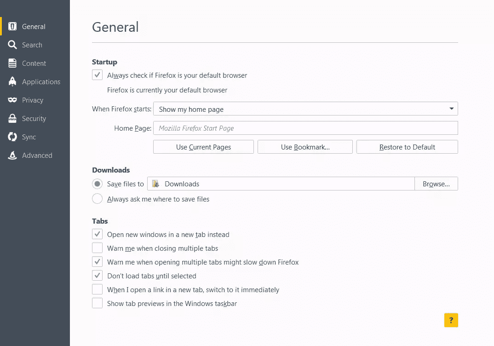

# 火狐 38 的新功能

> 原文：<https://www.sitepoint.com/whats-new-firefox-38/>

像时钟一样，在发布 Firefox 37 六周后，Mozilla 发布了 Firefox 38，其中包括一些令人印象深刻的新功能，将让《edge》的爱好者感到高兴。然而，对于一些人来说，数字版权管理集成也是一剂苦药。

让我们看看包里有些什么。

## 响应图像支持

Firefox 38 现在支持图片上的`picture`元素和`srcset`属性——加入了 Chrome 和 Opera。

然而，Firefox 仍然有一个问题需要解决。响应图像将使用正确的媒体查询加载，但目前不响应视窗大小调整。这个 bug[目前正在](https://bugzilla.mozilla.org/show_bug.cgi?id=1135812)上处理，应该会很快修复。

## Web Workers 和 WebSockets

Firefox 38 现在允许运行在 [Web Worker](https://developer.mozilla.org/en-US/docs/Web/API/Web_Workers_API) 中的代码打开 [WebSocket](https://developer.mozilla.org/en-US/docs/WebSockets) 连接。这对于游戏或其他协作应用程序来说是非常好的，它们现在可以在一个独立于 UI 的线程中完成多人/实时逻辑。

## 选项面板重新设计

重新设计的选项面板现在是版本 38 的默认选项。(在此之前，只能通过在`about:config`中更改其设置来激活它)。

如果你不喜欢新的设计，你可以通过`about:config`回到旧的布局，将`browser.preferences.inContent`设置为`false`。

## 一个有争议的决定:DRM

Firefox 现在支持 Windows 桌面(Vista+)上的[加密媒体扩展](https://www.w3.org/TR/encrypted-media/) (EME) API，还能自动下载 Adobe 的内容解密模块。

EME 是 W3C 颇具争议的进入数字版权管理(DRM)领域的成果。它的工作原理是在浏览器和内容提供商的版权材料之间提供一个沟通渠道。

最终用户的优势在于 HTML5 `video`可以用于流媒体视频等内容，无需下载 Flash 或 Silverlight 等第三方插件。

然而，这一决定并不受一些评论家的欢迎，比如科利·多克托罗，他对这一举动表示遗憾。Mozilla 的观点是，如果它不支持像网飞这样的视频流媒体服务，它的浏览器将会落后。但是对于一个致力于支持开放网络的组织来说，这是一个困难的局面。

网飞目前正在测试火狐的 DRM 解决方案，看看它是否适合向用户提供内容。

所以，为 DRM 欢呼三声！或者也不尽然……如果你仍然对这个决定感到不安，你可以下载一个没有 EME 的新版火狐浏览器。

## 安全性

火狐 38 总共修复了 13 个安全漏洞。其中，有五个被 Mozilla 标记为关键。

为了提高 WebRTC(一种相对较新的支持浏览器中实时通信的 API)的安全性，Firefox 38 现在要求应用程序或服务器支持 [PFS](https://hacks.mozilla.org/2015/02/webrtc-requires-perfect-forward-secrecy-pfs-starting-in-firefox-38/) (完美转发安全)密码，一种公钥系统。(因此，拥有 WebRTC 应用程序或服务器的开发人员需要确保他们的代码是最新的。)

在 Firefox 37 中，开发者工具的**网络**面板看到了显著的安全改进——用户能够获得关于每一个资源连接的信息。Firefox 38 对此进行了改进，如果加密过程使用 SSLv3 而不是 TLS 或 RC4，它会添加警告。

## HTML5 `<ruby>`标记支持

通过使用`<ruby>`标记，现在不用笨重的库或扩展就可以为日文和中文网站提供更好的排版。它用于指示文本中字符的发音或含义。(你可以在这里了解更多信息[。)](https://hacks.mozilla.org/2015/03/ruby-support-in-firefox-developer-edition-38/)

## 发布了新的 ESR

对于一些大型组织来说，每六周部署一个新的浏览器版本是一个很大的负担。因此，在 Firefox 的每七个稳定版本中，Mozilla 都会发布一个不同版本的 Firefox，称为 Firefox ESR(扩展版本支持)。Firefox 38 带来了最新的 ESR 版本。

Firefox 38 和 ESR 38 之间有两个值得注意的区别:

*   在 Firefox ESR 38 中，免费的浏览器内视频聊天服务 Firefox Hello 被默认禁用。这样做的原因显然是向后兼容。

*   用于在 HTML5 中执行 DRM 的新的加密媒体扩展也被禁用。

最新的 Firefox ESR 可以在这里下载。

## 结论

就在 Firefox 38 发布几天后，Mozilla 推出了 38.0.1 小更新，其中包括[个额外的错误修复](https://www.mozilla.org/en-US/firefox/38.0.1/releasenotes/)。

你可以在[官方发行说明](https://www.mozilla.org/en-US/firefox/38.0/releasenotes/)页面上找到 38 版本中新增内容的完整列表，而 [Mozilla 开发者网络](https://developer.mozilla.org/en-US/Firefox/Releases/38)页面列出了 web 开发者特别感兴趣的变化。

虽然 Firefox 38 带来了一些令人愉快的新功能，但 DRM 的加入将会给一些人留下苦涩的回味。很明显，Mozilla 对此很不高兴，但他们相信从长远来看这是正确的决定。

你对此有什么感觉？请在评论中告诉我们你的想法！

## 分享这篇文章