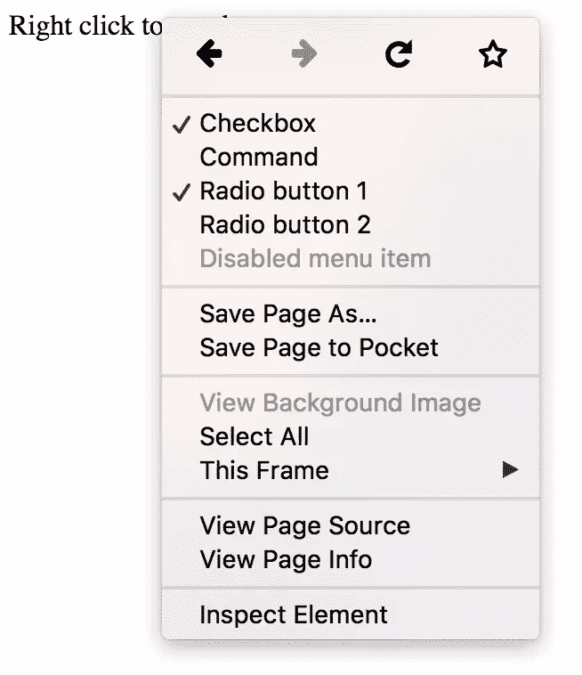
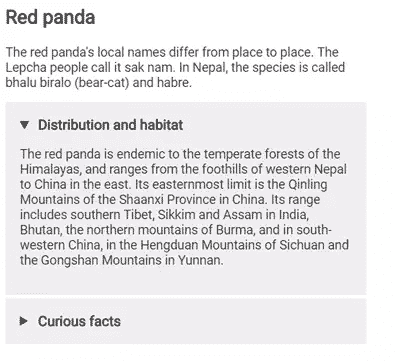
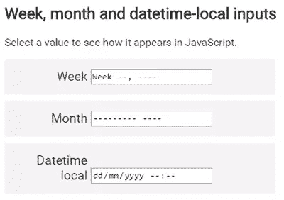

# HTML 5.1 的新特性

> 原文：<https://www.sitepoint.com/whats-new-in-html-5-1/>


利用 HTML5 发挥创意，制作动画。观看我们的截屏视频[用 HTML5 画布](https://www.sitepoint.com/premium/screencasts/creating-animations-with-html5-canvas)制作动画。

## HTML 5.1 一瞥

大约两年前 HTML5 标准的发布是 web 开发社区的一件大事。不仅因为它包含了一系列令人印象深刻的新特性，还因为它是自 1999 年 HTML 4.01 发布以来对 HTML 的第一次重大更新。今天你仍然可以看到一些网站吹嘘“现代”HTML5 标准的使用。

幸运的是，我们不必为 HTML 的下一次迭代等那么久。2015 年 10 月，W3C 开始致力于 HTML 5.1 的草案，目标是修复 HTML 5 中遗留的一些问题。经过多次迭代，2016 年 6 月达到“候选推荐”状态，2016 年 9 月达到“建议推荐”状态，最后 2016 年 11 月达到一个 [W3C 推荐](https://www.w3.org/TR/html/)状态。那些关注这一发展的人可能注意到这是一段颠簸的旅程。由于糟糕的设计或缺乏浏览器供应商的支持，许多最初的 HTML 5.1 特性被放弃了。

虽然 HTML 5.1 仍在开发中，但 W3C 已经开始着手 HTML 5.2 的[草案，预计将于 2017 年末发布。同时，这里有一个 5.1 中引入的一些有趣的新特性和改进的概述。这些特性仍然缺乏浏览器支持，但是我们将向您推荐至少一些可以用来测试每个例子的浏览器。](https://www.w3.org/TR/html52/)

### 使用`menu`和`menuitems`元素的上下文菜单

5.1 的草案版本引入了两种不同的`menu`元素:`context`和`toolbar`。前者用于扩展本地上下文菜单，通常通过右键单击页面来显示，后者用于定义简单的菜单组件。在开发过程中，`toolbar`被去掉了，但`context`菜单仍然保留着。

您可以使用 [`<menu>`](https://www.w3.org/TR/html/interactive-elements.html#the-menu-element) 标签定义一个由一个或多个 [`<menuitem>`](https://www.w3.org/TR/html/interactive-elements.html#the-menuitem-element) 元素组成的菜单，然后使用 [`contextmenu`](https://www.w3.org/TR/html/interactive-elements.html#element-attrdef-global-contextmenu) 属性将其绑定到任何元素。

每个`<menuitem>`可以有三种类型之一:

*   `checkbox`–允许您选择或取消选择一个选项；
*   `command`–允许您点击执行动作；
*   `radio`–允许您从组中选择一个选项。

下面是一个基本的使用例子，它在 Firefox 49 中有效，但在 Chrome 54 中似乎无效。

参见 [CodePen](http://codepen.io) 上 SitePoint ( [@SitePoint](http://codepen.io/SitePoint) )的 Pen [HTML 5.1 菜单示例](http://codepen.io/SitePoint/pen/bBrvRP/)。

在受支持的浏览器中，上下文菜单应该如下所示:



带有自定义项目的上下文菜单

### 详细信息和汇总要素

新的 [`<details>`](https://www.w3.org/TR/html/interactive-elements.html#the-details-element) 和 [`<summary>`](https://www.w3.org/TR/html/interactive-elements.html#the-summary-element) 元素实现了通过点击元素来显示和隐藏附加信息块的能力。这是经常使用 JavaScript 完成的事情，现在可以使用内部带有`<summary>`元素的`<details>`元素来完成。单击摘要可以切换来自`<details>`元素的其余内容的可见性。

下面的例子已经在 Firefox 和 Chrome 中测试过了。

参见 [CodePen](http://codepen.io) 上 SitePoint ( [@SitePoint](http://codepen.io/SitePoint) )的 Pen [HTML 5.1 详情及概要演示](http://codepen.io/SitePoint/pen/rWzgzg/)。

受支持的浏览器中的演示应该是这样的:



### 更多输入类型— `month`、`week`和`datetime-local`

输入类型的武器库增加了三种输入类型: [`month`](https://www.w3.org/TR/html/sec-forms.html#month-state-typemonth) 、 [`week`](https://www.w3.org/TR/html/index.html#contents) 和 [`datetime-local`](https://www.w3.org/TR/html/sec-forms.html#local-date-and-time-state-typedatetimelocal) 。

前两个选项允许您选择一周或一个月。在 Chrome 中，两者都以下拉日历的形式呈现，既可以选择一年中的某个月，也可以选择一周。当您从 JavaScript 中访问这些值时，您将会收到一个类似如下的字符串:`week`输入的`"2016-W43"`和`month`输入的`"2016-10"`。

最初，5.1 的草案引入了两个日期时间输入— `datetime`和`datetime-local`。不同之处在于，`datetime-local`总是选择用户时区的时间，而`datetime`输入也允许你选择不同的时区。在开发过程中，`datetime`型被丢弃，现在只剩下`datetime-local`型。`datetime-local`输入由两部分组成——日期部分和时间部分，前者可通过类似于`week`或`month`输入的方式选择，后者可单独输入。

您可以在下面的 CodePen 中找到所有这些新输入类型的一些实例。它可以在 Chrome 上运行，但还不能在 Firefox 上运行:

在 [CodePen](http://codepen.io) 上通过 SitePoint ( [@SitePoint](http://codepen.io/SitePoint) )查看 Pen [HTML 5.1 周、月、日期时间输入](http://codepen.io/SitePoint/pen/xRLowg/)。

受支持的浏览器中的演示应该是这样的:



### 响应图像

HTML 5.1 包括几个新特性，可以在不使用 CSS 的情况下实现响应图像。这些特性涵盖了它们各自的使用案例。

#### `srcset`图像属性

[`srcset`](https://www.w3.org/TR/html/single-page.html#element-attrdef-img-srcset) 图像属性允许您列出像素密度不同的多个备选图像源。这允许浏览器为用户的设备选择合适质量的图像(由它自己的像素密度、缩放级别或网络速度决定)。例如，您可能希望为在较慢的移动网络上使用小型手机的用户提供较低分辨率的图像。

`srcset`属性接受一个逗号分隔的图像 URL 列表，每个 URL 都有自己的`x`修饰符，它描述了最适合每个图像的像素比率(CSS 像素中的物理像素数量)。一个简单的例子是这样的:

```

```

在这种情况下，如果用户的像素比例等于 1，将显示`low-res`图像，对于 2，将显示`high-res`，对于 3 及以上，将选择`ultra-high-res`。

或者，您可以选择显示不同大小的图像，而不是不同的像素比率。这可以通过使用`w`修改器来完成:

```

```

在这种情况下，`low-res`图像被定义为 600 像素宽，`high-res`被定义为 1000 像素，`ultra-high-res`被定义为 1400 像素。

#### `sizes`图像属性

您可能希望根据用户的屏幕大小显示不同的图像。例如，您可以在宽屏幕上以两列显示一系列图像，而在窄屏幕上以一列显示。这可以通过使用`sizes`属性来实现。它允许您将屏幕的宽度转换为分配给图像的空间，然后使用`srcset`属性选择合适的图像。这里有一个例子:

```

```

当视窗宽度大于 40em 时，大小属性将图像宽度定义为视窗宽度的 50%,当视窗宽度小于或等于 40em 时，将图像宽度定义为视窗宽度的 100%。

#### `picture`元素

如果改变每个屏幕的图像大小还不够，并且您需要显示完全不同的图像，那么您可以使用 [`picture`](https://www.w3.org/TR/html/single-page.html#elementdef-picture) 元素。它允许您通过用一个`<picture>`元素包装您的``并指定多个子`<source>`元素来为不同的屏幕尺寸定义不同来源的图像。然后,`<source>`元素作为 URL 的来源来加载图片。

```
<picture>
  <source media="(max-width: 20em)" srcset="
    images/small/low-res.jpg 1x,
    images/small/high-res.jpg 2x, 
    images/small/ultra-high-res.jpg 3x
  ">
  <source media="(max-width: 40em)" srcset="
    images/large/low-res.jpg 1x,
    images/large/high-res.jpg 2x, 
    images/large/ultra-high-res.jpg 3x
  ">

  
</picture>
```

如果你想了解更多关于响应式图像的信息，我推荐 SitePoint 上关于如何用`srcset` 构建响应式图像的文章。

### 用`form.reportValidity()`验证表单

HTML5 定义了 [`form.checkValidity()`](https://www.w3.org/TR/html/single-page.html#dom-htmlobjectelement-checkvalidity) 方法，该方法允许您根据定义的验证器检查表单的输入，并返回一个布尔值作为结果。新的 [`reportValidity()`](https://www.w3.org/TR/html/single-page.html#dom-htmlformelement-reportvalidity) 非常相似——它也允许您验证表单并检索结果，但是另外在浏览器中向用户报告错误。下面是演示结果的代码笔(在 Firefox 和 Chrome 中测试过):

参见 [CodePen](http://codepen.io) 上 SitePoint ( [@SitePoint](http://codepen.io/SitePoint) )的 Pen [HTML 5.1 报告有效性演示](http://codepen.io/SitePoint/pen/eBEwjg/)。

“名字”输入应该标记有错误，因为它是必需的，但为空。当按预期工作时，看起来是这样的:


### 允许框架全屏显示

框架的新布尔 [`allowfullscreen`](https://www.w3.org/TR/html/single-page.html#element-attrdef-iframe-allowfullscreen) 属性允许您通过使用 [`requestFullscreen()`](https://fullscreen.spec.whatwg.org/#dom-element-requestfullscreen) 方法来控制它们的内容是否可以全屏显示。

### 用`element.forceSpellCheck()`进行拼写检查

这个新的 [`element.forceSpellCheck()`](https://html.spec.whatwg.org/multipage/interaction.html#dom-forcespellcheck) 方法允许你触发文本元素的拼写检查。这也是列表中第一个在任何浏览器中都不可用的特性。潜在地，这可以用于对用户没有直接编辑的元素执行拼写检查。

### 从未实现的功能

规范初稿中定义的一些特性最终被删除了，主要是因为浏览器供应商缺乏兴趣。以下是一些有趣的提及:

#### `inert`属性

`inert`属性意味着禁止所有子元素的用户交互。有点像给它们添加 disabled 属性。

#### `<dialog>`元素

元素为弹出窗口提供了一个本地实现。甚至还有一个方便的表单集成——在`<dialog>`上设置`method`属性会阻止表单将自己提交给服务器，而是关闭对话框并将值返回给对话框的创建者。

Firefox 似乎仍然支持这一功能，下面是一个例子:

在 [CodePen](http://codepen.io) 上通过 SitePoint ( [@SitePoint](http://codepen.io/SitePoint) )看到 Pen [HTML 对话框元素](http://codepen.io/SitePoint/pen/XNaLOg/)。

### 附加阅读

这绝不是 HTML 5.1 中变化的完整列表。有许多小的新功能，改变了生活标准，并删除了其他未使用的功能。如果您想查看变更的完整列表，请阅读规范的[变更](https://www.w3.org/TR/html/changes.html#changes)部分。与此同时，让我们希望浏览器厂商能尽快采用新功能！

HTML 5.1 的哪些方面最让你兴奋？请在评论中告诉我们！

发挥创意，开始使用 HTML5 制作动画。查看我们的截屏视频[用 HTML5 画布](https://www.sitepoint.com/premium/screencasts/creating-animations-with-html5-canvas)制作动画了解更多。