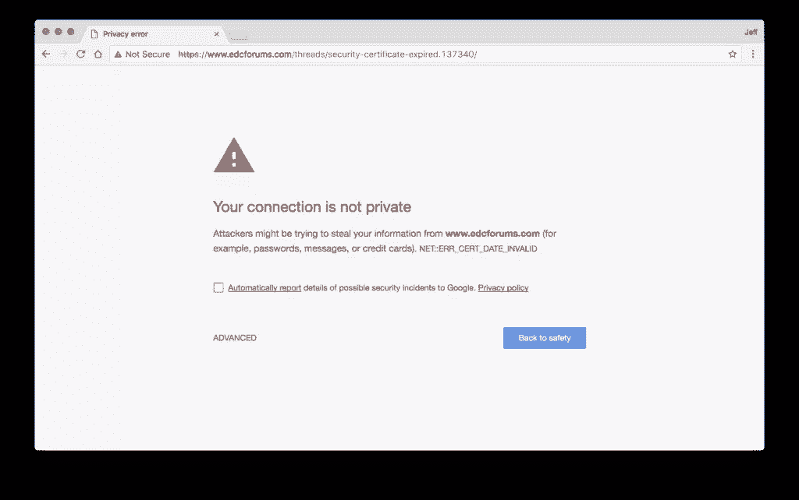

# 为什么每个网站都需要 HTTPS

> 原文：<https://www.sitepoint.com/why-every-website-needs-https/>

*本文是与 [SiteGround](https://www.siteground.com/go/article-sp) 合作创作的系列文章的一部分。感谢您对使 SitePoint 成为可能的合作伙伴的支持。*

首先，对于一个网站来说，使用 HTTPS 而不是简单的老式 HTTP 意味着什么？这意味着该网站是由 SSL(安全套接字层)或最新的 TLS(传输层安全性)保护的。如果你对这个主题不了解，这个陈述可能对你毫无意义，所以让我们把它分解一下。

当你访问一个网站时，你使用的是 URL 的`https`版本，你要求的是该网站的安全版本。简而言之，这意味着您的浏览器将希望在网站的服务器上看到 SSL/TLS 证书。该证书应由可验证的证书颁发机构(CA)授予，基本上允许您的浏览器通过加密连接与之交互。根据证书的不同，它也可能会说“看，这个网站就是它所说的那个人，已经被验证过了”。一旦找到该证书，就可以在您的浏览器和网站之间建立安全的加密连接。现在，如果有人试图介入并拦截你的通信，数据将被加密。你的 ISP 也许能够确定你去了什么网站，或者有多少 T2 数据被来回传输，但是不会有任何进一步的窥探发生。

如果网站的服务器正在接受 HTTPS 请求，但该网站没有有效的证书，或者该网站的证书已过期、CA 无效或任何其他问题，您的浏览器将会通知您，并试图阻止您继续操作。这是因为网站说有一个安全的连接可用，但没有提供，所以浏览器试图让你意识到这一点。

许多 web 服务器要么有证书，并将所有传入流量路由到 HTTPS，迫使您使用安全版本，或者，如果它们没有证书，则将所有流量路由到 HTTP，从而防止用户试图访问不存在的安全连接。

所以，现在我们对*和*构成一个网站的加密连接有了一个大致的概念，让我们来看看为你的网站获得一个安全证书的积极影响。

## 搜索排名

2014 年，[谷歌将 HTTPS 列为搜索结果中的一个因素](https://webmasters.googleblog.com/2014/08/https-as-ranking-signal.html)。他们的目标似乎是迫使改变，迫使网站管理员为他们的访问者提供适当的安全。在当时，这是一件大事，而且似乎已经奏效。这一时期是引入 SSL/TLS 作为部分流量的网站百分比上升趋势的开始。事实上，完全是 HTTPS 的网站也在增加。

当然，谷歌不会公布算法的所有变化，但我们知道 HTTPS 是一个指标，有理由认为，随着越来越多的网站转向 HTTPS，对*而不是*这样做的惩罚也可能会增加。但是对于你的网站，或者你的客户的网站来说，为了确保你的网站不被 HTTPS 的竞争对手忽视，难道一点额外的工作不值得吗？

## 让你的访客感到安全

下一个原因也在谷歌的掌控之中，但涉及到一个不同的产品:Chrome。根据一篇关于 HTTPS 网站的[博客文章，从 2017 年 Chrome 版本 56 开始，任何使用表单收集敏感信息(如信用卡、登录凭证等)的页面现在都将在地址栏中被标记为“不安全”，图标和文本为中性灰色。](https://security.googleblog.com/2016/09/moving-towards-more-secure-web.html)

因此，如果你的网站收集私人用户信息，Chrome 可能已经对你的用户将其标记为“不安全”。这对你的用户信心有什么影响？在未来的版本中，Chrome 会将所有的 HTTP 网站标记为“不安全”,并在栏中显示红色警告——这是给用户的一个明确信号，他们不应该信任你！Firefox 做了[同样的事情](https://blog.mozilla.org/security/2017/01/20/communicating-the-dangers-of-non-secure-http/)，标记非 HTTPS 网站中可能让你不安全地输入敏感信息的表单域，并在地址栏中告知用户该网站不安全。

那么，你的用户对你网站的信任值多少呢？即使你没有在你的网站上收集敏感信息，访问者自信地浏览的能力也可能会带来很大的不同。

## 让你的访客安全

在这里，我们来了解一下在你的网站上使用 HTTPS 的主要好处应该是什么——让你的访问者和他们与你的网站的互动真正安全。那么，你到底需要 HTTPS 做什么，它将如何帮助保护你的访客？

如本文开头所述，关键是加密的 web 流量。当使用常规 HTTP 时，你的互联网流量——你在网站上填写的表格，你与他们交换的信息，都可能被拦截。有了安全的 HTTPS，您提交的用户名、密码、信用卡和其他财务信息都被加密了。为你的网站设置 HTTPS 是非常值得的，因为回报是对每个使用你网站的人的安全提升！

当然，有些网站不做这种交易，所以这个理由，对一些人来说最有说服力，对其他人来说可能最没有说服力。

## 你的网站需要 HTTPS

不管哪个具体原因对你来说最重要，事实是你的网站需要 HTTPS！对于小网站来说，这可能是一个简单而免费的过程，使用像[让我们加密](https://letsencrypt.org/)这样的东西。对于更复杂的，你可能会决定立即切换到 HTTPS 是后勤上的挑战。事实仍然是，最终这是一个更好的解决方案，所以你会想要制定一个计划，并尽快实施它！

## 最后一步:如何得到 HTTPS

因此，如果你已经决定为你的网站获得一个证书，并走 HTTPS 路线，下一个问题是你想如何进行。您有几个选择:

*   查看[让我们加密](https://letsencrypt.org)。Let's Encrypt 是一项免费服务，你可以使用他们的命令行工具在你的 VPS 或服务器上创建和设置你自己的证书。证书是免费的，但必须每 90 天更新一次。然而，这个过程是可以自动化的，所以并不像看起来那么糟糕。
*   寻找一个在托管计划中包含 SSL 证书的托管提供商，比如我们的合作伙伴 [SiteGround](https://www.siteground.com/go/article-sp) 。默认情况下，SiteGround 提供免费的 Let's Encrypt 证书及其每个[托管计划](https://www.siteground.com/go/article-sp)，所以你不需要做任何复杂的配置。该证书将自动与您的 SiteGround 主机帐户更新，并受所有最流行的浏览器支持。
*   自己从证书颁发机构(如 Verisign、Digicert 或 Comodo)购买 SSL 证书。请注意，在这种情况下，如果使用自己的服务器或 VPS，您必须支付证书的费用，并将其上传到您的主机提供商或自己设置，并在事后负责其更新。

无论您选择哪一种，选择一种方法，让您的网站与 HTTPS 一起运行吧！

## 分享这篇文章