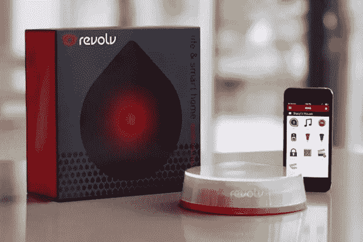

# 为什么物联网还有很长的路要走

> 原文：<https://www.sitepoint.com/why-the-internet-of-things-still-has-a-long-way-to-go/>

SitePoint 的第 10 周！整个星期，我们都在发布关于互联网和物理世界的交集的文章，所以请继续查看[物联网标签](https://www.sitepoint.com/blog/)以获取最新更新。

物联网(IoT)并没有一个让人放心的名字。尤其是“事情”这部分。在我看来，我们似乎还没有完全搞清楚物联网到底是怎么回事。尽管与 2 年前相比，我们在这个旅程上取得了很大的进步，但我仍然很难向非技术人员解释什么是物联网。

然而，更大的问题是，许多人确实认为他们了解物联网是什么，但他们错过了更大的图景。物联网无法与虚拟或增强现实等新兴技术相提并论。物联网是真实的。这项技术中的任何错误都可能对现实世界产生严重影响。随着人工智能的兴起，这对组合可能会带来一个危险的组合。

有很多理由我们不应该像对待其他新兴技术一样对待物联网。虽然《终结者》将人工智能的危险带入了流行文化，但如果物联网很快也会发生同样的事情，也就不足为奇了。

在对物联网空间的巨大可能性表现出过度热情之前，让我们仔细看看它的危险。

## 不安全物联网

虽然在最坏的情况下，bug 会破坏软件并使其变得无用，但在物联网领域的影响要严重得多。如果你新的闪亮的连接恒温器的一个缺陷意外地降低了你家的温度，而不是在冬天升高温度，导致你家的水管爆裂，该怎么办？联网的物联网灯泡在半夜打开，把你从应有的睡眠中唤醒，怎么样？这些场景可能听起来很荒谬，但它们是真实的可能性。

医学在这里是敏感的领域。在医学和前沿技术相遇的地方，很难不看到潜在的危险。[一名接受了无线心脏起搏器的女性](http://www.cnbc.com/2016/03/04/how-the-internet-of-things-could-be-fatal.html)可能会在她自己的身体上制造一个漏洞，让黑客可以访问和滥用——黑客可能会将她的生命掌握在手中。

随着 [IFTTT](https://ifttt.com/) 已经向大众提供许多物联网功能*(我们已经在 SitePoint 这里报道了 IFTTT [几次](https://www.sitepoint.com/connecting-lifx-light-bulbs-iot-using-ifttt/) [次](https://www.sitepoint.com/connecting-the-iot-and-node-js-to-ifttt/) [！数字世界和物理世界已经越来越接近了。在这种情况下，关注联网设备的安全措施是有意义的，因为其影响可能比任何老式软件漏洞都要严重。](https://www.sitepoint.com/how-to-empower-the-amazon-echo-with-ifttt/)*

## 车轮再造的互联网

拥有像洗衣机或烤箱这样的智能联网设备是很酷的，它们可以从网络上远程工作，不需要任何手柄或物理开关。但是，如果互联网瘫痪了会怎么样呢？我们会有替代的方法来使用这些设备吗？还是它们就不能用了？想象一下，如果你一周的工作服卡在洗衣机里，或者你的烤箱因为网络连接中断而无法关闭。

来源:马修·加勒特

一个非常可怕的例子是 CoreOS 安全专家 Matthew Garrett 的故事，他住在一家酒店，这家酒店没有使用房间灯的开关，而是使用 Android 平板电脑来控制所有房间的电子设备。多有用啊！嗯，当别人远程控制你房间里的电子设备时就不会了——因为那正是安全措施有多糟糕。每个房间的 IP 地址都以各自的房间号结尾。对任何人来说都难以置信的简单。

虽然您无法避免安全专家和研究人员入住您的酒店，但如果您不了解物联网设备的功能和安全要求，您可以避免摆弄这些设备。看来，说酒店漏了这份备忘录。

有些人可能不同意我的观点，但我相信，对于重新发明轮子的互联设备，总需要有一个 B 计划。能够定时远程关闭家里的灯是很棒的，但是如果我不能通过物理按钮/手柄关闭所述设备，我会很高兴地避免这样做。给我一些我需要时可以旋转、推动、点击和按压的东西！

## 专有物联网

想想看，你怎么能信任一个与运行你无法访问的专有代码的服务器通信的设备呢？你买的是一台你并不拥有的设备，而是一台你一直使用的设备，直到制造商决定是时候抛弃它了，而你只剩下一台在某个角落积灰的砖砌设备。

来源:旋转

然而，这正是发生在 Revolv 身上的事情，Revolv 是 2014 年收购的 Nest 公司(另一方面，Nest 是 Alphabet/Google 的一部分)建造的智能家居“枢纽”。Nest 宣布后，这款售价 300 美元的设备于 5 月 15 日停止工作。这一举动遭到了不再使用该设备的客户的强烈反对，像[阿洛·吉尔伯特这样的用户将 Revolv 与一个空容器的鹰嘴豆泥进行了比较。](https://arlogilbert.com/the-time-that-tony-fadell-sold-me-a-container-of-hummus-cb0941c762c1#.67oam8vwo)

尽管 Nest 为其客户提供退款(在一些非常糟糕的公关之后)，但整个情况引发了一个相当大的担忧——随着物联网的兴起，我们将拥有我们购买的任何设备，还是只是租用它们？这里有些值得思考的东西。

但不要担心，有替代方案:像 [Kaa](http://www.kaaproject.org/) 这样的物联网平台为你的物联网需求提供了一个完整的开源环境，而没有供应商锁定*(我们在[上一次的 Sourcehunt](https://www.sitepoint.com/sourcehunt-emerging-tech-edition/) )* 中谈到了 Kaa)。Kaa 的人员在他们的网站上详细解释了物联网平台即服务和 Kaa 这样的开源物联网平台之间的区别。我相信这应该是未来物联网设备的规范，但话说回来，当人们的联网设备因为制造商被收购而停止工作时，我真的很期待告诉他们“*我早就告诉过你了*”。

## 实验互联网

有时候，整个物联网主题可能会让人感觉像是大量的实验。然而，我不明白的是，为什么消费者会成为实验的一部分？支持物联网的设备不是可以简单地用敏捷流程处理的软件项目。它需要更好的安全性，质量保证和透明度。虽然我是前沿技术的忠实粉丝，但物联网并不是这样的游乐场。在物联网用例不再成为流行词汇并解决本文中提到的问题之前，我将坚持手动切换开关和冲泡咖啡。

你对物联网有什么想法？

## 分享这篇文章