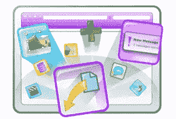

# 为什么雅虎的浏览器+还有很长的路要走

> 原文：<https://www.sitepoint.com/why-yahoos-browserplus-has-a-long-way-to-go/>

雅虎最近宣布了一款基于浏览器插件的运行时软件 [BrowserPlus](http://browserplus.yahoo.com/) ，它能让网络应用程序“跳出浏览器”，并提供通常为桌面应用程序保留的功能。虽然还没有完全准备好，BrowserPlus 的预览版演示了完全用 HTML/CSS/JavaScript 构建一些常见的应用程序，包括一个 IRC 客户端、一个拖放式照片上传器和一个 JSON AJAX 请求检查器。

借助 BrowserPlus，雅虎希望让 web 应用“突破浏览器”，用 OS APIs 桥接标准 web 技术，让 web 应用向桌面应用更近一步。然而，这种方法一点也不新；Gears(以前的 Google Gears)去年也为网络应用提供了本地存储，XUL 已经为网络应用提供了丰富的用户界面很长时间了，Adobe AIR 通过 JavaScript APIs 公开操作系统，彻底改变了游戏规则。Mozilla 的 Prism 可以让 web 应用感觉更像桌面应用。BrowserPlus 更进了一步，通过一个插件中的插件系统，为标准 web 应用程序带来了潜在的无限功能。你猜怎么着？所有这些都有效地锁定了平台。(Flash 和 Silverlight 值得一提，它们要求应用程序从第一天起就建立在它们的平台上。)

于是，雅虎加入了科技巨头的行列，试图创建一个平台来增强网络应用。浏览器插件当然不是新东西，但随着时间的推移，web 开发者发现他们不能简单地依赖插件和相关平台。就在四年前，你几乎可以肯定每个访问你网站的系统都安装了 Flash。今天，我们有 iPhones 和黑莓，自由软件锁定的香草 Linux 系统(如 Ubuntu)，64 位浏览器…本质上，Flash 支持不再是一个既定的。面临的挑战是向“用户”解释，也就是刚刚理解互联网 101 的最终用户。开发者不能再逃避标签中的错误信息和页脚中的“用这个插件看效果最好”的提示。

为什么要在网上做这个？桌面应用程序拥有 BrowserPlus 提供的功能已经很多年了。雅虎正试图将同样的应用能力推向互联网世界，使网络开发者能够覆盖他们应用中缺失的一环——桌面集成。如果第三方开发者可以将 BrowserPlus 推向一个体面的安装基础，雅虎可以开始将 BrowserPlus 整合到自己的门户和其他在线属性中(Flickr，有人吗？).雅虎已经运行了一些全球最受欢迎的网络应用程序；添加 BrowserPlus，他们不仅可以增强他们的应用程序，还可以在他们自己的平台上实现。有了 BrowserPlus，本地操作系统突然变得不那么重要了。

当然，有了这些新的浏览器插件，用户会像五年前一样感到困惑。如果我不能在第一时间向我妈解释如何安装 BrowserPlus，雅虎还有很长的路要走。网络已经经历了一次插件，仅仅十年前，大量的媒体格式就嵌入到网页中。我仍然记得以前必须在 Windows 95 机器上安装 QuickTime、Real、Windows Media Player 和一个奇怪的音频编解码器。不用说，这种体验是相当痛苦的，而且随着开发者不再使用浏览器插件，情况也没有太大的变化。

与此同时，控制下一个平台的竞赛正在升温，谷歌已经抢走了 MySpace。如果雅虎想接近达到临界规模，它就需要行动起来，而且要快。如果成功的话，网络应用程序最终可以与桌面应用程序相媲美。

Via [雅虎开发者博客](http://developer.yahoo.net/blog/archives/2008/05/browserplus.html)。

## 分享这篇文章