# 为什么应该首先在 Camera Raw 中编辑图像

> 原文：<https://www.sitepoint.com/why-you-should-edit-your-images-in-camera-raw-first/>

当你有很多图片时，编辑和处理你的图片绝对是一件苦差事。Photoshop 显然是编辑图像的旗舰程序，但如果你想要一种更专注的方式来润色图像呢？如果你想更多地关注校正和细节，那么 Camera Raw 可能就是你要找的。

“相机原始数据”是直接从相机中获取原始图像的方法，以便对其进行预处理。raw 图像比普通的 JPEG 图像包含更多的信息，因此大多数专业摄影师更喜欢以 Raw 格式拍摄每张图像，将其导入 Camera Raw 和 Photoshop，然后以 JPEG 格式输出。即使您的照片已经是压缩格式，您仍然可以在 Camera Raw 中打开 JPEG 图像，这使您可以访问许多优秀的工具和调整，从而简化您的图像编辑工作流程。

有些人会认为 Camera Raw 的设置和调整与 Photoshop 相同。在很大程度上，他们是正确的，但界面设置的方式，它消除了调整过程中的所有装饰，让您可以完全专注于使您的图像大胆，明亮，清晰。以下是 Camera Raw 必须提供的一些关键功能:

*   **恢复**–这种调整能够将细节恢复到图像的高光区域。当你有因为曝光过度而丢失的细节时，这是非常方便的。
*   **补光灯**–补光灯将细节带回到图像中较暗的阴影区域。这是我最喜欢的功能之一。
*   **黑色**–这将使图像的黑色部分变暗，并增加这些区域的清晰度。我通常将这与补光结合起来，这确实有助于更好地定义我的图像的黑暗区域，同时减轻细节，以便观众可以享受更清晰，更详细的图像。
*   **清晰度**–这是目前最好的磨刀工具之一。我很少不使用“清晰度”滑块来调整照片。它的工作方式大致类似于优化的模糊蒙版。
*   **鲜明度**–这是给你的图像添加色彩的最有趣的方式之一。鲜明度的作用类似于色调/饱和度，只是它向几乎没有颜色或根本没有颜色的区域添加颜色。请注意，在下面的例子中，由于有了鲜明的色彩，有云的灰色区域被打上了很多颜色。

完成上述调整后，您可以看到几个滑块可以带来的不同。阴影区域有更多的细节，高光区域有更多的细节，高光区域有更多的细节，高光区域有更多的细节，你的颜色看起来更生动。

之前:

[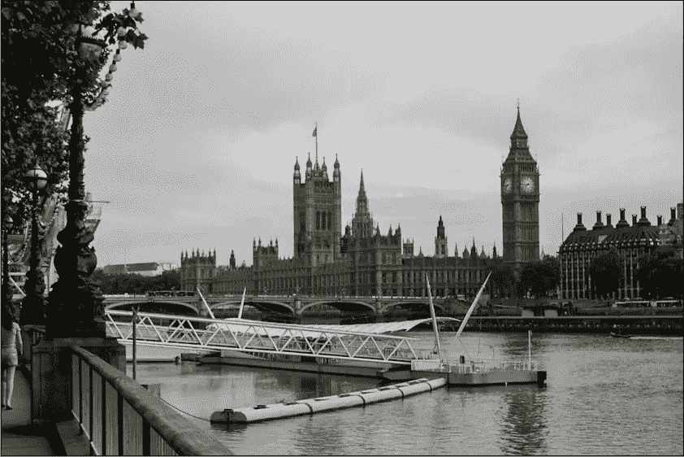](https://www.sitepoint.com/wp-content/uploads/2012/05/Screen-shot-2012-05-19-at-11.16.25-AM.png)

之后:

### [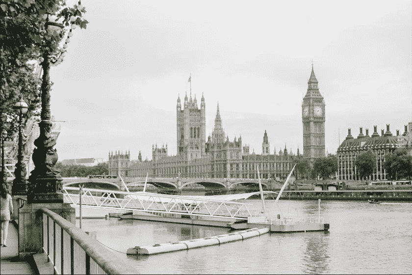](https://www.sitepoint.com/wp-content/uploads/2012/05/Screen-shot-2012-05-19-at-11.13.14-AM.png)

### 锐化和降噪

这组功能可以在细节部分找到，毫不奇怪，它可以让你的图像看起来更加清晰和详细。在“细节”下，您有各种各样的锐化选项，其工作方式很像 Photoshop 中的锐化滤镜。它们是:数量、半径、细节和遮罩。

锐化工具的正下方是降噪工具。它们非常适合去除图像中的颗粒和噪声。您可以控制亮度和颜色细节，这为您提供了与 Photoshop 中不同的选项。您可以更好地控制实际减少的噪音，最重要的是，只需调整几个滑块即可。下面是锐化和降噪面板:

[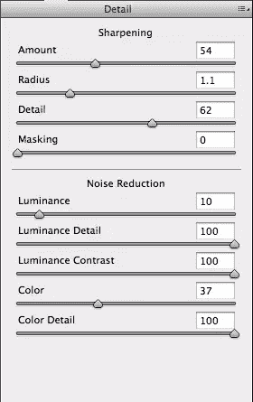](https://www.sitepoint.com/wp-content/uploads/2012/05/Screen-shot-2012-05-19-at-12.03.51-PM.png)

以下是应用锐化和降噪后的图像:

如果你看看我们之前的图像(只有清晰度和曝光增强)之间的差异，并将其与上面的一个直接比较，你可以看到一个巨大的差异。锐化和细节是真正有助于提供清晰的冲刷区域。

### HSL/灰度

HSL/灰度非常方便，因为您可以快速轻松地调整图像的颜色选项。您可以控制不同颜色的色调、饱和度和亮度。即使您将图像转换为灰度，您仍然可以调整不同的色调，以获得您想要的灰度图像的外观，尽管完全没有颜色。

[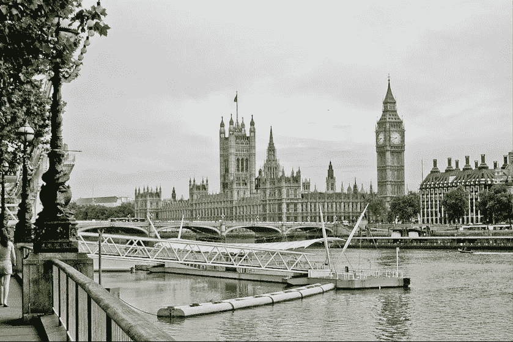](https://www.sitepoint.com/wp-content/uploads/2012/05/Screen-shot-2012-05-20-at-11.55.06-AM.png)

[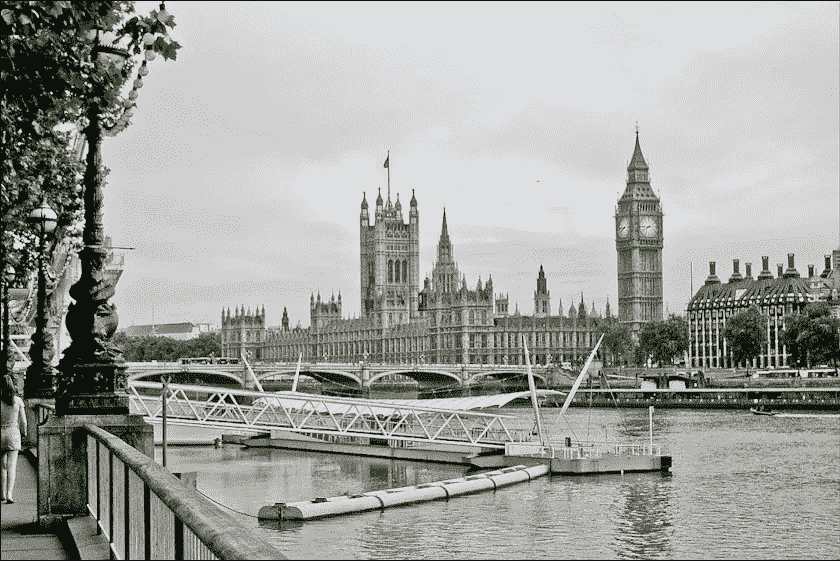](https://www.sitepoint.com/wp-content/uploads/2012/05/Screen-shot-2012-05-20-at-11.54.50-AM.png)

你可以在上面的例子中看到，我移除了左边石栏杆的过度饱和。这对于 HSL 滑块来说相当简单，我降低了图像中不想要的黄色调的饱和度。

对于灰度图像，您可以做同样的事情。您可以控制每个色调范围，使您能够轻松地将灰度图像调整到最佳状态。在下面的例子中，树叶太暗了，所以我调整了绿色滑块，把高光带回到树叶中。

之前:

[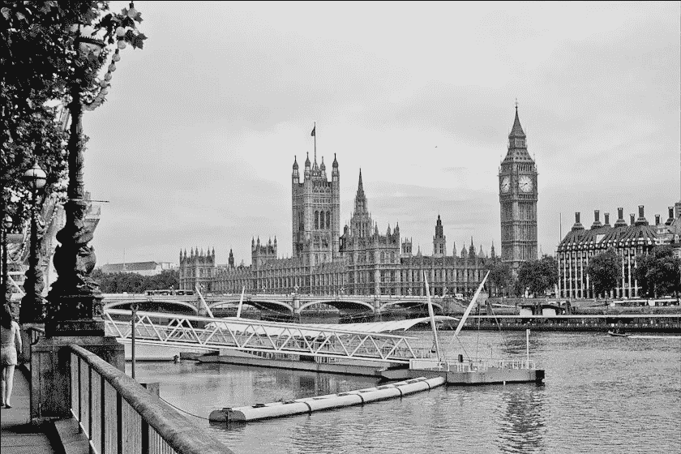](https://www.sitepoint.com/wp-content/uploads/2012/05/Screen-shot-2012-05-20-at-11.52.22-AM.png)

之后:

[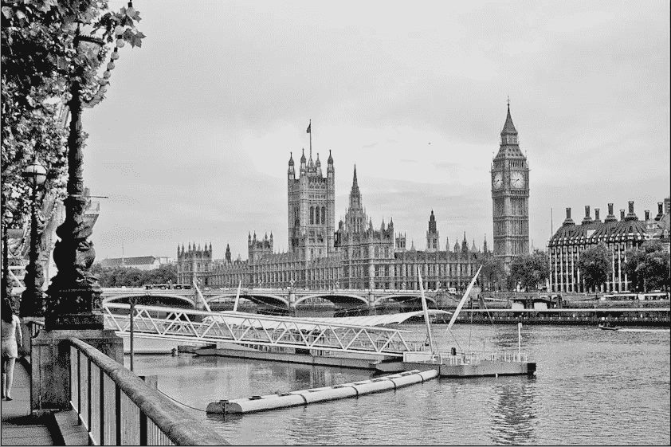](https://www.sitepoint.com/wp-content/uploads/2012/05/Screen-shot-2012-05-20-at-11.53.41-AM.png)

### 分割调色

分割调色是另一个很好的选择。它可以控制阴影和高光的色调，并使您能够控制两者之间的平衡。您可以将图像的高光设置为一种色调，阴影设置为另一种色调，甚至可以控制它们的应用比例。例如，如果您有一种颜色(如深蓝色压倒阴影，而淡黄色用于高光)，您可以设置它，以便每种颜色都单独调整，但同时调整。为了获得最佳效果，您可能希望使用相互搭配的对比色，如黄色和紫色。在下面的例子中，我使用分割色调来给照片添加复古的效果。

[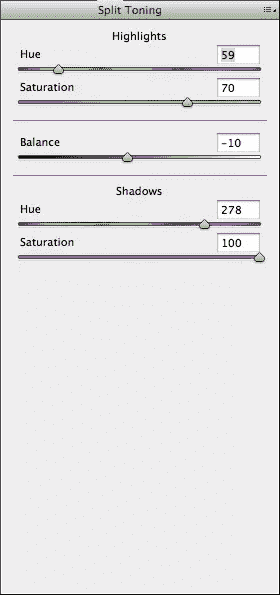](https://www.sitepoint.com/wp-content/uploads/2012/05/Screen-shot-2012-05-20-at-12.14.15-PM.png)

### 透镜轮廓

这是一个很好的工具，可以用来校正图像中的镜头失真。Camera Raw 甚至可以让您选择相机的品牌和型号，校正镜头失真，以及添加或删除渐晕。我强烈建议你选择相机的品牌和型号；它会产生意想不到的好结果。

[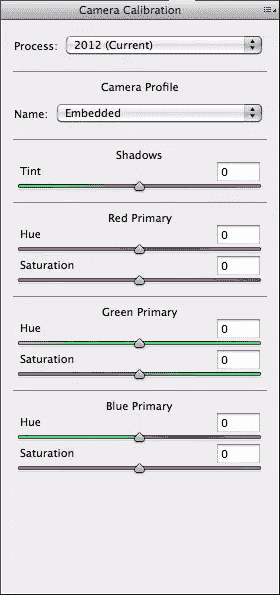](https://www.sitepoint.com/wp-content/uploads/2012/05/Screen-shot-2012-05-20-at-12.20.01-PM.png)

### 调节刷

Camera Raw 中的调整笔刷非常棒。此笔刷允许您在图像中设置一个点，并独立于图像的其余部分进行校正。最棒的是，您拥有全套的校正工具，因此如果您的图像中只有一个点需要调整(或者如果您需要在不同的区域进行多次调整)，您可以通过几个滑块快速轻松地完成。这比在 Photoshop 中完成得更快，在 Photoshop 中，您必须为每个要更改的不同区域制作不同的调整图层和不同的蒙版。在 Camera Raw 中，您可以点击、调整和移动。

在下面的例子中，我只在图像左侧的石头栏杆上调整了黄色色调的饱和度。早些时候，我应用了一个图像范围的橡皮布调整，降低了整个图像中黄色的饱和度，洗掉了著名的“大本钟”。使用调整笔刷，我们可以应用相同的调整，但只在我们需要的区域内。这给了我们更好的结果。

[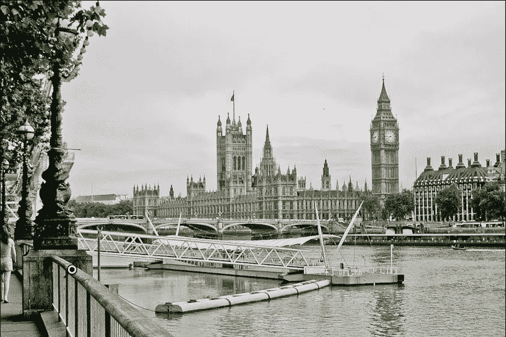](https://www.sitepoint.com/wp-content/uploads/2012/05/Screen-shot-2012-05-20-at-12.22.39-PM.png)

### 目标调整工具

目标调整工具允许您将图像中的一种色调作为目标，并在图像中的任何地方调整相同的色调。在下面的例子中，我点击了左边的树叶，并将鼠标拉向右边，以增加图像中绿色的亮度值。然后，我点击了大本钟上方的云，并增加了该区域的亮度值，这恰好在黄色色调范围内。

之前:

之后:

[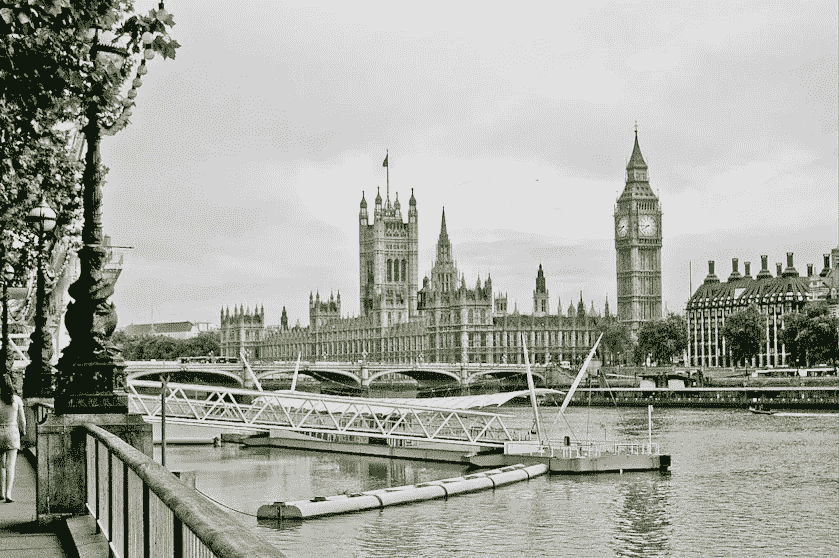](https://www.sitepoint.com/wp-content/uploads/2012/05/Screen-shot-2012-05-20-at-12.46.15-PM.png)

### 快照

快照是一个很棒的功能。假设您已经做了一些调整，但是您不能决定您是更喜欢彩色图像还是灰度图像。您可以转到快照面板，将彩色快照保存为快照。您可以通过单击看起来像 Photoshop 新图层图标的图标来完成此操作。然后，您可以将您的图像转换为灰度，用前面提到的 HSL 设置进行调整，并将其保存为自己的快照。当您准备好比较这两者时，只需转到快照选项卡，就可以来回切换来比较这两者。方便、快捷、简单！在下面的例子中，我有我在这篇文章中使用的 5 个不同的快照。点击它们中的任何一个都可以让你轻松地进行仔细的视觉比较。

[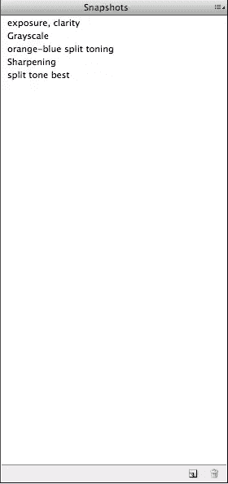](https://www.sitepoint.com/wp-content/uploads/2012/05/Screen-shot-2012-05-20-at-12.48.56-PM.png)

### 结论

当我们完善我们的图像时，了解我们所有可用的选项会有所帮助。Camera Raw 有自己的一套优势和工具，以及一个快速、简单的过程来比较修订。使用调整画笔进行精确调整可以节省大量时间，否则这些时间将会花费在 Photoshop 中重复制作蒙版和调整图层上。同样，使用快照比较最终结果可以节省额外的时间，并让您轻松地比较调整。根据您的需要，Camera Raw 可能是您工作流程中的一个优秀工具，并且可以节省大量时间。

## 分享这篇文章