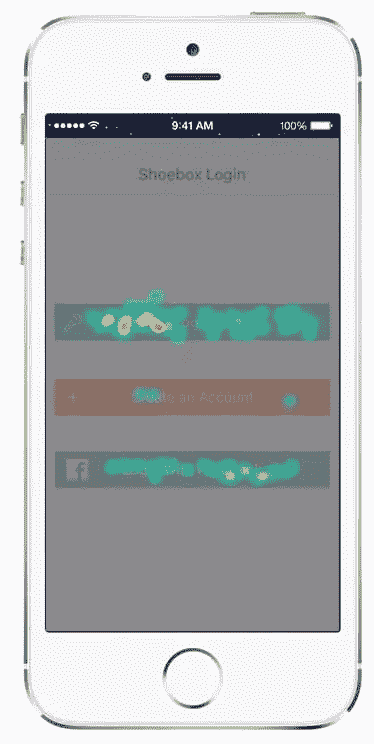

# 为什么你的应用程序优化是缺乏的，你甚至不知道它

> 原文：<https://www.sitepoint.com/why-your-app-optimization-is-lacking-and-you-dont-even-know-it/>

*这篇文章最初出现在 [Appsee](https://pm.appsee.com/2016/04/18/why-your-app-optimization-is-lacking-and-you-dont-even-know-it/) 上。感谢您对使 SitePoint 成为可能的合作伙伴的支持。*

如果你有一个应用程序，你可能有一个应用程序分析系统，或者，你至少在考虑一个。

你们中的许多人正在使用谷歌分析，这无疑是市场上最常用的解决方案——但在这个众所周知的统计中有一个重要的差异。

根据 VentureBeat 最近的报告，[移动应用分析:成功的移动开发者使用什么](http://insight.venturebeat.com/report/mobile-app-analytics-what-winning-mobile-developers-use)，只有 30%的受访应用开发者表示谷歌分析是他们的*主要*分析选择。归根结底，开发者“使用各种工具来分析和理解他们的应用程序内部发生的事情，尽管谷歌是目前的领导者，但它不是该领域唯一重要的参与者。”

这部分是由于应用需求的快速规范和移动应用行业的迅猛发展。如今，顶级应用程序开发人员使用独特的分析工具进行营销自动化、收购、参与、A/B 测试、货币化，最著名的是 UX。

对于这篇文章，让我们聚焦于 UX 应用分析，以及它在应用优化方面能为你做些什么。

## 第一，什么意思？

我想你已经知道 UX 是什么了。[根据定义](https://www.nngroup.com/articles/definition-user-experience/)，用户体验包括最终用户与公司、其服务和产品互动的所有方面。

然而，要真正理解你的应用程序的 UX，你需要*了解*你的用户正在经历什么，他们的行为如何。

这就是有效的 UX 应用程序分析发挥作用的地方。

## 超越传统的移动分析

因此，我在序言中指出，UX 应用分析对于你理解用户和应用优化流程至关重要，但它与传统分析系统的根本区别是什么？

**答案:**定性数据。

传统的移动分析工具为您提供量化数据，并强调关键指标，如新用户数量、参与率、用户保留率和地理细分。这些指标很重要，但是你有多长时间会觉得数据太多而洞察力太少？

这是一种普遍的情绪。

为了真正理解所有数字背后的“为什么”,你需要可视化你的应用程序内部发生了什么。这是 UX 应用分析的根本目标。

来源:vizioninteractive.com

我有一个比喻，完美地诠释了这个价值。假设有人告诉你一次他们去大堡礁的奇妙旅行。这种告诉你他们的体验的行为就像传统的、定量的移动分析。现在假设有人给你看了那个珊瑚礁的照片和视频——你现在看到了他们旅行的画面，可以在更高的层次上理解他们的经历。这是定性的，UX 应用分析的本质。

像 [Appsee](https://www.appsee.com/?cpnid=701b0000000WaoL&utm_source=sitepoint&utm_medium=onsite&utm_campaign=appseecpl&utm_content=appoptimization) 这样的 UX 应用分析，使应用团队能够超越[被动数据](http://www.searchenginepeople.com/blog/16042-ux-px-design.html)并获得视觉洞察，允许他们全面检查用户行为、转换漏斗、UI 更新、新功能，并最终简化应用优化流程。

例如，可能从“帐户创建”屏幕到你的应用商店的特定用户路径具有高退出率。这是为什么呢？传统的移动分析不会以一种清晰的方式为你分解事物。一张数据表只能带我们走这么远，而且很多时候我们根本无法从数字数据中推断出真知灼见。

来源:seroundtable.com

## 用户记录

这种独特的工具使您能够实时观察活跃的用户会话，并通过他们的眼睛确切地看到用户如何与您的应用程序交互。此外，他们可能在你的应用程序中遇到摩擦的时间和地点。

通过分析这些记录，您将获得一些信息，这些信息将帮助您了解您的用户遇到了哪些问题，以及他们为什么没有完成应用程序中的重要流程(如应用内购买和移动入职)。这是非常强大的，因为它实际上就像是从你的用户的肩膀上看过去，并且确切地看到他们如何使用你的应用程序。你是否察觉到由于你的应用程序的导航菜单设计，在一个记录的用户的会话中有挫败感？通过查看一系列指标很难发现这一点。

看看下面的示例记录，其中显示了一个用户由于技术问题无法通过脸书登录。用户尝试登录并遇到弹出错误消息。这种快速而强大的视觉效果可以突出为什么用户会离开你有价值的登录界面。

不再需要猜测——您只需点击播放按钮，就能亲眼看到您的用户是如何操作的。

[https://www.youtube.com/embed/KoVum1nuihA](https://www.youtube.com/embed/KoVum1nuihA)

## 触摸热图

虽然用户记录更侧重于单个用户层面，但触摸热图有助于提供关于用户行为的综合、全面的信息。触摸热图汇集了所有用户手势(点击、滑动、挤压等。)，让你看到用户最关注的地方，并帮助你了解应用程序 UI 的功效。

它们还可以帮助您检测每个屏幕上没有反应的手势，如果没有注意到，这些手势可能会影响或破坏您的用户体验。没有反应的手势可能意味着一个 bug，也可能暴露了用户界面中的一个设计缺陷。

看看下面的热图。从这个清晰的视觉效果中，你可能会得出这样的结论:行动呼吁(CTA)按钮需要向上移动几个像素，或者其中一个功能(“创建帐户”)被用户忽略/不太喜欢。

最终，这些定性的数据可以帮助你理解一些手势和设计的 KPI 和它们的含义，以及你如何最终改进你的 UI 设计。

## 总结

虽然我已经强调了定性数据的基本价值，但我强烈建议您将这些数据与定量数据结合使用。

定量数据可以指出你的应用程序的问题所在。一旦注意到这些麻烦的部分，你就可以利用可视化 UX 应用分析的定性优势来帮助你找到问题的确切原因。

不要忘记，为了完全理解你的用户体验，你必须亲自看到你的用户是如何行为的。没有这些洞察力，你的 UX 可能会功亏一篑。归根结底，传统分析不应成为应用优化的终极解决方案。

## 试试 SDK

Appsee 是一个面向 iOS 和 Android 的移动分析 SDK，它可以帮助[检查你的应用](https://www.appsee.com/?cpnid=701b0000000WaoL&utm_source=sitepoint&utm_medium=onsite&utm_campaign=appseecpl&utm_content=appoptimization)的性能以及用户如何与之交互。

通过热图和真实用户会话的视频记录，了解人们在您的移动应用中的行为。试试 Appsee SDK。

## 分享这篇文章