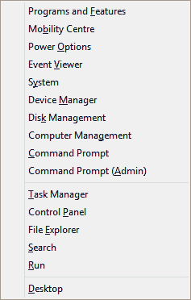
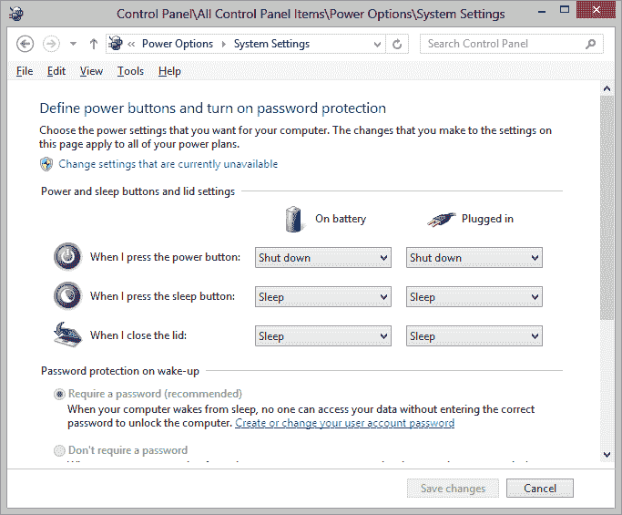

# 如何提高您的 Windows 8 工作效率

> 原文：<https://www.sitepoint.com/windows-8-productivity/>

Windows 8 最初可能会让你感到沮丧和困惑，但在光滑的 Metro/随便你怎么称呼它的表面下隐藏着许多熟悉的功能。幸运的是，微软已经提供了许多键盘快捷键，所以你可以避免在你的桌面电脑上进行毫无意义的滑动。

## 启动

不需要做任何复杂的手势——只需点击鼠标或按键，登录密码或图像就会浮现在眼前。按 Win+L 再次锁定计算机。

## 启动应用程序

点击你的键盘窗口键显示地铁开始屏幕。如果没有该应用程序，请使用 Win+Q 查看和搜索所有应用程序。

如果所有其他方法都失败，请使用文件资源管理器(Win+E)导航到旧的开始菜单文件夹:

*   c:程序数据 Microsoft windows 开始菜单
*   c:Users*<your-name>*appdataroamingmicrosoft windows 开始菜单

找到快捷方式，右键单击并选择“锁定到开始”、“锁定到任务栏”或“发送到>桌面”。

或者，旧的运行对话框仍然可以用 Win+R 启动，Alt+Tab 在应用程序之间切换。

最后，Windows 键加上一个从 1 到 0 的数字启动任务栏上相应的锁定应用程序。使用 Win+Alt+数字键打开应用程序跳转列表。

## 窗口热键

需要关闭桌面程序或 Metro 应用程序？从我记事起就支持 Alt+F4。

使用 windows 键和上下光标键可以最大化和最小化应用程序窗口。您可以分别使用 Win+left 和 Win+right 将窗口停靠在屏幕的左半部分或右半部分。

使用 Win+D 查看桌面，并再次点击它以重新查看您的活动应用程序。或者，Win+M 最小化所有窗口，Win+Shift+M 恢复它们。

最后，如果你使用的是平板设备，Win+O 会锁定屏幕方向。

## 超级用户热键

 如果只记得一个热键，那就做成 **Win+X** 。它显示了有用选项的菜单，如常用的控制面板设置、磁盘管理、计算机管理和命令提示符。

其他热键:

*   Win+C —显示魅力菜单
*   Win+I —设置的魅力
*   win+H——共享魅力
*   win+K——设备的魅力
*   Win+W —设置搜索
*   Win+P —第二个屏幕栏
*   Win+Z —显示 Metro 应用程序栏
*   Win+PrtScn —将屏幕截图保存到 Pictures 文件夹
*   Win+Break/Pause —显示控制面板系统对话框

## 停工

导航到关机选项有点可笑——将鼠标移动到屏幕的右下角或右上角(这在双显示器上很尴尬),然后依次单击设置、电源和关机。呃。

 这里有一个更简单的选项:*合上笔记本电脑的盖子或者按下电脑的电源按钮*。

谁知道呢？您可以在“控制面板”的“电源选项”中更改 Windows 是关机、睡眠还是休眠。单击左侧窗格中的*“选择电源按钮的功能”*链接。

我错过了你最喜欢的 Windows 8 热键或提示吗？有用的请…切换到另一个操作系统或降级到 Windows 7/XP 不一定实际！

## 分享这篇文章