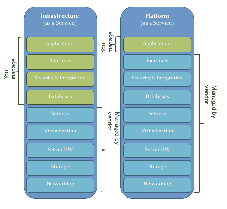
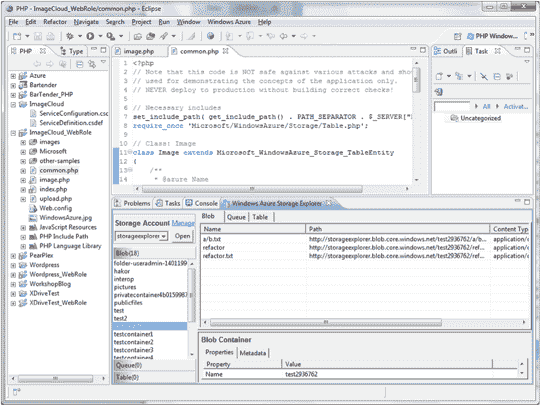
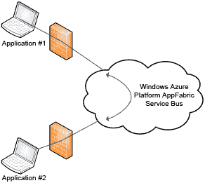
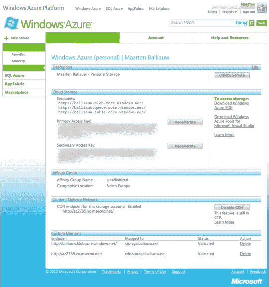

# 使用 Windows Azure 在云中托管 PHP

> 原文：<https://www.sitepoint.com/windows-azure-php/>

云计算不仅仅是高管会议上的一个时髦词，它还是 IT 界的下一件大事。云提供了无限量的资源，包括按需和按使用付费模式:随时可用的计算机资源！在本文中，我将重点关注这些云平台之一，微软的 Windows Azure，并为您提供在这个平台上开始开发 PHP 应用程序所需的所有信息。尽管我们不会深入探讨技术细节，但在我们进行的过程中，我会为您提供关于具体问题的更多信息和资源。

当你完成时，你应该对 Windows Azure 平台有了很好的理解，你可以在我们的[文章测验](https://www.sitepoint.com/quiz/microsoft/windows-azure-php)中测试你的知识。

## 不同的云

选择是一件好事。对于我们开发人员来说，好消息是在云计算方面有很多选择。微软、谷歌、亚马逊、Rackspace、GoGrid 和许多其他公司都提供有自己特色的云产品。看起来整个世界都在将这些产品分为两个不同的类别: *IaaS* (基础设施即服务)和 *PaaS* (平台即服务)——两者之间的区别如图[图 1，“云平台之间的区别”](#fig_iaaspaas "Figure 1. The difference between cloud platforms")所示。

**图一。云平台的区别**



首先，我们来看 IaaS。Amazon EC2 是第一个提供可以运行应用程序的虚拟机的公司。然而，这些虚拟机在您的控制之下，就像数据中心中的物理服务器一样。这意味着您可以控制操作系统的补丁程序、安全性和维护，并且所有这些都具有完全的根用户或管理员访问权限。由于网络、负载平衡器和防火墙都是为您处理的，因此云平台让您摆脱了基础架构的困扰。

接下来是 PaaS。这种方法也基于虚拟机，但是您无法控制它们。相反，提供了一组工具和 API 来让您打包您的应用程序并将其上传到您的虚拟机上，因此您唯一需要担心的是您的应用程序。网络、操作系统等都由云平台维护。

所有云供应商都有共同的特性，包括虚拟机和通过基于 REST 的协议可用的存储。然而，每种产品都有其独特的功能，这是好的:云仍然处于非常创新的阶段，作为开发人员，我们可以选择最适合我们特定应用的平台。

## Windows Azure 平台概述

在整篇文章中，我将描述 Windows Azure 平台，这是微软面向云计算世界的 PaaS 产品。但是，在我们深入了解技术细节之前，让我们先了解一下该产品中包含的组件，以及它们的作用。

### Windows Azure

Windows Azure 是 Windows Azure 平台的核心组件。营销人员将这个组件描述为“Azure 云的操作系统”。我不太喜欢营销人员和他们的报价，但这一次，他们是对的！Windows Azure 是微软产品的核心，它做任何操作系统都应该做的事情:它允许你在虚拟机上运行你的应用程序，要么以 web 角色(安装了 web 服务器)要么以 worker 角色运行——一个更干净的虚拟机，允许你托管其他类型的应用程序。

Windows Azure 还允许您快速扩展:只需更改一个配置值，您就可以轻松运行多个实例。负载平衡是自动进行的，不需要任何配置。

除了操作系统，还包括一组存储服务，可以通过基于 REST 的 API 访问。Blob 存储允许您托管任何文件:文本文件、图像、下载等。本质上，表存储是一个文档数据库，它的查询能力有限，但是可以大规模扩展。还有队列，它主要用于 web 和 worker 角色之间的通信。

Windows Azure 是您的应用程序将被托管的位置。web 角色将承载您的 web 应用程序；您可能会使用 blob 存储来存储文件，也可能使用表存储(或者 SQL Azure，我们稍后会讨论)来存储数据。平台的其他组件也使用 Windows Azure。

### SQL Azure

除了托管之外，您可能还需要一个存储关系数据的地方。这就是 SQL Azure 的用武之地:它是微软 SQL Server 的一个略微修改的版本，提供了你期望从数据库中得到的所有服务:表、视图、索引、存储过程、触发器等等。

SQL Azure 以可伸缩和可靠的方式提供数据库服务。数据在不同的站点之间复制，并通过负载平衡器提供，为您的应用程序的数据层提供了很高的性能。

### Windows Azure 平台 AppFabric

Windows Azure Platform AppFabric 本质上是两种产品的结合。有一种访问控制服务，你可以将用户的身份验证和授权任务委托给它，还有一种服务总线，在我看来，这是真正使 Windows Azure 脱颖而出的功能之一。简而言之，服务总线允许您在两个端点之间建立通信。这可能是向一组订户发布消息的服务，但是服务总线也可以用于在防火墙上打孔！

想象一下，应用程序 A 和 B 分别位于不同的网络中，位于不同的防火墙之后。似乎不可能直接通信，但是 AppFabric 服务总线将确保两个应用程序可以通信。您无需在公司的防火墙中打开端口，即可让您的云应用程序与内部应用程序进行通信。

### 现场服务

Live Services 提供了一个您可能已经知道的在线身份系统:Windows Live ID。Live Services 还提供在线感知、搜索、Bing 地图地图、同步等功能。

### 代号项目:达拉斯和悉尼

这些产品仍处于培育阶段，未来可能会发生一些变化。然而，它们已经提供了一些很棒的功能。Dallas 基本上是一个数据即服务解决方案，通过它您可以订阅以开放格式 OData 提供的各种数据集，OData 是基于 REST 和 Atom 的。它还为您的企业提供了一个新的收入来源:如果您拥有大量有用的数据，为什么不通过达拉斯提供这些数据并让其他人付费使用呢？

悉尼项目是不同的:它专注于你如何与你的云应用程序通信。目前，这种通信是通过公共互联网完成的，但 Sydney 将允许您建立到虚拟机的 VPN 连接，使您能够使用自己的安全证书等来保护通信。

## PHP 可用的工具和 API

当我们谈论在像 Windows Azure 这样的云平台中使用 PHP 时，在开始使用云之前，我们应该完成一些目标。您需要合适的工具来构建和部署您的应用程序，还需要合适的 API——那些允许您使用该平台及其所有特性的 API。

微软在这方面已经做了很多出色的工作。是的，Windows Azure 是一个基于 Windows 的平台，似乎只针对。网络语言。然而，当你看到围绕 PHP 和 Windows Azure 的工具、教程、API 和博客帖子时，很明显 PHP 是该平台的一个同等重要的公民！

让我们浏览一下今天 Windows Azure 上 PHP 可用的所有工具和 API。使用 [Web 平台安装程序](http://microsoft.com/web)可以非常容易地安装这些工具，这是一个“检查-下一步-完成”向导，允许您以一种简单有效的方式安装平台和工具。

### IDE 支持

当然，你可以使用你最喜欢的编辑器来开发一个将在 Windows Azure 上运行的 PHP 应用程序。另一方面，如果您正在使用基于 Eclipse 的编辑器，如 Eclipse PDT、Zend Studio 或 Aptana，您可以利用一个伟大的插件来加速您的开发工作，如图[图 2，“使用 Eclipse 进行开发”](#fig_eclipse "Figure 2. Using Eclipse for development")所示。适用于 Windows Azure 的 Eclipse 插件可在 http://windowsazure4e.org 的[获得。此外，Josh Holmes 准备了一个方便的帖子，](http://windowsazure4e.org)[在 Azure 开发上简单设置 PHP](http://www.joshholmes.com/blog/2010/04/13/easy-setup-for-php-on-azure-development/)。

**图二。使用 Eclipse 进行开发**



安装插件后，您会发现以下特性已经添加到您的 IDE 中:

*   项目创建和迁移允许将现有应用程序轻松迁移到 Windows Azure 应用程序。该工具将使您的应用程序为打包和部署到 Windows Azure 做好准备。

*   存储资源管理器提供对您的 Windows Azure 存储帐户的访问，并允许您上传和下载 blobs、查询表、列表队列等。

*   调试和本地测试也包括在内:没有必要立即在 Windows Azure 上部署和测试你的应用程序。“本地云”模拟环境是可用的。

### 包装

一旦您的应用程序准备好进行部署，就应该针对 Windows Azure 进行打包。*打包*基本上就是为你的应用程序创建一个 ZIP 存档，并嵌入所有包含文件及其配置需求的清单的过程。

Windows Azure 的 Eclipse 插件包含这个特性。然而，如果您不使用 Eclipse 作为您的 IDE，或者如果您在非 Windows 环境中工作，您可以使用针对 PHP 开发人员的 [Windows Azure 命令行工具](http://azurephptools.codeplex.com)来打包您的应用程序。

### 开发工具和 SDK

接下来，让我们看看 Windows Azure 提供给开发人员的一些工具和 SDK。

#### 用于 PHP 的 Windows Azure SDK

如果你计划为 Windows Azure 迁移一个应用程序或构建一个新的应用程序，那么你很可能需要存储空间。这就是 Windows Azure SDK for PHP 派上用场的地方:它让您可以轻松访问 Windows Azure 提供的 blob 存储、表存储和队列服务。您可以[下载这个 SDK](http://phpazure.codeplex.com) 作为一个独立的开源包，允许您从内部位置和您的云应用程序访问存储。如果您使用的是我们之前讨论过的 Eclipse 插件，您会发现这个 API 也包含在内。

利用存储的过程总是从设置您的凭证开始:一个帐户名和一个共享密钥(可以把它想象成一个很长的密码)。然后，您可以使用可用于 blob 存储、表存储或队列存储的特定类之一。

下面是一个 blob 存储的例子。首先，我创建一个容器(把它想象成一个虚拟硬盘)。然后，我将文件从本地硬盘上传到 blob 存储器:

```
/** Microsoft_WindowsAzure_Storage_Blob */require_once 'Microsoft/WindowsAzure/Storage/Blob.php';$storageClient = new Microsoft_WindowsAzure_Storage_Blob();$storageClient->createContainer('testcontainer');// upload /home/maarten/example.txt to Windows Azure$result = $storageClient->putBlob('testcontainer', 'example.txt', '/home/maarten/example.txt');
```

之后读取 blob 相当简单:

```
/** Microsoft_WindowsAzure_Storage_Blob */require_once 'Microsoft/WindowsAzure/Storage/Blob.php';$storageClient = new Microsoft_WindowsAzure_Storage_Blob();// download file to /home/maarten/example.txt$storageClient->getBlob('testcontainer', 'example.txt', '/home/maarten/example.txt');
```

表存储有点复杂。它就像一个非常可伸缩的数据库，没有绑定到模式，查询的可能性有限。要使用表存储，你需要一些可以被你的 PHP 应用程序和 Windows Azure 表存储使用的类。下面是一个表示人的示例类:

```
class Person extends Microsoft_WindowsAzure_Storage_TableEntity{  /**   * @azure Name   */  public $Name;      /**   * @azure Age Edm.Int64   */  public $Age;}
```

将一个`Person`实例插入到表中就像创建一个新实例并赋予它一些属性一样简单。之后，Windows Azure SDK for PHP 中的表存储 API 允许您将实体插入名为`testtable`的表中:

```
/** Microsoft_WindowsAzure_Storage_Table */require_once 'Microsoft/WindowsAzure/Storage/Table.php';$entity = new Person('partition1', 'row1');$entity->Name = "Maarten";$entity->Age = 25;$storageClient = new Microsoft_WindowsAzure_Storage_Table('table.core.windows.net', 'myaccount', 'myauthkey');$storageClient->insertEntity('testtable', $entity);
```

在一段代码中包含了大量的信息！首先， partition1 和 row1 是什么？这些是分区键和行键。*分区键*是实体的逻辑分组。例如，在用户可以提交博客文章的应用程序中，用户名是分区键的一个很好的候选对象——这将允许您轻松地查询与给定用户相关的所有数据。*行关键字*是该行的唯一标识符。

队列遵循同样的想法——有一个 API 允许你在 Windows Azure 上从队列中放入、获取和删除消息。队列也保证得到处理:当从队列中读取消息时，数据在特定时间内是不可见的。如果在该时间之后，消息还没有被明确删除，例如因为批处理脚本崩溃，则消息将重新出现，并可用于再次处理。

Windows Azure SDK for PHP 还具有一些特定于 PHP 和 Windows Azure 的额外功能。这包括像会话存储提供程序这样的功能，它允许您通过多个 web 角色实例共享 web 会话数据。另一个特性是流包装器，它允许您在 blob 存储上使用标准的文件函数，比如`fopen`。

一个示例应用程序 ImageCloud 使用了上述所有特性，可以在我的博客上下载。

#### 用于 PHP 的 SQL Server 驱动程序

PHP 的 SQL Server 驱动程序允许 PHP 开发人员访问托管在 SQL Server 或 SQL Azure 上的 SQL Server 数据库。PHP 的 SQL Server 驱动程序依赖于 Microsoft SQL Server ODBC 驱动程序来处理与 SQL Server 的低级通信。因此，PHP 的 SQL Server 驱动程序仅在 Windows 和 Windows Azure 上受支持。可以[下载](http://sqlsrvphp.codeplex.com)作为 PHP 扩展安装。

下载此驱动程序时，请务必下载 2.0 版。这个版本还有一个额外的好处，它提供了 PDO (PHP 数据对象)支持，允许您在 MySQL 和 SQL Server 之间快速切换。

现在，让我们假设您有一个 SQL Azure 数据库。以下代码展示了如何连接到 SQL Azure 数据库服务器上的`blog`数据库，并检索按发布日期排序的文章:

```
// Connect to SQL Azure using PDO$connection = new PDO('bvoj6aovnk.database.windows.net', 'sqladm@bvoj6aovnk', 'mypassword', array('Database' => 'blog'));// Fetch specific post$posts = array();$query = 'SELECT * FROM posts ORDER BY PubDate DESC';$statement = $connection->query($query);while ( $row = $statement->fetchObject('Post') ) {  $posts[] = $row;}
```

#### 用于 PHP 的 AppFabric SDK

正如我之前提到的，Windows Azure Platform AppFabric(不要与 Windows Server AppFabric 混淆)使您能够委派用户身份验证和授权，轻松穿透防火墙并连接不同受保护网络上的应用程序。你可以从 http://dotnetservicesphp.codeplex.com 下载。

在身份验证和授权方面，了解一些基于声明的身份验证和联合很重要——关于这个主题，有一些有趣的资源可供参考。基本上，您的应用程序与身份验证机构(如 Windows Azure Platform AppFabric)建立信任关系，这意味着您的应用程序信任通过该机构身份验证的用户。接下来，您的应用程序将要求其用户要求他们的权利。例如，我的应用程序可以要求用户声明他们可以创建订单:

```
$requiredClaims = array('CreateOrder' => true);if (ValidateClaimUtil::ValidateClaims($requiredClaims, "phpservice", 'http://localhost/SalesDashboard/', $signingKey)){  // User is allowed to create an order!} else{  // User is not authorized.}
```

Windows Azure Platform AppFabric 访问控制服务将验证用户是否拥有此声明，并使用该信息签署安全令牌。因为您的应用程序信任这个机构，所以它将根据声明是否有效而继续或失败。

现在，magine 有两个应用程序由于防火墙相关的政策而无法相互连接。如果两个应用程序都可以建立到服务总线的传出连接，服务总线将中继两个应用程序之间的通信。就这么简单——如果您有一个强大的 It 部门，这将非常有用！

**图 3。Windows Azure 平台 AppFabric 服务总线的优势**



向您展示这是如何工作的示例代码会让我们走得太远(因为它会涉及一些配置和设置任务)。但是如果你认为这听起来像是一个很棒的特性，请查看 PHP 网站的 [AppFabric，其中包含大量关于这个问题的教程。](http://www.dotnetservicesphp.com/Home.html)

### 其他特征

除了我们已经研究过的所有特性和 API 之外，还有许多其他特性和产品值得关注。这些特性并不总是特定于 Windows Azure 的，比如 IIS7 的 URL 重写模块，但你的应用程序仍然可以从中受益匪浅。

#### PHP Azure 贡献

Windows Azure 平台提供了一些有用的功能，比如读取配置文件(即使在部署完成后也可以修改)，或者登录 Windows Azure 环境并访问虚拟机上的本地存储来临时存储文件。不幸的是，这些功能被嵌入到 Windows Azure Cloud Guest OS 中，不能作为 REST 服务使用。然而幸运的是，这些特性是作为 C 动态链接库公开的，这意味着编写 PHP 扩展来与它们接口是一个合理的步骤。这正是 PHP Azure 贡献库所提供的:一个利用配置数据、日志和本地存储的 PHP 扩展。想象一下在您的`ServiceConfiguration.csdef`文件中有一个名为`EmailSubject`的配置值。使用 PHP Azure 贡献扩展读取这个值非常容易:

```
$$emailSubject = azure_getconfig("EmailSubject");
```

我们还可以将数据写入 Windows Azure 诊断日志。以下是我在诊断日志中写入信息性消息的一个示例:

```
azure_log("This is some useful information!", "Information");
```

PHP Azure 贡献项目可以在 http://phpazurecontrib.codeplex.com 的 CodePlex 上获得。

#### URL 重写

作为一名 PHP 开发人员，您可能已经使用了 URL 重写。在 Apache 的`.htaccess`文件中，很容易启用重写引擎，并将输入的 URL 重写为真正的脚本。例如，URL `http://www.example.com/products/books`可能被映射到您服务器上的`http://www.example.com/index.php?page=products&category=books`。这种技术在 IIS7 中也可用，IIS 7 是微软的 web 服务器，也用于 Windows Azure web 角色。上面的 URL 重写示例可以在 Windows Azure 应用程序根目录下的`Web.config`文件中定义:

```
<?xml version="1.0" encoding="UTF-8"?><configuration>  <system.webServer>    <rewrite>      <rules>        <rule name="RewriteProductsUrl" enabled="true" stopProcessing="true">          <match url="^products/([^/]+)/?$" />          <conditions>            <add input="{REQUEST_FILENAME}" matchType="IsFile" negate="true" />            <add input="{REQUEST_FILENAME}" matchType="IsDirectory" negate="true" />          </conditions>          <action type="Rewrite" url="index.php?page=products&category={R:1}" />        </rule>      </rules>    </rewrite>  </system.webServer></configuration>
```

还要注意，因为您的应用程序托管在 Windows Azure 中的 IIS web 服务器上，所以您可以为 IIS 使用任何 HttpModule，就像您为传统托管的应用程序所做的那样。这使得启用输出压缩、利用 IIS 身份验证和授权功能等变得更加容易。从[http://www.iis.net/download/urlrewrite](http://www.iis.net/download/urlrewrite)下载 IIS URL 重写模块。

#### WinCache 扩展

您可能知道，PHP 文件被解释成字节码，并在每次请求时从字节码执行。这个过程非常快，但是在高流量的网站上，建议我们缓存字节码，跳过脚本解释。这种技术提高了网站的性能，而不需要额外的资源。

在 Linux 上，利用这些技术的加速器模块，如 APC 和 IonCube，非常常见。这些也适用于 Windows，也可能适用于 Windows Azure。然而，微软也发布了自己的应用这种技术的模块:PHP 的 WinCache 扩展。这个扩展是 Windows 上最快的 PHP 加速器，并且还提供了像在这个缓存层存储会话数据这样的特性。PHP 的 Wincache 扩展可以从[http://www.iis.net/download/wincacheforphp](http://www.iis.net/download/wincacheforphp)下载。

#### 内容交付网络

当使用 Windows Azure blob 存储时，您会发现功能齐全的内容交付网络(CDN)也是可用的。例如，CDN 可以确保当用户下载图像时，可以从靠近用户客户端的存储服务器上检索到该图像。这确保了下载速度和延迟是最佳的，并且用户非常快速地接收图像。

有了 blob 存储，启用 CDN 就像点击一个按钮一样简单。之后，您的公共容器被复制到 CDN，这允许您的站点的用户尽可能快速地检索文件和资源！

**图 4。使用 Windows Azure CDN**



#### 域名映射

使用 Windows Azure，您的应用程序将被分配一个 cloudapp.net 域下的域名，例如，`myphpapp.cloudapp.net`。我想你会同意这不是最好的网址。当您使用 blob 存储来托管文件时，情况会变得更糟:`myphpappstorage.blob.core.windows.net`很难看！

幸运的是，Windows Azure 中的所有 URL 都可以映射到自定义域名。因此，要将`www.myphpapp.com`映射到`myphpapp.cloudapp.net`，您只需要向您的名称服务器添加一个 CNAME 记录。这同样适用于 blob 存储:`storage.myphpapp.com`可以通过向您的 DNS 服务器添加一个 CNAME 记录来映射到很长的`myphpappstorage.blob.core.windows.net`。

查看 Azure 团队成员 [Steve Marx 关于自定义域名的帖子](http://blog.smarx.com/posts/custom-domain-names-in-windows-azure)了解更多信息。

## 结论

在本文中，我们从 PHP 的角度拍摄了 Windows Azure 平台的快照。虽然我对 Windows Azure SDK for PHP 略有偏见，但我确实认为 Windows Azure 平台是在高度可扩展的云环境中托管 PHP 应用程序的绝佳选择。我还觉得像 Windows Azure AppFabric 服务总线这样的功能有很大的价值。底线是:我相信微软正在尽最大努力让 PHP 成为他们云平台上的一等公民。

另一个与 PHP 和 Windows Azure 相关的资源是 http://www.interoperabilitybridges.com，它列出了所有 PHP 和微软的开源项目。

别忘了去参加我们微软赞助的[文章测验](https://www.sitepoint.com/quiz/microsoft/windows-azure-php)来测试你的知识。

**note:** Microsoft: A SitePoint Business Partner

这篇文章是在微软的支持下完成的。我们与 Microsoft 密切合作，帮助开发对您(我们的读者)最有用、最相关的内容。

## 分享这篇文章