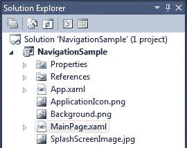
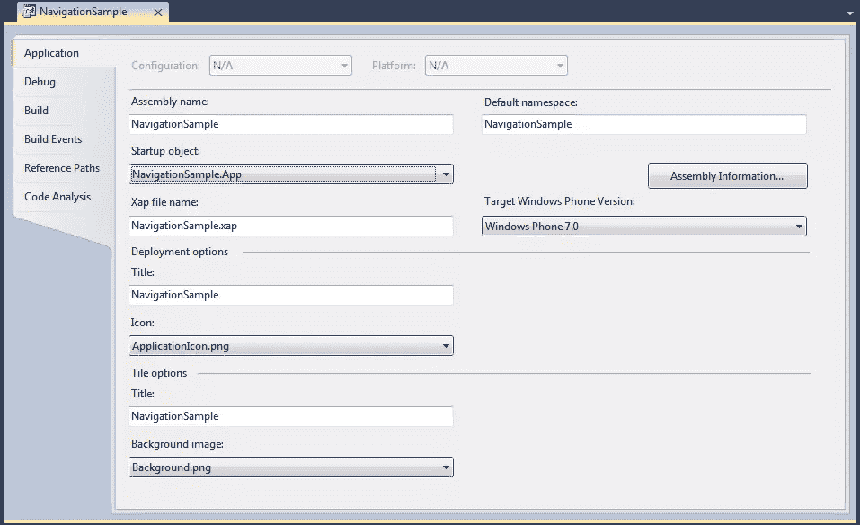

# Windows Phone 7 导航

> 原文：<https://www.sitepoint.com/windows-phone-7-navigation/>

Windows Phone 开发平台的有趣之处在于它基于 Silverlight，正如我们大多数人所知，Silverlight 首先是一种 web 技术。因此，Silverlight 支持的导航模型很好地映射了浏览器的工作方式，能够向前导航到新页面和向后导航到以前的页面。在这篇文章中，你将学习如何在你的 Windows Phone 应用程序中执行导航任务。

当您在 Visual Studio 或 Expression Blend 中创建新应用程序时，您的项目将包含许多定义基本 Windows Phone 应用程序的文件，请参见图 1。有两个包含布局信息的 XAML 文件，`App.xaml`用于应用程序范围的资源，`MainPage.xaml`用于定义应用程序内的第一页。

[](https://www.sitepoint.com/wp-content/uploads/2011/06/sp0006_01.png)

图 1

你能看到的其他文件是`ApplicationIcon.png`，在应用程序列表中应用程序名称旁边出现的图标，`Background.png`，默认的开始磁贴背景和`SplashScreenImage.jpg`，应用程序启动时出现的闪屏。除了闪屏图像(必须称为`SplashScreenImage.jpg`)之外，其他文件都可以通过项目属性对话框进行配置，参见图 2，可以通过双击 Solution Explorer 中的 properties 节点进行访问。

[](https://www.sitepoint.com/wp-content/uploads/2011/06/sp0006_02.png)

图 2

不幸的是，如果您想重命名或更改应用程序的初始页面，您必须手动编辑`WMAppManifest.xml`文件。通过在解决方案资源管理器窗口中展开“属性”节点可以找到该文件。您可以忽略这个文件的大部分内容，但是您需要修改的部分是`DefaultTask`元素:

```
<Tasks>
     <DefaultTask  Name ="_default" NavigationPage="MainPage.xaml"/>
</Tasks>
```

如果您希望更改应用程序的启动页面，请更改`DefaultTask`的`NavigationPage`属性。例如，下面指定`SecondPage.xaml`作为启动页面:

```
<DefaultTask  Name ="_default" NavigationPage="SecondPage.xaml"/>
```

或者，您可能希望将页面放在一个或多个子文件夹中。下面有一个名为“Pages”的子文件夹中的`MainPage.xaml`。

```
<DefaultTask  Name ="_default" NavigationPage="/Pages/MainPage.xaml"/>
```

一旦应用程序启动，您将希望用户能够导航到应用程序中的下一个页面。您可以通过直接在应用程序的框架上调用`Navigate`方法，或者通过在当前页面的上下文中找到的对`NavigationService`的引用来实现这一点。好吧，如果你不熟悉 Silverlight 导航模型，这听起来可能会很混乱。这个模型实际上相对简单:一个 Windows Phone 应用程序拥有一个`PhoneApplicationFrame`类的实例作为它的根视图。请将此视为应用程序的框架，其他所有内容都呈现在其中。在大多数情况下，框架本身没有任何视觉特征，但在某些情况下，您可能希望覆盖默认的框架行为，以定义页面过渡或应用程序中的其他效果。

框架负责显示应用程序的第一页(从`PhoneApplicationPage`继承的类)，并导航到后续页面。框架包含一个处理页面间导航的`NavigationService`类的实例。不管你如何在你的 Windows Phone 应用程序中启动导航，都是这个`NavigationService`处理从一个页面到下一个页面的转换。但是，建议您要么调用框架上的`Navigate`方法，要么调用当前页面范围内的`NavigationService`上的`Navigate`方法，如以下代码示例所示:

**通过框架导航**

```
var frame = Application.Current.RootVisual as PhoneApplicationFrame;
frame.Navigate(new Uri("/SecondPage.xaml", UriKind.Relative));
```

**在页面内导航**

```
this.NavigationService.Navigate(new Uri("/SecondPage.xaml", UriKind.Relative));
```

一旦你向前导航，在将来的某个时候，用户可能会想回到应用程序中。默认情况下，设备上的硬件后退按钮将向后导航应用程序页面。一旦在应用程序的第一页，再次按下后退按钮将导致应用程序被终止，显示上一个应用程序。这是 Windows Phone“后栈”的两个维度。有一个用户已经启动的应用程序的后台堆栈；用户导航到的每个页面应用程序中都有一个后台堆栈。

**注意**:虽然一个应用程序内的后台堆栈仅受设备可用内存的限制，但应用程序后台堆栈内最多只能存在 5 个应用程序。当第六个应用程序被打开时，第一个应用程序被从后台堆栈中永久移除。

在某些情况下，您可能希望在用户按下后退按钮时进行拦截。例如，如果您显示了一个弹出窗口来询问用户一个问题，您可以截取后退按钮来关闭弹出窗口。以下代码(写在页面的代码隐藏文件中，例如`MainPage.xaml.cs`)检测 popup 控件是否打开。如果是，则取消返回操作并关闭弹出窗口。

```
protected override void OnBackKeyPress (CancelEventArgs e){
    base.OnBackKeyPress(e);
    if (this.ProceedPopup.IsOpen){
        this.ProceedPopup.IsOpen = false;
        e.Cancel = true;
    }
}
```

或者，在某些情况下，您会希望强制用户返回到上一页。在这种情况下，你可以简单地在`NavigationService`实例上调用`GoBack`方法(例如在页面代码隐藏文件中的`this.NavigationService.GoBack()`)。需要注意的一点是，你不能关闭应用程序的第一页。这意味着如果用户当前在应用程序的第一页，试图调用`GoBack`方法将会引发一个异常。为了避免引发异常，您应该在调用`GoBack`方法之前查询`CanGoBack`属性。如果您查看`NavigationService`上的可用方法，您还会看到一个`GoForward`方法和`CanGoForward`属性。`CanGoForward`将总是返回 false，而`GoForward`方法将引发一个异常。这是因为一旦一个页面被关闭，通过返回到前一个页面，该页面不再可用，阻止了向前导航到现有页面。要导航到页面的新实例，请使用`Navigate`方法。

在这篇文章中，你已经看到了 Windows Phone 7 应用程序中导航系统的快速概览。理解后台堆栈的概念以及它将如何影响应用程序结构的设计是很重要的。

## 分享这篇文章