# Windows 终端:完整指南

> 原文：<https://www.sitepoint.com/windows-terminal/>

在本文中，我们将探索 Windows 终端，它是 [WSL2](https://www.sitepoint.com/wsl2) 的理想伴侣。它很快，可配置，看起来很棒，并提供了 Windows 和 Linux 开发的所有好处。

Windows 已经完全接受了 Linux，而 WSL2 让它变得天衣无缝。

您的发行版终端可以通过以下方式访问:

1.  单击其开始菜单图标
2.  在 Powershell 或命令提示符下输入`wsl`或`bash`
3.  使用第三方终端选项，如 [Cmder](https://github.com/cmderdev/cmder/) 、 [ConEmu](https://www.fosshub.com/ConEmu.html) 和 [Hyper](https://hyper.is/) ，并带有启动`%windir%\system32\bash.exe ~`的配置文件
4.  通过按`Ctrl` + `Shift` + `P`并键入/选择**终端，将 Linux 设置为 VS 代码中的默认 shell:选择默认 Shell** ，选择 **WSL Bash** 。

Windows 终端[(可从微软商店下载)](https://www.microsoft.com/store/apps/9n0dx20hk701)提供了进一步的选择，但你不会后悔安装它。新的应用程序功能:

*   支持 WSL2、SSH、Powershell、cmd 和其他命令行
*   多个选项卡和拆分窗格
*   可配置的主题、背景图像和透明效果
*   搜索框
*   自定义键绑定
*   GPU 加速文本渲染
*   一种很好看的新字体，[卡斯卡迪亚代码](https://github.com/microsoft/cascadia-code)
*   资源使用率低(通常每个选项卡 10MB)
*   自动更新(如果使用 Microsoft 商店)
*   [良好的文档记录](https://docs.microsoft.com/windows/terminal/)
*   而且是[开源](https://github.com/Microsoft/Terminal)！

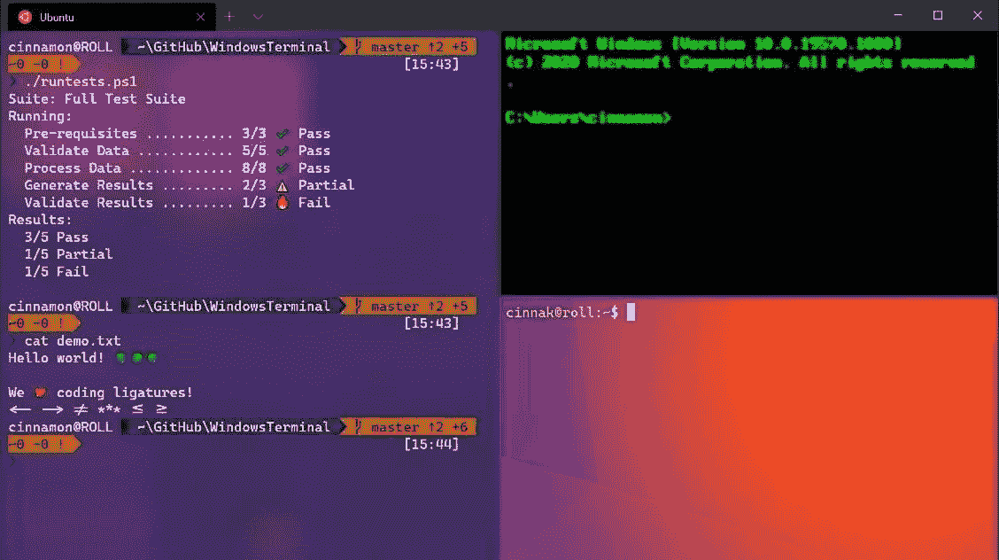

## 如何安装 Windows 终端

安装 Windows 终端最简单的方法是通过 Microsoft 商店:

```
ms-windows-store://pdp/?ProductId=9n0dx20hk701 
```

如果此链接失败，请尝试在您的浏览器中打开[微软商店，或者从 Windows 开始菜单中启动**微软商店**应用程序并搜索“终端”。](https://www.microsoft.com/store/apps/9n0dx20hk701)

*注意:注意不要选择早期的“Windows 终端预览”应用程序。*

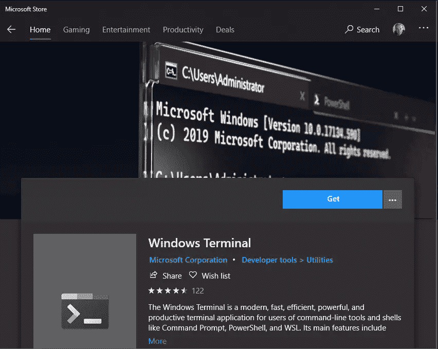

点击**获取**并等待几秒钟安装完成。

如果你没有访问商店的权限，你可以[从 GitHub](https://github.com/microsoft/terminal/releases/latest) 下载最新版本。

**Windows 终端**应用图标现在在 Windows 开始菜单中可用。为了方便访问，右击图标，选择**锁定开始**或**更多**，然后选择**锁定任务栏**。

## Windows 终端入门

第一次运行时，Windows 终端以 Powershell 作为默认配置文件启动。下拉菜单可用于启动其他选项卡和[访问设置](#settings):

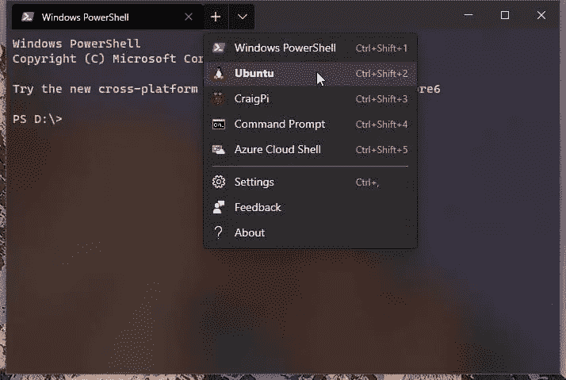

“终端”会自动为您安装的所有 WSL 发行版和 Windows shells 生成描述文件，尽管可以在[全局设置](#global-settings)中禁用生成。

## 管理选项卡和窗格

点击 **+** 图标或`Ctrl` + `Shift` + `T`，打开默认配置文件的新标签。要打开不同配置文件的标签，从下拉菜单中选择或按`Ctrl` + `Shift` + *N* ，其中 *N* 是配置文件的编号。

按下`Alt` + `Shift` + `D`复制和分割窗格。每次使用时，活动窗格会沿最长的轴分成两部分:

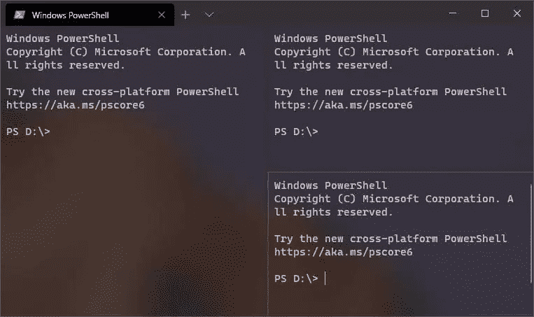

要强制创建:

*   垂直窗格，按`Alt` + `Shift` + `+`，或
*   水平窗格，按`Alt` + `Shift` + `-`

要在新窗格中打开另一个配置文件，请在从下拉菜单中选择时按住`Alt`键。

按住`Alt`并使用键盘上的光标键在活动窗格之间切换。通过按住`Alt` + `Shift`并使用光标键相应地调整大小，可以调整窗格的大小。

双击文本可以重命名选项卡。您也可以通过右键单击选项卡并选择菜单选项来更改名称或颜色:

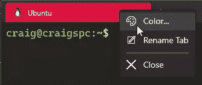

这只影响当前选项卡；这不会永久改变侧写。

要关闭活跃面板或标签，请按下`Alt` + `Shift` + `W`或输入终端的标准退出命令(通常为`exit`)。

## 文本大小

可用`Ctrl` + `+`和`Ctrl` + `-`调整激活终端的文本大小。或者，按住`Ctrl`并滚动鼠标滚轮。

## 卷动

使用滚动条浏览终端输出。或者，按住`Ctrl`并按下光标上移、光标下移、`Page Up`或`Page Down`使用键盘导航。

## 搜索

按`Ctrl` + `Shift` + `F`打开搜索框:


输入任何术语，然后使用向上和向下图标搜索终端输出。点击`Aa`图标激活和取消精确大小写匹配。

## 复制并粘贴

默认情况下，复制和粘贴分别绑定到`Ctrl` + `Shift` + `C`和`Ctrl` + `Shift` + `V`，虽然`Ctrl` + `C`和`Ctrl` + `V`也可以。

*注意:注意`Ctrl` + `C`可以终止一个 Linux 应用程序，所以使用`Shift`是明智的。*

在[全局设置](#global-settings)中有一个自动选择复制选项，你也可以通过点击鼠标右键粘贴当前剪贴板项目。

## 设置

从下拉菜单或`Ctrl` + `,`(逗号)访问设置。配置是在一个单独的`settings.json`文件中定义的，所以可能会提示您选择一个文本编辑器。VS Code 是一个很好的选择，尽管如果你乐意不用颜色编码和语法检查来编辑的话，记事本也不错。

`settings.json`控件:

1.  [全局设置](#global-settings)，适用于所有配置文件
2.  [配置文件设置](#profile-settings)，定义配置文件
3.  [自定义配色方案设置](#color-scheme-settings)，以及
4.  [按键设置](#keybinding-settings)

该文件使用以下格式:

```
// This file was initially generated by Windows Terminal
{

  // general settings, e.g.
  "initialRows": 40,

  // profile settings
  "profiles":
  {

    "defaults":
    {
      // settings that apply to all profiles
    }
    "list":
    [
      // list of individual profiles, e.g.
      {
        "guid": "{81d1dceb-c123-5678-90a1-123abc456def}",
        "name": "Windows PowerShell",
        "commandline": "powershell.exe"
      },
      {
        "guid": "{91d1dceb-c123-5678-90a1-123abc456def}",
        "name": "Ubuntu",
        "source": "Windows.Terminal.Wsl"
      }
    ]

  }

  // custom color schemes, e.g.
  "schemes": [
    {
      "name": "My new theme",
      "cursorColor": "#FFFFFF",
      "selectionBackground": "#FFFFFF",
      "background" : "#0C0C0C",
      "foreground" : "#CCCCCC"
    }
  ],

  // custom key bindings, e.g.
  "keybindings:
  [
    { "command": "find", "keys": "ctrl+shift+f" }
  ]

} 
```

默认值在`defaults.json`中定义。点击下拉菜单中的**设置**，按住`Alt`打开。

*警告:**请勿更改默认文件！**使用它查看默认设置，并在必要时添加或更改`settings.json`中的设置。*

### 全局设置

以下全局设置是最有用的，尽管更多设置记录在终端[文档](https://docs.microsoft.com/windows/terminal/customize-settings/global-settings)中。

`"defaultProfile"`定义启动 Windows 终端时默认使用的配置文件的 GUID。

将`"copyOnSelect"`设置为`true`，无需按`Ctrl` + `Shift` + `C`即可自动将选中的文本复制到剪贴板。

将`"copyFormatting"`设置为`false`,只复制没有任何样式的纯文本。*(我希望这是所有应用程序的默认设置！)*

将`"initialColumns"`和`"initialRows"`设置为水平和垂直尺寸的字符数。

`"tabWidthMode"`可以设置为:

1.  `"equal"`:每个标签宽度相同(默认)
2.  `"titleLength"`:每个标签都被设置为其标题的宽度，或者
3.  `"compact"`:非活动标签收缩到图标的宽度。

`"disabledProfileSources"`设置一个数组，防止轮廓自动生成。例如:

```
 "disabledProfileSources": [
    "Windows.Terminal.Wsl",
    "Windows.Terminal.Azure",
    "Windows.Terminal.PowershellCore"
  ], 
```

这将禁用所有生成的配置文件；删除任何你想保留的。

### 配置文件设置

通过[在`"profiles"`、`"list"`数组中创建一个对象组](https://docs.microsoft.com/windows/terminal/customize-settings/profile-settings)来定义新的轮廓。WSL2 Ubuntu 示例:

```
{
  "guid": "{91d1dceb-c123-5678-90a1-123abc456def}",
  "name": "Ubuntu",
  "source": "Windows.Terminal.Wsl",
  "startingDirectory": "//wsl$/Ubuntu/home/username/",
  "colorScheme": "Tango Dark",
  "useAcrylic": true,
  "acrylicOpacity": 0.75,
  "hidden": false
}, 
```

每个配置文件都定义有以下设置:

| 环境 | 描述 |
| --- | --- |
| `"guid"` | 唯一标识符(必需)。对于新的配置文件，您可以在[guidgen.com](https://www.guidgen.com/)在线生成 GUID |
| `"source"` | 轮廓生成器。这仅在配置文件已自动添加且不得编辑时使用。 |
| `"commandline"` | 假设没有设置`"source"`时运行的可执行文件。例如，这可能是一个 SSH 命令，如`"ssh yourname@domain.com"` |
| `"startingDirectory"` | shell 开始的目录。对于 WSL 发行版，这最好设置为`"//wsl$/Ubuntu/home/username/"`，其中`username`是安装期间创建的用户 |
| `"name"` | 下拉菜单中显示的配置文件名称 |
| `"tabTitle"` | 标签标题中显示的名称 |
| `"suppressApplicationTitle"` | 设置`true`强制`"tabTitle"`或`"name"`进入 bash |
| `"icon"` | 下拉列表和选项卡中显示的图标的完整路径，例如`"img/tux.png"`。24 位 png 是最佳选择；不幸的是，不支持 SVG |
| `"hidden"` | 如果设置了`true`，则配置文件不会显示在下拉菜单中 |
| `"fontFace"` | 使用特定的字体 |
| `"fontSize"` | 使用特定的字体磅值整数 |
| `"fontWeight"` | 使用特定的字体粗细。这可以是一个 OpenType 整数，也可以是一个关键字:`"normal"`、`"thin"`、`"extra-light"`、`"light"`、`"semi-light"`、`"medium"`、`"semi-bold"`、`"bold"`、`"extra-bold"`、`"black"`、`"extra-black"` |
| `"padding"` | 窗口边缘文本周围的填充。可以设置一个、两个或四个逗号分隔的值，如`"1, 2, 3, 4"`分别设置左、上、右、下 |
| `"antialiasingMode"` | 抗锯齿方法。设置为`"grayscale"`(默认)、`"cleartype"`或`"aliased"` |
| `"cursorShape"` | 光标类型。设置为`"bar"`(默认)、`"vintage"`、`"underscore"`、`"filledBox"`或`"emptyBox"` |
| `"cursorHeight"` | 定义为介于`25`和`100`之间的整数的`"vintage"`光标的高度 |
| `"cursorColor"` | 光标颜色，定义为`"#rgb"`或`"#rrggbb"` |

特定于主题的设置包括:

| 环境 | 描述 |
| --- | --- |
| `"colorScheme"` | 在`defaults.json`或`settings.json`中的`"schemes"`列表中定义的配色方案的名称([见下面的](#color-scheme-settings) |
| `"useAcrylic"` | 设置`true`使用磨砂玻璃背景效果 |
| `"acrylicOpacity"` | 丙烯酸不透明度从`0`(完全透明)到`1`(完全不透明) |
| `"backgroundImage"` | 背景图像的完整路径，例如`"img/background.png"` |
| `"backgroundImageOpacity"` | 背景图像的不透明度从`0`(完全透明)到`1`(完全不透明) |

最后，添加`"experimental.retroTerminalEffect": true`到一个复古 CRT 效果的配置文件！…

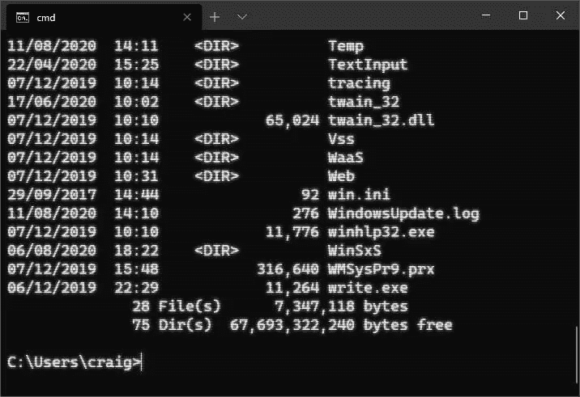

## 配色方案设置

每个配置文件的`"colorScheme"`可以设置为`defaults.json`中包含的任何配色方案的名称。例如:

`"Campbell"`:

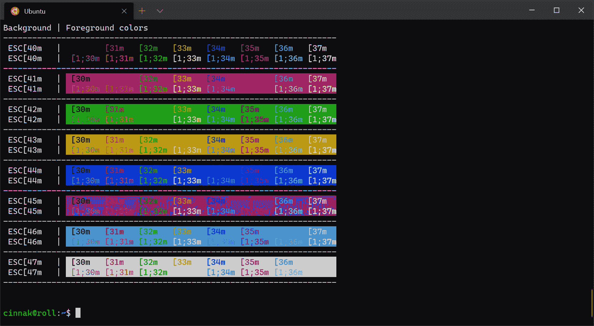

`"Campbell Powershell"`:

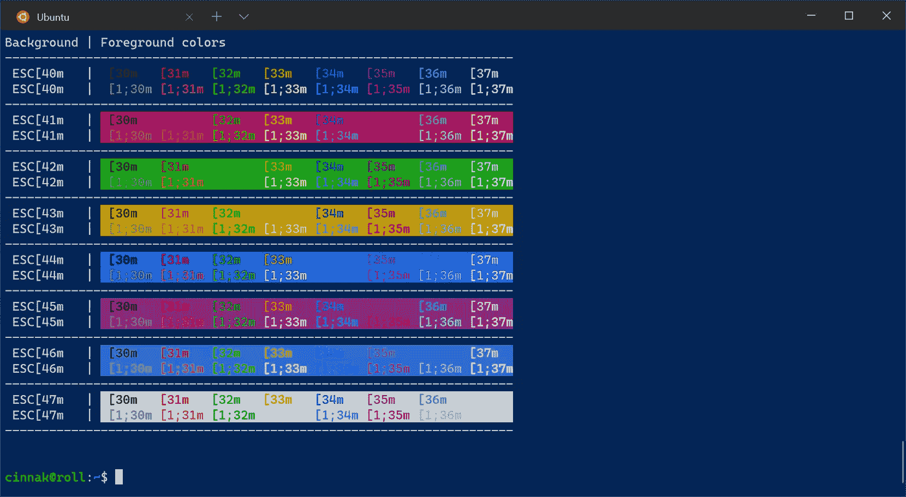

`"One Half Dark"`:

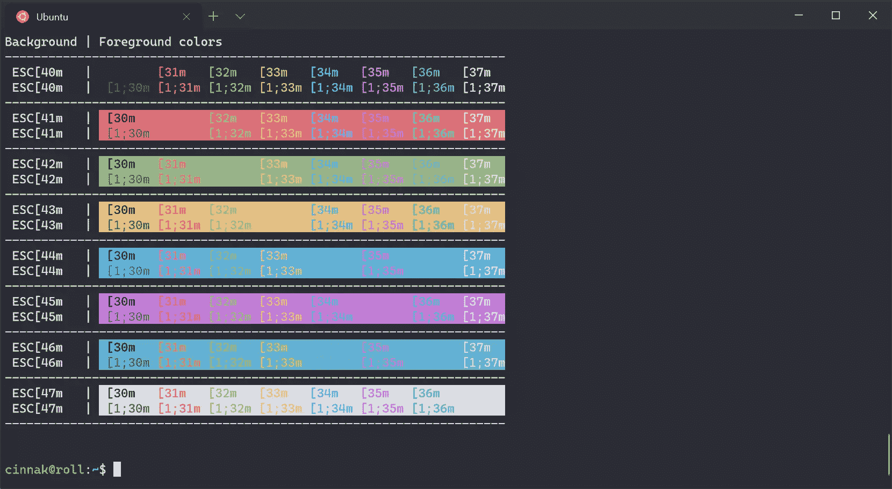

`"One Half Light"`:

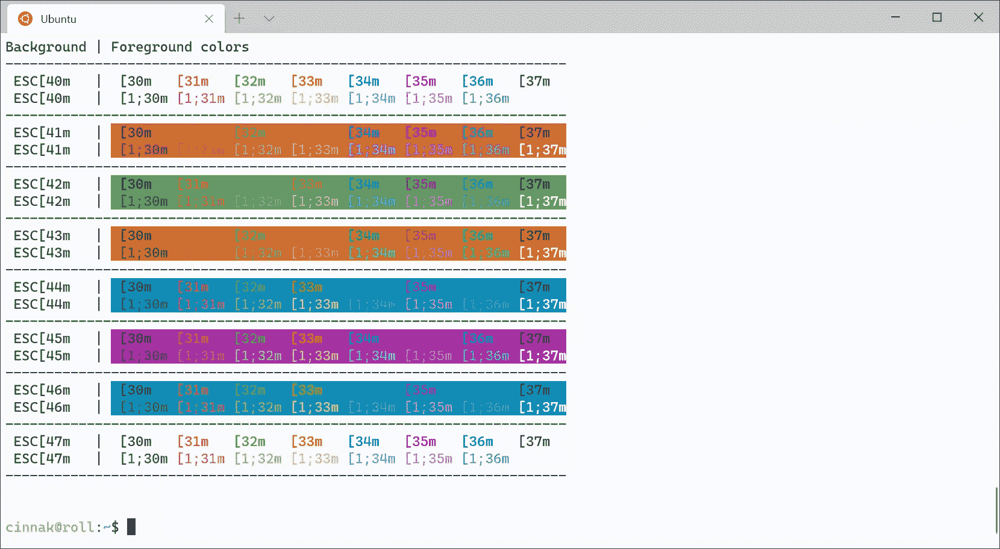

`"Tango Dark"`:

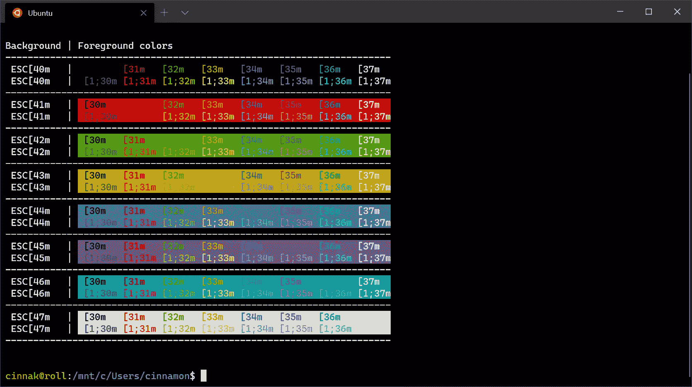

`"Tango Light"`:

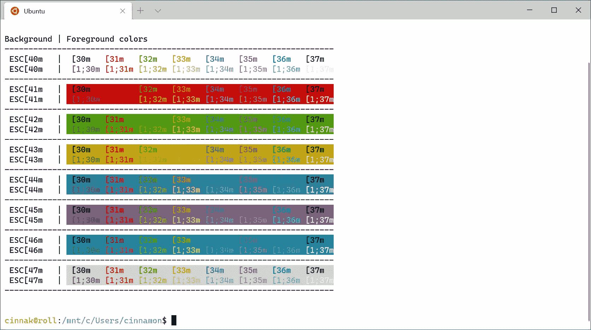

`"Vintage"`:

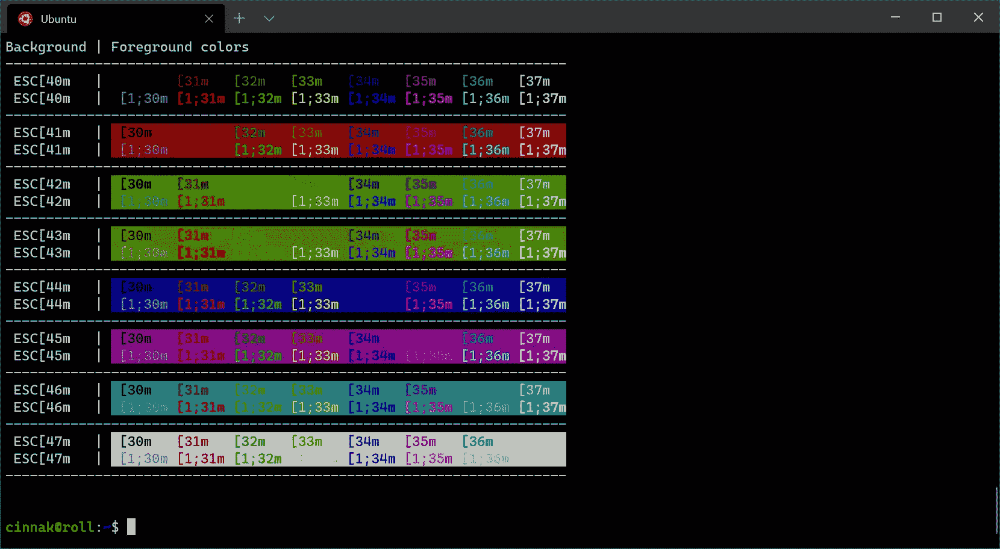

### 创建自己的配色方案

你自己的方案对象可以在`settings.json`的`"schemes"`数组中定义。每种颜色都用十六进制值定义。例如:

```
"schemes": [
  {
    "name": "My New Theme",
    "foreground": "#EEEEEE",
    "background": "#111111",
    "cursorColor": "#FFFFFF",
    "black": "#000000",
    "red": "#CC0000",
    "green": "#4E9A06",
    "yellow": "#C4A000",
    "blue": "#3465A4",
    "purple": "#75507B",
    "cyan": "#06989A",
    "white": "#EEEEEE",
    "brightBlack": "#555753",
    "brightRed": "#EF2929",
    "brightGreen": "#8AE234",
    "brightYellow": "#FCE94F",
    "brightBlue": "#729FCF",
    "brightPurple": "#AD7FA8",
    "brightCyan": "#34E2E2",
    "brightWhite": "#FFFFFF"
  }
], 
```

然后可以通过将其`"name"`添加到配置文件的`"colorScheme"`设置中来使用该方案。例如:

```
"colorScheme": "My New Theme" 
```

### 按键绑定设置

在`settings.json`中的`"keybindings"`数组覆盖或补充了在`defaults.json`中设置的默认键绑定。每个键绑定被定义为一个带有`"command"`和`"keys"`组合的对象。例如:

```
// Ctrl + Shift + F to open the search box
{ "command": "find", "keys": "ctrl+shift+f" }, 
```

在某些情况下，`"command"`可以是具有一个或多个参数的应用程序`"action"`。例如:

```
// Ctrl + Shift + 1 to open the first profile in a new tab
{
  "command": { "action": "newTab", "index": 0 },
  "keys": "ctrl+shift+1"
}, 
```

`"keys"`值接受修饰符`ctrl+`、`shift+`和`alt+`，后跟:

| 类型 | 键 |
| --- | --- |
| 功能键 | `f1-f24` |
| 字母数字键 | `a-z`，`0-9` |
| 符号键 | `-`、`=`、`[`、`]`、`\`、`;`、`'`、`,`、`.`、`/` |
| 光标键 | `down`、`left`、`right`、`up`、`pagedown`、`pageup`、`pgdn`、`pgup`、`end`、`home`、`plus` |
| 动作键 | `tab`、`enter`、`esc`、`escape`、`space`、`backspace`、`delete`、`insert` |
| 数字键盘按键 | `numpad_0-numpad_9`、`numpad0-numpad9`、`numpad_add`、`numpad_plus`、`numpad_decimal`、`numpad_period`、`numpad_divide`、`numpad_minus`、`numpad_subtract`、`numpad_multiply` |

例如，如果您想用`Ctrl` + `F`打开搜索框，您可以在`settings.json`中的`"keybindings"`数组中添加一行:

```
"keybindings":
[
  { "command": "find", "keys": "ctrl+f" }
] 
```

搜索框也会以`Ctrl` + `Shift` + `F`打开，因为该设置是在`defaults.json`中定义的——除非您将该组合键分配给另一个命令。

## 命令行选项

可以通过运行`wt.exe`从快捷方式或任何 Windows 或 Linux 终端启动 Windows 终端。支持以下选项:

| 选择权 | 描述 |
| --- | --- |
| `--help`、`-h`、`-?`、`/?` | 显示帮助 |
| `--maximized`，`-M` | 启动最大化 |
| `--fullscreen`，`-F` | 启动全屏 |

您还可以传递由分号分隔的命令列表。命令用于定义新的选项卡和窗格，并带有附加控制参数:

| 命令 | 因素 | 描述 |
| --- | --- | --- |
| `new-tab` | `--profile`或`-p`、`--startingDirectory`或`-d`、`commandline`、`--title` | 打开一个新标签 |
| `split-pane` | `--horizontal`或`-H`、`--vertical`或`-V`、`--profile`或`-p`、`--startingDirectory`或`-d`、`commandline`、`--title` | 打开一个新窗格 |
| `focus-tab` | `--target`或`-t` | 聚焦选项卡 |

### 例子

以下示例必须从标准的`cmd`命令行或快捷方式执行。

使用`Ubuntu`和`Windows Powershell`选项卡打开 Windows 终端:

```
wt -p "Ubuntu" ; new-tab -p "Windows PowerShell" 
```

在单独的窗格中打开带有`Ubuntu`、`Windows Powershell`和`Command Prompt`描述文件的 Windows 终端:

```
wt -p "Ubuntu" ; split-pane -V -p "Windows PowerShell" ; split-pane -H -p "Command Prompt" 
```


从 Linux shell 或 Powershell 启动 Windows 终端的更多示例可在 Windows 终端[文档](https://docs.microsoft.com/windows/terminal/command-line-arguments)中找到。

## 终末款待

我希望您喜欢这篇介绍 Windows 终端的文章。如前所述，它是 [WSL2](https://www.sitepoint.com/wsl2) 的理想搭配。它很快，可配置，看起来很棒，并提供了 Windows 和 Linux 开发的所有好处。

## 分享这篇文章