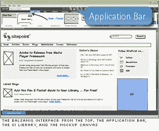
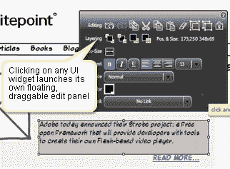
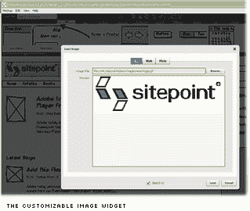
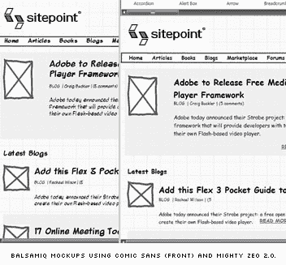

# Balsamiq 实体模型线框

> 原文：<https://www.sitepoint.com/wireframing-balsamiq-mockups/>

线框图是 2009 年网页设计过程中必不可少的一部分，但是在这个领域还没有一个工具能够占据主导地位。

**和其他前端的人聊起来，似乎有三个基本的思想流派。**

我们许多人坚持使用自己最熟悉的工具——Fireworks、Illustrator 和 Photoshop。毫无疑问，这些都是很好的选择，因为它们很便宜，而且利用了你多年来磨练的软件技能。

还有一些人手工绘制他们漂亮的线框，在业内通常被称为炫耀。如果你是纸和笔的行家，这是给客户和那个特别的人留下深刻印象的好方法。

最后，还有信息架构师和 UX 设计师，他们通常更喜欢专业的线框图工具，比如 iRise 和 Axure。这些工具通常设定更高的目标，旨在产生完整的工作原型，而不仅仅是静态的、链接的图形。虽然它们无疑是强大而丰富的工作环境，但它们的学习曲线和价格会让一些人望而却步。

今天我要看一个专业但相对简单和便宜的线框工具: [Balsamiq 样机](http://www.balsamiq.com/products/mockups)。

首先，让我们处理一些基本的须知事项。

Balsamiq 样机是新兴的 Adobe Air 应用程序类别中的另一个。这一点的好处是，这意味着你在网站上玩的现场演示实际上与你下载并在桌面上运行的应用程序是一样的。推而广之，这也让 Balsamiq 自动跨平台。

Balsamiq 界面非常容易理解。它包括三个主要部分:

*   应用程序栏:这给了你标准范围的剪切、粘贴和复制控件。
*   **UI(用户界面)库:**这是一个常用界面小部件的拖放集合。
*   原型画布:这是你的工作空间。

##### 开始吧

用 Balsamiq 实体模型构建一个线框就像把 UI 小部件从图库拖到画布上一样简单。每个元素都可以永久移动、编辑和调整大小。

UI Gallery 包含 70 多个预构建的小部件，包括您期望的所有标准:

*   文本字段
*   表单元素
*   标签菜单
*   滚动条
*   图像占位符
*   常见图标
*   图表和图形
*   浏览器浏览器
*   iPhone UI 元素

我发现这涵盖了绝大多数的日常需求，虽然有时我发现自己希望有一个简单的钢笔工具来添加基本的线条和形状。

一旦拖放到您的布局上，单击任何 UI 小部件都会自动启动它自己的浮动编辑面板(如上所示)，允许您更改该元素的属性(粗体、斜体、大小、对齐等)。

双击元素可以直接编辑其内容。对于简单的文本字段来说，这很容易想象，但是对于更复杂的小部件，比如选项卡、菜单和表格，这就更令人印象深刻了。添加新菜单项就像向 CSV 列表添加新值一样简单。

好吧，但是你在想:如果我需要一些库中没有的非标准/奇怪的元素/小部件怎么办？

令人高兴的是，内置的图像小部件给了我们一个选择。默认情况下，image 小部件为您提供了一个正方形的占位符图形(如上所示),但是您可以自由地将任何第三方图像加载到这些占位符中——如上面的 SitePoint 徽标所示。事实上，甚至有一个选项可以自动将你的图像转换成灰度。

这种有效创建和加载你自己的小部件的能力意味着你可以用这个工具绘制几乎任何布局的线框。

##### 细节是粗略的…

现在，如果你看过目前为止的任何截图，你会毫无疑问地注意到 Balsamiq 样机有一种特定的外观——一种松散的、手绘的、粗略的感觉。对一些人来说，这将是它的巨大魅力；对其他人来说，它的主要缺点。

有一个很好的论点是，呈现松散、粗略的线框有助于让你的客户专注于结构和总体布局目标，而不是陷入更短暂的设计细节。粗略的交流这不是最终的。

当然，反对的观点是，Balsamiq 的粗略质量成为其自身的主导风格，将客户的注意力从手头的任务上吸引过来——这与其意图完全相反。就我个人而言，我可以想到这两种场景中的任何一种都可以轻松应用于不同的客户。

在一个完美的世界中，我认为你可以像在 Adobe Illustrator 中删除笔触一样去除粗略的线条样式。目前这不是一个选项。

##### 思想

虽然 Balsamiq 并不适合所有的情况和设计师( [Andy Budd 并不是超级粉丝](http://www.andybudd.com/archives/2009/04/my_first_impres/))，但我认为该产品肯定有一个可行的市场。

在我看来，样式是给客户一个模型:

1.  简单到客户不会被短暂的图形和颜色分散注意力；

3.  比典型的干巴巴的黑白“框线”线框更有视觉冲击力。

我可以想象自己在很多情况下使用草图风格。但是当你觉得这种风格可能会被解读为有点卡通化的时候，你会怎么做呢？没有明显的替代方案。

从好的方面来看，Balsamic Mockups 价格便宜且易于学习，所以如果你仍然相信你需要一个独立的线框，这是一个不需要巨额投资就可以尝试线框制作的机会。

这个价格也使得这个应用程序对你的许多同事来说很有用。特别是，我认为该应用非常适合:

*   **Web 开发客户:**虽然我不会理所当然地给所有的客户提供这个工具，但是我曾经合作过的很多客户都喜欢使用这个工具来交流他们更广泛的想法。
*   经理和在线营销人员:有趣的是，马克·哈博特尔(SitePoint 创始人)无意中听到我向一位同事演示这一功能，他立刻认为这是一种工具，可以展示他改造网站部分内容的宏伟构想。目前，Mark 使用 MS Word 完成这项任务，因此 Balsamiq 是一个巨大的改进。

最后，如果你正在考虑一般的线框工具，你可能想看看加里·巴伯最近的一篇文章，这篇文章概述了 16 种选择(包括 Balsamiq): [*原型和线框*](https://www.sitepoint.com/article/tools-prototyping-wireframing/) 的 16 种设计工具。

##### 没有漫画就走

如果有一个信念将所有年龄、性别和信仰的设计师团结在一起，那就是对一种字体的强烈仇恨——被唾弃的微软漫画。

不幸的是，当 Balsamiq 的设计者选择它作为应用程序的默认字体时，他并没有意识到这个怪癖。此外，目前还没有简单的方法来改变这个设置。

现在我说没有简单的方法，但自定义应用程序字体不是不可能的。鉴于 Comic Sans 对于大多数设计公司来说都是一个真正的亮点，我想我应该加入这个快速定制字体的技巧:

1.  首先，寻找一个合适的漫画无替代品。幸运的是，就在上周，詹妮弗·法利写了一篇很棒的博文，讲述了在哪里可以找到不错的替代品。我选择了 [Blambot 的强大的杰欧 2](http://www.fontspace.com/blambot/mighty-zeo-20) 作为这个例子。

3.  创建一个空白文本文件，并将该文本粘贴到其中:
    `<config>
     <fontFace>Mighty Zeo 2.0</fontFace>
     <rememberWindowSize>false</rememberWindowSize>
     <useCookies>false</useCookies>
    </config>`

5.  将`<fontFace>`值更改为您喜欢的字体名称。

7.  Save this file as `BalsamiqMockups.cfg` and place it according to your OS:
    *   **Mac 用户:** `<your user home>/Library/Preferences/ BalsamiqMockupsForDesktop.nnnnnnnnnn/Local Store`
    *   **XP 用户:** `C:Documents and Settings<yourusername>Application DataBalsamiqMockupsForDesktop.nnnnnnnnnnLocal Store`
    *   **Vista 用户:** `C:Users<yourusername>AppDataRoamingBalsamiqMockupsForDesktop.nnnnnnnnnnLocal Store`
    *   **Linux 用户:** `~/.appdata/BalsamiqMockupsForDesktop.nnnnnnnnnn/Local Store`

9.  重新启动应用程序。

这可能需要一点尝试和错误来找到一种感觉正确的字体，但大多数人会相信这是值得努力的。

希望以后的版本能让这个过程变得更加优雅。

## 分享这篇文章