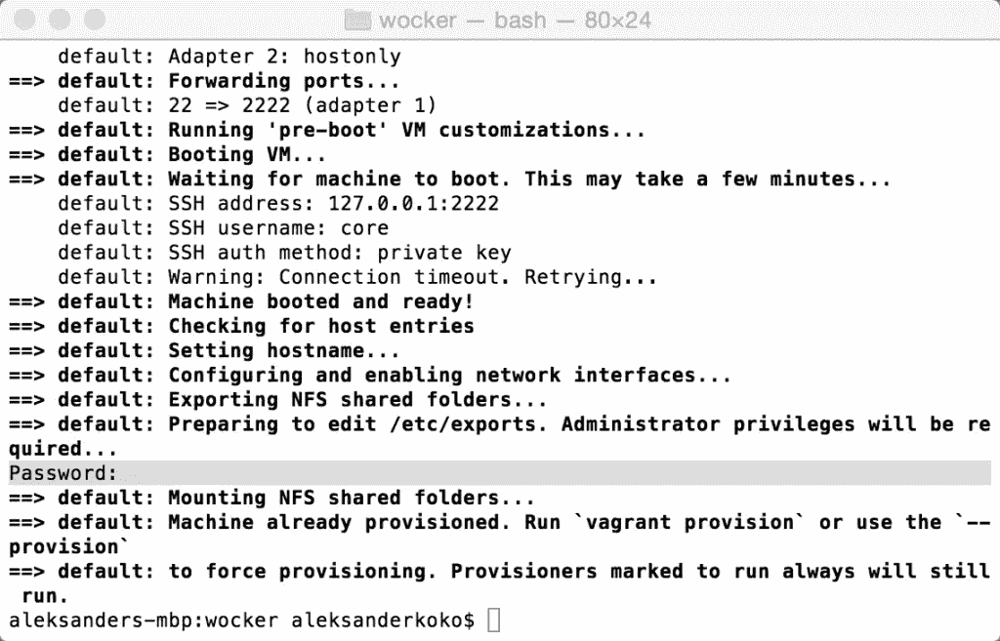
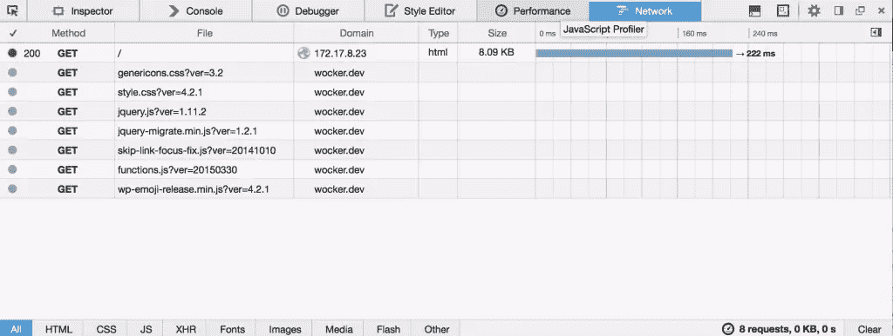
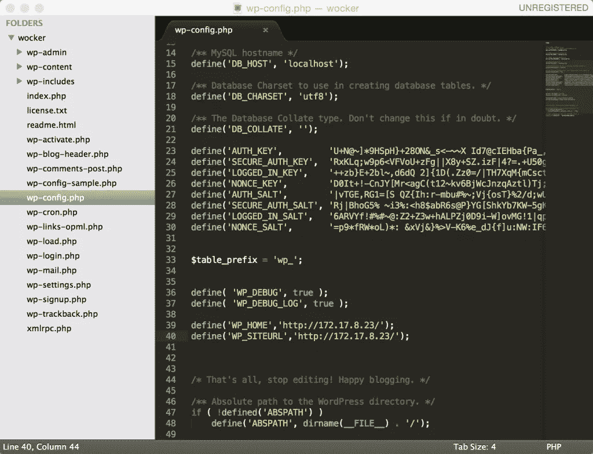
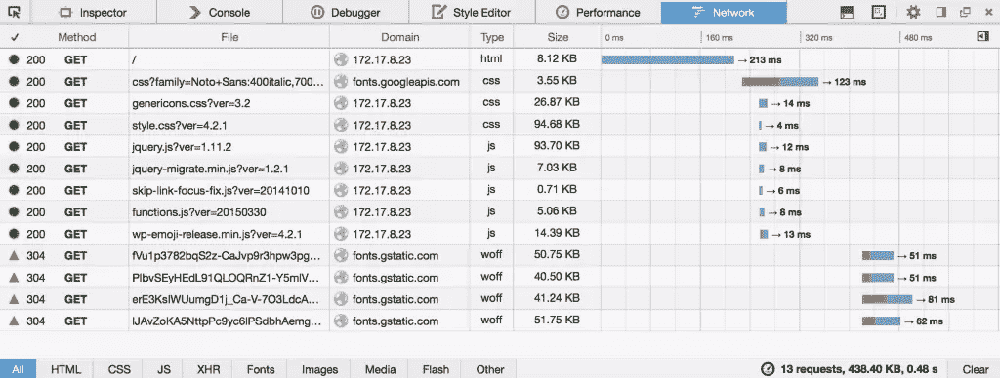
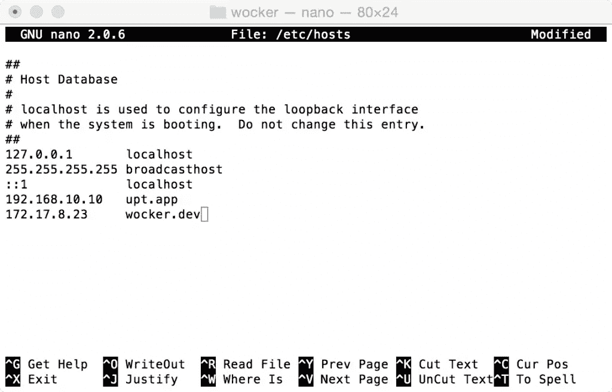
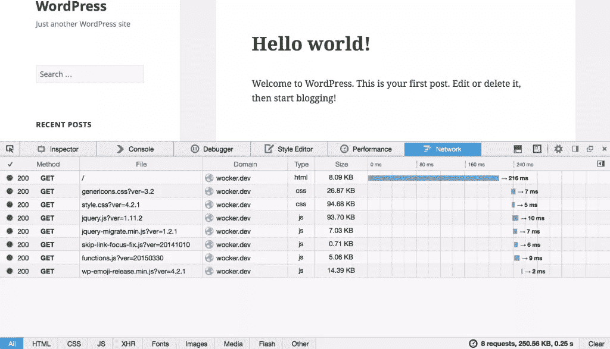
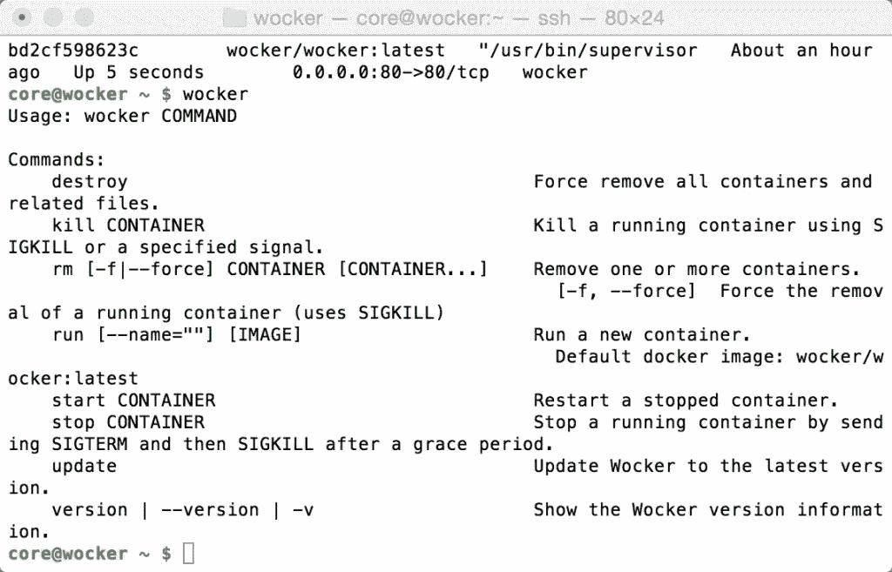

# Wocker:简单的 Dockerized WordPress

> 原文：<https://www.sitepoint.com/wocker-easy-dockerized-wordpress/>

在我之前关于 Docker 和 WordPress 的文章中，我们已经看到了如何在终端上使用简单的命令来设置 WordPress 和 Docker，然后我们转移到像 Docker Compose 这样的自动化工具。最后，我们将 Docker Compose 配置部署到 DigitalOcean。如果你还没有读过这些文章，你可以在下面找到它们:

*   [面向 WordPress 开发者的 Docker 简介](https://www.sitepoint.com/docker-for-wordpress-developers/)
*   [如何为 WordPress 手动构建 Docker 容器](https://www.sitepoint.com/how-to-manually-build-docker-containers-for-wordpress/)
*   [如何使用 Docker 官方 WordPress 图片](https://www.sitepoint.com/how-to-use-the-official-docker-wordpress-image/)
*   [用 Docker 部署 WordPress】](https://www.sitepoint.com/deploying-wordpress-with-docker/)

在这篇文章中，我将向你展示如何用另一种方式来设置 WordPress 和 Docker。我们将使用一个名为 [Wocker](https://github.com/wckr/wocker) (WCKR)的工具来简化我们的工作流程。

## 工人

Wocker 不同于我以前介绍过的工具。如果你以前使用过流浪者，你应该会发现这个很容易使用。沃克本质上是个流浪汉，他使用[科里奥斯](https://coreos.com)和[码头工人](https://www.docker.com)。您可能看不到 Docker 的太多证据，但是底层技术就是 Docker。要设置 Wocker，只需执行两个命令即可:

```
 git clone https://github.com/wckr/wocker.git && cd wocker
vagrant up 
```

第一个命令从它的 GitHub 库中克隆了 Wocker，第二个只是我们构建(供应)机器的标准`vagrant up`命令。如果你想继续，确保你已经安装了 [VirtualBox](https://www.virtualbox.org) 和[流浪者](https://www.vagrantup.com)(如果你还没有安装的话)。

*这里有一个小提示，在大多数 nix*系统中，当你运行`vagrant up`时，你可能必须执行`sudo`或者传递一个密码给`sudo`。*



这个流浪盒子的 IP 是`172.17.8.23`，但是现在还不行。如果您检查网络数据，您将看到 HTML 内容已经下载，但是其他文件(CSS、JavaScript)还没有下载。这是因为我们所有的文件都是从`Wocker.dev`请求的。沃克帮助我们设置好一切，我们有几个选择。



您可以通过添加以下两行来操作位于`data/wocker/`下的`wp-config.php`:

```
define('WP_HOME','http://172.17.8.23/');
define('WP_SITEURL','http://172.17.8.23/');
```





您可以手动将`172.17.8.23 wocker.dev`添加到您的`hosts`文件中。

```
 sudo nano /etc/hosts 
```



这一行将取决于您的操作系统。

最简单的方法就是安装“主机更新”插件。

`vagrant plugin install vagrant-hostsupdater`

这个插件使得更新我们的主机文件变得更加容易。

现在，您应该能够在浏览器中访问您的虚拟机的 IP 或主机名，两者都应该工作。



让我们仔细看看你的文件夹。除了你从 Github 克隆的 Wocker 文件，还有一个名为 **data** 的文件夹。在这个文件夹中，你会看到 WordPress 的所有东西(包括你的主题和插件等等。).

## 沃克 CLI

Wocker 还附带了一个 CLI。如果你使用过 Docker，你会知道你需要执行很多命令来运行一个容器。您必须处理文件系统映射、端口、链接容器等等。Wocker CLI 是 Docker CLI 的抽象。这并不意味着你不能在你的虚拟机中使用 Docker CLI。但是如果你刚开始使用 Docker 和 WordPress，这是一个很好的工具。要访问 Wocker CLI，您需要在虚拟机内部。在项目目录(包含浮动文件的目录)中，执行:

```
 vagrant ssh 
```

现在执行:

```
 wocker 
```



您将看到一些关于如何使用这个 CLI 的信息。这些命令是不言自明的，但是请随意试验和练习。这里有一个关于帮助信息中没有的命令的注释。如果您执行的命令是 Docker CLI 的一部分，而不是 Wocker 的一部分，那么 Wocker 将执行它。那是因为 Wocker **扩展了** Docker。

```
 wocker stop wocker
wocker start wocker
docker ps
wocker ps 
```

第一个命令停止名为 wocker 的容器。同样的事情也可以用`docker stop docker`和`wocker start docker`来做。

假设您已经完成了工作，现在是时候关闭虚拟机了，我们将运行:

```
 exit
vagrant halt 
```

然后，几个小时后，您想再次处理您的项目。我们现在将运行:

```
 cd /pathtoyourproject
vagrant up 
```

还有一步，因为这次要手动启动 wocker。当你第一次创建虚拟机时，你不需要启动 docker，但是从那以后你就需要启动了。

```
 vagrant ssh
wocker start wocker 
```

检查你的浏览器，现在一切都正常了！

## 深入挖掘

好奇心是一个强大的工具。在我们作为开发人员的工作中，这甚至更重要。我的动机是对我使用的工具感到好奇。这样我就明白了这个工具是如何工作的。

Wocker CLI 是一个简单的工具。它实际上是一个简单的 Bash 脚本。如果你在项目的根目录下看一下流浪者文件，你就可以检查出来。或者，你可以在这里查看[。](https://raw.githubusercontent.com/wckr/wocker-bashrc/master/bashrc)

如果你更好奇(我很高兴听到这个！)，你可以看看 Wocker 用什么做容器。Wocker 使用了一个名为`wocker/wocker`的图片，我们可以在 Docker Hub 上找到更多信息。在[沃克图片页面](https://registry.hub.docker.com/u/wocker/wocker/)你会找到[docker 文件](https://github.com/wckr/wocker-dockerfile/blob/master/wheezy/Dockerfile)的链接。如果你想改变它的行为，你可以使用 fork [Wocker repository](https://github.com/wckr/wocker-dockerfile) 。

## 改进的余地

在我谈论我不喜欢这个工具的地方之前，我想说我真的认为对于那些很少或没有 Docker 经验的人来说，它是一个很棒的工具。

与沃克尔共事一段时间后，这里有几个可以改进的地方:

*   没有多个 WordPress 安装
*   每次重启时，我都必须手动 ssh 并启动 wocker
*   只有一个容器，MySQL 不是一个独立的容器

对于第一个问题，有一些解决方案。首先是手动修改我们的流浪者文件中的 IP，并在`wp-config.php`上添加这两行:

```
define('WP_HOME','http://172.17.8.23/');
define('WP_SITEURL','http://172.17.8.23/');
```

如果你考虑 Docker 背后的概念，MySQL 是一个大问题。Docker 的创建是为了保持事物的分离，并在构建事物时考虑到架构。在一个容器中运行 Apache、PHP 和 MySQL 并不理想。但是 Wocker 是为 Docker 和 WordPress 的新用户设计的，它的工作做得很好。

## 结论

在本文中，我们已经了解了 Wocker 是什么以及如何开始使用它。Wocker 很容易安装，如果你是 Docker 社区的新成员，考虑在你的下一个 WordPress 项目中使用这个工具。

如果你想了解更多关于 Docker 和它是如何工作的，可以查看我们之前关于 Docker 和 WordPress 的文章:

*   [面向 WordPress 开发者的 Docker 简介](https://www.sitepoint.com/docker-for-wordpress-developers/)
*   [如何为 WordPress 手动构建 Docker 容器](https://www.sitepoint.com/how-to-manually-build-docker-containers-for-wordpress/)
*   [如何使用 Docker 官方 WordPress 图片](https://www.sitepoint.com/how-to-use-the-official-docker-wordpress-image/)
*   [用 Docker 部署 WordPress】](https://www.sitepoint.com/deploying-wordpress-with-docker/)

我想听听你的意见。你觉得沃克怎么样？你会在下一个项目中考虑它吗？你用过其他可以推荐的类似工具吗？

## 分享这篇文章