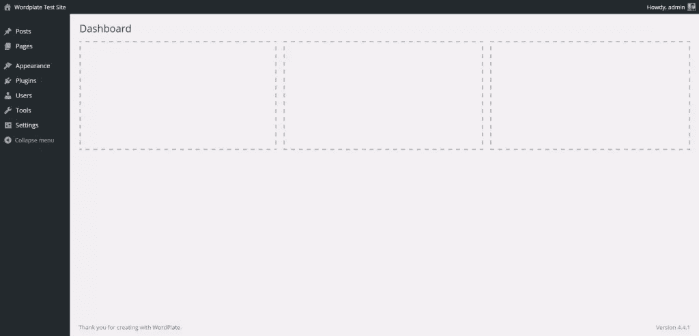
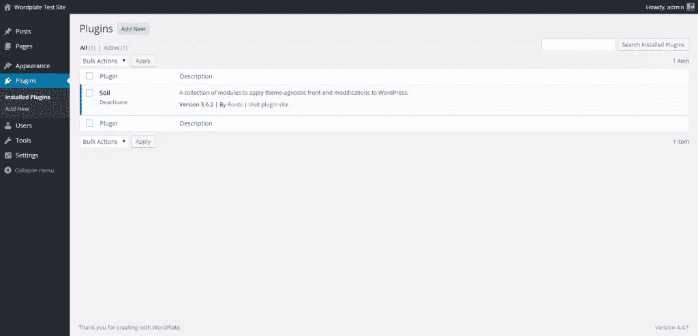
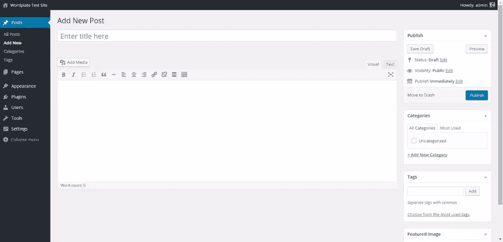

# 更好的 WordPress 开发工作流程

> 原文：<https://www.sitepoint.com/wordplate/>

Composer 是一个奇妙的工具，在现代 PHP 开发中广泛用于处理项目依赖关系。它有助于安装和更新项目的所有相关包或依赖项。尽管它还没有被主要用于 WordPress 核心，但是作为开发者，我们仍然可以利用 Composer 来引导我们的 WordPress 应用程序。

关于在 WordPress 旁边使用 Composer 的参考和文档，我不能推荐足够高的 [Rarst 的 Composer 站点](http://composer.rarst.net/)。这是学习 Composer 如何以多种不同方式集成到 WordPress 的很好的资源。最近，也有一些项目旨在使用 Composer 来简化 WordPress 的设置，比如 [WP Starter](https://github.com/wecodemore/wpstarter) 和 [WordPlate](https://github.com/wordplate/wordplate) 。

根据 WordPlate 官方网站，WordPlate 被描述为:

> 用 Laravel 和 Symfony 组件构建的 WordPress 框架。为每个 Laravel 爱好者提供熟悉的设置。遵循不要重复自己的原则。


WordPress 样板是一个 WordPress 样板文件，它采用了用 Composer 完全管理 WordPress 站点的思想，并且用 Packagist 提供的流行包(如 PHP dotenv 和 Symfony components)简化了开发的各个部分。本文的其余部分将关注 WordPlate，特别是在撰写本文时最新发布的 3.1.0 版本。

本教程假设您有一个工作的 web 服务器，无论是本地的还是远程的，都可以使用 SSH 访问命令行。您还应该能够熟练地使用命令行来学习本教程。

## 先决条件

WordPlate 至少要求 PHP 版本 5.5.9 带有 mbstring 扩展名，因此对于较旧的 PHP 安装，需要进行更新。要检查您安装的 PHP 版本，只需运行命令:

```
php -v
```

它会显示你当前使用的 PHP 版本。

还需要预先安装一些其他东西，包括:

*   设计者
*   Node.js 和 gulp.js

### 安装作曲者

要在 Linux 或 Unix 系统上安装 Composer，只需键入以下命令

```
curl -sS https://getcomposer.org/installer | php
mv composer.phar /usr/local/bin/composer
```

第二行是可选的，因此在使用 Composer 时，您可以在终端中简单地引用`composer`而不是`php composer.phar`。对于其他系统，请参考[作曲文档](https://getcomposer.org/doc/00-intro.md)。

要验证您是否正确安装了 Composer，请在您的终端中键入此命令，您应该能够看到已安装的 Composer 版本以及所有可用的命令。

```
composer -v
```

### 安装 Node.js 和 gulp.js

Node.js 可以下载，或者通过访问 [Node.js 下载页面](https://nodejs.org/en/download/)从源代码安装，而 gulp.js 可以通过运行以下命令安装:

```
npm install --global gulp
```

成功安装 Node.js 后，就可以使用了。你可以在他们的[文档页面](https://github.com/gulpjs/gulp/blob/master/docs/getting-started.md)上找到更多关于安装 gulp.js 的信息。

现在，如果一切顺利，输入`node -v`应该会返回已安装 Node.js 的正确版本。

## 装置

现在您已经获得了所有需要的依赖项，让我们看看如何实际安装和使用 WordPlate 本身。键入命令:

```
composer create-project wordplate/wordplate
```

这将告诉 Composer 将 WordPlate 下载到当前目录。您应该会看到类似如下的输出:

```
Installing wordplate/wordplate (3.1.0)
    - Installing wordplate/wordplate (3.1.0)
    Downloading: 100%

  Created project in /srv/www/wordplate
  > php -r "copy('.env.example', '.env');"
  Loading composer repositories with package information
  Installing dependencies (including require-dev)
    - Installing johnpbloch/wordpress-core-installer (0.2.1)
      Loading from cache

    - Installing composer/installers (v1.0.22)
      Loading from cache

    - Installing vlucas/phpdotenv (v2.2.0)
      Loading from cache

    - Installing symfony/polyfill-mbstring (v1.0.1)
      Downloading: 100%

    - Installing symfony/var-dumper (v3.0.1)
      Downloading: 100%

    - Installing symfony/finder (v3.0.1)
      Downloading: 100%

    - Installing psr/log (1.0.0)
      Loading from cache

    - Installing symfony/debug (v3.0.1)
      Downloading: 100%

    - Installing symfony/console (v3.0.1)
      Downloading: 100%

    - Installing johnpbloch/wordpress (4.4.1)
      Downloading: 100%

    - Installing doctrine/inflector (v1.1.0)
      Loading from cache

    - Installing illuminate/contracts (v5.2.7)
      Downloading: 100%

    - Installing illuminate/support (v5.2.7)
      Downloading: 100%

    - Installing illuminate/container (v5.2.7)
      Downloading: 100%

    - Installing illuminate/filesystem (v5.2.7)
      Downloading: 100%

    - Installing illuminate/config (v5.2.7)
      Downloading: 100%

    - Installing filp/whoops (2.0.0)
      Downloading: 100%

    - Installing wordplate/framework (3.1.0)
      Downloading: 100%

    - Installing roots/soil (3.6.2)
      Loading from cache

  symfony/var-dumper suggests installing ext-symfony_debug ()
  symfony/console suggests installing symfony/event-dispatcher ()
  symfony/console suggests installing symfony/process ()
  illuminate/support suggests installing jeremeamia/superclosure (Required to be able to serialize closures (~2.2).)
  illuminate/support suggests installing paragonie/random_compat (Provides a compatible interface like PHP7's random_bytes() in PHP 5 projects (~1.1).)
  illuminate/support suggests installing symfony/polyfill-php56 (Required to use the hash_equals function on PHP 5.5 (~1.0).)
  illuminate/support suggests installing symfony/process (Required to use the composer class (2.8.*|3.0.*).)
  illuminate/filesystem suggests installing league/flysystem (Required to use the Flysystem local and FTP drivers (~1.0).)
  illuminate/filesystem suggests installing league/flysystem-aws-s3-v3 (Required to use the Flysystem S3 driver (~1.0).)
  illuminate/filesystem suggests installing league/flysystem-rackspace (Required to use the Flysystem Rackspace driver (~1.0).)
  filp/whoops suggests installing whoops/soap (Formats errors as SOAP responses)
  Writing lock file
  Generating autoload files
  > php plate salts:generate
  WordPress security salts set successfully.
```

用一个简单的命令，各种任务就完成了，包括下载 WordPress 的最新版本，下载所有需要的包，如[土壤](https://github.com/roots/soil)， [PHP dotenv](https://github.com/vlucas/phpdotenv) 和一堆 Symfony 和 Laravel 包。

由于 WordPlate 使用 Elixir 进行前端资产编译，所以也需要安装`package.json`中的所有依赖项。在终端的 WordPlate 目录下运行这个命令，告诉 npm 安装所有的依赖项。

```
cd wordplate
npm install
```

完成后，您应该将所有需要的依赖项(Composer 和 Node.js)分别下载到`vendor`和`node_modules`目录中。

## 目录结构

熟悉 WordPlate 中的目录结构是一个好主意，因为您不会在项目的根目录中找到默认的`wp-content`、`wp-admin`、`wp-includes`和所有其他相关的`wp-`文件。

如果您的安装工作正常，这就是您应该在主工作目录中看到的内容。

```
- bootstrap/
- config/
- node_modules/
- public/
- resources/
- vendor/
- .editorconfig
- .env
- .env.example
- .gitignore
- composer.json
- composer.lock
- gulpfile.babel.js
- LICENSE
- package.json
- plate
- README.md 
```

让我们仔细检查每个文件夹和文件，看看它们是如何与 WordPlate 相关联的。

*   **bootstrap**——包含`autoload.php`自动加载 Composer 包，以及实例化 WordPlate 应用程序。
*   包含了几个影响 WordPress 站点工作方式的文件，这将在下一节详细讨论。
*   **node _ modules**–NPM 自动创建的包含所有 Node.js 依赖项的目录。
*   **public**–实际的站点，其中包含了你在 WordPress 的正常安装中可能会看到的文件，由于使用了 Composer，会有一些细微的变化。在`composer.json`中定义的主题将被安装到`public/themes/`目录，插件将按照`composer.json`中的配置进入`public/plugins`目录。WordPress 包含在一个单独的目录下`public/wordpress`。
*   **resources**–包含所有脚本、样式和图像，将由 Elixir 处理到指定的输出文件夹中，通常是主题资产文件夹。
*   **供应商**–由 Composer 自动创建的目录，存储在`composer.json`中定义的所有依赖关系。
*   **。editor config**–标准编辑器配置文件，可以加载到您最喜欢的文本编辑器中。在 editorconfig.org 的[了解更多。](http://editorconfig.org)
*   **。env**–由`phpdotenv`用来存储所有常规站点配置。在这里你可以定义 WordPress 数据库访问，邮件设置和盐键。
*   **. env . example**–提供预期配置的示例`.env`，以防我们需要基于不同的环境创建另一个`.env`文件。
*   **。git ignore**–标准`.gitignore`文件。默认情况下，它会忽略`node_modules`、`vendor`和其他一些包含敏感信息的文件，如`.env`文件。注意，公共插件、主题和 WordPress 文件夹也被排除在 Git 的跟踪之外，因为它们都是通过 Composer 管理的。
*   **composer . JSON**–标准`composer.json`带有一些适应 WordPress 配置的设置。为了安装，所有的主题和插件都应该在这里定义。
*   **composer . lock**–由 Composer 内部使用，用于跟踪依赖关系。
*   **gulpfile . babel . js**–为 Elixir 提供配置，以管理`resources`文件夹中的资产编译。
*   **许可证**–麻省理工学院许可证的复印件。
*   **package . JSON**–node . js 依赖项在这里定义，主要是 Elixir 使用的 gulp 相关包。
*   **字牌**–通过 CLI 提供管理字牌的基本命令。
*   **README . MD**–项目自述文件。

## 配置

现在，您已经下载了 WordPress 和所有其他依赖项，但是 WordPress 站点还没有安装。在配置之前，我们需要:

*   将 http 服务器(nginx、apache 或其他)的文档根目录指向 WordPlate 公共文件夹。
*   为 WordPress 创建一个数据库，供对该数据库有权限的用户使用。

一旦你完成了这两项工作，在`.env`文件中适当地修改数据库访问。您不需要接触`wp-config.php`文件，因为它将在这个文件中被管理。然后你可以继续 WordPress 的常规安装过程，在安装向导中选择你喜欢的语言和一些其他的网站细节。

登录到 WordPress 仪表盘后，你会注意到仪表盘已经被精简到最基本的部分。

这里有一些你应该在 WordPress dashboard 中看到的屏幕截图。

#### 主题页面:


#### 仪表板:



#### 安装的插件:



#### 添加新帖子:



### 通过`.env`文件进行配置

位于根目录中的文件提供了特定于您的安装的站点范围的配置。正如您之前看到的，这是我们可以输入数据库访问细节的地方。WordPress salts 也应该已经为您配置好并存储好了。可以在`.env`文件中配置的东西并不局限于在`.env.example`中所陈述的，因为你总是可以在其中引入你自己的配置密钥。

我不会详细介绍 [phpdotenv](https://github.com/vlucas/phpdotenv) 是如何工作的，但是本质上，你可以通过`env`函数，或者`$_ENV`和`$_SERVER`超级全局变量来访问配置设置。在`wp-config.php`文件中有一些关于如何加载配置的例子。

### 使用`config`文件夹的额外配置

有 10 个文件位于`config`文件夹中，它们决定了你的站点如何工作。它们中的每一个都已经包含了关于它们所控制的内容的有用的注释，但是一个接一个地浏览它们以便澄清是一个好主意。

*   `dashboard.php`–控制在仪表板上启用哪些小部件。注释特定行以启用小部件(默认情况下禁用)。
*   `editor.php`–控制新帖子屏幕的外观。您可以自定义 TinyMCE 工具栏、媒体压缩设置以及应该出现在此屏幕上的元框。
*   `footer.php`–控制页脚的文本。
*   `login.php`–可用于更改登录页面上的徽标，以及登录失败时的错误消息。
*   `mail.php`–配置 WordPress 如何发送你的邮件，默认情况下，它被配置为通过[邮件陷阱](https://mailtrap.io/)发送所有邮件。
*   `menus.php`–控制管理侧栏和管理菜单栏链接，以及默认情况下禁用帮助和屏幕选项选项卡。重新启用首选链接的注释。
*   `options.php`–目前只控制一个选项，即站点的永久链接结构。
*   `plugins.php`–默认设置插件安装时自动激活，可以相应更改。
*   `themes.php`–通常是您需要配置的主文件。控制站点描述、时区和其他有用的设置。
*   `widgets.php`–包含 WordPlate 默认禁用的内置小部件列表。注释特定行以重新启用小部件。

config 目录中的所有文件都有很好的文档记录，应该足以理解它是如何工作的。

## 插件和主题

默认情况下，WordPlate 需要在各种前端清理任务的默认 WordPlate 主题中使用的[root/soil](https://github.com/roots/soil)包。除此之外，你可以像往常一样通过 Composer 自由安装任何其他插件，因为 WordPlate 已经为你配置了 [WordPress Packagist](http://wpackagist.org/) 。

对于外行人来说，WordPress Packagist 是官方插件和主题目录的镜像，不同之处在于 WordPress Packagist 的所有插件和主题都包含`composer.json`文件，这意味着它们都可以通过 Composer 正常安装。

通过 Composer 管理插件和主题的安装和更新意味着不再使用管理主题和插件的后端管理。

### 安装插件和主题

你所需要做的就是定义你想要的插件/主题来安装在 composer.json 的`require`部分。已经有一个默认安装的`roots/soil`的例子。

例如，要安装 Yoast WordPress SEO 插件，只需在`require`部分添加插件名称和要安装的具体版本。

```
...
"require": {
    "php": "^5.5.9 || ^7.0",
    "wordplate/framework": "3.1.*",
    "roots/soil": "^3.6",
    "wpackagist-plugin/wordpress-seo": "3.0.7" //new addition
} 
... 
```

注意`composer.json`需要是一个有效的 json，所以上面例子中的注释只是为了说明需要做的改变。然后，在您的终端中，只需运行`composer update`，Composer 就会为您获取插件。

相同的概念适用于安装和更新主题。例如，要安装最新版本的[Twenty 16](https://wordpress.org/themes/twentysixteen/)，将这一行添加到 composer.json 的`require`部分，然后再次运行`composer update`。

```
...
"require": {
    "php": "^5.5.9 || ^7.0",
    "wordplate/framework": "3.1.*",
    "roots/soil": "^3.6",
    "wpackagist-plugin/wordpress-seo": "3.0.7",
    "wpackagist-theme/twentysixteen": "1.1" //add new theme
} 
... 
```

### 写字板默认主题

除此之外，WordPlate 还附带了自定义主题。没有什么东西是现成的，没有任何风格。这是因为主题是作为一个起点服务的，你可以用很好的默认值来开发你的主题。它还演示了在主题的`functions.php`文件中使用`roots/soil`包。

## 盘子 CLI

Plates CLI 提供了另一种通过命令行管理站点某些方面的方法。在撰写本文时，它还很有限，但是将来可用命令的列表肯定会增加。

这里有三个命令可供使用。

*   `php plate list`–列出所有可用的命令，并附带一些其他选项。
*   `php plate help <command-name`–显示给定命令的有用信息。
*   `php salts:generate`–生成在`.env`文件中定义的 WordPress 安全盐密钥。

## 结论

Composer 是一个有用的工具，已经被开发人员用来开发现代 PHP 应用程序很多年了。尽管 WordPress core 本身还不支持它，但是没有理由不开始使用它，因为它提供了一个强大的开发工作流程，有[千个包](https://packagist.org/statistics)可以和 WordPress 一起使用。

将 Composer 与 WordPress 集成需要一些工作，但是 WordPlate 已经提供了一个很好的起点，没有太多的麻烦。

## 分享这篇文章