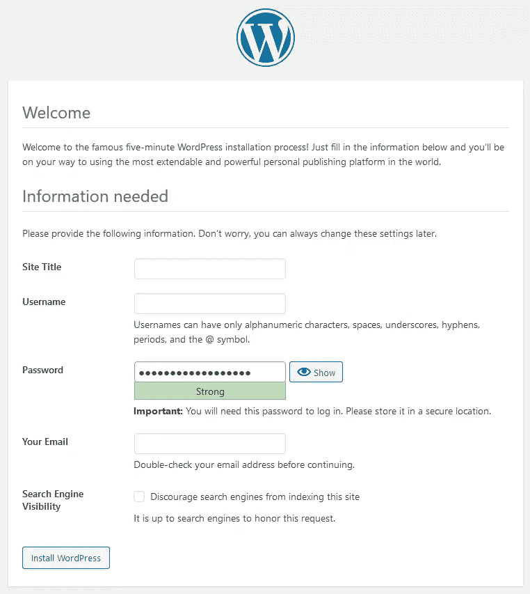
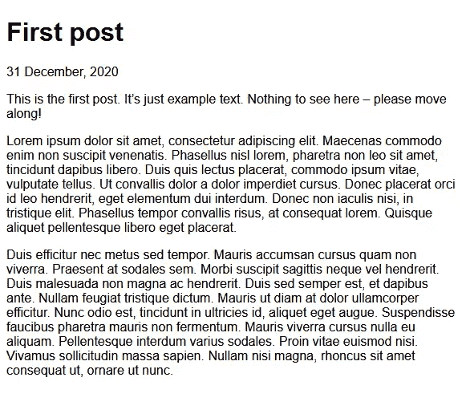
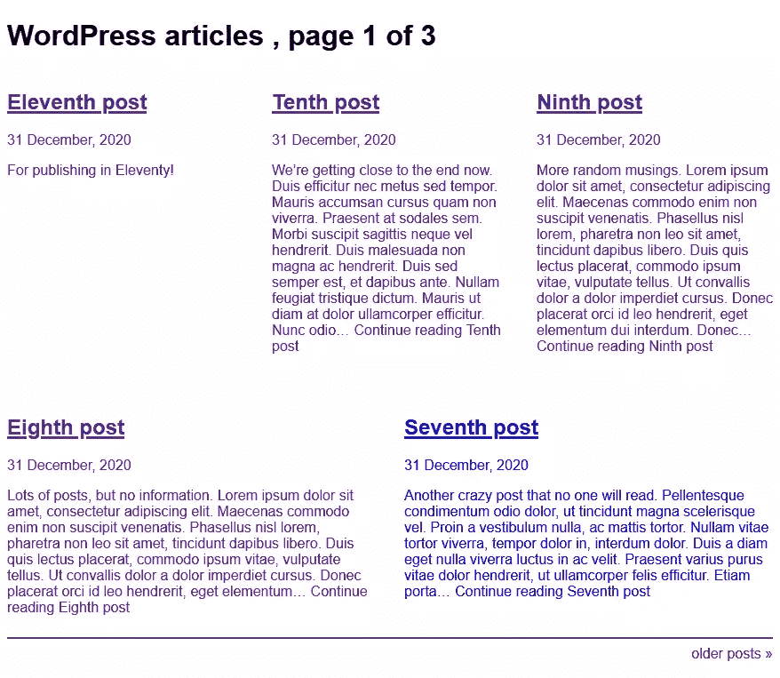

# 如何使用 WordPress 作为 Eleventy 的无头 CMS

> 原文：<https://www.sitepoint.com/wordpress-headless-cms-eleventy/>

在过去的几年里，静态站点生成器[像](https://www.sitepoint.com/static-site-generators/)[eleven](https://www.sitepoint.com/getting-started-with-eleventy/)和 [Jamstack](https://www.sitepoint.com/learn-jamstack/) 这样的概念已经从利基工具发展成为主流开发方法。

好处很吸引人:

*   更简单的部署和静态托管
*   更好的安全性；几乎没有可利用的后端系统
*   使用 Git 轻松备份和文档版本控制
*   出色的开发体验，以及
*   超快的性能

不幸的是，静态站点发电机(SSG)项目很少移交给客户。《哲基尔》、《雨果》、《盖茨比》等 SSG 都是为开发者设计的。导航版本分支、更新 Markdown 文档和运行命令行构建过程对于来自内容管理系统上一键发布世界的编辑来说是令人沮丧的。

本教程描述了一种让每个人都快乐和有动力的方法！…

*   内容编辑可以使用 WordPress 来编辑和预览文章
*   开发人员可以将这些内容导入 Eleventy 来构建一个静态站点

## 无头 CMSs 和松散耦合的 API

这里举例说明的一些概念被晦涩的行话和术语所掩盖。我将尽力避免它，但是理解一般的方法是有用的。

大多数内容管理系统(CMSs)提供:

1.  管理页面、文章、媒体、类别、标签等的内容控制面板。
2.  将内容插入模板的网页生成系统。这通常在用户请求页面时按需发生。

这有一些缺点:

*   网站可能受限于 CMS 及其插件的能力。
*   内容通常存储在 HTML 中，因此很难重复使用，例如，在移动应用程序中使用相同的内容。
*   页面呈现过程可能会很慢。CMSs 通常提供缓存选项来提高性能，但是当数据库出现故障时，整个站点可能会消失。
*   切换到另一个/更好的 CMS 并不容易。

为了提供额外的灵活性， *headless CMS* 有一个内容控制面板，但不是页面模板，数据可以通过 API 访问。任何数量的系统都可以使用相同的内容。例如:

*   SSG 可以在构建时获取所有内容，并呈现一个完整的站点
*   另一个 SSG 可以用不同的方式建立一个网站——例如，提供优质内容
*   移动应用程序可以按需获取内容，显示最新的更新

无头 CMS 解决方案包括 [Sanity.io](https://www.sanity.io/) 和[contentiful](https://www.contentful.com/)。这些功能很强大，但是需要编辑学习新的内容管理系统。

## WordPress REST API

几乎 40%的网站使用 WordPress (包括 SitePoint.com)。大多数内容编辑都会遇到 CMS，许多人会每天使用它。

WordPress 从 2016 年发布 4.7 版本开始就提供了一个 [REST API](https://developer.wordpress.org/rest-api/) 。API 允许开发人员访问和更新 CMS 中存储的任何数据。例如，要获取最近的十篇文章，您可以向以下地址发送请求:

```
yoursite.com/wp-json/wp/v2/posts?orderby=date&order=desc 
```

*注意:只有在 WordPress **设置**中设置了漂亮的永久链接，例如**帖子名称**，这个 REST URL 才会起作用。如果站点使用默认的 URL，REST 端点将是`<yoursite.com/?rest_route=wp/v2/posts?orderby=date&order=desc>`* 。

这将为每个帖子返回包含大型对象数组的 JSON 内容:

```
[
  {
    "id": 33,
    "date": "2020-12-31T13:03:21",
    "date_gmt": "2020-12-31T13:03:21",
    "guid": {
      "rendered": "https://mysite/?p=33"
    },
    "modified": "2020-12-31T13:03:21",
    "modified_gmt": "2020-12-31T13:03:21",
    "slug": "my-post",
    "status": "publish",
    "type": "post",
    "link": "https://mysite/my-post/",
    "title": {
      "rendered": "First post"
    },
    "content": {
      "rendered": "<p>My first post. Nothing much to see here.</p>",
      "protected": false
    },
    "excerpt": {
      "rendered": "<p>My first post</p>",
      "protected": false
    },
    "author": 1,
    "featured_media": 0,
    "comment_status": "closed",
    "ping_status": "",
    "sticky": false,
    "template": "",
    "format": "standard",
    "meta": [],
    "categories": [1],
    "tags": []
   }
] 
```

WordPress 默认返回十篇文章。HTTP 头`x-wp-total`返回文章总数，而`x-wp-totalpages`返回页面总数。

注意:读取公共数据不需要 WordPress 认证，因为…它是公共的！[认证](https://developer.wordpress.org/rest-api/using-the-rest-api/authentication/)只有在你试图添加或修改内容的时候才有必要。

因此，可以将 WordPress 用作一个无头 CMS，并将页面数据导入一个静态的站点生成器，比如 Eleventy。您的编辑可以继续使用他们知道的工具，而不管您使用的站点发布流程。

### WordPress 警告

下面的部分描述了如何将 WordPress 的文章导入到一个 Eleventy 生成的站点中。

在理想的情况下，你的 WordPress 模板和 Eleventy 主题应该是相似的，这样页面预览就可以和最终的站点完全一样。这可能很困难:WordPress REST API 输出 HTML，代码可能会被插件和主题显著改变。一个传送带、商店产品或联系人表单可能会出现在静态站点中，但无法运行，因为它缺少客户端资产或对服务器端 API 的 Ajax 请求。

我的建议是:你的 WordPress 设置越简单，就越容易被用作无头 CMS。不幸的是，你的客户端安装的 57 个*基本*插件可能会带来一些挑战。

## 安装 WordPress

下面的演示代码假设你已经在你的 PC 上运行了 WordPress。你可以手动安装 Apache、PHP、MySQL 和 WordPress，使用一体化安装程序，如 [XAMPP](https://www.apachefriends.org/) ，甚至访问一个直播服务器。

或者，您可以使用 [Docker](https://www.docker.com/) 来管理安装和配置。创建一个新目录，比如`wpheadless`，包含一个`docker-compose.yml`文件:

```
version: '3'

services:

  mysql:
    image: mysql:5
    container_name: mysql
    environment:
      - MYSQL_DATABASE=wpdb
      - MYSQL_USER=wpuser
      - MYSQL_PASSWORD=wpsecret
      - MYSQL_ROOT_PASSWORD=mysecret
    volumes:
      - wpdata:/var/lib/mysql
    ports:
      - "3306:3306"
    networks:
      - wpnet
    restart: on-failure

  wordpress:
    image: wordpress
    container_name: wordpress
    depends_on:
      - mysql
    environment:
      - WORDPRESS_DB_HOST=mysql
      - WORDPRESS_DB_NAME=wpdb
      - WORDPRESS_DB_USER=wpuser
      - WORDPRESS_DB_PASSWORD=wpsecret
    volumes:
      - wpfiles:/var/www/html
      - ./wp-content:/var/www/html/wp-content
    ports:
      - "8001:80"
    networks:
      - wpnet
    restart: on-failure

volumes:
  wpdata:
  wpfiles:

networks:
  wpnet: 
```

从你的终端运行`docker-compose up`来启动 WordPress。首次运行时，这可能需要几分钟时间，因为所有依赖项都必须下载并初始化。

将在主机上创建一个新的`wp-content`子目录，其中包含已安装的主题和插件。如果您使用的是 Linux、macOS 或 Windows WSL2，您可能会发现这个目录是由`root`用户创建的。你可以运行`sudo chmod 777 -R wp-content`来授予所有用户读写权限，这样你和 WordPress 都可以管理这些文件。

*注:`chmod 777`并不理想。一个稍微安全一点的选择是`sudo chown -R www-data:<yourgroup> wp-content`后面跟着`sudo chmod 774 -R wp-content`。这将向 Apache 和组中的任何人授予写权限。*

在你的浏览器中导航到 [http://localhost:8001/](http://localhost:8001/) 并遵循 WordPress 的安装过程:



根据需要修改你网站的设置，记得设置漂亮的永久链接，比如**设置** > **永久链接**中的**帖子名称**。然后添加或导入一些文章，这样您就有数据在 11 月份进行测试。

保持 WordPress 运行，但是一旦你准备好关闭一切，从项目目录运行`docker-compose down`。

## 安装十一件

Eleventy 是一个流行的 Node.js 静态站点生成器。[Eleventy](https://www.sitepoint.com/getting-started-with-eleventy/)入门教程描述了一个完整的设置，但下面的说明显示了基本步骤。

确保您已经安装了[node . js](https://nodejs.org/)8.0 或以上版本，然后创建一个项目目录并初始化`package.json`文件:

```
mkdir wp11ty
cd wp11ty
npm init 
```

安装 Eleventy 和 [node-fetch](https://www.npmjs.com/package/node-fetch) [Fetch 兼容](https://developer.mozilla.org/Web/API/Fetch_API)库作为开发依赖:

```
npm install @11ty/eleventy node-fetch --save-dev 
```

然后创建一个新的`.eleventy.js`配置文件，它设置了源(`/content`)和构建(`/build`)子目录:

```
// .eleventy.js configuration
module.exports = config => {

  return {

    dir: {
      input: 'content',
      output: `build`
    }

  };

}; 
```

## 检索 WordPress 文章数据

Eleventy 可以从任何地方提取数据。包含在内容的`_data`目录中的 JavaScript 文件被自动执行，并且由导出函数返回的任何数据在页面模板中都是可用的。

在项目目录中创建一个`content/_data/posts.js`文件。首先定义默认的 WordPress post API 端点和`node_fetch`模块:

```
// fetch WordPress posts
const
  wordpressAPI = 'http://localhost:8001/wp-json/wp/v2/posts?orderby=date&order=desc',
  fetch = require('node-fetch'); 
```

随后是一个`wpPostPages()`函数，该函数确定必须进行多少次 REST 调用来检索所有帖子。它调用 WordPress API URL，但是附加了`&_fields=id`来返回文章 IDs 所需的最少数据。

然后可以检查`x-wp-totalpages`标题以返回页数:

```
// fetch number of WordPress post pages
async function wpPostPages() {

  try {

    const res = await fetch(`${ wordpressAPI }&_fields=id&page=1`);
    return res.headers.get('x-wp-totalpages') || 0;

  }
  catch(err) {
    console.log(`WordPress API call failed: ${err}`);
    return 0;
  }

} 
```

一个`wpPosts()`函数检索一组帖子(*页面*)，每个帖子都有其 ID、slug、日期、标题、摘录和返回的内容。字符串被解析为 JSON，然后所有空的和受密码保护的帖子被删除(其中`content.protected`被设置为`true`)。

*注意:默认情况下，`/wp-json/wp/v2/posts`端点不会返回只能由内容编辑查看的 WordPress 草稿和私人帖子。*

文章内容被格式化以创建日期和干净的字符串。在这个例子中，完全合格的 WordPress URLs 去掉了 [http://localhost:8001](http://localhost:8001) 域，以确保它们指向呈现的站点。您可以根据需要添加进一步的修改:

```
// fetch list of WordPress posts
async function wpPosts(page = 1) {

  try {

    const
      res = await fetch(`${ wordpressAPI }&_fields=id,slug,date,title,excerpt,content&page=${ page }`),
      json = await res.json();

    // return formatted data
    return json
      .filter(p => p.content.rendered && !p.content.protected)
      .map(p => {
        return {
          slug: p.slug,
          date: new Date(p.date),
          dateYMD: dateYMD(p.date),
          dateFriendly: dateFriendly(p.date),
          title: p.title.rendered,
          excerpt: wpStringClean(p.excerpt.rendered),
          content: wpStringClean(p.content.rendered)
        };
      });

  }
  catch (err) {
    console.log(`WordPress API call failed: ${err}`);
    return null;
  }

}

// pad date digits
function pad(v = '', len = 2, chr = '0') {
  return String(v).padStart(len, chr);
}

// format date as YYYY-MM-DD
function dateYMD(d) {

  d = new Date(d);
  return d.getFullYear() + '-' + pad(d.getMonth() + 1) + '-' + pad(d.getDate());

}

// format friendly date
function dateFriendly(d) {

  const toMonth = new Intl.DateTimeFormat('en', { month: 'long' });
  d = new Date(d);
  return d.getDate() + ' ' + toMonth.format(d) + ', ' + d.getFullYear();

}

// clean WordPress strings
function wpStringClean(str) {

  return str
    .replace(/http:\/\/localhost:8001/ig, '')
    .trim();

} 
```

最后，一个导出的函数返回所有格式化文章的数组。它调用`wpPostPages()`来确定页数，然后为每个页面并发运行`wpPosts()`:

```
// process WordPress posts
module.exports = async function() {

  const posts = [];

  // get number of pages
  const wpPages = await wpPostPages();
  if (!wpPages) return posts;

  // fetch all pages of posts
  const wpList = [];
  for (let w = 1; w <= wpPages; w++) {
    wpList.push( wpPosts(w) );
  }

  const all = await Promise.all( wpList );
  return all.flat();

}; 
```

post 对象的返回数组如下所示:

```
[
  {
    slug: 'post-one',
    date: new Date('2021-01-04'),
    dateYMD: '2021-01-04',
    dateFriendly: '4 January 2021',
    title: 'My first post',
    excerpt: '<p>The first post on this site.</p>',
    content: '<p>This is the content of the first post on this site.</p>'
  }
] 
```

## 呈现 11 月的所有帖子

Eleventy 的[分页功能](https://www.11ty.dev/docs/pagination/)可以从生成的数据中呈现页面。使用以下代码创建一个`content/post/post.njk` [Nunjucks](https://mozilla.github.io/nunjucks/) 模板文件，以检索`posts.js`数据(`posts`)并在根据帖子的 slug 命名的目录中输出每个项目(【帖子】):

```
---
pagination:
  data: posts
  alias: post
  size: 1
permalink: "/{{ post.slug | slug }}/index.html"
---
<!DOCTYPE html>
<html lang="en">
<head>
<meta charset="UTF-8">
<title>{{ post.title }}</title>
<meta name="viewport" content="width=device-width,initial-scale=1" />
<style> body { font-size: 100%; font-family: sans-serif; } </style>
</head>
<body>

<h1>{{ post.title }}</h1>

<p><time datetime="{{ post.dateYMD }}">{{ post.dateFriendly }}</time></p>

{{ post.content | safe }}

</body>
</html> 
```

从终端的根项目目录中运行`npx eleventy --serve`来生成所有的帖子并启动一个开发服务器。

如果在 WordPress 中已经创建了一个带有 slug `post-one`的帖子，你可以在你的新的第 11 个站点中访问它，网址是[http://localhost:8080/post-one/](http://localhost:8080/post-one/):



## 创建文章索引页面

为了使导航更容易，可以在`content/index.njk`创建一个类似的分页页面。这将在每页上呈现五个带有“较新”和“较旧”帖子链接的项目:

```
---
title: WordPress articles
pagination:
  data: posts
  alias: pagedlist
  size: 5
---
<!DOCTYPE html>
<html lang="en">
<head>
<meta charset="UTF-8">
<title>{{ post.title }}</title>
<meta name="viewport" content="width=device-width,initial-scale=1" />
<style> body { font-size: 100%; font-family: sans-serif; }
  ul, li {
    margin: 0;
    padding: 0;
  }
  ul {
    list-style-type: none;
    display: flex;
    flex-wrap: wrap;
    gap: 2em;
  }
  li {
    flex: 1 1 15em;
  }
  li.next {
    text-align: right;
  }
  a {
    text-decoration: none;
  }
  a h2 {
    text-decoration: underline;
  } </style>
</head>
<body>

<h1>
  {{ title }}{{ list }} list
  , page {{ pagination.pageNumber + 1 }} of {{ pagination.pages.length }}
</h1>

<ul class="posts">
  
    <li>
      <a href="/{{ post.slug }}/">
        <h2>{{ post.title }}</h2>
        <p><time datetime="{{ post.dateYMD }}">{{ post.dateFriendly }}</time></p>
        <p>{{ post.excerpt | safe }}
      </a>
    </li>
  
</ul>

<hr>


<ul class="pages">
  
    <li><a href="{{ pagination.href.previous }}">&laquo; newer posts</a></li>
  

  
    <li class="next"><a href="{{ pagination.href.next }}">older posts &raquo;</a></li>
  
</ul>


</body>
</html> 
```

上面执行的`npx eleventy --serve`应该仍然是活动的，但是如果需要的话，再次运行它。在`build`目录中创建一个`index.html`文件，它链接到前五篇文章。更多页面包含在`build/1/index.html`、`build/2/index.html`等。

导航到 [http://localhost:8080/](http://localhost:8080/) 查看索引:



按`Ctrl` | `Cmd` + `C`退出十一号服务器。独立运行`npx eleventy`来构建一个完整的站点，为部署做好准备。

## 部署决策

最终的 Eleventy 站点包含静态 HTML 和资产。它可以托管在任何 web 服务器上，没有服务器端运行时、数据库或其他依赖性。

你的 WordPress 站点需要 PHP 和 MySQL，但是对于内容编辑来说，它可以托管在任何实用的地方。私有公司网络上的服务器是最安全的选择，但是您可能需要考虑为远程员工提供公共 web 服务器。可以使用 IP 地址限制、附加认证等来保护这两者。

你的 Eleventy 和 WordPress 站点可以托管在不同的服务器上，也许可以分别从不同的子域如`www.mysite.com`和`editor.mysite.com`访问。这两者都不会相互冲突，而且更容易管理流量高峰。

但是，在下列情况下，您可能更愿意将两个站点放在同一台服务器上:

*   您有一些静态页面(服务、关于、联系等)。)和一些 WordPress 页面(商店、论坛等。)，或者
*   静态站点访问 WordPress 数据，比如上传的图片或其他 REST APIs。

PHP 只在 URL 不能用另一种方式解析时才启动 WordPress 渲染。例如，假设你有一个带有永久链接`/post/my-article`的 WordPress 帖子。它将在用户访问`mysite.com/post/my-article` *时被服务，除非*一个名为`/post/my-article/index.html`的静态文件已经由 Eleventy 在服务器的根目录下生成。

不幸的是，内容编辑不能从 WordPress 预览文章，所以你可以考虑有条件的 URL 重写。这个 Apache `.htaccess`配置从一个适当的`/static/`目录加载所有的`/post/`URL，除非用户的 IP 地址是`1.2.3.4`:

```
RewriteEngine On
RewriteCond %{REMOTE_HOST} !^1.2.3.4
RewriteRule "^/post/(.*)" "/static/post/$1/index.html" [R] 
```

对于更复杂的站点，您可以使用 Eleventy 根据您生成的页面来呈现服务器配置文件。

最后，您可能希望引入一个自动触发第 11 个构建和部署过程的过程。你可以考虑:

1.  每 N 小时构建一次，不考虑更改。
2.  为内容编辑者提供一个大的“立即部署”按钮。这可以集成到 WordPress 管理面板中。
3.  使用 WordPress REST API 经常检查最近的帖子`modified`日期。当它晚于上次构建日期时，可以开始重建。

## 更简单的静态站点？

这个例子说明了使用 WordPress 作为静态站点生成的无头 CMS 的基础。它非常简单，尽管更复杂的内容需要更复杂的代码。

进一步改进的建议:

*   尝试从使用第三方主题和插件的现有 WordPress 站点导入帖子。
*   修改返回的 HTML 来删除或修改 WordPress 小部件。
*   导入进一步的数据，如[页面](https://developer.wordpress.org/rest-api/reference/pages/)、[类别](https://developer.wordpress.org/rest-api/reference/categories/)和[标签](https://developer.wordpress.org/rest-api/reference/tags/) ( [评论](https://developer.wordpress.org/rest-api/reference/comments/)也是可以的，尽管用处不大)。
*   [将图像或其他媒体](https://developer.wordpress.org/rest-api/reference/media/)提取到本地文件系统。
*   考虑如何在本地文件中缓存 WordPress 文章以加快渲染速度。可以检查`_fields=modified`日期，以确保导入新的和更新的帖子。

WordPress 不太可能是管理静态网站内容的最佳选择。然而，如果你已经在使用 WordPress 并考虑迁移到一个静态站点生成器，它的 REST API 提供了一个可能的迁移路径，而不用完全放弃 CMS。

## 分享这篇文章