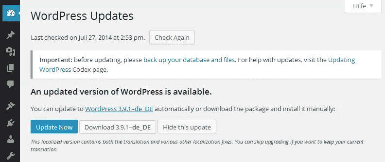

# WordPress i18n 和本地化

> 原文：<https://www.sitepoint.com/wordpress-i18n/>

WordPress 可以说是当今世界领先的内容管理系统(CMS )(有些人甚至认为 WordPress 不仅仅是一个 CMS(T1 ))),为全球超过 6000 万个网站提供支持。

默认情况下，WordPress 是以美国英语(en_US)呈现的，但是它有一个内置的语言功能。这使得 WordPress 社区可以将 WordPress 翻译成几种语言。WordPress 的主题、翻译文件和支持也已经有了不同的语言版本。

## WordPress i18n 支持

WordPress 使用 [gettext](http://www.gnu.org/software/gettext/) 库和国际化工具 **(i18n)** 。
正是这些库促进了 WordPress、主题和插件的国际化。

**注:** `i18n`是国际化的缩写，之所以叫 i18n，是因为“I”和“n”之间有 18 个字母。

如果您不熟悉 i18N、translations 和 Gettext 的概念，我强烈建议您阅读这个关于本地化的系列文章,以了解其中涉及的内容。

在这篇文章中，我将介绍 WordPress i18n 的基础知识。我将带你完成安装一个本地化版本的 WordPress(你自己语言的 WordPress)的简单过程，并向你展示如何将一个现有的 WordPress 站点转换成一个本地化版本。

## 安装 WordPress 的本地化版本

许多来自世界各地的 WordPress 爱好者已经合作将 WordPress 翻译成他们不同的语言。

例如，WordPress 的法语、德语和意大利语本地化版本分别在[fr.wordpress.org](http://fr.wordpress.org/)、[de.wordpress.org](http://de.wordpress.org/)和[it.wordpress.org](http://it.wordpress.org/)提供。

让我们看看如何使用德语国际化作为本教程的基准来安装本地化的 WordPress。

1.  前往 de.wordpress.org 下载德国的 WordPress。
2.  FTP/SFTP 进入你的网络服务器，将 WordPress 包解压到你喜欢的安装目录。
3.  在你的 web 服务器上为 WordPress 创建一个数据库，以及一个拥有所有权限的 MySQL 用户。
4.  编辑`wp-config.php`文件并添加您的数据库信息。
5.  通过在网络浏览器中访问 URL 来运行 WordPress 安装脚本。
6.  你应该已经有了德语版的 WordPress 并开始运行。

你可能还想查看一下 WordPress codex 的其他安装方式。

其他语言版本的 WordPress 完整列表可以在 WP Central 获得。

## 将一个现有的 WordPress 网站变成国际版本

让我们假设你是德国人，你有一个现有的英文 WordPress 网站，但是直到你读了这篇文章，你才知道有一个德文版的 WordPress。基于这一新发现的知识，你决定通过将你的 WordPress 站点从默认的英文版改为德文版来改变现状。你可能认为这是一项非常困难的任务，但让我给你一点震撼。整个过程就像下面的指南一样简单，你甚至不需要重新安装 WordPress。

继续阅读，学习如何将现有的 WordPress 博客转换成你自己的语言(德语作为案例研究)。

从 i18n.svn.wordpress.org[的 WordPress 翻译库下载你语言的`.mo`文件。在这里](http://i18n.svn.wordpress.org/)获取德语的`.mo`语言文件[。](http://i18n.svn.wordpress.org/de_DE/trunk/messages/de_DE.mo)

`.mo`文件是机器可读的二进制文件，实际上是由`gettext`函数用来翻译的。

`.mo`文件的命名约定基于 ISO–639 语言代码(例如，pt 代表葡萄牙语)后跟 ISO–3166 国家代码(例如， *PT 代表葡萄牙语或* BR 代表巴西)。因此，巴西葡萄牙语文件将被称为`pt_BR.mo`，而非特定葡萄牙语文件将被称为`pt.mo`。
因此，德语的语言文件将被命名为`de_DE.mo`。

完整的代码列表可在[(国家代码)](http://www.gnu.org/software/gettext/manual/html_chapter/gettext_16.html#Country-Codes)和[(语言代码](http://www.gnu.org/software/gettext/manual/html_chapter/gettext_16.html#Language-Codes)找到。

既然我们已经下载了语言文件`.mo`，我们需要安装它。
要安装它，在 WordPress `/wp-content`安装目录中创建一个名为`/languages`的新文件夹，并将`.mo file`上传到你刚刚创建的语言文件夹中。

打开`wp-config.php`文件并搜索:

```
define ('WPLANG', '');

```

根据刚刚下载的`.mo`文件编辑这一行。例如，使用德语，`.mo`文件的名称被用作 PHP 常量`WPLANG`的值:

```
define('WPLANG', 'de_DE');

```

保存并打开你的 WordPress 站点。它现在应该以新安装的德语显示。

### 翻译时要记住的一些事情

我发现在将我的一个博客本地化为德语后，一些术语仍然显示在英语中。原因很简单，因为在 [WordPress 翻译库](http://i18n.svn.wordpress.org)的德语`.mo`文件缺少这些术语的翻译。

令人欣慰的是，在`WordPress Updates`页面，我得到了一个点击安装选项，可以自动将博客更新为完全本地化的德语版本。



**提示:**为了确保你下载了最新的语言`.mo`文件，它应该位于一个带有版本标签的文件夹中。一个例子是位于[i18n.svn.wordpress.org/es_ES/tags/3.9.1/messages/es_ES.mo](http://i18n.svn.wordpress.org/es_ES/tags/3.9.1/messages/es_ES.mo)的当前版本 WordPress (3.9.1)的`Spanish`语言`.mo`文件。

## 结论

像这样不可思议的特性是 WordPress 生态系统保持繁荣的原因。人们自然会对使用一个极其灵活的平台感到舒适，WordPress 社区不断将灵活性提升到一个全新的水平。用你喜欢的语言使用 WordPress 是一个重要的特性，正如你所看到的，这是一个非常容易实现的特性。

你有任何问题或意见吗？我很乐意在评论中回应他们。

## 分享这篇文章