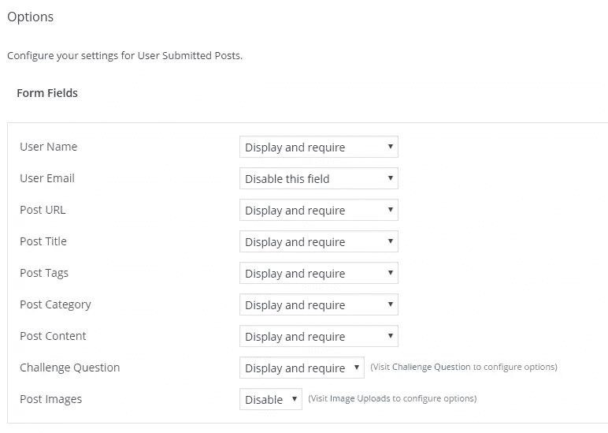
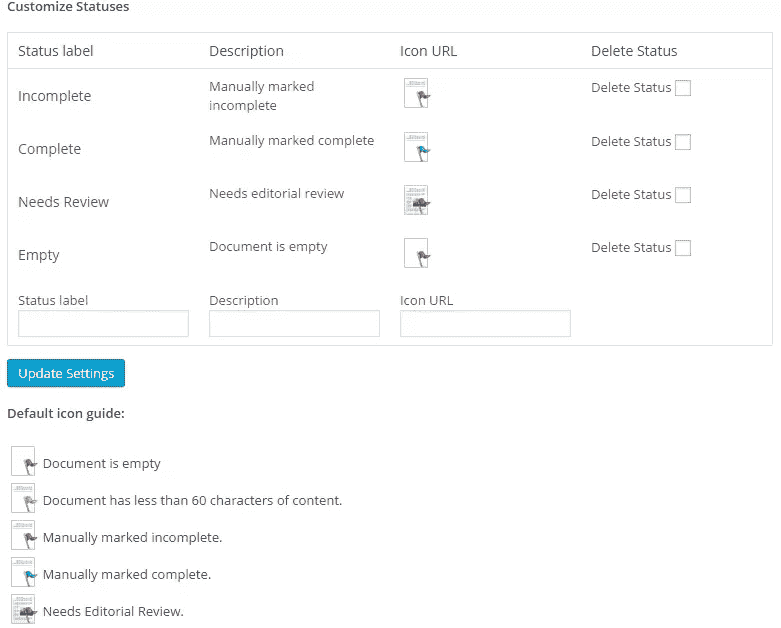
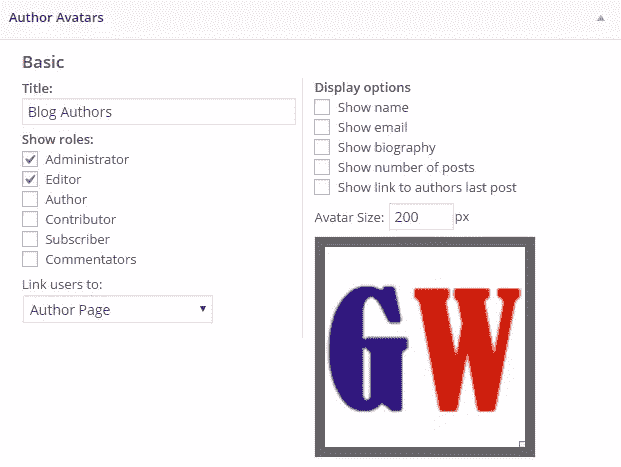

# 最好的 WordPress 多作者管理插件

> 原文：<https://www.sitepoint.com/wordpress-multi-author-management-plugins/>

在这篇文章中，我将介绍一些最好的 WordPress 多作者管理插件。在我们深入研究最流行的可用选项之前，让我们先来看看我们期望在一个好的多作者管理插件中看到的一些关键特性。

## 管理多作者网站的关键

如果你决定建立一个多作者的博客或网站，你可能希望考虑以下特点。下面提到的相关插件将在本文的下一节详细描述。

### 隐藏 WordPress 仪表板

首先，你不希望每个 WordPress 角色都控制你的管理区域。您应该在不需要的地方对用户角色(如贡献者和作者)隐藏这一点。这对你的作者来说也有助于简化事情。

使用:WP 用户前端插件

### 管理提交的帖子

当管理多个作者时，通过模板标签或短代码提供一个前端表单，使访问者能够提交帖子和上传图片，这是一个重要的功能。

使用:用户提交的帖子插件

### 作者简介和简历

作者通常希望他们的内容发布在网站上，以帮助获得认可并提升他们的作者简介，向其他专业人士展示他们的贡献。因此，作者简介和简历应该看起来有吸引力，但要足够简单以吸引读者的注意力。

使用:作者头像插件

### 向多个用户发送电子邮件

在协调繁忙的日程安排时，编辑可能会对向多个用户发送电子邮件所花费的时间感到沮丧。一个插件可以让一次给多个用户发邮件变得更容易，这无疑是另一个有价值的选择。

使用:电子邮件用户插件

### 进行中的内容

单独寻找不完整的帖子或试图记住如何处理不完整或部分完整的文档会令人厌倦。管理编辑工作流程可以让一切变得更简单，比如用笔记标记不完整的帖子或自动检测空帖子。

用途:内容进度插件

### 用户扩展(Cimy 用户额外字段)

注册页面带有预定义的工作流和标准字段。删除一些不需要的字段，允许添加其他重要的字段。这有助于赋予注册页面个人风格。

使用:Cimy 用户额外字段插件

### 关于用户和作者的说明

在仪表板中，以文本区域的形式在每个用户的个人资料周围添加注释是一个有用的功能。别担心，其他人看不到，只有管理员可以访问这些笔记。

使用:用户注释插件

## WordPress 多作者管理插件

### [用户提交的帖子](https://wordpress.org/plugins/user-submitted-posts/)

活跃安装次数:20，000 次以上

用户提交的帖子是一个插件，让您轻松地创建前端表单，使访问者能够通过模板标签或短代码提交帖子和上传图像。

一些主要功能包括:

*   允许访问者在你网站的任何地方提交帖子
*   将提交的图像设置为特色图像
*   包括输入验证和可定制的验证码和隐藏字段，以阻止垃圾邮件
*   提交的帖子可能包括标题、标签、类别、作者、url、帖子等。
*   WP 内置的用于帖子内容的富文本编辑器
*   成功提交帖子后，将用户重定向到任意位置或返回当前页面
*   带有简化 CSS 样式的 HTML5 提交表单
*   使用您自己的自定义表单模板和样式表

### [用户注释](https://wordpress.org/plugins/user-notes/)

活跃安装数:300 以上

用户注释插件允许你保存只有管理员才能看到的关于用户的私人注释。它向仪表板中每个用户的配置文件添加了一个文本区域，以便管理员可以维护私人注释。同样重要的是，注释仅对管理员可见。

### [WP 用户前端](https://wordpress.org/plugins/wp-user-frontend/)

活跃安装次数:10，000 次以上

通过 WP 用户前端插件，用户可以轻松地在网站前端创建新帖子并编辑他们的个人资料，而无需进入后端管理仪表板。

功能包括:

*   用户可以从前端创建一个新的职位
*   用户也可以从前端编辑帖子
*   他们可以在前端定制仪表板中查看自己的页面
*   从前端编辑配置文件
*   管理员可以限制任何用户访问 WordPress 后端的级别
*   从前端上传附件
*   上传帖子特色图片
*   管理员可以从前端管理用户

### [内容进度](https://wordpress.org/plugins/content-progress/)

活跃安装数:300 以上

内容进度是一个管理编辑工作流程的插件。以下是一些功能:

*   向内容列表添加图标，如帖子、页面和自定义帖子类型，以表明您的需求
*   自动检测空帖子或文本较少的文档
*   标记任何不完整或需要审阅的文档
*   创建自定义内容标志，例如*“添加视频”*、*“需要格式化”*
*   在帖子中添加注释，以方便群组之间的交流

### [Cimmy 用户额外字段](https://wordpress.org/plugins/cimy-user-extra-fields/)

活跃安装次数:20，000 次以上

Cimmy 用户额外字段插件为您的注册页面添加了更多有用的字段。您还可以向注册页面添加各种选项，包括图片和 URL。如果您愿意，也可以隐藏某些字段。

### [电子邮件用户](https://wordpress.org/plugins/email-users/)

活跃安装次数:10，000 次以上

电子邮件用户插件允许站点编辑向注册的站点用户发送电子邮件。

### [管理](https://wordpress.org/plugins/adminimize/)

活跃安装次数:100，000 次以上

Adminize 是一个神奇的插件，可以为非管理员用户从仪表板上删除一些项目。如果您是管理员，您通常希望隐藏仪表板中的某些项目，以防止贡献者和作者查看它。

### [增强的能力管理器](https://wordpress.org/plugins/capability-manager-enhanced/)

活跃安装次数:30，000 次以上

不要与 WordPress 规则和功能混淆，功能管理器增强插件帮助你轻松地管理角色(如订户、作者、贡献者、编辑和管理员)。

以下是主要功能:

*   添加新角色
*   查看或更改角色权能
*   轻松地将现有角色复制到新角色中
*   向现有角色添加新功能

### [限制作者发帖](https://wordpress.org/plugins/restrict-author-posting/)

活跃安装数:2，000 以上

限制作者发布插件将允许管理员限制一个用户配置文件的特定类别。这使得作者或编辑更容易只在特定类别中发表文章。

### [修订版](https://wordpress.org/plugins/revisionary/)

活跃安装数:4，000 以上

修订版插件负责编辑已发布的内容。修订版可以立即出版，也可以在编辑同意后预定时间出版。它还使贡献者能够提交对他们自己发布的内容的修订。

### [作者头像列表](https://wordpress.org/plugins/author-avatars/)

活跃安装次数:10，000 次以上

作者头像列表插件可以很容易地在你的多用户博客或网站上显示用户头像列表。您可以使用小部件或短代码来显示用户头像列表。这个插件还附带了一个 TinyMCE 编辑器插件，可以很容易地插入短代码。

如果你想要更多的选择，这里有一个莎莉·伍德的最好的 WordPress 作者简历插件的伟大列表。

## 摘要

在这篇文章中，我介绍了一些适用于 WordPress 的最好的多作者管理插件，以及它们如何帮助你更好地管理多作者网站。你还有其他想分享的吗？

## 分享这篇文章