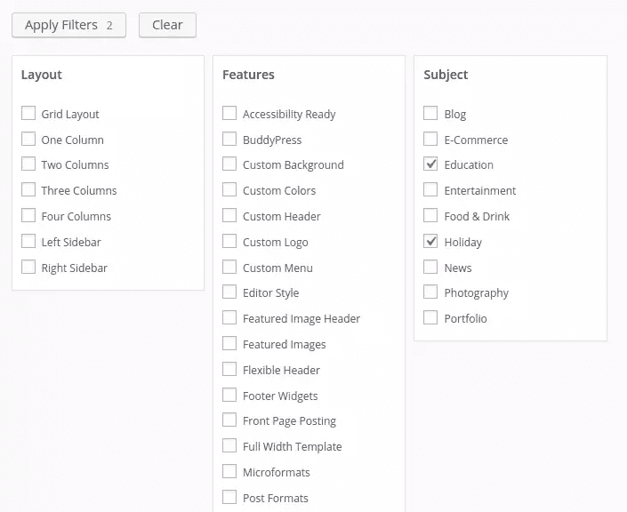
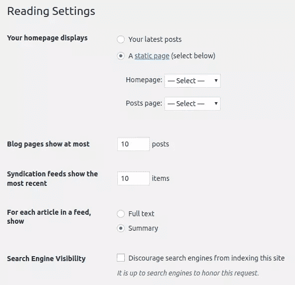

# 用 WordPress 建立一个非博客网站

> 原文：<https://www.sitepoint.com/wordpress-non-blog-site/>

这篇文章深入探讨了如何使用 WordPress 来运营一个常规的非博客网站。

WordPress 最初是一个博客平台，并在博客世界中拥有长期的统治地位。无论你打算经营哪种类型的博客，WordPress 都能帮你轻松搞定。

无论是照片博客、视频博客还是简单的思想日志，WordPress 都有博客作者可能要求的所有铃声、哨声和功能！

也就是说，我们也可以使用 WordPress 创建一个非博客网站——一个根本不需要博客的网站，而是一个简单明了的网站。尽管 WordPress 主要是一个博客工具，但它也可以运行一个非博客网站。

## 博客功能

WordPress 自带了一大堆博客特有的功能。这些包括但不限于评论、博客文章、类别和标签等。

现在，很明显，这些特性中的大部分对于运行和管理一个博客站点是至关重要的。然而，当建立一个非博客网站时，许多这样的功能可能并不有用。显然，我们可以选择让它们保持原样。

但是前端的东西呢？如果我们完全放弃博客文章，博客存档不会给用户一个“没有找到文章”的信息吗？“未分类”类别呢？这样的分类法也倾向于拥有自己的档案。

解决这个问题最简单的方法是完全禁用存档。除此之外，我们还可以选择禁用许多其他以博客为中心的功能。

## 创建一个非博客的 WordPress 网站

在更进一步之前，让我们面对事实:WordPress，以其目前的形式，期望它的用户写和发布帖子。如果你所希望做的只是建立一个有给定页数的静态网站，并且不需要发布或定期更新帖子和其他形式的内容，那么博客部分就是多余的。

因此，我们有必要告诉 WordPress 我们不需要默认的文章档案、分类或作者档案等等。例如，下面的代码帮助您从站点中删除所有默认的博客页面和归档:

```
/* Registering redirect action callback */
add_action('template_redirect', 'sp_remove_blog');
/* Removing blog from our site */
function sp_remove_blog(){
  //Works on archive template, single post template or index
  if( is_archive() || is_single() || is_home() ) {
    global $wp_query;
    $wp_query-&gt;set_404(); //404 not found
  }
} 
```

上面的代码禁用了所有的博客存档、单篇文章模板以及博客索引模板。现在，WordPress 将把用户从单一的帖子模板或博客档案重定向到 404 页面。你可以在你的`.htaccess`文件中进一步设置自定义重定向，通过 WordPress 插件，或者在代码本身中重定向用户到一个特定的页面而不是 404 页面，甚至是主页！

上面的代码最好放在你的主题或者子主题的`functions.php`文件中。这一步是必要的，以防止创建空的存档页面，否则可能会损害您的搜索排名。也就是说，在某种程度上，你也可以通过一个好的 SEO 插件来禁用几个存档，比如 [Yoast SEO](https://wordpress.org/plugins/wordpress-seo/) (参考插件相关的详细指南)。

## 寻找非博客主题

有很多 WordPress 主题可供选择。即使对于非博客网站，也有大量令人惊奇的 WordPress 主题，有免费的，也有付费的。

现在，不用说，你应该只从可靠的来源选择你的 WordPress 主题。很容易成为一个糟糕的 WordPress 主题的牺牲品，让你的网站在几分钟内被破坏或者被黑。

就免费 WordPress 主题而言，你唯一应该看的地方是官方主题库。回购中的 WordPress 主题是经过质量测试的，通常带有质量更好的代码。最重要的是，官方库中的免费 WordPress 主题没有恶意代码或恶意软件。

对于非博客网站，官方知识库有几个标签，你可以用它们来筛选出完美的主题。例如，“ [Education](https://wordpress.org/themes/tags/education/) ”功能过滤器通常提供针对教育特定网站的主题，但是您可以在几乎任何非博客网站上使用这些主题。这同样适用于“假日”过滤器。



当选择一个高级主题时，确保你选择了一个知名的主题卖家。此外，你应该关注的主题的标签或类型通常被称为“商业”或“公司”主题。大多数这样的主题倾向于带有一个定制的博客页面模板或布局，这不应该是一个大问题，因为您已经使用上面的代码禁用了存档页面显示。

然而，当你为你的非博客网站选择一个 WordPress 主题时，有一个特别的谨慎步骤。无论如何，避免带有大量“自定义”功能的 WordPress 主题，尤其是带有自定义短代码、自定义按钮、自定义页面模板等等的主题。这样的 WordPress 主题只有在你以它应该的方式使用 WordPress 的时候才是开箱即用的。当你试图在 WordPress 中建立一个真正的非博客网站时，定制页面模板和短代码只会碍事。当您没有博客文章要显示时，您将如何使用网格归档博客页面模板？

某些高级 WordPress 主题，如 [Divi by Elegant Themes](https://www.elegantthemes.com/gallery/divi/) ，是上述规则的例外，因为这些主题往往有一个生态系统和自己的预制模板。事实上，你可以在 Divi 中选择一个商业模板，然后立刻将一个非博客网站导入到你的 WordPress 安装中。但是在大多数情况下，最好使用一系列的 WordPress 插件来实现这样的定制功能。
说到 WordPress 插件…

## 用于建立非博客网站的插件

如今，转向 WordPress 插件来扩展和利用 WordPress 已经成为一种规范。有这么多的 WordPress 插件供我们使用，利用一些有用的插件来进一步改进我们的网站是很自然的。

虽然 WordPress 插件的共性——比如那些用于 SEO 或安全的——对于博客和非博客网站来说都是一样的，但是我们可以使用一些专门用于非博客项目的 WordPress 插件。

首先，[禁用评论](https://wordpress.org/plugins/disable-comments/) WordPress 插件可以帮助你在网站上全局禁用评论。这意味着评论管理和审核的所有实例，以及前端的评论表格，都将从你的非博客网站中删除。这不仅可以确保你不必再处理垃圾邮件，而且禁用评论插件还可以通过从 WordPress 仪表盘、管理菜单、管理面板等移除评论相关的项目来整理你的 WordPress 管理面板。

接下来， [Google XML Sitemaps](https://wordpress.org/plugins/google-sitemap-generator/) 插件对于非博客网站也很有用。顾名思义，这个插件可以帮助你更有效地创建和管理你的站点地图。建议你使用一个专用的站点地图插件，因为你的站点会有几个方面你不想包含在你的站点地图中——特别是那些与博客相关的，比如分类归档。使用专门的网站地图或 SEO 插件可以帮助你确保搜索引擎不会抓取你的非博客网站中任何不想要的部分。

## 管理非博客网站上的内容

现在，在这个阶段，你已经安装了一些有用的 WordPress 插件，并且从你的 WordPress 安装中删除了博客特有的特性。

你还列出了一个好的 WordPress 主题，适合你的非博客网站的需求和要求。

自然是时候开始做事了。一般来说，对于一个非博客网站，你大部分时间都在使用页面。根据您网站的需要，您可以根据需要添加任意多的页面。然而，通常有一个三步模式可以遵循。

显然，第一步是添加一个自定义主页。您可以导航到设置菜单下的站点阅读子菜单，然后在其中指定一个自定义主页。通常，你选择的 WordPress 主题会有一个定制的主页模板，你可以在给定的页面上使用。



第二步是将所需的页面添加到您的站点并构建您的内容。由于 WordPress 中的页面文章类型没有作为分类法与之相关联的类别或标签，所以您可以简单地放置您的内容，并且如果需要的话，以子页面的形式指定一个层次结构。在这一点上，使用页面构建器插件可能是个好主意。

例如， [Elementor](https://wordpress.org/plugins/elementor/) 提供了一系列预设的元素，你可以将它们添加到你的页面内容中，让你的网站看起来更独特。

最后，你也可以在你的网站上添加自定义的文章类型。例如，证明和其他自定义元素可以显示为自定义帖子类型。流行的 WordPress 插件 Jetpack 附带了推荐和组合帖子类型，尽管对于更复杂的帖子类型，你可以使用插件，如[自定义帖子类型 UI](https://wordpress.org/plugins/custom-post-type-ui/) 。

## 摘要

所以你有它！在 WordPress 中建立一个非博客网站是相当容易的，整个过程可以通过简单的步骤来完成。所有需要做的就是禁用博客特有的功能，然后转向 WordPress 页面(如果需要的话，自定义帖子类型)，完成工作！

WordPress 是世界上最流行的内容管理系统。自然，不言而喻，它可以，也确实，非常有效地增强了博客和非博客网站的能力。因此，WordPress 是建立非博客网站的一个好选择，如果你打算很快建立一个，你应该考虑一下试试 WordPress！

## 分享这篇文章