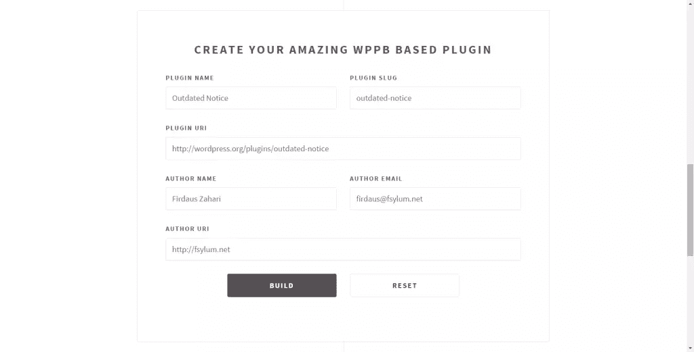
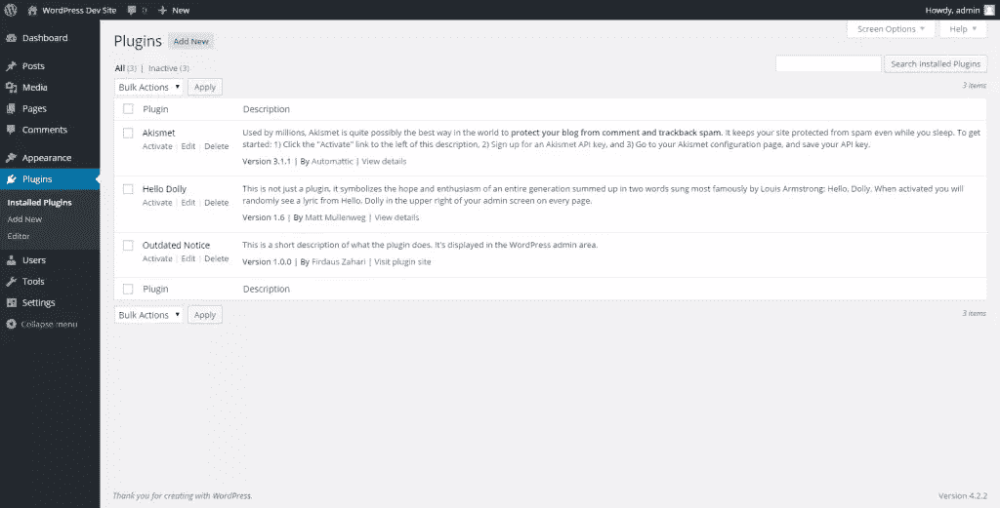
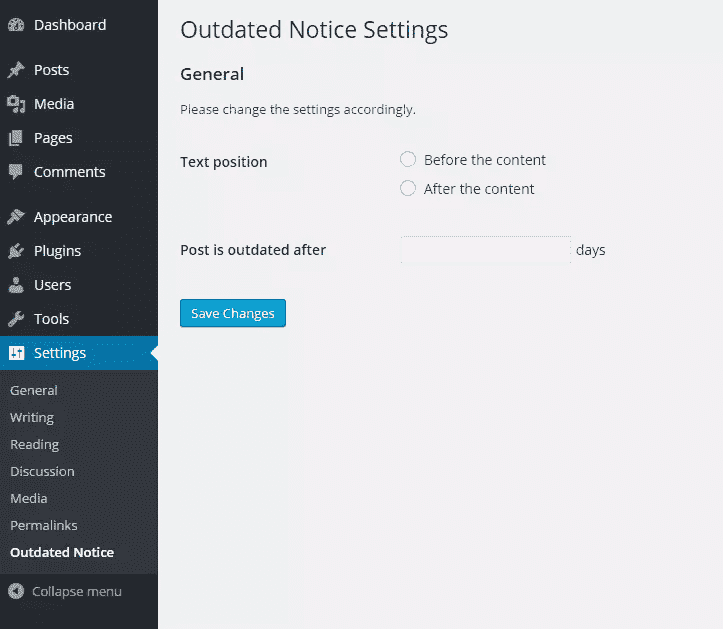

# WordPress 插件样板文件第 2 部分:开发插件

> 原文：<https://www.sitepoint.com/wordpress-plugin-boilerplate-part-2-developing-a-plugin/>

在我的系列文章的第一部分，WordPress 插件样板文件的介绍中，我们看了样板文件中的代码是如何组织的。为了继续这个系列，我们将应用我们之前学到的知识来构建一个真正的工作插件。我们将看看如何使用样板代码快速启动并运行我们的插件，尽可能少的工作。

本文将关注创建和激活插件，以及开发插件的面向管理员的功能。为了阅读这篇教程，你需要对 PHP 和 WordPress 有一个基本的了解，同时也要有关于 [WordPress 插件 API](https://codex.wordpress.org/Plugin_API) 的工作知识。

## 关于插件

我们将开发一个简单的插件，它将显示一个特定帖子最后更新的天数。我们还将为插件提供一些简单的定制，允许用户选择一个帖子被认为过期的具体天数，以及通知在帖子内容中的位置。

## 准备样板文件

正如在第一篇文章中提到的，我们可以下载一份新的样板文件进行搜索，然后自己替换，或者我们可以使用非官方的 WordPress 插件样板文件生成器来加速这个过程。让我们为我们的插件使用生成器。

前往 [WordPress 插件样板文件生成器](http://wppb.me/)网站，在表格中填入适当的值。姑且称我们的插件为“过时通知”。这里有一个填写了字段的示例表单。



我使用一个虚拟的链接到官方资源库的插件 URL。不要太担心这个东西，因为我们总是可以在插件标题中修改它。

点击“构建”按钮，你应该会得到一个漂亮的、定制的 WordPress 插件样板。

## 安装和激活插件

生成的 zip 存档将包含两个期望的目录，`assets`和`trunk`。我们不打算使用符号链接的方式安装我们的插件，所以解压存档中的`trunk`文件夹，并将其复制到`wp-content/plugins`目录中。

我们仍然需要对其进行适当的重命名，以避免与其他插件发生命名冲突，因此我们将把`trunk`目录重命名为`outdated-notice`。

如果你现在转到`wp-admin`中的“已安装插件”部分，你肯定会看到你的插件在已安装但尚未激活的插件列表中。插件样板文件生成器不会改变任何关于插件描述的东西，所以如果我们想要改变它，我们可以简单地编辑主插件文件中的描述，在我们的例子中，是`outdated-notice.php`。



点击“激活”来激活你闪亮的新插件。你的 WordPress 站点不会有任何改变，所以不要担心激活插件后还看不到任何东西。

## 添加选项页面

插件开发者通常为用户提供定制插件设置的方法。这可以通过利用 WordPress 提供的[设置 API](https://codex.wordpress.org/Settings_API) 来实现。让我们看看如何将我们自己的设置集成到插件中。

简而言之，我们将允许用户选择通知出现的位置，要么在文章内容之前，要么在文章内容之后。至于天数阈值，用户可以设置帖子被视为过期之前的天数。使用这条信息，我们将动态地改变通知的类别，这样我们就可以使它的风格不同于仍然被认为是新鲜的帖子。

让我们从为插件添加一个选项页面开始。

打开`admin`文件夹中的`class-oudated-notice-admin.php`。我们需要修改这个类来允许我们为插件注册一个设置页面。将这个公共方法添加到类的末尾。

```
/**
	 * Add an options page under the Settings submenu
	 *
	 * @since  1.0.0
	 */
	public function add_options_page() {

		$this->plugin_screen_hook_suffix = add_options_page(
			__( 'Outdated Notice Settings', 'outdated-notice' ),
			__( 'Outdated Notice', 'outdated-notice' ),
			'manage_options',
			$this->plugin_name,
			array( $this, 'display_options_page' )
		);

	}
```

需要注意的一点是，由于我们使用类来定义钩子，我们需要以`array( <class instance>, <class method )`的形式传递一个数组，而不是直接指定要调用哪个函数。唯一需要遵守的规则是该方法需要是公共的。

我们还没完呢！正如我们所见， [`add_options_page`](https://codex.wordpress.org/Function_Reference/add_options_page) 需要一个有效的回调函数，我们还没有在我们的`Outdated_Notice_Admin`类中定义它。让我们把它加进去。这应该很简单，因为我们将使用包含在`admin/partials`文件夹中的`outdated-notice-admin-display.php`。所以，我们回调函数所要做的就是包含这个文件。

```
/**
	 * Render the options page for plugin
	 *
	 * @since  1.0.0
	 */
	public function display_options_page() {
		include_once 'partials/outdated-notice-admin-display.php';
	}
```

应该可以了。我们现在需要做的最后一件事是使用样板文件中提供的 loader 类正确地加载它。打开`includes`文件夹中的`class-outdated-notice.php`，在`define_admin_hooks`方法中添加我们之前定义的附加钩子。在我们的选项页面上要包含的正确操作挂钩是`admin_menu`，所以让我们把它添加进来。

```
$this->loader->add_action( 'admin_menu', $plugin_admin, 'add_options_page' );
```

现在，您应该会在设置下看到一个附加的“过期通知”子菜单。您可以通过访问 URL `http://<our-site-url>/wp-admin/options-general.php?page=outdated-notice`来访问空选项页面。

现在这是一个空白页，所以让我们开始用适当的标记填充部分文件。

## 注册、保存和检索设置值

WordPress Codex 上的[设置 API](https://codex.wordpress.org/Settings_API) 页面很好地解释了如何注册我们自己的设置，包括在选项页面上显示它们。

下面是我们在这一部分要做的事情的分类:

1.  向样板文件加载器注册钩子
2.  注册设置部分
3.  注册两个设置字段(阈值天数和文本位置)
4.  注册这两个设置
5.  填充选项页面
6.  保存并重新填充要显示的字段。

### 将挂钩注册到样板文件加载程序

让我们一个一个地检查所有的步骤。

要注册一个设置段，我们将需要使用 [`register_setting`](https://codex.wordpress.org/Function_Reference/register_setting) 功能。初始化该函数的合适钩子是`admin_init`。因此，首先我们将在样板文件加载器中添加另一个钩子，在主样板文件类`Outdated_Notice`类的`define_admin_hooks`方法中注册我们的设置。

```
$this->loader->add_action( 'admin_init', $plugin_admin, 'register_setting' );
```

为了使事情更简单，并为我们的选项名提供一种基本的命名空间，我们将在这个类的顶部添加另一个私有变量。将这段代码放在`Outdated_Notice_Admin`类的顶部。

```
/**
	 * The options name to be used in this plugin
	 *
	 * @since  	1.0.0
	 * @access 	private
	 * @var  	string 		$option_name 	Option name of this plugin
	 */
	private $option_name = 'outdated_notice';
```

从现在开始，我们将把这个值加到与我们的选项相关的任何东西前面。

接下来是实际注册设置部分、设置字段和各个设置。再次打开`Outdated_Notice_Admin`类，并将公共方法`register_setting`添加到其中。

### 注册设置部分

在 public `register_setting`方法中，我们将注册一个设置部分。由于 Codex 已经提供了足够的入门信息，所以我不会过多地研究各种函数和 API。由于我们的插件设置相对简单，我们将只注册一个部分。

这个代码片段将允许我们使用 [`add_settings_section`](https://codex.wordpress.org/Function_Reference/add_settings_section) 函数为我们的选项页面注册一个“通用”部分。

```
// Add a General section
	add_settings_section(
		$this->option_name . '_general',
		__( 'General', 'outdated-notice' ),
		array( $this, $this->option_name . '_general_cb' ),
		$this->plugin_name
	);
```

注意，我们用变量$option_name 预先挂起了我们的节名，以防止与其他插件冲突。回调可以用来提供关于我们部分的附加信息，这正是我们想要的。

我们将添加另一个公共方法，`outdated_notice_general_cb`,它将回显关于这个部分的基本信息。

```
/**
	 * Render the text for the general section
	 *
	 * @since  1.0.0
	 */
	public function outdated_notice_general_cb() {
		echo '<p>' . __( 'Please change the settings accordingly.', 'outdated-notice' ) . '</p>';
	}
```

### 注册两个设置字段(阈值天数和文本位置)

我们需要使用的设置 API 的下一部分是注册要在选项页面上呈现的实际字段。这可以通过使用 [`add_settings_field`](https://codex.wordpress.org/Function_Reference/add_settings_field) 功能来实现。

我们将使用单选按钮进行文本位置配置。这是通过将这段代码添加到我们拥有的`register_setting`函数中来完成的。

```
add_settings_field(
		$this->option_name . '_position',
		__( 'Text position', 'outdated-notice' ),
		array( $this, $this->option_name . '_position_cb' ),
		$this->plugin_name,
		$this->option_name . '_general',
		array( 'label_for' => $this->option_name . '_position' )
	);
```

我们需要确保`add_settings_field`的第五个参数将指向我们之前注册的正确设置部分，否则我们可能看不到选项页面上的字段。

这还没有完成。我们需要提供回调函数来呈现单选按钮的实际标记。在我们的`outdated_notice_position_cb`函数中，我们需要包含这段代码:

```
**
	 * Render the radio input field for position option
	 *
	 * @since  1.0.0
	 */
	public function outdated_notice_position_cb() {
		?>
			<fieldset>
				<label>
					<input type="radio" name="<?php echo $this->option_name . '_position' ?>" id="<?php echo $this->option_name . '_position' ?>" value="before">
					<?php _e( 'Before the content', 'outdated-notice' ); ?>
				</label>
				<br>
				<label>
					<input type="radio" name="<?php echo $this->option_name . '_position' ?>" value="after">
					<?php _e( 'After the content', 'outdated-notice' ); ?>
				</label>
			</fieldset>
		<?php
	}
```

日阈值的第二个选项可以使用普通文本输入进行配置。因此，我们将注册另一个设置字段:

```
add_settings_field(
		$this->option_name . '_day',
		__( 'Post is outdated after', 'outdated-notice' ),
		array( $this, $this->option_name . '_day_cb' ),
		$this->plugin_name,
		$this->option_name . '_general',
		array( 'label_for' => $this->option_name . '_day' )
	);
```

同样，我们还需要提供一个回调函数来呈现我们的文本字段。

```
/**
	 * Render the treshold day input for this plugin
	 *
	 * @since  1.0.0
	 */
	public function outdated_notice_day_cb() {
		echo '<input type="text" name="' . $this->option_name . '_day' . '" id="' . $this->option_name . '_day' . '"> '. __( 'days', 'outdated-notice' );
	}
```

### 注册设置

最后，我们需要注册我们将要使用的选项名称，以便它可以在 WordPress 中被识别。由于我们使用了两个不同的选项名称，`outdated_notice_position`和`outdated_notice_day`，我们将使用 [`register_setting`](https://codex.wordpress.org/Function_Reference/register_setting) 函数来注册它们。

```
register_setting( $this->plugin_name, $this->option_name . '_position', array( $this, $this->option_name . '_sanitize_position' ) );
	register_setting( $this->plugin_name, $this->option_name . '_day', 'intval' );
```

注意，`register_setting`函数的第三个参数是一个清理回调。尽管这是可选的，但确保输入值在保存到数据库之前经过清理总是有用的。

对于日间消毒，我们将使用内置的 PHP 函数，`intval`,因为这在我们的情况下已经足够了。至于文本通知位置，我们将定义自己的清理回调函数，该函数只允许将某些值保存到数据库中。这在处理受限于特定值的选项时特别有用，例如在这种情况下，我们只接受两个值，即`before`和`after`，因此我们的清理回调需要确保如果值不是其中之一，它不会被保存到数据库中。

这里有一个简单的清理回调函数来实现这一点:

```
/**
	 * Sanitize the text position value before being saved to database
	 *
	 * @param  string $position $_POST value
	 * @since  1.0.0
	 * @return string           Sanitized value
	 */
	public function outdated_notice_sanitize_position( $position ) {
		if ( in_array( $position, array( 'before', 'after' ), true ) ) {
	        return $position;
	    }
	}
```

### 填充选项页面

在我们注册完所有相关的设置之后，现在我们需要确保我们的选项页面能够正确呈现。因为我们使用 WordPress 的方式来注册我们的字段和设置，这个任务非常简单。

打开`admin/partials`文件夹内的`outdated-notice-admin-display.php`。下面是我们如何根据之前注册的设置来呈现选项页面。

```
<div class="wrap">
	    <h2><?php echo esc_html( get_admin_page_title() ); ?></h2>
	    <form action="options.php" method="post">
	        <?php
	            settings_fields( $this->plugin_name );
	            do_settings_sections( $this->plugin_name );
	            submit_button();
	        ?>
	    </form>
	</div>
```

通过 [`do_settings_sections`](https://codex.wordpress.org/Function_Reference/do_settings_sections) 和 [`settings_fields`](https://codex.wordpress.org/Function_Reference/settings_fields) 功能的简单组合，您的选项页面马上就完成了。

让我们休息一下，刷新选项页面。



### 保存并重新填充字段

尝试填写一些值并保存表单。您应该会收到“设置已保存”的通知但是什么都没发生。让我们试着对两个选项都做一个`var_dump`。将它放在相关函数中的某个位置。

```
var_dump(get_option( $this->option_name . '_position' ));
	var_dump(get_option( $this->option_name . '_day' ));
```

我们应该从数据库中获得一些值，如下例所示:

```
string(5) "after" 
	string(2) "90"
```

这意味着我们的表单工作正常，所以剩下唯一需要做的事情就是在文本字段中显示当前值，并确保选中正确的单选按钮。

让我们先处理单选按钮。作为一种快捷方式，我们将使用 WordPress 提供的 [`checked`](https://codex.wordpress.org/Function_Reference/checked) 功能来标记之前选择的值。我们的`outdated_notice_position_cb`将需要一些修改。

下面是回调的更新片段。

```
/**
	 * Render the radio input field for position option
	 *
	 * @since  1.0.0
	 */
	public function outdated_notice_position_cb() {
		$position = get_option( $this->option_name . '_position' );
		?>
			<fieldset>
				<label>
					<input type="radio" name="<?php echo $this->option_name . '_position' ?>" id="<?php echo $this->option_name . '_position' ?>" value="before" <?php checked( $position, 'before' ); ?>>
					<?php _e( 'Before the content', 'outdated-notice' ); ?>
				</label>
				<br>
				<label>
					<input type="radio" name="<?php echo $this->option_name . '_position' ?>" value="after" <?php checked( $position, 'after' ); ?>>
					<?php _e( 'After the content', 'outdated-notice' ); ?>
				</label>
			</fieldset>
		<?php
	}
[php]

<p>Notice that we are retrieving the value back from the database and assigning it to the <code>$position</code> variable before using it in the <code>checked</code> function for the radio buttons.</p>

<p>Next we are going to modify the <code>outdated_notice_day_cb</code> function.</p>

[php]
	/**
	 * Render the treshold day input for this plugin
	 *
	 * @since  1.0.0
	 */
	public function outdated_notice_day_cb() {
		$day = get_option( $this->option_name . '_day' );
		echo '<input type="text" name="' . $this->option_name . '_day' . '" id="' . $this->option_name . '_day' . '" value="' . $day . '"> ' . __( 'days', 'outdated-notice' );
	}
```

现在，无论我们何时更改任一字段的值，它都会正确地反映在选项页面中。

## 进一步的改进

这绝不是完整的。我们总是可以改进这个插件的面向管理员的功能。我能想到的一些事情是:

*   代码清理——WordPress 插件样板文件附带了很多有用的功能，但是在我们的例子中，管理端、CSS 和 JS 加载是完全不必要的。我们总是可以从我们的代码库中删除它，使它变得更小。
*   i18n(国际化)就绪——尽管我们在插件中广泛使用了`__()`和`_e()`,但我们并没有真正经历实际的 i18n 过程。我不会在这里讨论这个过程，因为这个话题已经在 SitePoint 上广泛讨论过了，例如在[这篇文章](https://www.sitepoint.com/wordpress-i18n-make-your-plugin-translation-ready/)中。
*   更精细的选择——由于我们的实现将应用于所有帖子，我们可以进一步优化它，以应用于某个类别中的帖子，或者其中有特定标签的帖子。

完整的代码可以从这个 [GitHub 库](https://github.com/fsylum/outdated-notice/tree/part-2)的`part-2`分支中查看。

## 结论

我们已经创建了一个插件，通过注册相关设置，并为用户创建一个选项页面来定制我们的插件，具有基本的面向管理的功能。在使用 WordPress 插件样板的相对较短的时间内，我们实现了这一点，而没有损害代码质量，并且仍然坚持 WordPress 推荐的最佳实践。

请继续关注本系列的下一部分，我们将在插件面向公众的一面显示帖子内容中的适当通知。

## 分享这篇文章